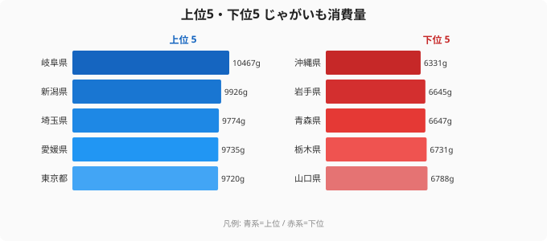

「じゃがいもの産地といえば北海道」——この常識は、消費量ランキングを見た瞬間に揺らぎます。2024年の家計調査で最も多くじゃがいもを買っていたのは、海を持たない内陸県の**岐阜県（10,467g）**でした。生産量で日本の約8割を占める北海道は11位にとどまり、同じく主要産地の青森県・岩手県にいたっては下位5県に沈んでいます。一方、最下位は**沖縄県（6,331g）**。トップとの差は1.65倍です。「たくさん作る県が、たくさん食べるとは限らない」——この逆説が、家計調査という鏡に映し出した日本の食卓の実像を、これから順に見ていきます。

## 上位5・下位5：トップは内陸と都市圏、底は産地と沖縄

<source-link href="/ranking/potato-consumption-quantity">じゃがいも消費量ランキングの全件データを見る</source-link>

上位5県は、岐阜（10,467g）・新潟（9,926g）・埼玉（9,774g）・愛媛（9,735g）・東京（9,720g）という顔ぶれです。ひとつの地域に固まってはいません。内陸の岐阜、雪国の新潟、首都圏の埼玉と東京、四国の愛媛が混在しています。「○○地方が強い」という単純な地域パターンでは説明できない並びになっているのが、このランキングの第一の特徴です。

ただし、上位10県まで広げて見ると、ひとつの傾向が浮かび上がります。埼玉（3位）・東京（5位）・神奈川（7位・9,531g）・千葉（9位・9,507g）と、首都圏の4都県がそろって上位に入っているのです。じゃがいもは保存が効き、カレー・肉じゃが・サラダ・コロッケと用途が広い常備野菜です。世帯人数が比較的多く、家庭内調理の機会が一定数ある都市圏の食卓で、安定して買われていると読み取れます。

下位5県は、沖縄（6,331g）・岩手（6,645g）・青森（6,647g）・栃木（6,731g）・山口（6,788g）です。注目したいのは、岩手と青森という**北東北の主要産地**がここに並んでいる点です。「じゃがいもをたくさん作る県ほど、家計で買う量は少ない」という、産地ならではの構造がここに表れています。

> [!NOTE]
> 本データは総務省「家計調査」における二人以上の世帯の品目別年間**購入量（g）**で、都道府県庁所在市・政令指定都市の数値を都道府県の代表値として用いています。自家栽培や知人からのもらい物、外食・業務用は含まれません。じゃがいもは家庭菜園や産地での「買わずに手に入る」割合が大きい品目なので、産地ほど購入量が実際の摂取量より小さく出やすい点に注意が必要です。

## 「産地=消費地」ではない逆説——北海道はなぜ上位に入らないのか

じゃがいもの生産量で北海道が全国の約8割を占めることは、広く知られています。にもかかわらず、購入量ランキングで北海道は11位（9,429g）。さらに青森（45位・6,647g）・岩手（46位・6,645g）は下位5県に入っています。生産量で上位を争う3道県が、消費量では中位から下位に位置しているのです。

この逆説には、家計調査という指標の性質が深く関わっています。家計調査が捉えるのはあくまで**お金を払って買った量**です。産地では、自家栽培の収穫物や農家どうしのおすそ分け、直売所での安価な入手といった「市場を経由しないルート」が豊富にあります。そうしたじゃがいもは購入量として記録されないため、産地ほど数字が小さく出る傾向があります。

加えて、生産規模と家庭消費は別の軸で動きます。北海道のじゃがいもは加工用・業務用・本州向け出荷として大量に流通し、その規模は道内の家庭が食べる量とは直接結びつきません。産地であることは「家でたくさん買う」こととイコールではありません。この食料経済の基本が、ここにはっきりと見えてきます。

類似の逆説は、ほかの食品でも観察できます。「産地の人がいちばん食べる」という直感は、家計調査の購入量ベースではしばしば裏切られます。[経済・消費カテゴリのランキング](/category/economy)では、産地と消費地が一致しない食品の実態を複数の指標で確認できます。

> [!WARNING]
> 「北海道・青森・岩手のじゃがいも消費が少ない」という結論は、**家計調査の購入量に限った話**です。産地では直売・自家菜園・もらい物で得る量が多く、購入量に反映されません。家計調査は市場を経由した購入のみを捉えるため、産地の実際の摂取量とは乖離している可能性が高い指標です。「産地は食べていない」と短絡せず、「市場での購入が少ない」と読むのが正確です。

## 首都圏がそろって上位に並ぶ意味

産地が下位に沈む一方で、首都圏が上位を占めるのも、このランキングの見逃せない特徴です。埼玉（3位・9,774g）・東京（5位・9,720g）・神奈川（7位・9,531g）・千葉（9位・9,507g）と、一都三県がきれいに上位10県に並んでいます。

首都圏は産地ではありません。それでも購入量が多いのは、消費の大半を市場経由でまかなっているからです。自家栽培や産地のおすそ分けに頼れない都市部の世帯は、必要なじゃがいもを「店で買う」しかありません。その買い物の量が、そのまま家計調査の数字として丸ごと記録されます。産地で目減りした購入量が、都市圏ではほぼ満額で計上される——この非対称が、ランキングの上下を入れ替えている主因のひとつです。

四国の愛媛（4位・9,735g）や九州の福岡（6位・9,544g）が上位に食い込むのも、同じ「市場経由の購入が中心」という都市的な購買構造で説明できます。地域の気候や郷土料理よりも、「買って食べるか、もらって食べるか」という入手経路の違いのほうが、購入量という指標には強く効いているのです。

> [!TIP]
> じゃがいも消費量を[緑茶消費量ランキング](/ranking/green-tea-consumption-quantity)や[こんぶ消費量ランキング](/ranking/konbu-consumption-quantity)と並べて見ると、家計調査の「購入量」という性質がよりはっきりします。自家生産や贈答が多い品目ほど産地の数字が小さく出る、という共通の歪みを意識すると、ランキングの順位を額面どおりに受け取らずに読めるようになります。

## 最下位の沖縄は「芋文化」があっても「じゃがいも」ではない

最下位は沖縄県（6,331g）です。沖縄はサツマイモ（紅芋）の産地として知られ、芋を使った料理や菓子の文化が深く根づいています。それでも、じゃがいもの購入量は47都道府県で最も少なくなっています。「芋」への親しみは、必ずしも「じゃがいも」の消費には結びつかない、ということです。

沖縄の食卓を長く支えてきた芋はサツマイモであり、じゃがいもは本土から持ち込まれた外来の食材という位置づけです。肉じゃがやカレーといった本土由来の料理での利用が中心で、郷土料理の主役にはなりにくい立場にあります。年間を通じて温暖な気候のため、じゃがいもが主役になりやすい鍋物やおでんといった寒い季節の料理の出番が少ないことも、購入量を押し下げる方向に働いていると考えられます。

[沖縄県の地域データ](/areas/47000)を見ると、食文化に関わる各指標で本土と際立った差異が確認できます。沖縄の最下位は「沖縄が芋を食べない」ことを意味しません。「じゃがいもという特定の品目が郷土の食卓に深く入り込んでいない」ことの表れと読むのが妥当です。

## まとめ

- **トップは岐阜（10,467g）**——産地でも特定の食文化圏でもない内陸県が首位に立ち、上位は内陸・雪国・都市圏・四国が混在する
- **最下位は沖縄（6,331g）**——サツマイモ文化と温暖な気候が、じゃがいもの出番を構造的に少なくしている
- **トップと最下位の差は約1.65倍**——同じ日本国内でこれだけの開きが生じるのは、気候や食文化だけでなく入手経路の違いも大きい
- **産地の逆説**——生産量日本一の北海道は11位、産地の青森・岩手は下位5県。家計調査が捉えるのは「買った量」であり、自家生産や直売の多い産地ほど数字が小さく出る
- **首都圏の上位独占**——埼玉・東京・神奈川・千葉がそろって上位10県に入る。消費の大半を市場経由でまかなう都市部ほど、購入量がそのまま数字に表れる

## データ出典

総務省「家計調査」2024年／二人以上の世帯における品目別年間購入量（都道府県庁所在市・政令指定都市ベース）。e-Stat 経由で整備。数値は各調査都市の購入量を都道府県の代表値として用いているため、自家生産・直売・もらい物の多い産地や、非調査地域の実態とは乖離する場合があります。
