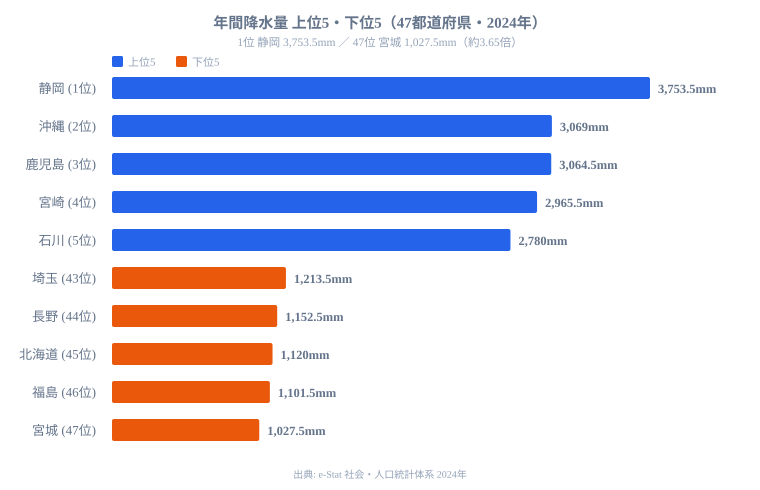
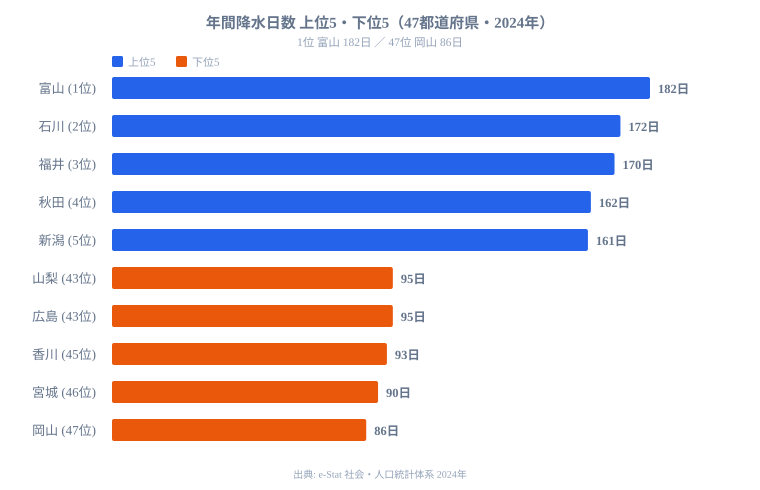
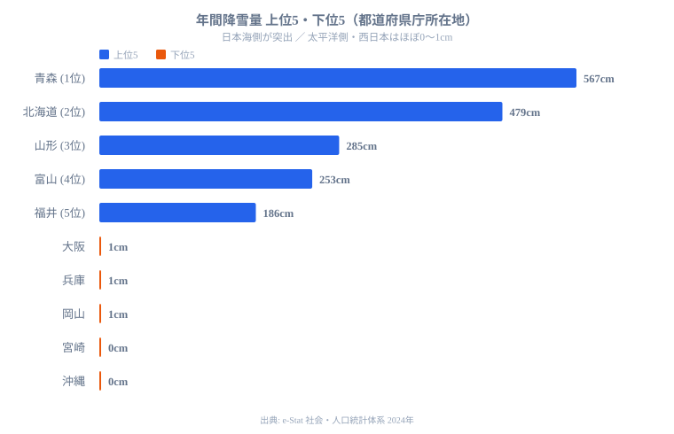

「雨が多い県はどこか？」という問いに正確に答えるには、2つの指標が必要です。「**年間降水量**（どれだけ降るか）」と「**降水日数**（何日降るか）」は、まったく異なる情報を持っているからです。

静岡県は年間降水量**3,753.5mm**で全国トップです。しかし降水日数は**113日**で中位にとどまり、雨の日は全国で比較的少ないのです。一方、富山県の降水日数は**182日**で全国一ですが、1日あたりの雨量は**14.6mm**とそれほど多くありません。

この「降り方の違い」を4タイプに整理すると、防災リスク・農業計画・移住先の気候評価が大きく変わります。なぜ同じ「雨が多い県」でも降り方がこれほど分かれるのか、降水量・降水日数・降雪量の3つのデータを順番に見ていきます。

> [!NOTE]
> データは2024年の各都道府県庁所在地の観測値（e-Stat 社会・人口統計体系）です。観測地点は県庁所在地のため、同じ県内でも山間部と沿岸部で実際の降水量は大きく異なります。たとえば高知県の山間部・魚梁瀬では年間4,000mmを超える年もあり、県の代表値が県内すべてを表すわけではありません。

## 年間降水量が多いのはどこか──太平洋側が突出する

まず「どれだけ降るか」を見ます。年間降水量の上位5県と下位5県を並べると、地形の影響がはっきり出ます。

**年間降水量が最も多いのは[静岡県](/areas/22000)（3,753.5mm）**です。2位の沖縄県（3,069mm）、3位の鹿児島県（3,064.5mm）、4位の宮崎県（2,965.5mm）、5位の石川県（2,780mm）が続きます。静岡が突出する理由は地形にあります。南アルプスと駿河湾に挟まれた地形が太平洋からの湿った空気を受け止め、山にぶつかった空気が上昇して雨雲を発達させるため、極めて多い降水量をもたらすのです。上位は太平洋側（静岡・沖縄・鹿児島・宮崎）と日本海側の石川が混在しており、「南だから多い」という単純な構図ではありません。

一方、**最も少ないのは宮城県（1,027.5mm）**で、46位の福島県（1,101.5mm）、45位の北海道（1,120mm）、44位の長野県（1,152.5mm）、43位の埼玉県（1,213.5mm）が下位を占めます。静岡と宮城の差は約3.65倍にのぼります。下位は東北の太平洋側（宮城・福島）、内陸の長野・埼玉、そして北海道です。山脈の風下にあたる内陸や、季節風が雪を落とした後の太平洋側は、空気が乾いて降水量が抑えられます。なお降水量が少ないことは、洪水リスクが低く晴天日が多いという過ごしやすさの裏返しでもあり、「少雨＝住みにくい」とはなりません。

<source-link href="/ranking/annual-precipitation">年間降水量ランキングをもっと見る</source-link>

## 「降る日数」で並べ替えると順位が入れ替わる

次に「何日降るか」を見ます。降水量とは別の指標であるため、上位の顔ぶれが入れ替わります。

**降水日数が最も多いのは[富山県](/areas/16000)（182日）**です。2位の石川県（172日）、3位の福井県（170日）、4位の秋田県（162日）、5位の新潟県（161日）が続き、上位は日本海側に集中します。年間の半分が雨か雪という計算になり、これは冬の雪が日数を押し上げているためです。日本海側は冬に大陸からの季節風が日本海で水分を含み、山地にぶつかって雪を降らせ続けるので、降水「日数」が極端に多くなります。

下位は降水量の下位とは別の顔ぶれです。**最も少ないのは岡山県（86日）**で、46位の宮城県（90日）、45位の香川県（93日）、そして43位タイの山梨県・広島県（ともに95日）が並びます。瀬戸内側の岡山・香川・広島は中国山地と四国山地に挟まれて季節風が弱まり、晴天が続きやすい「晴れの国」です。ここで重要なのは静岡県です。降水量では全国トップなのに、降水日数は113日で中位にとどまります。つまり「降る日は多くないが、降れば一気に大量に降る」のが静岡型なのです。1日あたりに直すと静岡は約33.2mm/日、富山は約14.6mm/日と、降り方の濃さがまるで違います。

> [!TIP]
> 「降水量が多い」と「雨の日が多い」を1つの指標だと思い込むと、防災や移住の判断を誤ります。1日あたりの雨量（年間降水量 ÷ 降水日数）に直すと、静岡のような集中豪雨型と富山のようなしとしと型がくっきり分かれます。同じ「雨が多い」でも、前者は洪水・土砂災害への備えが、後者は日照不足への対策が重要になります。

<source-link href="/ranking/annual-precipitation-days">年間降水日数ランキングをもっと見る</source-link>

## 量と日数を掛け合わせると4タイプに分かれる

ここまでの2指標を「量（多い／少ない）」×「日数（多い／少ない）」で組み合わせると、47都道府県は4つの降り方タイプに整理できます。

- **集中豪雨型（量多・日数少）**：静岡・鹿児島・宮崎。台風や梅雨前線で一気に降るため1日あたりの雨量が大きく、静岡は約33mm/日に達します。洪水・土砂災害のリスクが高く、インフラ整備コストもかさみます。
- **量も日数も多い型（量多・日数少なくない）**：石川・福井・富山。梅雨の雨と冬の雪が重なり、年の半分近くが雨か雪です。水資源は豊富ですが日照不足になりやすいタイプです。
- **しとしと型（量少・日数多）**：北海道・秋田。冬の雪が降水日数を押し上げる一方、1日あたりの量は少なめです。秋田は降水日数162日で全国4位ですが、量は中位にとどまります。
- **晴れの国型（量少・日数少）**：宮城・岡山・香川。降水量も日数も少なく晴天日が多い気候です。岡山は降水日数86日で全国最少、宮城は降水量1,027.5mmで全国最少と、どちらも「晴れの国型」の両端を担います。

この4タイプの境目を作っているのは、**冬に雪が降るかどうか**です。同じ「雨が多い県」でも、太平洋側は台風と梅雨でまとめて降り（集中豪雨型）、日本海側は冬の雪で日数を稼ぎます（しとしと型・量も日数も多い型）。次の降雪量のデータを見ると、この境目がさらにはっきりします。

> [!WARNING]
> 「降水量が多い年＝洪水リスクが高い」とは言い切れません。同じ年間降水量でも、1日に集中して降る集中豪雨型と、毎日少しずつ降るしとしと型では洪水リスクがまったく異なります。防災の観点では年間降水量よりも「最大1時間雨量」や「24時間最大降水量」のほうが重要な指標になります。タイプを取り違えると備えの優先順位を誤ります。

## 降雪量──日本海側と太平洋側の差が降り方を決める

降水日数の差を生んでいる「冬の雪」を、降雪量のデータで確認します。降雪量は降水量以上に地域差が際立ちます。

**青森県567cm、北海道479cm、山形県285cm、富山県253cm、福井県186cm**と、東北・北海道の日本海側と北陸が圧倒的な降雪量を記録します（石川県157cmも続きます）。これらの県はいずれも降水日数の上位とも重なり、冬の雪が「降る日数」を押し上げている構造が見て取れます。青森市は年間5m以上の雪が降る世界有数の豪雪都市です。日本海から吹き込む季節風と奥羽山脈の配置が、季節風に大量の雪を落とさせるため、わずか数百キロの距離で降雪量が激変します。

一方、太平洋側・西日本はほぼ0〜1cmです。**大阪・兵庫・岡山は1cm、宮崎・沖縄・静岡は0cm**にとどまります。同じ東北でも太平洋側の宮城県は59cmと、日本海側の青森の約10分の1にすぎません。奥羽山脈を境に、季節風が日本海側で雪を落としきってしまうため、太平洋側には乾いた風だけが吹き下ろします。これが太平洋側の降水量・降水日数を同時に押し下げ、「晴れの国型」を生む地形的な理由です。豪雪地帯では除雪コストや冬季の交通網維持が大きな財政負担となり、特に高齢化が進む自治体では「雪かき人材」の確保が深刻な課題になっています。

> [!NOTE]
> 降雪量（冬に降った雪の合計）と最深積雪（一度に地面に積もった最大の深さ）は別の指標です。最深積雪では青森県が101cmで全国一、北海道97cmが2位で、富山県・山形県がともに51cmで3位タイです。「たくさん降る」ことと「深く積もる」ことは、気温や雪質によってずれる場合があるため、合わせて読むと豪雪の実態が立体的に見えます。

<source-link href="/ranking/maximum-snow-depth">最深積雪ランキングをもっと見る</source-link>

## まとめ──4タイプで変わる実用的な意味

「雨が多い」と「雨の日が多い」は別物です。47都道府県を4タイプで見ると、この原則の実用的な意味が見えてきます。

- **集中豪雨型**（静岡・鹿児島・宮崎）：年間の洪水・土砂災害リスクが高く、インフラ整備コストがかさみます。農業は水管理が重要で、太陽光発電は晴れの日に効率良く発電できる一方、豪雨時の設備被害リスクも抱えます。
- **晴れの国型**（宮城・岡山・香川）：洪水リスクが低く農業は安定的で、太陽光発電に向く気候です。ただし水不足のリスクがあり、香川は古くから溜め池文化が発達してきました。
- **量も日数も多い型**（富山・石川・福井）：年の半分近くが雨か雪という日照不足が課題です。太陽光発電には不利ですが、農業は水が豊富で安定しています。
- **しとしと型**（北海道・秋田）：冬の雪が降水日数を押し上げますが、1日あたりの量は少なめです。除雪は重い負担になります。

これらのデータは、移住先の選定・農業計画・防災インフラ・太陽光発電の立地検討など、さまざまな意思決定の基礎情報として活用できます。県の代表値だけでなく、必ず「量」と「日数」の両方を確認するのが、降り方を読み違えないコツです。気温・日照・可住地など他の自然環境指標と合わせて見たい場合は、[国土・気象カテゴリ](/category/landweather)の各ランキングが参考になります。

## データ出典

- e-Stat 社会・人口統計体系（気候・自然環境）statsDataId: 0000010102
- 気象庁「気象統計情報」2024年
