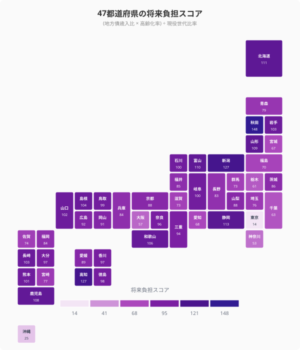
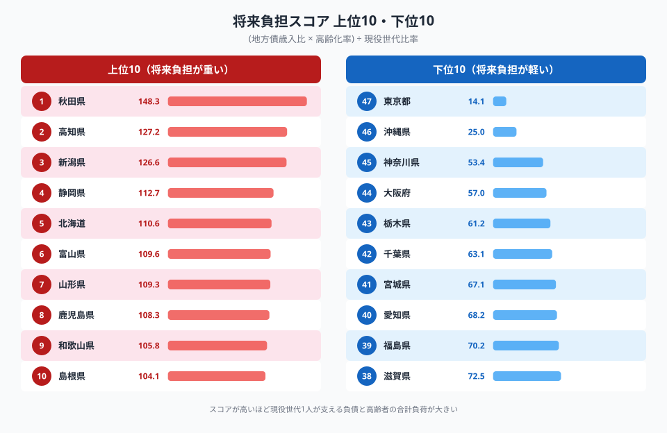
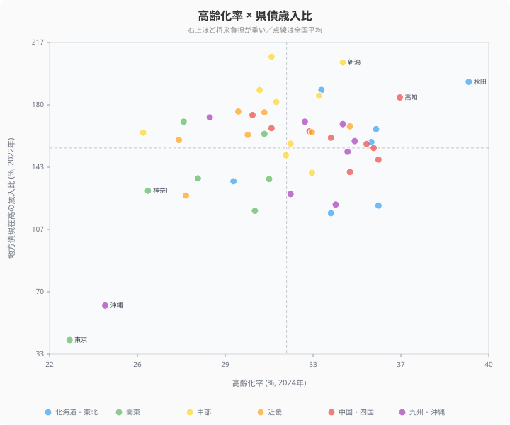

「歳入の 2 倍の借金を抱える県」は静岡や新潟── ではその借金を**実際に誰が返すのか**？

地方債の歳入比 (%) だけを見ても、答えは見えてきません。借金の重さは**人口構造**、つまり「現役世代 1 人がどれだけの負債と高齢者を背負っているか」によって決まるからです。本記事は **(地方債歳入比 × 高齢化率) ÷ 現役世代比率** という独自指標で、47 都道府県の世代間負担を可視化します。

結果は鮮明な格差。1 位 **秋田県 148.3** vs 47 位 **東京都 14.1**── スコア差は **10 倍超**。秋田の現役世代 1 人が背負う負担は、東京の現役世代の 10 倍以上ということになります。

## 47都道府県の将来負担スコア

<data-source url="https://www.e-stat.go.jp/dbview?sid=0003228123" label="e-Stat 地方財政状況調査・人口推計"></data-source>

色が濃いほど現役世代 1 人あたりの将来負担が重い地域です。**北海道・東北ブロックと中国・四国ブロックの一部**が濃く塗られている一方、**首都圏・近畿圏**は薄い色が目立ちます。

> [!NOTE]
> 将来負担スコア = (地方債歳入比 × 高齢化率) ÷ 現役世代比率
> - **地方債歳入比 (%)**: 都道府県の地方債現在高を歳入総額で割った値（2022年度・歳入規模に対する負債の重さ）
> - **高齢化率 (%)**: 65 歳以上人口の割合（2024年）
> - **現役世代比率 (%)**: 15-64 歳人口の割合（2024年）
> 数値の解釈: 高齢者と負債の総和を、現役世代がどれだけの倍率で支えるかの相対指標。スコア 100 を基準に、200 なら倍の負担、50 なら半分の負担。

<source-link href="/ranking/local-debt-current-ratio">地方債現在高の歳入比ランキング</source-link>

## 将来負担スコア 上位・下位

**1位は秋田県** (スコア 148.3)。地方債歳入比 193.7%、高齢化率 39.5%（全国 1 位）、現役世代比率 51.6%。**負債・高齢化・現役不足の三重苦**が現れます。

2 位 高知県 (127.2)、3 位 新潟県 (126.6)、4 位 静岡県 (112.7)、5 位 北海道 (110.6)。上位 10 位の半数が**北海道・東北ブロック**です。

最下位は **東京都** (14.1)。地方債歳入比 41.6%（全国最低）、高齢化率 22.7%（最低）、現役世代比率 66.8%（最高）。**負債・高齢化が低く現役層が厚い** 三拍子揃った構造で、秋田の 1/10 のスコアです。

46 位 沖縄県 (25.0)、45 位 神奈川県 (53.4)、44 位 大阪府 (57.0)、43 位 栃木県 (61.2)。**首都圏・近畿の都市部と沖縄**が下位を占めます。

<ad-slot></ad-slot>

## 高齢化率 × 県債歳入比の散布図

将来負担スコアの構成要素を分解して見るため、横軸に高齢化率、縦軸に県債歳入比を取った散布図を見てみます。

4 象限のうち、**右上（高齢化高・県債高）** が最も将来負担が重い領域です。秋田・新潟・静岡・高知・北海道がこの象限に並びます。

**左下（高齢化低・県債低）** は東京と沖縄。高齢化が進んでおらず県債も低いため、将来負担はずっと軽くなります。

**右下（高齢化高・県債低）** には福島・栃木が見えます。高齢化は平均的だが県債歳入比が小さい地域。負債負担は相対的に軽い。

**左上（高齢化低・県債高）** には大阪府・神奈川県が位置します。県債歳入比は中程度ですが、高齢化が遅いぶん現役世代の負担は限定的です。

## 6 ブロック別の将来負担パターン

- 北海道・東北（平均スコア約110）: 高齢化進行 + 県債歳入比高、典型的な三重苦地域
- 中国・四国（約95）: 中山間地中心、地方債依存度が高い県が点在
- 中部（約85）: 静岡・新潟がスコアを押し上げ、太平洋ベルト工業県は中位
- 近畿（約75）: 大阪・京都が大都市バッファ、和歌山が高い
- 九州・沖縄（約70）: 沖縄の若い人口構造がブロック平均を引き下げ
- 関東（約65）: 首都圏の現役世代厚みが効く

「現役世代 1 人が支える負担」という観点で、地方圏 vs 都市圏の **構造的な格差** が浮き彫りになります。

> [!TIP]
> 地方債歳入比（県債残高 ÷ 歳入）だけを見ると静岡（208.5%）・新潟（205.1%）が最大だが、現役世代比率が高い静岡（55.3%）は秋田（51.6%）より支える人が多い。同じ借金でも「誰が返すか」で実質的な重みが変わるため、人口構造と組み合わせた本記事のスコアで比較することが重要。

<ad-slot></ad-slot>

## 既存記事との関係

本記事は「歳入比 (%) だけ」では見えない**世代別負担の重さ**に焦点を当てた独自分析です。歳入比そのものの全国順位や財政指標との相関は、関連記事で扱っています。

- [歳入の2倍の借金を抱える県](/blog/local-government-debt-burden) ── 県債歳入比のランキングと将来負担比率の相関
- [所得1位は東京、最下位と2.5倍差](/blog/per-capita-income-gap) ── 所得側の地域差
- [県民所得とGDPで順位が逆転する県](/blog/prefectural-income-gdp-ranking) ── GDP との関係

## まとめ

47 都道府県の将来負担スコアから、次の 4 点が明確になりました。

1. **10 倍超の格差**: 1 位 秋田 (148.3) と 47 位 東京 (14.1) でスコア差は約 10.5 倍。「同じ日本人」とは思えない世代間負担の差
2. **三重苦地域の存在**: 高齢化進行 + 県債歳入比高 + 現役世代不足が同時に進む北海道・東北ブロック。秋田・北海道・新潟・高知が典型例
3. **首都圏・沖縄の有利な構造**: 東京・神奈川・大阪・沖縄は人口構造が比較的若く、県債歳入比も低めで、現役世代の負担は軽い
4. **政策含意**: 県債残高そのものの議論よりも、**現役世代に対する相対負担**を見ることで、地域別の財政持続性が見えてくる

地方債の議論は「絶対額」「歳入比」「将来負担比率」など多角度に行われていますが、最終的に支払うのは**人**です。世代別負担という尺度は、これからの地方財政を考える上で欠かせない視点といえます。

## データ出典

本記事のデータはe-Stat（政府統計の総合窓口）を基に作成しています。
