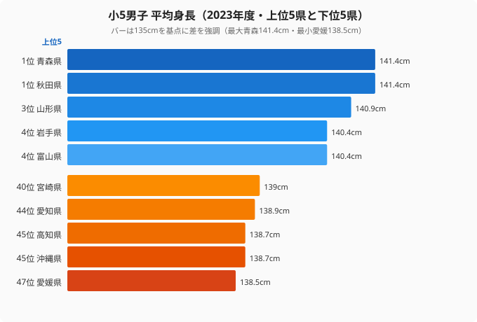
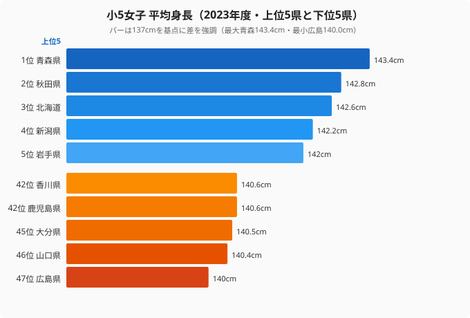

文部科学省「学校保健統計調査」（2023年度）の小学5年生平均身長を都道府県別に見ると、最大と最小の差は男子で2.9cm、女子で3.4cmにとどまります。学年が同じ11歳の子どもどうしなら、これくらいの差は誤差のように思えるかもしれません。

ところが、この小さな差には根強い地域パターンが隠れています。**男子は青森141.4cm を頂点に東北勢が上位を占め、最下位は愛媛138.5cm。西日本の県が下位に並ぶこの構図は、半世紀ほどほとんど変わっていません。** 1cm以下で順位が入れ替わるはずの小集団データが、これほど長く同じ並びを保つのは偶然とは考えにくいのです。

そしてもう一つの謎があります。**男子では下位グループにいる沖縄が、女子では上位8位に入る** のです。同じ島に住む子どもなのに、なぜ男女でこれほど結果が違うのでしょうか。この記事では、[小5男子の平均身長](/ranking/average-height-primary-school-fifth-grade-male)と[小5女子の平均身長](/ranking/average-height-primary-school-fifth-grade-female)、両者の重なりから、身長の地域差を読み解いていきます。

## 男子は東北が上位を独占、最下位は西日本に集中

まず男子から見ていきます。2023年度の小5男子は青森・秋田が141.4cmで同率1位、続いて山形140.9cm、岩手・富山が140.4cmと、上位5県のうち4県が東北で占められています。一方、最下位は愛媛138.5cm。その手前には沖縄・高知（ともに138.7cm）が並び、下位グループはすべて西日本の県です。

<source-link href="/ranking/average-height-primary-school-fifth-grade-male">小5男子 平均身長ランキングをもっと見る</source-link>

なぜ上位がここまで東北に偏るのでしょうか。TOP10を見ると、青森・秋田・山形・岩手・宮城という東北5県に加え、北海道と北陸の富山が入り、計7県が東北・北海道・北陸という寒冷な日本海側・北日本に集中します。残る3つの例外は山梨・東京・徳島で、いずれも東日本か、四国でも温暖な瀬戸内ではない地域です。寒冷地で身長が高くなる傾向は、保温に有利ながっしりした体格が世代を通じて選ばれてきたという見方や、魚介・乳製品を多く摂る食習慣でタンパク質・カルシウムが充足しやすいという見方など、複数の要因が重なって生まれていると考えられています。

逆に下位の西日本側は、温暖な気候で体格がやや小柄に向かいやすいという仮説のほか、地域ごとの食文化や生活様式の違いも背景にあるとみられます。ただし学校保健統計調査の単年データだけでは、これらの要因を切り分けることはできません。

> [!NOTE]
> 「学校保健統計調査」は毎年、全国の幼稚園・小学校・中学校・高等学校等を対象に実施される文部科学省の基幹統計です。都道府県別の平均値は数千人規模の抽出標本にもとづくため、141.4cm のように0.1cm単位で示されますが、年度ごとに小さな順位変動が起こります。「青森が常に1位」と固定的に読まず、上位・下位の地域帯として捉えるのが安全です。

## 女子も東北が上位、最下位は中国・九州に並ぶ

女子も傾向はよく似ています。青森が143.4cmで1位、秋田142.8cm、北海道142.6cm、新潟142.2cm、岩手142.0cmと、上位5県は東北・北海道・北陸の北日本勢でそろいます。最下位は広島140.0cm、その手前に山口140.4cm、大分140.5cmと、中国・九州の県が下位グループを形成します。

<source-link href="/ranking/average-height-primary-school-fifth-grade-female">小5女子 平均身長ランキングをもっと見る</source-link>

女子で「なぜ北日本が高いのか」という構図は、男子とほぼ共通しています。寒冷な気候帯と、魚介・乳製品を多く摂る食文化が重なる地域で、子どもの平均身長が高く出やすい——この大枠は男女を問わず働いているようです。注目すべきは、男子で下位グループに沈んでいた **沖縄が、女子では8位（141.8cm）と一気に上位へ浮上する** 点です。同じ県でありながら、男女で順位が大きくずれる。これが本記事の中心的な謎であり、次の章で掘り下げます。

> [!WARNING]
> 下位グループは「子どもの発育が悪い」という意味ではありません。差は最大でも3cm台で、全国どの県も同年代の標準的な範囲に収まっています。順位はあくまで0.1cm刻みの相対比較であり、最下位の広島140.0cmと中位県の差はごくわずかです。ランキングの上下だけを取り出して優劣の話に読み替えないよう注意してください。

<ad-slot></ad-slot>

## 沖縄の逆転──男子下位グループが女子では上位8位

ここで沖縄に注目します。男子では高知と並ぶ45位（138.7cm）で下位グループにいる沖縄が、女子では8位（141.8cm）と上位に食い込みます。同じ県の同じ学年で、なぜ男女でこれほど結果が分かれるのでしょうか。

> [!WARNING]
> 学校保健統計調査の単年値だけからでは、この逆転の原因を特定することはできません。以下は先行研究や栄養調査をふまえた仮説であり、学術的に確定したものではありません。原因を断定せず、「こういう可能性がある」という読み筋として受け取ってください。

仮説の一つは、栄養摂取パターンが男女で異なる効き方をしている可能性です。沖縄の伝統的な食文化（豆腐・海藻・魚・豚肉）は、成長期に重要なタンパク質・カルシウム・鉄分を含みます。こうした食習慣が女子の発育を支える一方で、食の欧米化による影響が男子の発育に先に表れている、という見方があります。

もう一つは、成長スパート（急成長期）のタイミングが男女で異なることです。女子は男子より1〜2年早く成長スパートを迎えるため、11歳という特定の時点を切り取ると、女子の身長は地域差が出やすくなります。沖縄のように女子だけが上位に来る現象は、この時間差が地域の発育環境と組み合わさって生まれている可能性があります。いずれも仮説の域を出ませんが、「男女で同じ地域差になるとは限らない」ことを沖縄ははっきり示しています。

> [!TIP]
> 小5（11歳）は、女子の成長スパートが男子より1〜2年早く訪れる時期にあたります。全国的にもこの年齢では女子の平均身長が男子を上回りますが、その差の大きさは県によって異なります。男子の順位だけを見て「この県は子どもが小さい」と早合点せず、必ず女子の順位と合わせて読むのが、身長データの正しい読み筋です。

## 男女で重なる県・分かれる県

男女のランキングを重ねると、地域差の「芯」と「ぶれ」が見えてきます。男女どちらでもTOP10に入る県は、青森（男1位／女1位）、秋田（男1位／女2位）、岩手（男4位／女5位）、北海道（男9位／女3位）、富山（男4位／女10位）、山形（男3位／女10位）、東京（男8位／女7位）の7県です。青森・秋田・岩手といった北東北の県は男女そろって安定的に上位を占め、これが地域差の動かない芯にあたります。

一方で、男女で大きくぶれる県もあります。最も象徴的なのが沖縄（男45位→女8位）で、高知も男45位に対し女子は18位と中位まで持ち直します。逆に広島は女子で最下位（47位）ですが男子は40位、男女ともに下位という県では愛媛（男47位／女35位）が目立ちます。「身長が高い県／低い県」という単純な二分ではなく、男女のどちらで見るかによって県の立ち位置が変わるのです。地域差の芯は北日本の上位集中にありますが、その周縁では男女差というもう一つの軸が効いていることがわかります。

## なぜ東北は半世紀も上位を維持するのか

文部科学省の統計をさかのぼっても、東北・北海道が上位、西日本（四国・中国・九州）が下位という並びは長期にわたってほぼ一定です。この傾向は小学生だけでなく、[中学2年男子の平均身長](/ranking/average-height-middle-school-second-grade-male)でも同じ東北上位・西日本下位の構図が続きます。小集団の平均値がこれほど安定して同じ地域パターンを描くのは、短期的な偶然ではなく、地域に根づいた条件が継続的に働いていることを示唆します。

この持続性を説明する仮説は複数あります。

1. **食文化**：東北の豊富な魚介類・乳製品の摂取が、タンパク質・カルシウムの充足を支えるという見方
2. **気候適応**：寒冷地では保温に有利ながっしりした体格に向かいやすく、世代を通じて定着したという見方
3. **遺伝的背景**：数世代にわたる集団としての特徴が地域差を下支えしている可能性
4. **生活様式**：屋外活動時間・睡眠時間・食事の規則性など、生活習慣の地域差

ただし、これらはあくまで仮説の列挙であり、学校保健統計調査のデータ単体から原因を特定することはできません。重要なのは、男女ともに北日本が上位という大枠は共通しながら、沖縄のように男女で逆転する県が存在することです。身長の地域差は「気候や食文化という地域の芯」と「男女差というもう一つの軸」が重なって生まれている、と捉えるのが現時点で最も無理のない読み方でしょう。

## データ出典

- 文部科学省「学校保健統計調査」（2023年度確定値）
- e-Stat経由で都道府県別に整備

<site-link category="educationsports"></site-link>
