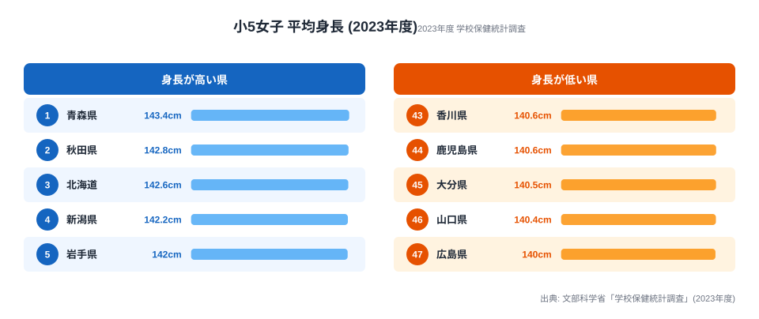
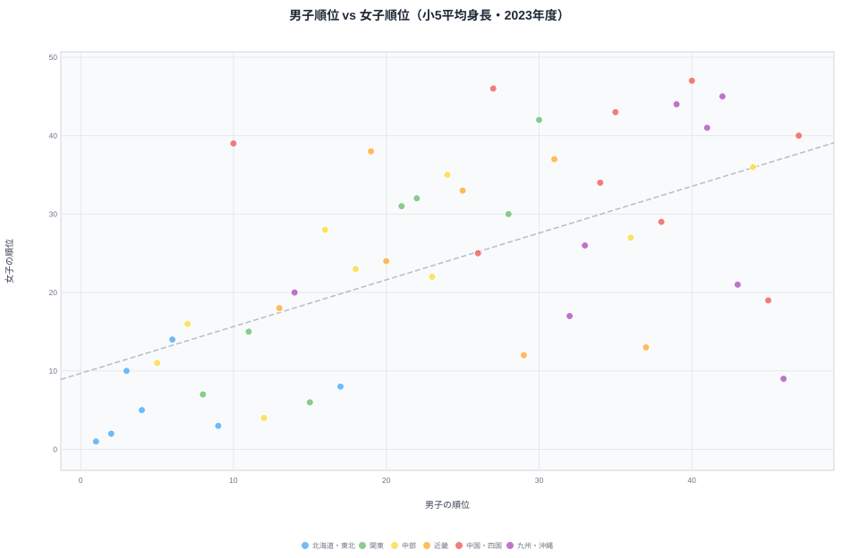

文部科学省「学校保健統計調査」（2023年度）で小学5年生の平均身長を都道府県別に見ると、最大と最小の差は男子で2.9cm、女子で3.4cmと、数字そのものはわずかです。ところが**東北上位・西日本下位という順位の並びは長年ほぼ変わっていません**。1cm以下の刻みで揺れるはずの小集団データが、これだけ安定した地域パターンを保ち続けるのは、偶然では説明しにくい現象です。

そしてもう一つ、この記事の核心になる謎があります。**男子では下位グループ（46位）の沖縄が、女子では上位グループ（9位）に跳ね上がる**のです。同じ島の同じ世代で、なぜ男女でこれほど立ち位置が違うのか。男子ランキングと女子ランキングを並べて、「男女で同じ順位になる県」と「逆転する県」を見分けながら読み解いていきます。

> [!NOTE]
> 「学校保健統計調査」は毎年、全国の小・中・高等学校等で実施される文科省の基幹統計です。都道府県別の平均身長は数千人規模のサンプルから算出されるため、年度によって0.1〜0.3cm程度の順位の入れ替わりが起こります。本記事の順位は2023年度確定値で、同値の場合は連番（タイ無し）で並べています。

## 男子は東北・北海道がほぼ独占する

まず男子から見ます。小5男子の上位は東北・北海道・北陸に集中し、下位は西日本がまとまって並びます。

<source-link href="/ranking/average-height-primary-school-fifth-grade-male">小5男子 平均身長ランキング（47都道府県・各年版）をもっと見る</source-link>

1位は青森（141.4cm）、2位は同値の秋田（141.4cm）、3位に山形（140.9cm）と続き、上位5県のうち4県が東北です。残る1県の富山（5位・140.4cm）も北陸で、寒冷・積雪地帯という共通点があります。一方で下位5県は宮崎・愛知・高知・沖縄・愛媛と、東海から西の県で占められ、最下位は愛媛（47位・138.5cm）でした。

注目したいのは、1位青森と最下位愛媛の差がわずか2.9cmにとどまる点です。クラス内の個人差が10cm以上あることを考えれば、都道府県平均の2.9cm差は誤差に近い小ささです。それでも上位＝東北、下位＝西日本という構図がこれだけ明確に出るのは、個々の子どもではなく地域全体に共通する要因が背景にあることを示唆します。

> [!TIP]
> 平均身長の地域差は「身長が高い・低い」という優劣の話ではありません。0.1cm単位で順位が決まる以上、注目すべきは個別の県の値より、東北が固まって上位・西日本が固まって下位に並ぶという**並びの規則性**です。1県だけ突出していたら偶然を疑いますが、同じ地方が束で揃うのは構造を疑うべきサインです。

## 女子も東北が上位だが、下位の顔ぶれが変わる

次に女子です。女子は男子より成長スパート（急成長期）が1〜2年早く訪れるため、11歳時点では全国的に女子のほうが背が高くなります。上位の地方傾向は男子とよく似ていますが、下位に並ぶ県の顔ぶれが変わります。

<source-link href="/ranking/average-height-primary-school-fifth-grade-female">小5女子 平均身長ランキング（47都道府県・各年版）をもっと見る</source-link>

女子も1位は青森（143.4cm）、2位は秋田（142.8cm）で、東北勢が先頭を走る点は男子と同じです。3位に北海道（142.6cm）、4位に新潟（142.2cm）と続き、上位は北日本でまとまります。一方、下位は大分（45位・140.5cm）・山口（46位・140.4cm）・広島（47位・140.0cm）と、男子の下位（四国・東海）とは違って**中国・九州**が並びます。1位青森と最下位広島の差は3.4cmで、男子よりやや開きます。

ここで男子ランキングと見比べると、ひとつ目立つ動きがあります。男子で下位グループ（46位）だった沖縄が、女子では9位（141.8cm）と上位に食い込んでいるのです。次の章で、この男女逆転を正面から見ていきます。

<ad-slot></ad-slot>

## 沖縄の逆転──男子46位が女子では9位に跳ね上がる

男子で46位（138.7cm・下位グループ）の沖縄が、女子では9位（141.8cm・上位グループ）まで順位を上げます。47都道府県のなかで、男女でここまで立ち位置が動く県は珍しく、この記事の最大の見どころです。

下の散布図は、横軸に男子の順位（左ほど上位＝1位）、縦軸に女子の順位（下ほど上位＝1位）をとって47都道府県をプロットしたものです。点線は両者の傾向を示す回帰直線で、この線の近くに乗る県は男女で立ち位置が連動しており、線から大きく外れる県ほど男女で順位が逆転していることを意味します。沖縄は**右下**（男子順位が大きい＝図の右、女子順位が小さい＝図の下）に位置し、回帰直線から大きく外れて振れ幅が突出しています。

沖縄だけでなく、高知も男子45位から女子19位へ大きく上昇します。逆に山形は男子3位から女子10位へ、富山は男子5位から女子11位へと、男子で上位だった北陸の一部が女子では少し順位を落とします。つまり男女の順位は完全には連動しておらず、県ごとに男女差の出方が違うのです。

> [!WARNING]
> 沖縄の男女逆転を「食文化が原因」と断定することは、単年の身長データだけからはできません。なぜなら学校保健統計調査は身長の結果しか記録しておらず、栄養摂取・成長スパートの時期・サンプル構成のどれが効いているかを切り分ける変数を持たないからです。以下は先行研究や栄養調査をふまえた**仮説**であり、相関の指摘であって因果の証明ではありません。

**[仮説]** 逆転の要因として有力なのは、成長スパートの時期のずれです。女子は男子より1〜2年早く急成長期に入るため、11歳という特定の年齢で「すでに伸びた女子」と「これから伸びる男子」を比べることになります。沖縄でこの時期のずれが他県より大きければ、同じ県でも男子は低め・女子は高めに出る道理です。これを検証するには、学校保健統計の中1・中2の身長（[中2男子 平均身長ランキング](/ranking/average-height-middle-school-second-grade-male)）で沖縄男子が追いつくかを追跡し、文科省「学校保健統計調査」の発育曲線（年齢別身長の推移）と突き合わせるのが筋です。身長データ単体では原因を特定できないため、これらの時系列・別年齢のデータと照合して初めて仮説の当否が判定できます。いずれにせよ、沖縄の逆転は「西日本＝身長が低い」という単純な図式が女子では崩れることを示す好例です。

## 男女で同じ順位の県と、逆転する県を分ける

男子と女子のランキングを重ねると、県は大きく3つのグループに分かれます。

- **男女ともに上位（並びが安定）**：青森（男1位／女1位）、秋田（男2位／女2位）、岩手（男4位／女5位）、東京（男8位／女7位）。東北勢と首都圏は男女どちらでも高い位置を保ちます。
- **男女ともに下位（並びが安定）**：愛媛（男47位／女40位）、広島（男40位／女47位）。中国・四国の一部は男女ともに下位グループにとどまります。
- **男女で逆転（並びが不安定）**：沖縄（男46位／女9位）、高知（男45位／女19位）。男子で低く女子で高い、典型的な逆転県です。

東北4県（青森・秋田・岩手・山形）が男女ともに上位に並ぶことは、寒冷地と身長の相関を示唆します。一方で沖縄・高知のような逆転県の存在は、地域差を「気候」だけで説明できないことの裏返しでもあります。男女で揃う県は気候・食文化など男女共通の要因が、逆転する県は成長時期や男女別の生活差といった**性別固有の要因**が、それぞれ強く効いていると読むのが自然です。

> [!TIP]
> ランキングを1本だけ見ると「沖縄は身長が低い県」と早合点しがちですが、男子と女子を並べた瞬間にその理解は崩れます。地域統計は性別・年齢で切り口を変えると順位が入れ替わることが多く、**2つ以上の指標を重ねて初めて構造が見える**典型例です。

## なぜ東北は長年上位を維持するのか

過去数十年の学校保健統計を遡っても、東北・北海道が上位、西日本（四国・中国・九州）が下位という大枠はほぼ一定です。順位の細部は年ごとに入れ替わりますが、地方単位の並びは驚くほど安定しています。

この持続性を説明しうる仮説は複数あり、どれか一つに絞れるものではありません。

1. **食文化**：東北の豊富な魚介類・乳製品の摂取が、成長に関わるタンパク質・カルシウムの充足を支えるという見方
2. **気候適応**：寒冷地ではがっしりした体格が有利に働くとする説（ただし都道府県平均2.9cmの差を説明できるかは未検証）
3. **遺伝・集団的要因**：数世代にわたる地域集団の特徴が差を生む可能性
4. **生活様式**：屋外活動時間・睡眠時間・食事の規則性など、生活習慣の地域差

ただしこれらは仮説の列挙にすぎず、学校保健統計調査のデータ単体から原因を特定することはできません。確かなのは、わずか3cm前後の差が長年ぶれずに地域パターンを描き続けているという事実だけです。中学生になると差がどう変わるのかは、[中2男子 平均身長ランキング](/ranking/average-height-middle-school-second-grade-male)や[中2女子 平均身長ランキング](/ranking/average-height-middle-school-second-grade-female)と見比べると追えます。地域そのものの背景に関心があれば、各県の人口・産業をまとめた[都道府県プロフィール](/areas/02000)もあわせて参照してください。

## まとめ

- 小5男子の1位は青森（141.4cm）、最下位は愛媛（47位・138.5cm）で、差はわずか2.9cm。
- 小5女子の1位も青森（143.4cm）、最下位は広島（47位・140.0cm）で、差は3.4cm。
- 男女ともに東北・北海道が上位を占め、西日本（四国・中国・九州）が下位に並ぶ構図が長年安定。
- 最大の見どころは沖縄の男女逆転で、男子46位（138.7cm）から女子9位（141.8cm）へ跳ね上がる点。
- 男女で揃う県（青森・秋田など）と逆転する県（沖縄・高知）の存在は、地域差が気候だけでなく性別固有の要因にも左右されることの証左。

## データ出典

- 文部科学省「学校保健統計調査」（2023年度確定値）
- e-Stat（政府統計の総合窓口）経由で都道府県別に整備

<site-link category="educationsports"></site-link>
