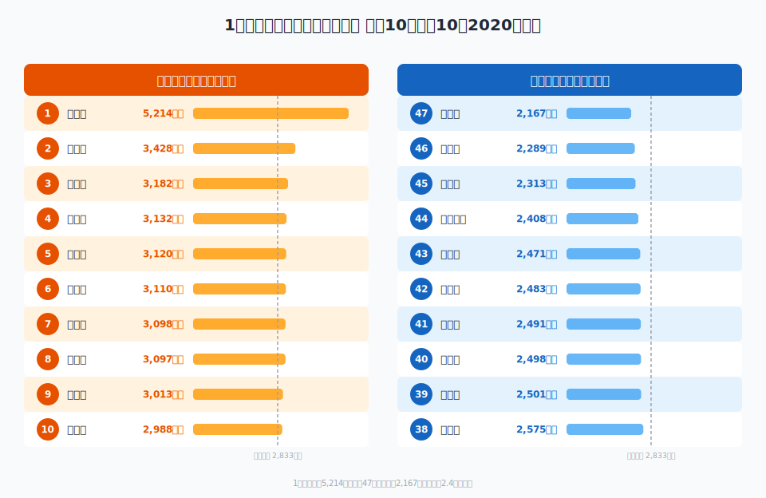
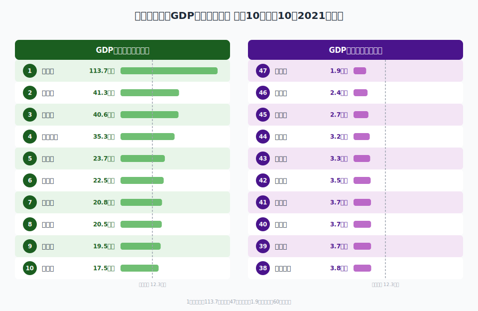

**1人あたり県民所得1位は東京都の521万円**。これは多くの人が予想する通りでしょう。では2位はどこか。大阪でも神奈川でもなく、**愛知県（343万円）**です。

この記事では「1人あたり県民所得」と「県内総生産（GDP）」の2つの指標で都道府県をランキングし、両者の違いから見えてくる地域経済の実像を読み解きます。

> [!NOTE]
> 県民所得＝雇用者報酬＋財産所得＋企業所得。個人の年収ではなく、県全体の経済活動で生み出された所得の総額を人口で割った値です。内閣府「県民経済計算」（平成27年基準）による。

<data-source label="e-Stat 県民経済計算"></data-source>

<ad-slot></ad-slot>

## 1人あたり県民所得ランキング

2020年度のデータで47都道府県を比較します。

### 上位10県

| 順位 | 都道府県 | 1人あたり県民所得（千円） |
|---:|:---|---:|
| 1 | 東京都 | 5,214 |
| 2 | 愛知県 | 3,428 |
| 3 | 福井県 | 3,182 |
| 4 | 栃木県 | 3,132 |
| 5 | 富山県 | 3,120 |
| 6 | 静岡県 | 3,110 |
| 7 | 茨城県 | 3,098 |
| 8 | 滋賀県 | 3,097 |
| 9 | 徳島県 | 3,013 |
| 10 | 千葉県 | 2,988 |

**2位の愛知県から8位の滋賀県まで、差はわずか約33万円**。いずれもトヨタ関連や化学・機械など製造業が集積する「ものづくり県」です。神奈川は13位、大阪は22位と、大都市だからといって上位に入るとは限りません。

意外なのは**9位の徳島県**。人口約72万人の小県ですが、LEDや化学製品を手がける日亜化学工業など、付加価値の高い製造業が所得を押し上げています。

### ワースト10県

| 順位 | 都道府県 | 1人あたり県民所得（千円） |
|---:|:---|---:|
| 38 | 佐賀県 | 2,575 |
| 39 | 奈良県 | 2,501 |
| 40 | 熊本県 | 2,498 |
| 41 | 高知県 | 2,491 |
| 42 | 長崎県 | 2,483 |
| 43 | 愛媛県 | 2,471 |
| 44 | 鹿児島県 | 2,408 |
| 45 | 鳥取県 | 2,313 |
| 46 | 宮崎県 | 2,289 |
| 47 | 沖縄県 | 2,167 |

**47位は沖縄県の217万円**。1位の東京都とは約2.4倍の格差があります。下位には九州南部・四国南部の県が集中しており、第1次産業やサービス業中心の産業構造が背景にあります。

奈良県（39位）はベッドタウンとして大阪に通勤する住民が多く、**所得は大阪で計上されるため県内の数値は低くなる**という構造的な要因があります。

<source-link href="/ranking/per-capita-kenmin-shotoku-h27">1人当たり県民所得ランキングをもっと見る</source-link>

<ad-slot></ad-slot>

## 県内総生産（GDP）ランキング

次に、人口で割らない県全体の経済規模＝県内総生産を見てみましょう。2021年度のデータです。

### 上位10県

| 順位 | 都道府県 | 県内総生産（百万円） |
|---:|:---|---:|
| 1 | 東京都 | 113,685,917 |
| 2 | 大阪府 | 41,320,372 |
| 3 | 愛知県 | 40,585,984 |
| 4 | 神奈川県 | 35,287,752 |
| 5 | 埼玉県 | 23,733,625 |
| 6 | 兵庫県 | 22,506,291 |
| 7 | 千葉県 | 20,806,993 |
| 8 | 北海道 | 20,540,923 |
| 9 | 福岡県 | 19,457,117 |
| 10 | 静岡県 | 17,530,625 |

**東京都の約114兆円は2位大阪府の約2.8倍**。日本のGDPの約2割を東京1都が生み出している計算です。上位はほぼ人口の多い大都市圏が並びます。

### ワースト10県

| 順位 | 都道府県 | 県内総生産（百万円） |
|---:|:---|---:|
| 38 | 和歌山県 | 3,765,051 |
| 39 | 宮崎県 | 3,706,513 |
| 40 | 山梨県 | 3,702,855 |
| 41 | 福井県 | 3,681,511 |
| 42 | 秋田県 | 3,545,316 |
| 43 | 徳島県 | 3,340,186 |
| 44 | 佐賀県 | 3,179,197 |
| 45 | 島根県 | 2,670,688 |
| 46 | 高知県 | 2,376,443 |
| 47 | 鳥取県 | 1,926,339 |

県内総生産の最下位は**鳥取県の約1.9兆円**。東京都の約60分の1です。

<source-link href="/ranking/total-production-in-the-prefecture">県内総生産ランキングをもっと見る</source-link>

## 県民所得とGDPで順位が逆転する県

2つのランキングを比較すると、**順位が大きく変わる県**があります。これが「1人あたりの豊かさ」と「経済の規模」の違いです。

### 所得順位 ＞ GDP順位（人口が少ないが1人あたりは豊か）

| 都道府県 | 所得順位 | GDP順位 | 差 |
|:---|---:|---:|---:|
| 福井県 | 3 | 41 | +38 |
| 徳島県 | 9 | 43 | +34 |
| 富山県 | 5 | 28 | +23 |
| 栃木県 | 4 | 15 | +11 |

**福井県は所得3位なのにGDPでは41位**。人口約76万人と少ないため経済の総量は小さいですが、1人あたりに換算すると全国トップクラスの「稼ぐ力」を持っています。

### GDP順位 ＞ 所得順位（経済規模は大きいが1人あたりは平均的）

| 都道府県 | 所得順位 | GDP順位 | 差 |
|:---|---:|---:|---:|
| 大阪府 | 22 | 2 | -20 |
| 北海道 | 31 | 8 | -23 |
| 福岡県 | 35 | 9 | -26 |
| 神奈川県 | 13 | 4 | -9 |

**大阪府は日本第2の経済圏でありながら、1人あたり所得では22位**。人口が多いぶん「割り算」すると中位に沈みます。北海道・福岡も同様で、経済規模が大きい＝住民が豊かとは言えないことがわかります。

<ad-slot></ad-slot>

## 県民所得と相関が強い指標

1人あたり県民所得と相関が強い統計データを見ると、所得の高さを生み出す構造が浮かび上がります。

| 相関指標 | 相関係数（r） | 意味 |
|:---|---:|:---|
| 住民税（1人あたり） | 0.92 | 所得が高い→税収も多い（当然の結果） |
| 固定資産税（1人あたり） | 0.89 | 所得が高い地域は不動産価値も高い |
| 300人以上事業所の従業者割合 | 0.86 | **大企業が多い県ほど所得が高い** |
| 10〜29人事業所の従業者割合 | -0.88 | 小規模事業所が多い県ほど所得が低い |
| 男性所定内給与額 | 0.83 | 個人の賃金とも連動 |

特に注目すべきは**大企業比率との相関**です。300人以上の事業所で働く人の割合が高い県ほど所得が高く（r=0.86）、逆に10〜29人の小規模事業所の割合が高い県ほど所得が低い（r=-0.88）。県民所得の地域差は、企業規模の差でもあるといえます。

## 地域パターン

データを地域ブロックで整理すると、明確なパターンが見えます。

- **東海・北陸**（愛知・静岡・富山・福井・滋賀）: 製造業の集積で1人あたり所得が高い。GDPは愛知・静岡を除くと中位
- **首都圏**（東京・神奈川・千葉・埼玉）: GDPは上位だが、1人あたり所得は東京以外は10〜17位と中位
- **関西圏**（大阪・兵庫・京都）: GDPは上位だが、1人あたり所得は20位前後。人口の多さで「薄まる」構造
- **九州南部・四国南部**（宮崎・鹿児島・高知・沖縄）: 所得・GDPともに下位。第1次産業比率が高く大企業が少ない

東京を除けば、**「所得の高さ＝製造業の強さ」**という図式がかなり明確です。

## まとめ

- **1人あたり県民所得1位は東京都（521万円）**、2位は愛知県（343万円）。上位は製造業が盛んな「ものづくり県」が占める
- **県内総生産（GDP）は人口の多い大都市圏が上位**。1位東京（約114兆円）、2位大阪（約41兆円）
- **福井県は所得3位・GDP41位**と最も順位差が大きく、「小さくても豊かな県」の代表例
- 県民所得と最も相関が強いのは大企業比率（r=0.86）。**大企業が集まる県ほど所得が高い**
- 47位の沖縄県（217万円）と東京都の格差は約2.4倍。地域間の所得格差は依然として大きい

> [!NOTE]
> 県民所得は個人の手取り年収ではありません。企業所得や財産所得も含む指標のため、「県民所得が高い＝住民の給与が高い」とは限らない点に注意が必要です。

### 関連記事

- [勤労者世帯の月収ランキング──東京79万円vs沖縄49万円](/blog/prefectural-income-ranking)
- [物価が安い県、高い県はどこ？ 消費者物価地域差指数で見る47都道府県の「生活コスト」](/blog/consumer-price-regional-gap-ranking)
- [「貯蓄県」vs「消費県」──都道府県別・貯蓄現在高ランキングで見る日本人のお金事情](/blog/savings-balance-ranking)
