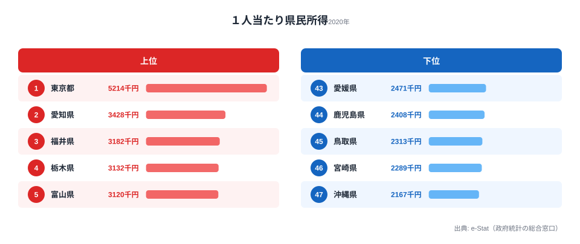
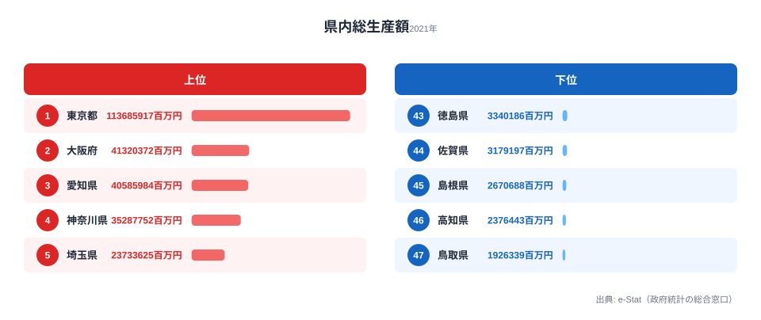
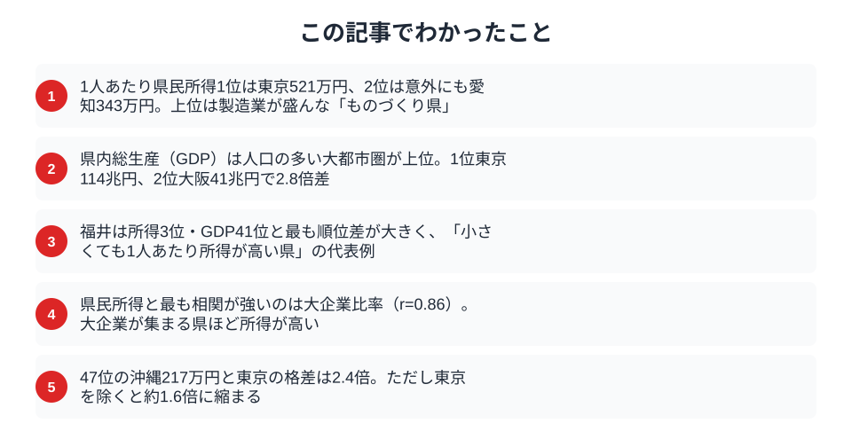

**1人あたり県民所得1位は東京都の521万円**。これは多くの人が予想する通りでしょう。では2位はどこか。大阪でも神奈川でもなく、**愛知県（343万円）**です。同じ都道府県の経済力でも、「1人あたりの所得水準」と「経済の規模（GDP）」では順位が大きく入れ替わります。福井県のように所得は3位なのにGDPでは41位という県すらあります。

この記事では「1人あたり県民所得」と「県内総生産（GDP）」の2つの指標で都道府県をランキングし、両者の順位がなぜ逆転するのかを、相関データから読み解きます。結論を先に言えば、所得の順位を決めているのは大都市かどうかではなく、**大企業がどれだけ集まっているか**です。

> [!NOTE]
> 県民所得は雇用者報酬・財産所得・企業所得の合計です。個人の年収ではなく、県全体の経済活動で生み出された所得を人口で割った値で、企業所得や財産所得も含むため「県民所得が高い＝住民の給与が高い」とは限りません。内閣府「県民経済計算」（平成27年基準）によります。

## 1人あたり県民所得ランキング──上位は「ものづくり県」

2020年度のデータで47都道府県を比較します。

**1位は東京都**（521万円）、**2位は愛知県**（343万円）です。2位の愛知県から8位の滋賀県（310万円）まで、差はわずか約33万円に収まります。いずれもトヨタ関連や化学・機械など製造業が集積する「ものづくり県」で、福井（3位）・栃木（4位）・富山（5位）・静岡（6位）と続きます。神奈川は13位、大阪は22位と、大都市だからといって上位に入るわけではありません。

意外なのは**9位の徳島県**です。人口約72万人の小県ですが、LEDや化学製品を手がける日亜化学工業など、付加価値の高い製造業が所得を押し上げています。人口が少なくても1人あたりの所得が高くなるのは、この「分母が小さく分子が大きい」構造が効いているからです。

最下位は**沖縄県の217万円**で、1位の東京都とは約2.4倍の差があります。ただし、東京都を除いた46道府県で見ると、最大の愛知県（343万円）と最小の沖縄県（217万円）の差は約1.6倍に縮まります。2.4倍という数字は東京の突出した値に引き上げられている面があり、地域間の差を捉えるときは東京の特殊性を踏まえる必要があります。下位には鳥取（45位）・宮崎（46位）・沖縄（47位）など九州南部・四国南部・山陰の県が集中しており、第1次産業やサービス業中心の産業構造が背景にあります。

奈良県（39位）は大阪に通勤する住民が多いベッドタウンです。県民所得は住民ベースで計算されるため通勤先に関わらず奈良県に帰属しますが、**県内総生産（GDP）は生産が行われた場所で計上されるため、通勤先の大阪に計上**されます。奈良県のGDP順位（37位）が所得順位（39位）よりわずかに高いのは、県内の公共サービスや建設業などの生産活動が一定規模あるためです。下位県の暮らしぶりは[沖縄県のデータ](/areas/47000)などの都道府県プロフィールでも確認できます。

<source-link href="/ranking/per-capita-kenmin-shotoku-h27">1人当たり県民所得ランキングをもっと見る</source-link>

## 県内総生産（GDP）ランキング──人口の多い大都市圏が並ぶ

次に、人口で割らない県全体の経済規模＝県内総生産を見てみましょう。2021年度のデータです。

**東京都の約114兆円は、2位大阪府の約41兆円の約2.8倍**です。日本のGDPの約2割を東京1都が生み出している計算になります。上位は大阪・愛知・神奈川・埼玉と、ほぼ人口の多い大都市圏が並びます。所得ランキングで上位だった福井・徳島・富山が見当たらないのは、人口が少なく経済の総量そのものが小さいためです。

県内総生産の最下位は**鳥取県の約1.9兆円**で、東京都の約60分の1にとどまります。高知（46位）・島根（45位）など人口の少ない県が下位に並びますが、これは産業構造の良し悪しではなく、単純に経済規模の大小を映しています。[東京都のデータ](/areas/13000)を見ると、人口・事業所数の集積がそのまま経済規模に直結していることがわかります。

> [!TIP]
> GDP（経済の総量）と1人あたり県民所得（1人の豊かさ）は別物です。GDPが大きい県は「経済圏として大きい」だけで、住民1人あたりが豊かとは限りません。両者を分けて見ると、後述する「順位の逆転」が理解しやすくなります。

<source-link href="/ranking/total-production-in-the-prefecture">県内総生産ランキングをもっと見る</source-link>

<ad-slot></ad-slot>

## 県民所得とGDPで順位が逆転する県

2つのランキングを比較すると、**順位が大きく変わる県**が見えてきます。これが「1人あたりの所得水準」と「経済の規模」の違いです。逆転には2つの方向があります。

**所得順位がGDP順位より高い県（人口は少ないが1人あたり所得は高い）**は、次のとおりです。

- **福井県**: 所得3位 → GDP41位（+38）。人口約76万人と少ないため経済の総量は小さいものの、1人あたりに換算すると全国トップクラスを記録します
- **徳島県**: 所得9位 → GDP43位（+34）
- **富山県**: 所得5位 → GDP28位（+23）
- **栃木県**: 所得4位 → GDP15位（+11）

**GDP順位が所得順位より高い県（経済規模は大きいが1人あたりは平均的）**は、次のとおりです。

- **大阪府**: 所得22位 → GDP2位（-20）。日本第2の経済圏でありながら、人口が多いぶん「割り算」すると1人あたり所得は中位に沈みます
- **福岡県**: 所得35位 → GDP9位（-26）
- **北海道**: 所得31位 → GDP8位（-23）
- **神奈川県**: 所得13位 → GDP4位（-9）

経済規模が大きい県ほど1人あたり所得が高い、とは限らないことがわかります。むしろ人口の多い大都市圏ほど、生み出した所得が大勢の住民で薄まり、1人あたりでは中位に落ち着く傾向があります。

## 県民所得と相関が強い指標──逆転の正体は「企業規模」

順位の逆転がなぜ起きるのか。1人あたり県民所得と相関が強い統計データを見ると、所得の高さを生み出す構造が浮かび上がります。e-Stat「社会・人口統計体系」の都道府県別データ（n=47）からピアソンの積率相関係数を算出すると、相関の強い順に次のようになります。

- **住民税（1人あたり）**: r=0.92。所得が高い県は税収も多く、ほぼ当然の結果です
- **固定資産税（1人あたり）**: r=0.89。所得が高い地域は不動産価値も高い傾向があります
- **300人以上事業所の従業者割合**: r=0.86。**大企業が多い県ほど所得が高い**という関係です
- **10〜29人事業所の従業者割合**: r=-0.88。小規模事業所が多い県ほど所得が低くなります
- **男性所定内給与額**: r=0.83。個人の賃金とも連動しています

特に注目すべきは**大企業比率との相関**です。300人以上の事業所で働く人の割合が高い県ほど所得が高く（r=0.86）、逆に10〜29人の小規模事業所の割合が高い県ほど所得が低くなります（r=-0.88）。所得3位の福井や5位の富山に大企業の工場が集積し、GDP上位でも所得が中位の大阪が中小・サービス業を多く抱えることを思い出すと、**順位の逆転の正体は「大都市かどうか」ではなく「大企業がどれだけ集まっているか」**だとわかります。県民所得の地域差は、企業規模の差でもあるのです。

> [!WARNING]
> 相関は因果ではありません。「大企業が多いから所得が高い」とまでは断定できず、所得が高い地域に大企業が立地しやすいという逆向きの関係も考えられます。また、東京都は多くの指標で突出した外れ値となるため、東京都を除外すると相関係数が変動します。上記はあくまで47都道府県全体での傾向です。

<ad-slot></ad-slot>

## 地域ブロックで見るパターン

データを地域ブロックで整理すると、明確なパターンが見えてきます。

- **東海・北陸**（愛知・静岡・富山・福井・滋賀）: 製造業の集積で1人あたり所得が高くなっています。ただしGDPは愛知・静岡を除くと中位です
- **首都圏**（東京・神奈川・千葉・埼玉）: GDPは上位だが、1人あたり所得は東京を除くと10〜17位の中位にとどまります
- **関西圏**（大阪・兵庫・京都）: GDPは上位だが、1人あたり所得は大阪22位・兵庫18位・京都30位。人口の多さで「薄まる」構造です
- **九州南部・四国南部**（宮崎・鹿児島・高知・沖縄）: 所得・GDPともに下位。第1次産業の比率が高く大企業が少ないことが共通します

東京を除けば、**「所得の高さ＝製造業の強さ」**という図式がかなり明確に表れています。経済全般の指標は[経済カテゴリのランキング一覧](/category/economy)からも横断的に比較できます。

## まとめ

- **1人あたり県民所得1位は東京都**（521万円）、2位は愛知県（343万円）。上位は製造業が盛んな「ものづくり県」が占めます
- **県内総生産（GDP）は人口の多い大都市圏が上位**。1位東京（約114兆円）、2位大阪（約41兆円）で約2.8倍の差があります
- **福井県は所得3位・GDP41位**と最も順位差が大きく、「小さくても1人あたり所得が高い県」の代表例です
- 県民所得と最も相関が強いのは大企業比率（r=0.86）。**大企業が集まる県ほど所得が高く**、これが順位逆転の正体です
- 最下位の沖縄県（217万円）と東京都の差は約2.4倍。ただし東京を除くと約1.6倍に縮まり、差の大部分は東京の突出に起因します

世帯ベースの収入を知りたい場合は[勤労者世帯の月収ランキング](/blog/prefectural-income-ranking)も合わせて読むと、所得指標の違いがより立体的に見えてきます。

## データ出典

- 内閣府「県民経済計算」（平成27年基準、1人あたり県民所得は2020年度）
- 内閣府「県民経済計算」（県内総生産は2021年度）
- 総務省「社会・人口統計体系」（相関指標の都道府県別データ）
- いずれも e-Stat（政府統計の総合窓口）経由で整備したデータを使用しています。
