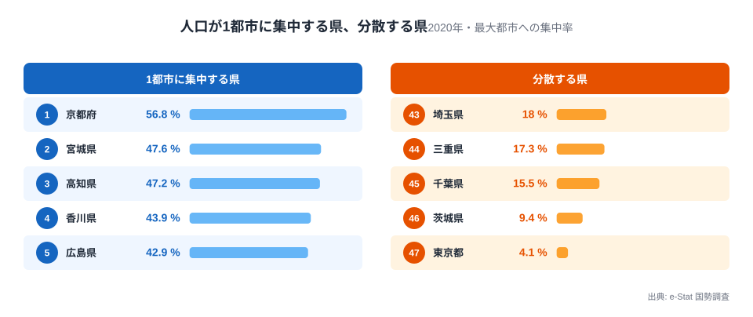
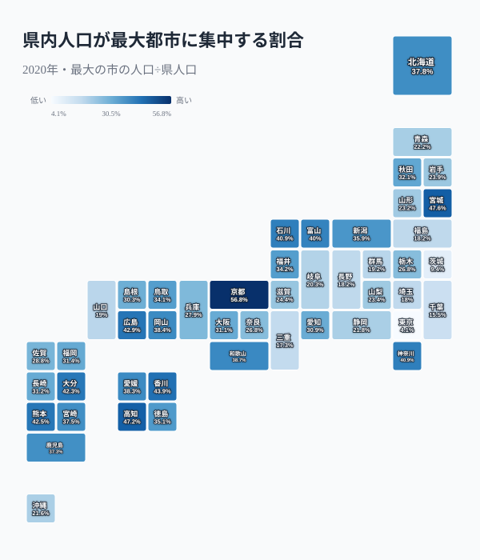
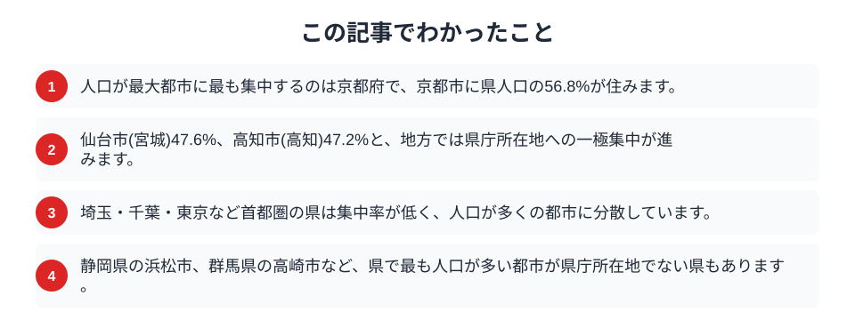

同じ「県」でも、人口の集まり方はまるで違います。ある県では県民の半分以上が1つの都市に住み、別の県では最大の都市でも県人口の1割にすぎません。2020年の国勢調査から、各県で最も人口の多い都市が県全体のどれだけを占めるかを計算すると、地方と都市圏ではっきり傾向が分かれました。人口が1つの都市に凝縮する県と、いくつもの都市に薄く広がる県。その差は、県の成り立ちそのものを映しています。

## 京都は半分以上が京都市に住む

まず、最大の都市への集中率が高い県と低い県を並べてみます。

<data-source label="e-Stat 国勢調査" note="最大の市の人口÷県人口（2020年）"></data-source>

最も集中率が高いのは京都府で、京都市に県人口の56.8%が住んでいます。県民の半分以上が1つの都市に集まる計算です。続いて宮城県の仙台市が47.6%、高知県の高知市が47.2%、香川県の高松市が43.9%、広島県の広島市が42.9%と、地方の県で県庁所在地への集中が目立ちます。反対に、集中率が最も低いのは東京都で4.1%、次いで茨城県9.4%、千葉県15.5%と、いずれも人口が多くの都市に分かれています。集中する県では県庁所在地がその県の顔として突出し、分散する県では中規模の都市がいくつも並び立つという、対照的な構図が見えてきます。

<source-link href="/ranking/total-population">都道府県別の総人口ランキングを見る</source-link>

## 地方は集中、首都圏は分散する

次に、集中率を地図で見ると、地方と都市圏の違いがくっきり現れます。

<data-source label="e-Stat 国勢調査" note="最大の市の人口÷県人口（2020年）"></data-source>

色が濃いのは京都・宮城・高知・香川・広島・大分といった、県庁所在地が地域の中心として際立つ県です。地方では、進学・就職・医療・買い物のあらゆる機能が県庁所在地に集まり、県内の人口もそこへ吸い寄せられていきます。一方で、色が薄いのは埼玉・千葉・茨城といった首都圏の県です。これらの県は東京への通勤圏として発展したため、県内に突出した中心都市を持たず、川口・柏・つくばのように同規模の都市が横並びになりました。[首都圏3県が昼間人口では最下位](/blog/population-migration-tokyo-concentration)になる構造は、この「中心を持たない分散型」の県のかたちと表裏一体です。

<source-link href="/ranking/total-population">総人口の都道府県ランキングを見る</source-link>

## 最大都市が県庁所在地とは限らない

集中率の話には、もう一つ意外な側面があります。

> [!NOTE]
> 県で最も人口が多い都市が、県庁所在地とは限りません。静岡県では浜松市が静岡市を上回り、群馬県では高崎市が前橋市より多く、福島県ではいわき市が福島市を上回ります。山口県の下関市、三重県の四日市市も同様です。こうした県では、行政の中心と人口の中心がずれているため、県のまとまり方も一極集中型とは異なります。

こうしたずれが生まれる背景はさまざまです。浜松市は自動車やオートバイなどの製造業で発展し、県庁のある静岡市と並ぶ二大都市になりました。いわき市は昭和の大合併で広い市域を一つにまとめた結果、面積とともに人口も大きくなりました。港湾都市として栄えた下関市や、工業と港で伸びた四日市市も、行政の中心とは別の理由で人口を集めた都市です。最大都市と県庁所在地が分かれている県では、県内に複数の核ができやすく、集中率も中程度にとどまる傾向があります。「県の顔」がどの都市なのかは、県庁がある場所だけでは決まらないのです。

## 数字を読むときの注意

集中率という一つの数字も、県の事情によって意味が変わります。

> [!WARNING]
> 東京都の集中率が極端に低いのは、人口が集まる23の特別区が「市」ではなく特別区であり、単一の都市として数えていないためです。実際には都心部に人口も機能も高度に集中しており、集中率の数字だけで「東京は分散している」と読むのは誤りです。

> [!TIP]
> 集中率は、県の面積や地形にも左右されます。山地で可住地が限られる県では、平地の中心都市に人が集まりやすくなります。集中の高さを「便利さ」や「発展」と直結させず、地形や交通、歴史とあわせて読むことが大切です。

集中する県と分散する県は、どちらが良い・悪いという話ではありません。それぞれの県が歩んできた歴史と地理の結果として、人口の集まり方が形づくられています。

## まとめ

この記事でわかったことを整理します。

人口が1つの都市に集中するかどうかは、県によって大きく分かれます。地方では県庁所在地への一極集中が進み、京都府では県民の過半数が京都市に住みます。一方、首都圏の県は中心を持たず多くの都市に分散しています。人口の集まり方は、都市への流入が続く現在も少しずつ変わり続けており、[東京だけが増える2050年の日本](/blog/future-population-tokyo-paradox)や[人口動態のテーマページ](/themes/population-dynamics)からその行方を展望できます。県のかたちを人口の集中度から見ることは、地域を理解する新しい視点になります。

## データ出典

- e-Stat（政府統計の総合窓口）国勢調査「都道府県別・市区町村別人口」（2020年）
- 集中率は各県で最も人口の多い市の人口を県総人口で割って算出。政令指定都市の行政区は市に含め、東京都の特別区は単一の市として数えていません。
