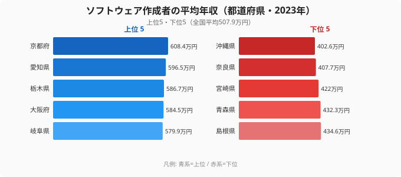
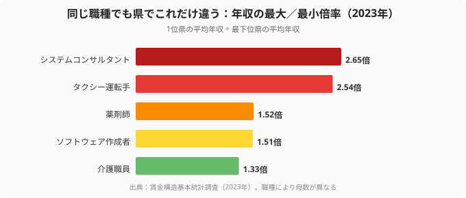

転職を考えはじめて求人サイトを開くと、たいてい最初に目に入るのが「この職種の平均年収は◯◯万円」という数字です。けれども、その全国平均はあなたの年収を約束しません。2023年の賃金構造基本統計調査をもとに職種ごとの平均年収を都道府県別に並べると、同じ仕事でも住む県によって**1.3倍から2.6倍**もの差がついていました。月収に直せば毎月数万円から十数万円、生涯賃金では数百万円から一千万円規模の違いになります。

この記事の問いはシンプルです。「あなたの職種は、どの県でいくらが相場なのか」。そして「全国平均ではなく自分の県の相場を起点にすると、転職の判断はどう変わるのか」。先に結論を言うと、年収を上げたいなら見るべきは全国平均ではなく、**自分の職種 × 自分の県（あるいは狙う県）の相場**です。その相場を一番手早く、しかも無料で教えてくれるのが転職エージェントですが、それは記事の後半で触れます。まずはデータで「県差の大きさ」を見ていきましょう。

> [!NOTE]
> ここでの「年収」は賃金構造基本統計調査の「きまって支給する現金給与額×12＋年間賞与その他特別給与額」で推計した額面（税・社会保険料を引く前）です。手取りではなく、個々の企業の手当や残業の多寡までは反映しません。また職種によっては調査対象の人数（母数）が少なく、とくに上位・下位の県は単年でぶれやすい点に注意してください。順位は「県のおおよその相場」を示すものと読んでください。

## 同じ「ソフトウェア作成者」でも、京都と沖縄で年収が1.5倍違う

まずIT職の代表として、ソフトウェア作成者（プログラマー・システムエンジニア等）の都道府県別年収を見ます。2023年の全国平均は507.9万円。上位と下位の5県を並べると、その振れ幅がはっきりします。

1位は[京都府](/areas/26000)608.4万円、続いて愛知596.5万円、栃木586.7万円、大阪584.5万円、岐阜579.9万円と、関西・中部の製造業が集積する地域が上位を固めました。一方の下位は沖縄402.6万円を最下位に、奈良407.7万円、宮崎422.0万円、青森432.3万円、島根434.6万円。トップとボトムの開きは**205.8万円、倍率にして1.51倍**にのぼります。同じスキルセットを持つエンジニアでも、勤務地が変わるだけで年収のスタートラインが200万円ずれるということです。

意外なのは、東京が上位5に入っていない点です。IT職は東京一極集中のイメージがありますが、平均年収でみると京都・愛知・栃木といった製造業の研究開発拠点を抱える県が上回ります。これは、これらの県では自動車・電機メーカーの社内システム部門や開発子会社が高めの賃金水準を形成しているためと考えられます（[仮説]の域は出ませんが、上位県の顔ぶれは製造業集積と整合的です）。リモートワークで居住地を選べる時代だからこそ、「どの県の求人に応募するか」が年収を左右する変数になっています。

<source-link href="/ranking/software-engineer-annual-income">ソフトウェア作成者の平均年収ランキング（全47都道府県）を見る</source-link>

> [!WARNING]
> この順位は「県の平均」であって「あなたの年収保証」ではありません。同じ県内でも、勤め先が大手メーカー系か受託開発か自社サービスかで年収は大きく振れますし、ソフトウェア作成者は調査対象の人数が県によって偏るため、上位・下位の顔ぶれは年によって入れ替わります。県の順位は「相場の目安」として使い、最後は個別企業の条件で確かめるのが鉄則です。

## 格差の大きさは職種で全然違う──最大はシステムコンサルタントの2.65倍

ここで一段視点を引きます。「県で年収が違う」のはソフトウェア作成者だけの話ではありません。けれども、その**格差の大きさ自体が職種によって大きく異なる**のです。代表的な5職種について、1位県の平均年収を最下位県の平均年収で割った「格差倍率」を並べてみます。

最も格差が大きいのはシステムコンサルタントで、**2.65倍**（1位秋田952.5万円・最下位沖縄359.1万円）。次いでタクシー運転手2.54倍（東京586.0万円・石川230.5万円）、薬剤師1.52倍（広島706.0万円・徳島463.7万円）、ソフトウェア作成者1.51倍（京都608.4万円・沖縄402.6万円）、介護職員1.33倍（広島411.3万円・大分308.6万円）と続きます。介護職員のように制度（介護報酬）で賃金の上限が全国的にそろえられている職種は格差が小さく、システムコンサルタントやタクシー運転手のように地域の需要と単価がそのまま給与に跳ね返る職種ほど格差が大きい、という傾向が読み取れます。

注目すべきは、格差が大きい職種ほど「県選び」のレバレッジが効くことです。介護職員なら県を変えても年収は1.3倍までしか動きませんが、システムコンサルタントなら相場の高い県と低い県で2.6倍、つまり同じ仕事内容でも年収が倍以上変わり得ます。なお、システムコンサルタントの1位が秋田・2位奈良という直感に反する並びは、母数が小さく特定の高給企業が平均を押し上げている可能性が高く、[システムコンサルタントの年収ランキング](/ranking/system-consultant-annual-income)で全県の並びを確認するとぶれの大きさが見えてきます。「自分の職種はどちらのタイプか」を知ることが、転職戦略の出発点になります。

> [!TIP]
> 自分の職種の格差が大きいなら、「スキルを上げる」より「相場の高い県の求人を狙う」ほうが短期では効くことがあります。逆に格差が小さい職種は、県を変えても年収は伸びにくいため、資格取得や役職アップなど別の軸で年収を設計する必要があります。格差の大小は、あなたが取るべき打ち手を変えるのです。

## なぜ「全国平均」ではなく「自分の県の相場」で動くべきか

ここまでのデータが示す結論は明快です。職種の年収は「全国一律の数字」ではなく、**職種 × 地域の掛け合わせ**で決まります。だからこそ、求人サイトのトップに出てくる「この職種の平均年収は◯◯万円」は、転職の意思決定にはほとんど役に立ちません。あなたにとって本当に意味があるのは、次の3つの組み合わせです。

- いま働いている県で、自分の職種の相場はどのあたりか（自分の現在地）
- 狙える県（リモート可なら全国）で、相場はどこまで上がるか（伸びしろ）
- その県・その企業で、額面だけでなく家賃や生活費を引いた手元の額はどうなるか（実質）

たとえばソフトウェア作成者が沖縄（402.6万円）で働きながら、リモート可の京都・愛知圏の求人（580〜600万円台）に応募できれば、引っ越しなしで年収を1.5倍にできる可能性があります。逆に、額面の高い県へ移っても家賃がそれ以上に上がるなら、可処分所得はむしろ減ることもあります。「全国平均より高いかどうか」ではなく、「自分の相場からどれだけ動かせるか」で考えるのが、年収を最大化する現実的な道筋です。同じ賃金・労働の指標を横断で眺めたい場合は[賃金・労働カテゴリ](/category/laborwage)も参考になりますし、職種ごとの地域差をさらに掘り下げた例として[介護職とケアマネで年収が逆転する県の話](/blog/care-worker-income-prefecture-gap)もあわせて読むと、相場の読み方が立体的になります。

## 自分の相場を「無料で」教えてもらう方法

とはいえ、「自分の職種 × 県の相場」「リモート可で狙える県の求人」を個人で調べ尽くすのは大変です。ここで現実的な選択肢になるのが転職エージェントです。誤解されがちですが、**転職エージェントの登録・面談（キャリア相談）は求職者側は無料**です。理由はビジネスモデルにあります。エージェントは、採用が決まったときに採用した企業側から成功報酬を受け取る仕組みで運営されています。だから求職者からは費用を取らず、登録も、キャリアアドバイザーとの面談も、求人紹介も、年収交渉の代行も、すべて無料で利用できます。

> [!NOTE]
> 「無料」の中身を具体的に言うと、(1) 会員登録、(2) キャリアアドバイザーとの面談（オンライン面談に対応する社が多い）、(3) あなたの職種・地域に合った求人の紹介、(4) 職務経歴書の添削や年収交渉の代行、までが一般的に無料です。まず「いま転職するかは未定だが、自分の市場価値だけ知りたい」という情報収集だけの利用でも構いません。本記事は広告（アフィリエイト）を含みます。無料の範囲や提供サービスは各社で異なるため、登録前に各社の案内をご確認ください。

エンジニア・IT職のように地域差・企業差が大きい職種は、自分一人で相場を把握しにくいぶん、エージェントに「自分の経験で、狙える県も含めると年収はどこまで上がるか」を聞く価値が大きい領域です。たとえばエンジニア特化型のエージェントなら、リモート可・残業少なめといった条件を含めて相場感を教えてもらえます。

<affiliate-banner src="https://www24.a8.net/svt/bgt?aid=260601701360&wid=001&eno=01&mid=s00000026573001005000&mc=1" href="https://px.a8.net/svt/ejp?a8mat=4B5LK5+5YC2K2+5P1E+5ZEMP" tracking="https://www18.a8.net/0.gif?a8mat=4B5LK5+5YC2K2+5P1E+5ZEMP" width="320" height="100" label="STRATEGY CAREER｜エンジニア転職（無料登録・無料面談）"></affiliate-banner>

<!-- TODO(総合転職エージェント): A8で総合エージェント（リクルート/doda/マイナビ等）の提携承認・リンク取得後、ここに2枚目の <affiliate-banner src/href/tracking width height label> を追加する。全職種ハブのため総合型を主、エンジニアは上のSTRATEGY CAREERを従とする出し分け。register-affiliate-banner で SSOT (affiliate-ads-data.ts) にも登録すること。 -->

職種を問わず「まず自分の相場を知る」ことが、年収アップの第一歩です。全国平均という曖昧な基準ではなく、自分の職種と県の実際の数字を起点に、狙える伸びしろを具体的に描くことから始めてみてください。

## まとめ

- 2023年の賃金構造基本統計調査でみると、同じ職種でも年収は県で**1.3〜2.6倍**違う。ソフトウェア作成者は1位京都608.4万・最下位沖縄402.6万で**1.51倍**、全国平均は507.9万円。
- 格差の大きさは職種で異なり、最大はシステムコンサルタントの**2.65倍**、タクシー運転手2.54倍。制度で単価がそろう介護職員は1.33倍と小さい。**格差が大きい職種ほど「県選び」のレバレッジが効く**。
- だから転職判断は「全国平均」ではなく「自分の職種 × 県の相場」を起点にすべき。リモート可なら居住地を変えずに相場の高い県の求人を狙える。
- 額面だけでなく、家賃・生活費を引いた**実質の手取り**で比べると順位は変わる。
- 自分の相場や狙える県の求人を効率よく知る手段が転職エージェント。**登録・面談は求職者は無料**（採用企業が成功報酬を払うモデル）で、情報収集だけの利用でも構わない。

## データ出典

厚生労働省「賃金構造基本統計調査」（2023年）をもとに、e-Stat 経由で整備したデータを集計。年収は「きまって支給する現金給与額×12＋年間賞与その他特別給与額」で推計した額面値。職種により調査対象人数が異なり、母数の小さい職種は上位・下位の順位が年次でぶれやすい点に留意してください。
