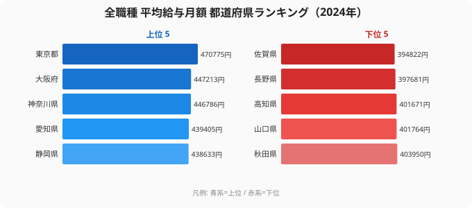
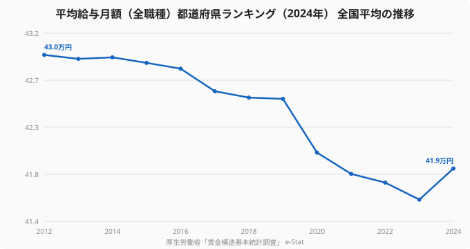

「給料を上げたいなら都会へ」とよく言われる。確かに平均給与が最も高いのは[東京都](/areas/13000)で、月額47.1万円（2024年）。だが、最下位の[佐賀県](/areas/41000)（39.5万円）と比べても、その差は約1.2倍にとどまる。職種による2〜3倍の年収差と比べると、都道府県間の給与格差は意外なほど小さい。

しかも、全国平均の給与月額は2012年の43.0万円から2024年の41.9万円へと、12年でむしろ微減している。賃金が伸び悩む中で、住む場所を変えずに収入を上げる方法はあるのか。本記事では2024年の平均給与を47都道府県で読み解き、リモート転職による「地方在住×都市部給与」という選択肢を検証する。

> [!NOTE]
> データは厚生労働省「賃金構造基本統計調査」をもとにした全職種の平均給与月額（きまって支給する現金給与額）です。賞与は含みません。産業構成により地域差が生じ、物価・家賃水準を加味すると実質的な豊かさの順位は変わります。

## 平均給与ランキングの全体像 — 東京1強でも差は約1.2倍

上位は東京都（47.1万円）、大阪府（44.7万円）、神奈川県（44.7万円）、愛知県（43.9万円）、静岡県（43.9万円）。下位は佐賀県（39.5万円）、長野県（39.8万円）、高知県（40.2万円）。全国平均は41.9万円、中位（24位前後）の鹿児島県は41.7万円だ。

注目すべきは、上位も下位も平均の前後数万円に収まり、47都道府県が極端に狭いレンジへ密集している点だ。1位と最下位の開きが約1.2倍にすぎないということは、住む県を変えても給与水準はほとんど動かないことを意味する。年収を動かす主因は「どこに住むか」ではなく「どの企業の給与テーブルに乗るか」にある。

<source-link href="/ranking/avg-salary-all-prefecture">都道府県別の平均給与ランキングを詳しく見る</source-link>

## 全国平均は微減 — 「待っていても上がらない」賃金

時系列で見ると厳しさが浮かぶ。全国平均は2012年の43.0万円から2024年の41.9万円へと12年で微減した。物価上昇下での名目給与の停滞は、実質的な手取りの目減りを意味する。

> [!NOTE]
> 直近は底打ちの兆しもある。2023年の41.6万円から2024年は41.9万円へと前年比で反転した。ただし12年トレンドで見れば依然として2012年水準を下回っており、「在籍を続ければ自然に上がる」局面には戻っていない。

賃金を上げる主導権は、会社が定期昇給で運んでくれるものから、自分がより高い給与水準の企業・職種を選ぶ側へと移っている。

## 地域差が小さいからこそ「働く場所」を選べる

地域差が約1.2倍と小さいことは、裏を返せば「どこに住んでも給与水準は大きく変わらない」ということだ。一方で、家賃をはじめとする生活コストの地域差は給与差よりはるかに大きい。東京は給与が高いが住居費も突出し、額面で月数万円多くても住居費の差で大半が相殺されることは珍しくない。

つまり手元にいくら残るかは、給与そのものではなく「給与から家賃・物価を引いた後」で決まる。給与差が小さく家賃差が大きいなら、都市部水準の給与を保ったまま生活コストの低い地域に住むほうが、額面年収を多少上げるより可処分所得は増えやすい。リモートワークは、この「給与は都市部・生活コストは地方」という組み合わせを初めて現実的にした手段だ。

<source-link href="/ranking/telework-rate">都道府県別テレワーク実施率ランキングも見る</source-link>

> [!TIP]
> エンジニアのようにリモートで完結する職種なら、勤務地と居住地を切り離せる。家賃の安い地域に住みながら都市部水準の年収を得るという設計は、転職という機会にこそ最適化しやすい。リモート可否・年収レンジ・企業の給与水準を比較できるエンジニア専門の転職エージェントを使えば、年収交渉と「どこに住んで働くか」を同時に設計できる。

## まとめ — 勝負どころは「住む場所」から「働き方の設計」へ

平均給与データが示すのは、(1) 地域差は約1.2倍と小さく、(2) 全国平均は12年で微減した、という2点だ。この状況で収入を増やすには、住む県を変えるよりも、給与の高い企業へ移り、なおかつ生活コストの低い地域に住む組み合わせを選ぶことが効く。額面の給与ランキングだけを眺めても見えてこないのは、最終的に手元へ残る金額──可処分所得という一点である。

## データ出典

- 厚生労働省「賃金構造基本統計調査」（e-Stat 統計データ、2012〜2024年）
- 平均給与月額はきまって支給する現金給与額（賞与を除く）。産業構成により地域差が生じます

本記事の対象データ: [関連カテゴリ](/category/laborwage)
