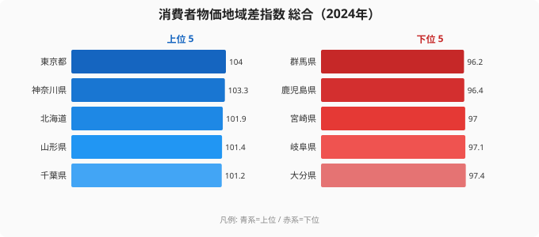
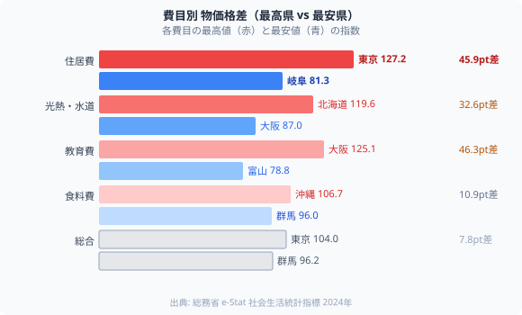

「地方に移住すれば生活費が安くなる」──この期待は正しいでしょうか。

2024年の消費者物価地域差指数（全国平均=100）を見ると、**最高は東京104.0・最安は群馬96.2**で差は**わずか7.8ポイント**。「8%しか違わないなら移住のメリットは小さい」と思いがちです。

ところが、費目別に分解すると全く違う景色が見えます。**住居費だけは東京127.2 vs 岐阜81.3で45.9ポイント差**。家賃が「物価格差の真因」だったのです。費目ごとに「動く幅」がまるで違うため、総合指数の小ささに惑わされると判断を誤ります。

## 総合ランキング──思ったより小さい差

**首都圏・大都市圏が高く、南九州・北関東が低い**構造です。1位の東京（104.0）と47位の群馬（96.2）の差は7.8ptにすぎません。年収400万円なら物価の地域差は年間30万円程度で、「地方は安い」は事実でも体感ほど大きくないことがわかります。

> [!NOTE]
> 消費者物価地域差指数は、各都道府県の物価水準を全国平均=100として指数化したもの。総務省「小売物価統計調査」（2024年）に基づきます。「指数の差」は割合の差とほぼ等しいと読むと、以降の試算が直感的に理解できます。

意外な結果があります。**北海道は3位の高物価**。「北海道は物価が安い」というイメージとは正反対です。理由は**光熱費**です。北海道の光熱・水道費は119.6で全国ダントツ1位。暖房費が年間を通じてかさむ影響が総合指数を押し上げています。総合指数は4費目を平均してしまうため、こうした「どの費目が効いているか」は分解しないと見えません。

<source-link href="/ranking/consumer-price-difference-index-overall">消費者物価地域差指数ランキングをもっと見る</source-link>

## 費目別に見ると「別世界」が現れる

総合指数は「全部入り」の平均値。費目別に分解すると物価の構造が丸裸になります。下図は各費目の最高県（赤）と最安県（青）の指数を並べたもので、住居費の帯だけが突出して長いことが一目でわかります。

### 住居費──格差の主役（東京127.2 vs 岐阜81.3）

**費目別最大の格差は住居費**（45.9pt差）。東京の住居費指数127.2は全国平均の1.3倍。千葉（114.4）・神奈川（112.9）・埼玉（107.3）と首都圏が上位を独占します。

逆に、岐阜（81.3）・岡山（82.0）・石川（82.8）など地方は全国平均の8割程度。「東京から岐阜に引越すと家賃が45ポイント下がる」ということは、単純計算で**家賃が約36%安くなる**可能性があります（※他条件一定の場合）。総合の地域差のほとんどは、この住居費＝家賃が生み出しています。移住で生活コストを下げられるかは、ほぼ家賃で決まると言ってよいでしょう。費目別の家計判断は[移住で生活コストは下がるか（費目別分解）](/blog/consumer-price-regional-gap)でさらに詳しく扱っています。

### 光熱費──北海道の「暖房コスト」

**北海道は光熱・水道費で全国断トツ1位（119.6）**。岩手（112.1）・山形（111.2）・青森（111.0）と東北勢が続きます。北海道の総合物価3位の正体は、この暖房コストです。

逆に大阪（87.0）は全国最安。温暖な気候と都市ガス普及が光熱費を抑えます。光熱費は気候という動かせない条件に縛られるため、移住で「下げる」のが最も難しい費目です。

### 教育費──大阪が全国1位の意外

**教育費は大阪（125.1）が全国1位**。和歌山（119.0）・京都（116.8）・滋賀（115.0）と近畿が上位を独占。私立中学・高校への進学率が高い近畿の教育文化が指数を押し上げます。

逆に富山（78.8）・群馬（80.1）・山口（80.7）は教育費が安い。公立校の充実と私立校の少なさが背景です。子育て世帯にとっては、家賃と並んで移住先選びに効く費目です。

### 食料費──地方が安いとは限らない

**食料費最高は沖縄（106.7）**。離島への輸送コストが直撃します。2位は東京（103.0）ですが、3位には福井（102.5）・島根（102.5）と地方が入ります。

一方**最安は長野（95.8）・群馬（96.0）**。農業県は地産地消の恩恵で食料費が安くなります。ただし食料費の格差は10.9ptと住居費の4分の1以下で、移住による食費の節約効果は小さいのが実態です。

> [!TIP]
> 「総合で物価が高い = すべてが高い」とは限りません。北海道は総合3位ですが住居費はむしろ平均以下。「高い費目・安い費目」を費目別に把握することが、移住・家計管理の本質的な判断につながります。物価の上がり方の地域差は[都道府県で異なるインフレの型](/blog/cpi-change-regional-pattern)も参考になります。

## 物価 × 所得──「実質的な豊かさ」の4象限

物価が安くても所得が低ければ生活は楽になりません。**消費者物価地域差指数と1人あたり県民所得**を組み合わせると、暮らしの「実質的な豊かさ」が見えてきます。

- **穴場（高所得 × 低物価）**：愛知（物価98.1／県民所得3,728千円）・栃木（97.6／3,479千円）・富山（98.6／3,398千円）。所得が高いのに物価は平均以下。
- **厳しい（低所得 × 高物価）**：北海道（101.9／2,742千円）・沖縄（100.2／2,391千円）。所得が低いのに物価は平均並み以上。

**愛知・栃木・富山**が「所得が高くて物価が低い穴場」として浮かびます。愛知は自動車産業の高所得と中京圏の穏やかな物価が両立。富山は共働き率の高さと低物価が実質的な豊かさを支えます。一方**北海道・沖縄**は「所得が低いのに物価が全国平均並み」という厳しい構造で、北海道は光熱費、沖縄は食料費がそれぞれ物価を押し上げています。所得側の地域差は[所得1位は東京、最下位と2.5倍差](/blog/per-capita-income-gap)で確認できます。

> [!WARNING]
> 「穴場」判定は2024年時点の静的スナップショットです。近年の人口流入による地価・家賃上昇（特に愛知・栃木）で、今後は「穴場」でなくなる可能性もあります。移住を検討する際は最新の家賃相場を個別確認してください。

<source-link href="/ranking/per-capita-kenmin-shotoku-h23">1人あたり県民所得ランキングをもっと見る</source-link>

## まとめ──物価は「平均」でなく「費目」で見る

- **総合差は7.8pt**：「地方は安い」は事実だが体感ほど大きくない。
- **住居費差は45.9pt**：物価格差の真因。移住の節約効果はほぼ家賃で決まる。
- **光熱費・教育費**：北海道の高物価は暖房費、近畿の高物価は教育費。総合では見えない。
- **物価 × 所得**：愛知・栃木・富山が「実質的に豊かな穴場」、北海道・沖縄は厳しい。

物価を「平均」で語ると判断を誤ります。費目別に分解し、所得と組み合わせて初めて「実質的な暮らしやすさ」が見える──これが47都道府県の物価データの読み方です。暮らしのコストを多面的に比べたいなら[経済カテゴリのランキング一覧](/category/economy)から探せます。

## データ出典

- 総務省「小売物価統計調査」2024年（消費者物価地域差指数）
- e-Stat「社会生活統計指標（家計）」
- 内閣府「県民経済計算」（1人あたり県民所得）
