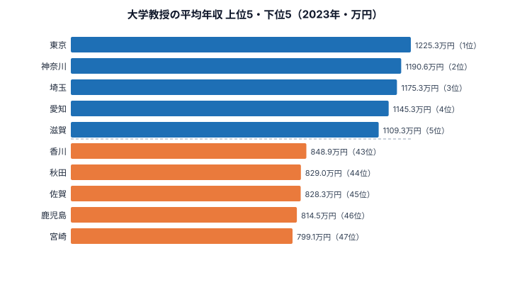

「大学教授」と聞くと、どこの大学でも同じくらい稼いでいる――そんなイメージを持つ人は多い。だが2023年の賃金構造基本統計調査を都道府県別に並べると、その思い込みは崩れる。最も高い[東京都](/areas/13000)の平均年収は**1,225.3万円**、最も低い[宮崎県](/areas/45000)は**799.1万円**。その差は**426.2万円**、倍率にして**約1.5倍（1.533倍）**にもなる。

ここで言う「大学教授の平均年収」は、賃金構造基本統計調査の所定内給与をベースに「月給×12＋賞与」で年収換算した推計値だ。同じ職階・同じ肩書であっても、勤務する地域によってこれだけ開く。この記事では47都道府県の全データを可視化し、「なぜ大都市圏で高く、地方で低いのか」を構造から読み解く。

> [!NOTE]
> 数値は厚生労働省「賃金構造基本統計調査」（2023年）の職種別データから、`月給×12＋賞与` で年収換算した推計値です。標本は各都道府県内の大学に勤務する教授で、私立・国立・公立の構成比は地域ごとに異なります。少数標本の県では年次変動が大きい点に注意してください。

## 大学教授の年収ランキング 上位10と最下位（2023年）

まず全体像から。上位は首都圏・関西・中京の大都市圏が占め、47都道府県のうち**17県**が1,000万円台に乗っている。

上位を見ると、東京都（1,225.3万円）を筆頭に、神奈川県（1,190.6万円）・埼玉県（1,175.3万円）と首都圏が表彰台を独占する。愛知県（1,145.3万円）・大阪府（1,096.1万円）・兵庫県（1,077.6万円）と続き、三大都市圏がほぼそのまま上位に並ぶ。**滋賀県（1,109.3万円）が5番手に食い込んでいる**のは意外だが、これは関西の私立・公立大学が集積し、京阪神への通勤圏として大学が立地していることが背景にあると考えられる。

<source-link href="/ranking/university-professor-annual-income">大学教授の平均年収ランキングをもっと見る</source-link>

## 下位グループ：地方圏でなぜ低くなるのか

最下位の5県を抜き出すと、いずれも地方圏に集中している（上のチャート右側が下位）。下から順に宮崎県（799.1万円）・鹿児島県（814.5万円）・佐賀県（828.3万円）・秋田県（829.0万円）・香川県（848.9万円）が並ぶ。

最下位は宮崎県の**799.1万円**で、唯一800万円を下回った。鹿児島県（814.5万円）が46位、佐賀県（828.3万円）が45位と、九州勢が下位に並ぶ。

下位に地方県が集まる構造には、いくつかの要因が重なっていると見られる。第一に、**地方は地域手当（都市部ほど高い物価補正）が低い**ため、同じ俸給表でも実支給額が抑えられる。国家公務員に準じた給与体系を採る国立大学法人では、地域手当の差がそのまま教授の年収差に反映されやすい。第二に、地方では相対的に**私立大学より給与水準の安定した（が天井の低い）公立・地方国立大学の比率が高い**こと、第三に標本となる教授の年齢・在職年数構成の違いも影響する。

> [!WARNING]
> この調査は「教授」という職階の平均であり、個々の研究者の年収を保証するものではありません。同じ県内でも国立・私立・医学部の有無で大きく異なります。また年次によって標本が入れ替わるため、単年のランキングだけで「その県が恒常的に低い」と断定するのは危険です。複数年の傾向で見ることをおすすめします。

<source-link href="/ranking/university-professor-annual-income">下位県を含む47都道府県の詳細データを見る</source-link>

## 発見：年収の地図は「大学の所在地」ではなく「都市の物価」を映す

このランキングで見えてくるのは、**大学教授の年収は学問の中身ではなく、勤務地の経済圏の大きさに連動している**という構造だ。

平均は**977.8万円**、中央値は**979.2万円**で、両者がほぼ一致している。これは47都道府県が極端な外れ値なく、なだらかに分布していることを意味する。だが上位と下位の顔ぶれを並べると、その「なだらかさ」が地理的にきれいに整列していることがわかる。1,000万円超の17県には東京・神奈川・埼玉・千葉・愛知・大阪・兵庫・福岡といった三大都市圏＋政令市を抱える県がほぼ網羅される一方、800万円台前半に沈むのは九州・東北・四国の地方県だ。

**[仮説]** この差の主因は研究力や大学の格ではなく、**地域手当（都市手当）と物価補正**である可能性が高い。同じ国立大学法人の俸給表でも、東京23区勤務と地方勤務では地域手当率が十数ポイント違い、それだけで年収100万円超の差が生まれうる。検証するには、各県の国立／私立教授の構成比と地域手当率を突き合わせる必要がある。

> [!TIP]
> 「教授職そのものの市場価値」より「どの都市で働くか」が年収を左右するという点では、大学教授も一般の会社員と同じ構造に置かれている、と読むこともできます。地域の物価・家賃と合わせて見ると、額面の差が実質の差とは限らない点も興味深いところです。

## まとめ

- **1位は東京都の1,225.3万円**。神奈川県（1,190.6万円）が2位、埼玉県（1,175.3万円）が3位と、首都圏が上位を独占した（2023年）。
- **最下位は宮崎県の799.1万円**で、47都道府県で唯一800万円を割り込んだ。鹿児島県が46位、佐賀県が45位と九州勢が下位に並ぶ。
- 上位と下位の差は**426.2万円、倍率は約1.5倍（1.533倍）**。同じ「教授」でも勤務地で大きく開く。
- 上位は三大都市圏＋政令市、下位は九州・東北・四国の地方圏という**明確な地理的クラスター**が見られる。
- 平均977.8万円・中央値979.2万円とほぼ一致し、極端な外れ値はないが、地域手当・物価補正が差の主因と見られる。

## データ出典

- 厚生労働省「賃金構造基本統計調査」（2023年）。職種別データを e-Stat 経由で整備し、`月給×12＋賞与` で年収換算した推計値。

本記事の対象データ: [関連カテゴリ](/category/educationsports)
