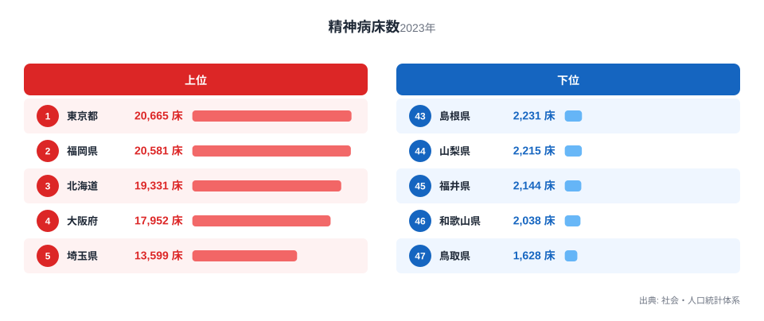
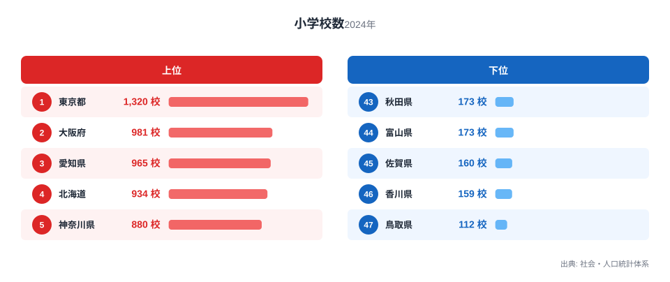

精神科医療を支える病床の数と、子どもたちが通う小学校の数は、一見すると何のつながりもない指標に見えます。医療政策と教育政策は、まったく別の行政分野です。

しかし都道府県別のデータを並べてみると、両方の指標で上位に並ぶ顔ぶれがほとんど同じであることに気づきます。この記事では、精神病床数と小学校数という一見無関係な二つの指標を都道府県別に比較し、両者がどれほど強く重なり合っているのかを可視化します。そのうえで、重なりだけでは説明しきれない地域ごとのずれも見ていきます。相関があるからといって、精神病床の多さが小学校の数を決めているわけではありません。

## 精神病床数の多い県・少ない県

精神病床数は、精神科病院や精神科診療所に設置された病床の合計を表す指標です。社会・人口統計体系の2023年データでは、全国で最も精神病床数が多いのは東京都で、20,665床にのぼります。僅差で福岡県が20,581床で2位に続き、北海道が19,331床で3位、大阪府が17,952床で4位となっています。5位の埼玉県は13,599床、6位の神奈川県は13,229床、7位の愛知県は12,224床、8位の千葉県は12,161床、9位の兵庫県は11,434床と、上位は人口の多い地域が占めています。

<source-link href="/ranking/psychiatric-bed-count">精神病床数ランキングをもっと見る</source-link>

上位の顔ぶれを見ると、精神病床数は単純な人口の多さと強く結びついていることがわかります。東京都、福岡県、北海道、大阪府という上位4都道府県は、いずれも全国有数の人口規模を持つ地域です。人口が多ければ精神科医療を必要とする患者数も多くなり、それに応じて病床が整備されてきたと考えられます。

一方で下位に目を向けると、47位の鳥取県は1,628床、46位の和歌山県は2,038床、45位の福井県は2,144床、44位の山梨県は2,215床、43位の島根県は2,231床と、人口規模の小さい県が並んでいます。上位と下位の差は10倍を超えており、都道府県によって精神科医療の提供体制には大きな開きがあることがうかがえます。ただし病床数の少なさが医療の質の低さを意味するわけではありません。

> [!NOTE]
> 精神病床とは、精神科病院や一般病院内の精神科病棟に設けられた病床のことで、内科や外科などの一般病床とは統計上別に集計されます。ここで扱う数値は病床の絶対数であり、人口当たりに換算した値ではありません。人口の多い都道府県ほど数値が大きくなりやすい指標だという前提を踏まえて読む必要があります。

## 小学校数の多い県・少ない県

続いて小学校数を見てみます。同じく社会・人口統計体系がまとめた2024年データによれば、小学校数が最も多いのは東京都で1,320校です。2位は大阪府の981校、3位は愛知県の965校、4位は北海道の934校、5位は神奈川県の880校と続きます。

小学校数の上位10県を精神病床数の上位10県と照らし合わせると、9位までは顔ぶれが完全に一致していることに気づきます。順位こそ入れ替わっているものの、東京都、大阪府、愛知県、北海道、神奈川県、埼玉県、千葉県、兵庫県、福岡県という9都府県が、両方の指標でそろって上位を占めているのです。異なるのは10位で、精神病床数では鹿児島県が9,302床で10位に入るのに対し、小学校数では静岡県が483校で10位に入っています。

下位の顔ぶれにも、同様の重なりが見られます。47位の鳥取県は112校で最も少なく、46位の香川県は159校、45位の佐賀県は160校、44位の富山県と43位の秋田県はいずれも173校です。[小学校数ランキング](/ranking/elementary-school-count)からも、人口の少ない県ほど学校数が少なくなる傾向がはっきりと読み取れます。

> [!TIP]
> 絶対数のランキングでは人口の多い都道府県が上位を占めますが、人口当たりに換算すると顔ぶれは大きく変わります。人口の少ない県でも、精神科医療や学校教育の体制が手厚く整備されていれば人口当たりの数値は上位に浮かび上がるため、絶対数だけでは見えない地域ごとの整備状況の違いを読み解く手がかりになります。

## 二つの指標を重ねてみると

精神病床数と小学校数、それぞれの上位・下位の顔ぶれがこれほど重なっているのであれば、両者の関係を散布図で確認してみましょう。横軸に精神病床数、縦軸に小学校数を取ると、右肩上がりの分布がはっきりと浮かび上がります。

散布図では、東京都が両指標ともに突出した位置にあります。大阪府、愛知県、北海道、神奈川県、埼玉県、千葉県、兵庫県、福岡県がそれに続く形で右上に固まっています。逆に鳥取県、福井県、山梨県、島根県、和歌山県といった県は、いずれの指標でも左下に位置しています。この分布から、精神病床数が多い県ほど小学校数も多いという傾向が、47都道府県全体を通じて成り立っていることが見て取れます。

しかし、この相関をそのまま「精神病床が多いから小学校が多い」あるいはその逆と解釈するのは誤りです。精神科医療と義務教育は、まったく異なる仕組みで整備される社会基盤です。実際、47都道府県の精神病床数と小学校数の相関係数はr=0.926ときわめて高く、両者に共通する要因として真っ先に疑われるのが、その都道府県の人口規模です。そこで人口規模の影響を取り除いた偏相関係数を計算すると、r=0.713という値になります。相関係数としては下がるものの、依然として強い関係が残っており、人口規模だけでは重なりのすべてを説明しきれないことがわかります。人口が多い地域では医療需要も教育需要も同時に大きくなるため精神病床数と小学校数がそろって増える傾向は確かにありますが、それに加えて各都道府県が歩んできた精神科医療・学校教育それぞれの整備の歴史も、重なりの一因になっていると考えられます。

> [!WARNING]
> 精神病床数と小学校数の間に見られる相関は、両方の指標が人口規模と強く結びついていることから生じる見かけ上の関係です。精神科医療の充実度と教育インフラの充実度を直接比較したり、一方から他方の水準を推測したりする根拠として用いることはできません。相関関係と因果関係は、切り分けて読む必要があります。

## 相関から外れる県に見える地域差

すべての都道府県が人口規模だけで説明できるわけではありません。ここからは、精神病床数の順位と小学校数の順位が大きくずれている県に注目してみます。

熊本県は精神病床数で11位の8,706床です。一方、小学校数では23位の327校にとどまっています。同様に長崎県は精神病床数13位の7,640床に対して、小学校数は24位の314校です。宮崎県は精神病床数20位の5,828床に対して、小学校数は33位の231校にとどまります。大分県も精神病床数23位の5,274床に対して、小学校数は30位の260校です。沖縄県は精神病床数22位の5,285床に対して、小学校数は29位の263校となっています。いずれも九州・沖縄地方の県で、人口規模から見込まれる水準よりも精神病床が手厚く整備されてきた可能性があります。

反対の傾向を示すのが、岐阜県や三重県、長野県です。岐阜県は精神病床数で34位の3,799床にとどまります。一方、小学校数では21位の340校と、相対的に高い順位につけています。三重県も精神病床数27位の4,570床に対して、小学校数は17位の362校です。長野県は精神病床数28位の4,501床に対して、小学校数は20位の359校です。いずれも小学校数の順位が精神病床数の順位を上回っており、本州中央部に位置するこれらの県では、人口規模に対して学校数が相対的に多く保たれていると言えそうです。

最も規模の小さい鳥取県は、精神病床数1,628床で47位です。小学校数も112校で47位となっており、両指標でそろって最下位に位置しています。[東京都のデータ](/areas/13000)や[福岡県のデータ](/areas/40000)のように人口が突出して多い地域とは対照的に、鳥取県のような小規模な県では、精神病床数と小学校数がともに全国最小水準となる傾向が明確に表れています。

## まとめ

精神病床数と小学校数は、行政分野としては接点のない二つの指標です。それにもかかわらず、都道府県別に並べてみると上位9都府県はほぼ同じ顔ぶれとなり、下位の県々でも共通する県が数多く見られました。相関係数はr=0.926に達し、人口規模を統制した偏相関係数もr=0.713と依然として強く、この重なりの背景には都道府県の人口規模が主要な要因の一つとしてあることがわかります。ただし人口規模だけで説明が尽きるわけではなく、残された強い偏相関は、各都道府県固有の医療・教育それぞれの整備の歴史が重なりに影響していることを示しています。

同時に、熊本県や長崎県、宮崎県のように精神病床数の順位が小学校数の順位を大きく上回る県や、岐阜県や三重県、長野県のように逆の傾向を示す県も存在します。人口規模という共通の土台の上に、それぞれの都道府県が歩んできた歴史の違いが積み重なり、見かけの相関だけでは説明できないずれを生み出しているのです。

## データ出典

- 精神病床数: 社会・人口統計体系（2023年）
- 小学校数: 社会・人口統計体系（2024年）
