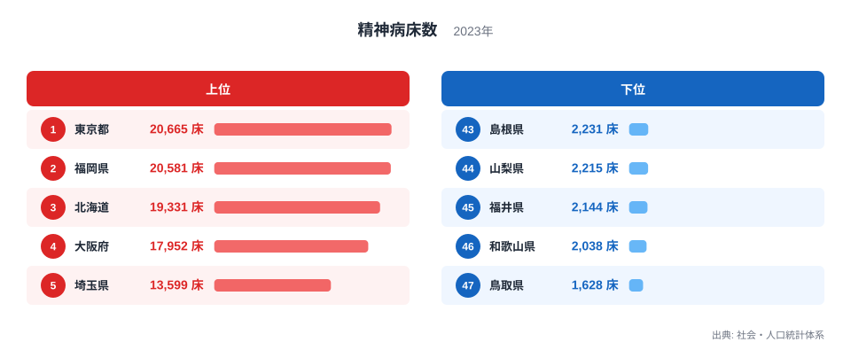
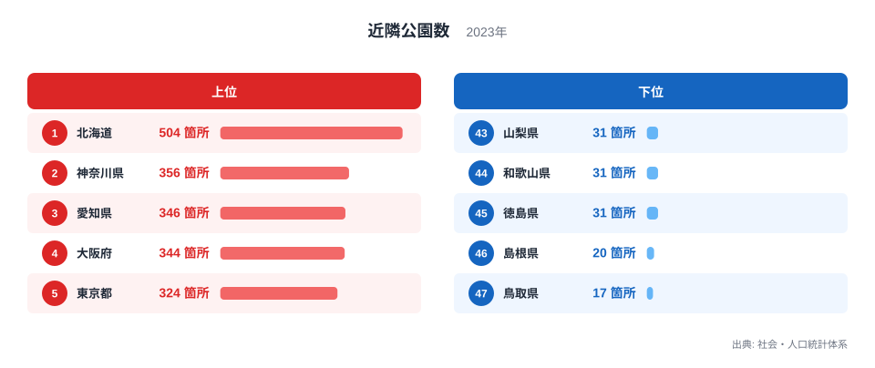
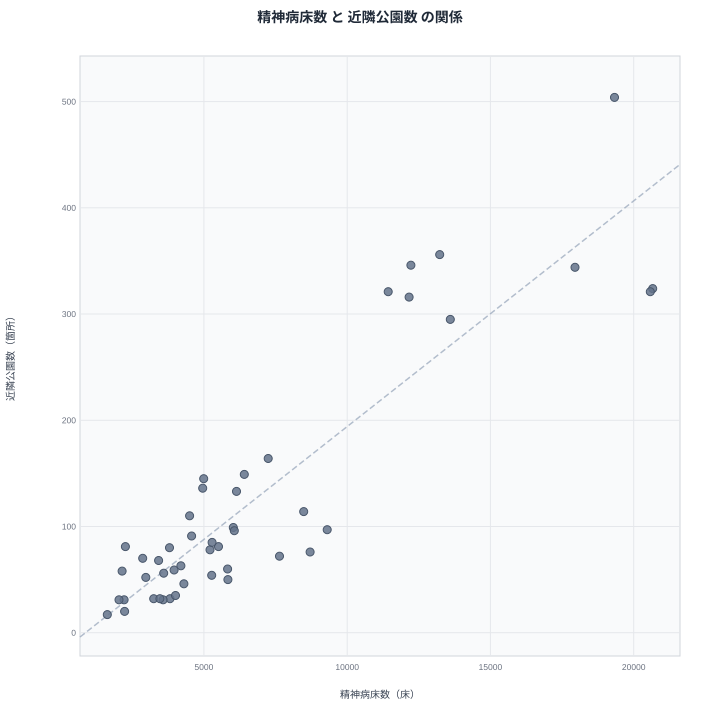

医療の受け皿と身近な緑地は、一見すると関係のない指標に思えます。しかし都道府県別のデータを並べると、両者は似た分布を示すことが分かります。この記事では精神病床数と近隣公園数という2つの指標を比較し、見かけの相関の裏にある真因を探ります。

精神病床数は都道府県内にある精神科医療の受け入れ体制の規模を示す指標です。近隣公園数は住民の身近にある小規模な公園の数を示します。用途がまったく異なるこの2つの指標が、なぜ似た動きを見せるのでしょうか。

## 精神病床数の分布

まずは精神病床数そのものを確認します。

<source-link href="/ranking/psychiatric-bed-count">精神病床数ランキングをもっと見る</source-link>

社会・人口統計体系の2023年のデータによりますと、精神病床数の全国トップは東京都で、20,665床となっています。2位は福岡県で20,581床、3位は北海道で19,331床、4位は大阪府で17,952床、5位は埼玉県で13,599床と続き、人口の多い都道府県が上位に並んでいます。

下位に目を向けますと、鳥取県が1,628床で最も少なく、和歌山県が2,038床、福井県が2,144床、山梨県が2,215床、島根県が2,231床と続きます。上位1位の東京都と下位1位の鳥取県を比較しますと、その差は12倍を超えており、都道府県の規模によって医療体制の量が大きく異なることが分かります。

精神病床は病院という施設の集積によって成り立つため、人口が多く医療機関の数そのものが多い都道府県ほど病床数も積み上がっていく傾向があります。逆に人口の少ない県では、医療機関の絶対数が限られるため病床数も少なくなります。

順位を細かく見ますと、6位の神奈川県は13,229床、7位の愛知県は12,224床、8位の千葉県は12,161床、9位の兵庫県は11,434床、10位の鹿児島県は9,302床と続きます。上位10県のうち9県が万床前後の規模を持つのに対し、下位に近づくにつれて千床単位まで規模が縮小していく様子が読み取れます。

## 近隣公園数の分布

続いて、比較対象となる近隣公園数を見ていきます。

社会・人口統計体系の2023年のデータによりますと、近隣公園数の全国トップは北海道で、504箇所に達しています。2位は神奈川県で356箇所、3位は愛知県で346箇所、4位は大阪府で344箇所、5位は東京都で324箇所となっており、こちらも人口の多い都道府県が上位に集まっています。

下位を見ますと、鳥取県が17箇所で最も少なく、島根県が20箇所、山梨県、和歌山県、徳島県がそろって31箇所で続きます。北海道と鳥取県を比較しますと、その差は29倍以上に開いています。

近隣公園数のランキングでは北海道が1位、精神病床数のランキングでは東京都が1位と、トップの顔ぶれは入れ替わっています。近隣公園数で2位の神奈川県は精神病床数では6位、3位の愛知県は7位、4位の大阪府は4位となっており、上位県の顔ぶれが大きく重なっていることが分かります。

さらに順位を見ますと、6位は兵庫県の321箇所、7位は福岡県の321箇所、8位は千葉県の316箇所、9位は埼玉県の295箇所と続きます。精神病床数のランキングでも兵庫県は9位、福岡県は2位、千葉県は8位、埼玉県は5位と、いずれも上位10位以内に位置しており、両指標の上位県の顔ぶれが強く重なっていることがうかがえます。

## 見かけの相関とその真因

2つの指標の関係を散布図で確認してみます。

散布図を見ますと、精神病床数が多い県ほど近隣公園数も多い傾向がおおむね確認できます。北海道、東京都、大阪府、福岡県、神奈川県、愛知県、埼玉県、千葉県、兵庫県といった都道府県は、両方の指標で相対的に高い位置に集まっています。一方、鳥取県、島根県、山梨県、和歌山県、徳島県などは両方の指標で低い位置にまとまっています。

しかし、この相関を「精神病床が多いから公園が増える」あるいは「公園が多いから精神病床が増える」という直接の因果関係として読むのは適切ではありません。両者を同時に動かしている真因は、都道府県の人口規模と都市化の度合いだと考えられます。人口が多く都市化が進んだ都道府県では、医療インフラとしての病院・病床が集積すると同時に、住民の生活環境を整えるための公園整備も進みます。つまり精神病床数と近隣公園数は、どちらも「その都道府県にどれだけの都市機能やインフラが集積しているか」という共通の背景要因によって同じ方向に動いているのです。

この関係は、都市の規模が大きくなるほど医療・福祉・生活環境のあらゆるインフラが同時に厚みを増すという、都市機能の集積の表れと見ることができます。片方の指標だけを見て他方を推測することはできませんが、両方とも都市の規模を映す鏡になっている点は興味深い発見です。

## まとめ

精神病床数と近隣公園数は、いずれも北海道や東京都、大阪府、福岡県といった人口の多い都道府県で高く、鳥取県や島根県といった地方の県で低いという似た分布を示しています。この2つの指標には一定の相関が見られますが、それは人口規模と都市化の進み方という共通の背景要因によるものであり、一方が他方を直接引き起こしているわけではありません。異なる分野の指標を比較するときこそ、見かけの相関に飛びつかず、その背後にある構造を考える姿勢が大切です。

> [!NOTE]
> 精神病床数は医療施設としての病床数の集計であり、実際の入院患者数や利用率とは別の指標です。近隣公園数は住民の身近にある小規模な公園を対象とした集計で、大規模な都市公園や自然公園は含まれない場合がある点にご留意ください。

> [!WARNING]
> 精神病床数と近隣公園数はどちらも2023年のデータですが、集計対象や調査目的が異なる統計から取られています。人口一人当たりに換算せず絶対数のまま比較しているため、都道府県の人口規模の違いがそのまま数値の差として表れている点に注意が必要です。

> [!TIP]
> 医療インフラと生活インフラのように分野の異なる指標を比較するときは、両方の指標に共通して影響する要因がないかを先に考えると、相関の意味を読み違えにくくなります。人口規模や都市化の度合いは、多くの都道府県別指標に共通して効いてくる代表的な背景要因です。

## 関連するデータ

- [近隣公園数ランキング](/ranking/neighborhood-park-count)
- [同じカテゴリの統計一覧](/category/socialsecurity)
- [東京都のデータ](/areas/13000)
- [福岡県のデータ](/areas/40000)

## データ出典

- 社会・人口統計体系（精神病床数・2023年）
- 社会・人口統計体系（近隣公園数・2023年）
