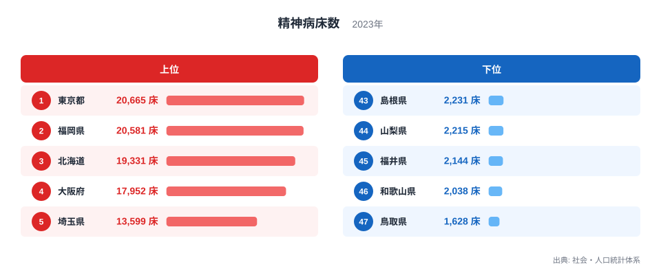
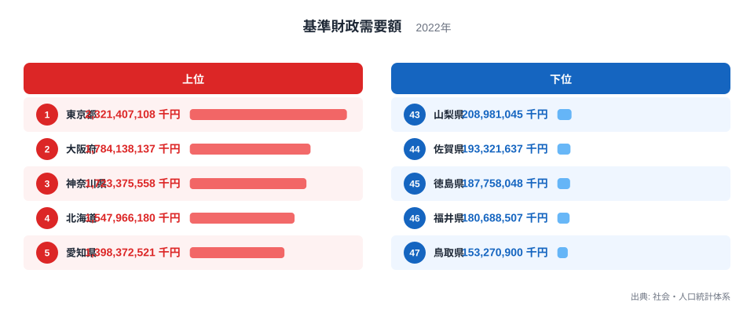
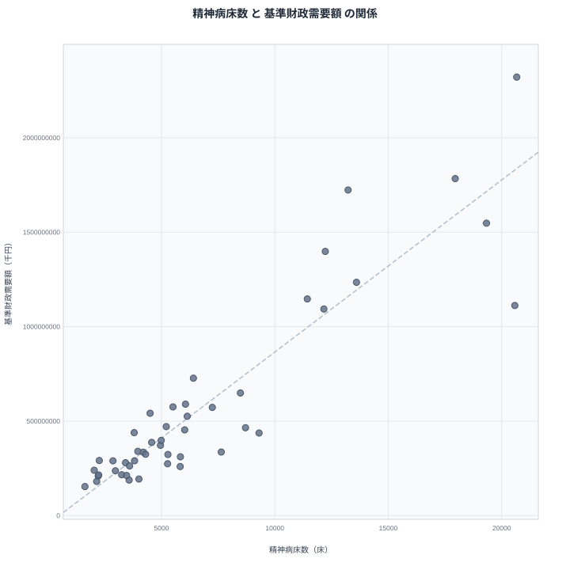

精神病床数は、その地域にある精神科病院がどれだけのベッドを持っているかを示す医療インフラの指標です。一方、基準財政需要額は、人口や行政サービスの規模から機械的に算出される、地方自治体の財政規模を表す指標です。

一見すると、この2つはまったく別の世界の数字に見えます。片方は病院の設備、もう片方は自治体の財政計算です。しかし都道府県別に順位を並べてみると、同じ顔ぶれの県が上位と下位の両方に繰り返し登場します。この記事では、精神病床数と基準財政需要額がどこまで連動していて、どこでその連動が崩れるのかを見ていきます。

## 精神病床数の多い県、少ない県

<source-link href="/ranking/psychiatric-bed-count">精神病床数ランキングをもっと見る</source-link>

精神病床数の全国トップは東京都で、2万床を超える規模になっています。僅差で福岡県が続き、以下、北海道、大阪府、埼玉県という順に並びます。上位5県だけで全国の病床のかなりの部分を占めており、大都市圏に病床が集中していることがわかります。

一方、下位に目を移すと、鳥取県、和歌山県、福井県、山梨県、島根県が並びます。最下位の鳥取県の病床数は、最上位の東京都の1割にも届きません。この差は単純な人口規模の違いだけでは説明しきれないほど大きく、病床の整備状況が県ごとに大きく異なることを示しています。

福岡県が全国2位という順位は、単純な都市規模だけでは説明しにくい特徴です。人口規模でいえば福岡県は全国でも上位ではあるものの、東京都や大阪府ほどではありません。それでも病床数では東京都に迫る規模を持っている点は、この後の相関の議論で重要な手がかりになります。

## 基準財政需要額の大きい県、小さい県

基準財政需要額の上位は、東京都、大阪府、神奈川県、北海道、愛知県という顔ぶれです。いずれも人口が多く、行政サービスの規模が大きい都道府県であり、この指標が人口や行政需要の大きさを反映していることがよくわかります。[基準財政需要額ランキング](/ranking/standard-fiscal-demand-municipality)を見ると、上位県と下位県の差は10倍以上にのぼります。

> [!NOTE]
> 基準財政需要額は、実際に自治体が使ったお金の額ではありません。人口や面積、行政サービスの必要量をもとに、総務省が定めた基準にしたがって機械的に算出される推計値です。地方交付税の配分を決めるための指標であり、財政の豊かさそのものを直接示すものではない点に注意してください。

下位は山梨県、佐賀県、徳島県、福井県、鳥取県という並びです。精神病床数の下位と比べると、佐賀県や徳島県のように顔ぶれが入れ替わる部分もありますが、山梨県、福井県、鳥取県は両方の指標でそろって下位に位置しています。

このように、上位と下位のどちらにも重なる県がある一方で、片方の指標では上位でももう片方では中位にとどまる県も存在します。次の散布図で、この関係をより直接的に確認します。

## 散布図で見る相関

散布図を見ると、多くの県は右上がりの帯の中に収まっています。基準財政需要額が大きい県ほど精神病床数も多い傾向があり、東京都や大阪府、北海道のように両方の指標で上位に位置する県が、この帯の右上に集まっています。

ただし、すべての県がこの帯にきれいに乗っているわけではありません。帯の上側に外れている県は、財政規模の割に病床数が多い県であり、逆に下側に外れている県は、財政規模の割に病床数が少ない県です。この外れ方にこそ、単純な財政規模だけでは説明できない要因が隠れています。

福岡県は、この散布図の中でも特に目立つ位置にあります。基準財政需要額の順位は8位ですが、精神病床数の順位は2位です。財政規模から予想される水準を大きく超えて、病床が整備されていることになります。

> [!WARNING]
> 散布図で右上がりの傾向が見えても、それは精神病床数と基準財政需要額のどちらかがもう一方の原因であることを意味しません。両者がともに人口規模と関係している結果として、見かけ上の相関が生まれている可能性があります。

## 相関の背後にある共通因子

[同じカテゴリの統計一覧](/category/socialsecurity)を見渡すと、人口や世帯数に関わる指標の多くが同じような並び方をしていることに気づきます。精神病床数と基準財政需要額が連動して見える最大の理由も、両者がそれぞれ独立に人口規模と強く結びついているためだと考えられます。

基準財政需要額は、人口や面積、行政サービスの必要量をもとに算出される仕組みになっており、人口の多い都道府県ほど大きな値になります。精神病床も、患者や利用者が集まりやすい人口の多い地域に整備が進みやすく、結果として両者は人口という共通の土台の上で似たような順位になります。つまり、精神病床数が財政規模を直接押し上げているわけでも、その逆でもなく、どちらも同じ第三の要因から影響を受けていると見るのが自然です。

> [!TIP]
> 人口の多い県ほど両方の数値が大きくなりやすいため、医療体制そのものの充実度を比べたい場合は、人口当たりの病床数に置き換えて見直すと、この記事とは違った順位になる可能性があります。

## 順位がずれる県に見える別の傾向

福岡県のほかにも、財政規模の順位より病床数の順位のほうが明らかに高い県がいくつか見つかります。鹿児島県は精神病床数で10位につけていますが、基準財政需要額では21位です。熊本県も病床数11位に対して財政需要は18位、長崎県は病床数13位に対して財政需要は26位と、順位の差がさらに大きくなります。

これらの県に共通するのは、いずれも九州に位置している点です。財政規模だけを基準にすれば中位から下位に位置してもおかしくない県で、精神病床の整備が全国的な傾向を上回るペースで進んでいることになります。なぜこの地域でこうした傾向が生まれているのかは、今回の2つの指標だけでは断定できません。ただ、医療提供体制の整備がどのように進んできたかという歴史的な経緯が、財政規模とは別の形で病床数に影響している可能性は考えられます。

こうした例外的な県の存在は、相関関係を見るときに忘れてはならない注意点を教えてくれます。全体としての傾向と、個々の県の実情は必ずしも一致しません。[東京都のデータ](/areas/13000)や[福岡県のデータ](/areas/40000)を見比べると、同じように上位に位置する県でも、財政規模と病床数のバランスがまったく異なることがわかります。

## まとめ

- 精神病床数の全国トップは東京都で、福岡県、北海道、大阪府、埼玉県が続きます。
- 基準財政需要額の全国トップも東京都で、大阪府、神奈川県、北海道、愛知県が続きます。
- 両指標の上位・下位には東京都、大阪府、北海道、鳥取県、福井県、山梨県など重なる県が多く、共通因子として人口規模の影響が大きいと考えられます。
- 福岡県、鹿児島県、熊本県、長崎県のように、財政規模の順位より病床数の順位が明らかに高い県も存在します。
- 相関の全体像だけでなく、そこから外れる県の存在にも注目することで、指標が示す意味をより正確に読み取れます。

## データ出典

精神病床数、基準財政需要額ともに社会・人口統計体系のデータをもとに作成しています。精神病床数は2023年、基準財政需要額は2022年の値を使用しています。
