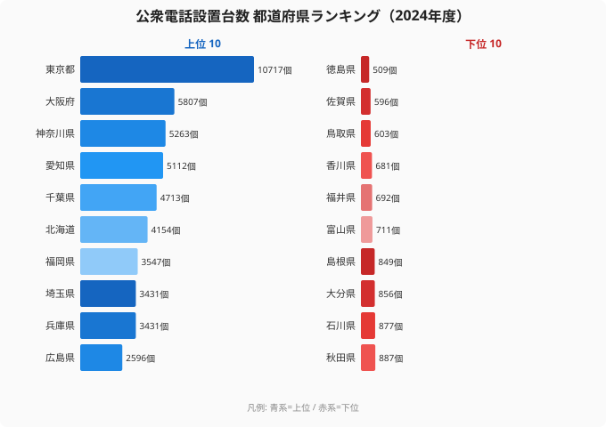
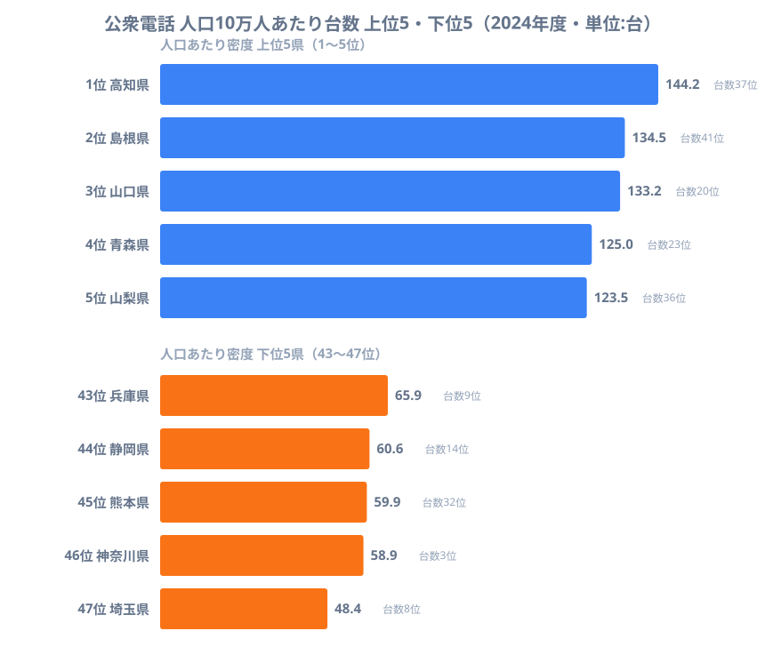
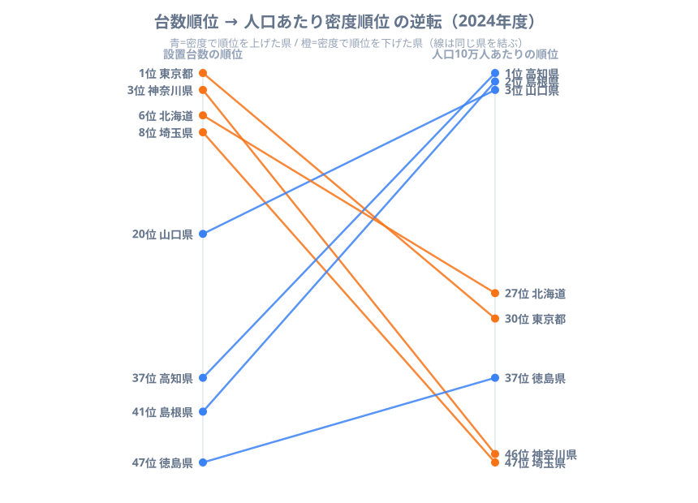

「公衆電話がいちばん多いのは東京」──これは正しい事実です。2024年度の設置台数は東京都の10,717個が断トツで、最少の徳島県509個とのあいだには約21倍の開きがあります。

ところが、この「台数ランキング」をそのまま「公衆電話が身近な県ランキング」と読むと、答えを大きく取り違えます。台数を人口で割って「人口10万人あたり何台あるか」に直したとたん、順位はまるで別物になるからです。台数1位の東京は人口あたりだと30位まで沈み、逆に台数37位にすぎない高知県が、密度では堂々の1位に躍り出ます。

この記事は、公衆電話の**絶対数と人口あたり密度で順位がどう逆転するか**という一点に絞って構造を読み解きます。時系列でなぜ公衆電話が消えずに残ってきたのか、その推移は姉妹記事[公衆電話はなぜ消えきらない？](/blog/public-phone-prefecture-vanishing)に譲り、本記事は「台数か、密度か」という見る軸の違いだけを深掘りします。

> [!NOTE]
> ここで使う「人口10万人あたり台数」は、各都道府県の設置台数（e-Stat 社会・人口統計体系、2024年度）を同年の総人口で割って算出した派生指標です（台数 ÷ 人口 × 100,000）。公式統計に「密度ランキング」という表は存在せず、本記事が台数と人口から計算した値である点に注意してください。

## まず絶対数：台数は人口集中地域に積み上がる

出発点として、よく目にする「設置台数」の絶対値を確認しておきます。これは人口あたりではなく、各県に実際に置かれている公衆電話の数そのものです。

最多は東京都の10,717個で、2位の大阪府5,807個のほぼ倍にあたります。以下、神奈川県5,263個、愛知県5,112個、千葉県4,713個と、上位は三大都市圏の都府県がそのまま並びます。一方の下位は徳島県509個、佐賀県596個、鳥取県603個と、人口規模の小さい県が占めます。

この棒グラフが示すのは、きわめて素直な対応です。人が多い県ほど台数が多く、少ない県ほど台数も少ない。東京と徳島で21倍という開きも、人口規模の差をほぼなぞっただけのものです。つまり絶対数のランキングは「どの県に人と拠点が集まっているか」をほとんどそのまま映している、と言い換えられます。だからこそ、これを「公衆電話の手厚さ」として読むのは早合点になります。人口の多い県が台数で上に来るのは当たり前で、本当に知りたいのは「一人ひとりの近くにどれだけあるか」だからです。

<source-link href="/ranking/public-phone-count">公衆電話設置台数ランキングをもっと見る</source-link>

> [!WARNING]
> 設置台数は人口の多寡に強く引っ張られる絶対値です。「東京が台数1位＝東京は公衆電話が充実している」とは限りません。人口あたりに直すと、後述のとおり東京は中位以下まで下がります。台数の順位を「身近さ」と取り違えないことが、このデータを読むうえで最大の落とし穴です。

## 人口あたりに直すと：高知1位・東京30位の逆転

では本題です。設置台数を人口10万人あたりに換算すると、ランキングの顔ぶれは一変します。

人口あたりで最も密度が高いのは高知県で、10万人あたり144.2台にのぼります。次いで島根県134.5台、山口県133.2台、青森県125.0台、山梨県123.5台と続き、上位は過疎・地方圏の県がずらりと並びます。台数では下位だった高知（台数37位）や島根（台数41位）が、密度では1位・2位に立つのです。

逆に密度の下位を見ると、埼玉県が10万人あたり48.4台で最下位、神奈川県58.9台、熊本県59.9台、静岡県60.6台と続きます。埼玉・神奈川は台数では8位・3位の上位県でしたが、人口あたりでは47位・46位まで沈みます。

各バーの右側に「台数◯位」を併記しました。密度上位の県はいずれも台数では中位以下、密度下位の県はいずれも台数では上位、という対応がはっきり読み取れます。高知県は台数では936個（37位）と少ないものの、人口が約65万人と小さいため、一人あたりにすると最も手厚くなります。反対に埼玉県は3,431個（8位）と多くの台数を抱えていますが、人口約708万人で割ると一気に薄まり、密度では全国最下位に落ちます。つまり**台数の多さと人口あたりの手厚さは、むしろ逆を向く**のがこの指標の核心です。

<source-link href="/ranking/public-phone-count">設置台数の順位（絶対数）も確認する</source-link>

> [!TIP]
> 過疎県で密度が高いのは「公衆電話が充実しているから」というより、分母である人口が小さいことが効いています。同じ1台でも、人口65万人の高知と708万人の埼玉では「一人あたりの濃さ」がまったく違います。人口あたり指標を読むときは、分子（台数）だけでなく分母（人口）の小ささが順位を押し上げている可能性を必ず併せて見るのが読み筋です。

## 順位はどれだけ入れ替わるか

絶対数と密度の逆転を、同じ県を線で結んで可視化したのが次の図です。左軸が設置台数の順位、右軸が人口10万人あたりの順位で、線が下に向かう（順位が悪化する）県と上に向かう（順位が改善する）県が一目で分かります。

最も劇的なのは東京都です。設置台数では1位ですが、人口10万人あたりでは30位まで落ちます。日本一台数が多い県が、一人あたりに直すと中位以下に沈むわけです。神奈川県は台数3位から密度46位へ、埼玉県は台数8位から密度47位（最下位）へと、大都市圏ほど大きく順位を下げます。人口の分母が桁違いに大きいため、台数をどれだけ積み上げても密度では追いつけないのです。

反対に線が大きく上向くのは、高知県（台数37位→密度1位）、島根県（台数41位→密度2位）、山口県（台数20位→密度3位）といった地方圏の県です。台数だけ見れば「手薄」に見えた県が、人口あたりでは全国トップクラスの手厚さを持っていたことになります。

注目したいのは、台数で「最下位」として語られがちな徳島県（509個・47位）の立ち位置です。人口あたりに直すと徳島は密度37位で、埼玉・神奈川・愛知・大阪といった台数上位の大都市圏よりも上に来ます。**「台数最少＝最も公衆電話が乏しい県」ではない**のです。台数の絶対値だけを見て「徳島がいちばん少ない」と結論づけると、一人あたりの実態を見落とすことになります。

> [!WARNING]
> 人口あたり密度が高いことは、必ずしも「便利」を意味しません。過疎地では集落が点在し、最寄りの公衆電話までの物理的な距離はむしろ遠くなりがちです。密度（人口あたり台数）と、利用しやすさ（拠点までの距離）は別物です。本記事の密度は「人口に対する台数の比」であって、アクセスの良さを直接示すものではない点に注意してください。

## まとめ

- 設置台数の絶対値は東京都10,717個が1位、徳島県509個が最少で約21倍の開きがありますが、これは人口規模の差をほぼなぞった順位です。
- 人口10万人あたりに直すと順位は逆転し、密度1位は高知県（144.2台）、最下位は埼玉県（48.4台）となります。
- 台数1位の東京は密度では30位、台数3位の神奈川は密度46位、台数8位の埼玉は密度47位まで沈みます。
- 逆に台数37位の高知、41位の島根、20位の山口は、人口あたりでは1〜3位に躍り出ます。
- 台数最少として語られる徳島県(509個)も、人口あたりでは密度37位で大都市圏より上位にあり、「台数最少＝最も乏しい」ではありません。
- 公衆電話の手厚さを論じるなら、絶対数ではなく人口あたり密度で見ることが、見る軸として欠かせません。

## データ出典

- e-Stat 社会・人口統計体系（NTT東日本・NTT西日本の公衆電話設置台数）2024年度
- 人口10万人あたり台数は、上記設置台数を同年の都道府県別総人口で除して算出した本記事独自の派生値です。

公衆電話が時系列でどう減り、なぜ消えきらずに残ってきたのかは、姉妹記事[公衆電話はなぜ消えきらない？](/blog/public-phone-prefecture-vanishing)で扱っています。通信・情報分野の他の指標は[ICTカテゴリ](/category/ict)から確認できます。密度1位の[高知県の地域プロフィール](/areas/39000)と密度最下位の[埼玉県の地域プロフィール](/areas/11000)を比べると、人口規模が密度を左右する構造が見えてきます。
