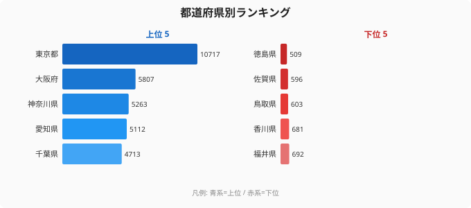
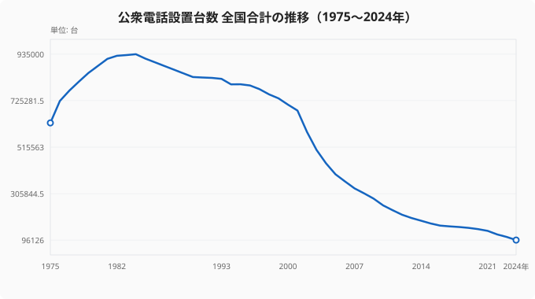

「街角から公衆電話が消えた」と感じる人は多いでしょう。[ICTカテゴリのランキング一覧](/category/ict)を見ると、インターネット普及率や携帯電話契約数など、通信インフラ全体の変化が読み取れます。実際、全国の公衆電話設置台数は1984年の93.5万台をピークに減り続け、2024年には9.6万台と約10分の1にまで落ち込んでいます。しかしその一方で、都道府県ランキングを見ると、1位の東京都（10,717個）と最下位の徳島県（509個）には**21.1倍という驚きの格差**が存在します。

「人口が多い東京が1位」は想像がつくとしても、なぜこれほど格差が開くのでしょうか。そして、スマートフォンが普及しきったこの時代に、公衆電話はなぜまだ残り続けているのか。データから見えてくる構造的な理由を探ります。

<source-link href="/ranking/public-phone-count">公衆電話設置台数の全47都道府県ランキングを見る</source-link>

## 上位5県：大都市圏が独占する公衆電話の「密度」

2024年のランキング上位を見ると、上位5都府県はすべて大都市圏です。

- 1位　東京都：10,717個
- 2位　大阪府：5,807個
- 3位　神奈川県：5,263個
- 4位　愛知県：5,112個
- 5位　千葉県：4,713個

東京都の10,717個は2位の大阪府（5,807個）の約1.8倍に相当します。1位と2位の間にもすでに大きな開きがあります。

> [!NOTE]
> 「公衆電話設置台数」は総務省「社会・人口統計体系」の調査値です。設置場所には駅構内・商業施設・病院・公道上のボックス型など多様な形態が含まれます。街中でボックス型が減っても、施設内の台数が維持されている場合があるため、「街から消えた」という体感と台数データは必ずしも一致しません。

なぜ大都市圏に集中するのか。理由は単純に「人口」だけではありません。大都市ほど鉄道駅・ターミナル・商業施設が多く、各施設への義務的設置（後述）や需要による設置が重なります。東京都は面積あたりの人流密度が別格で高く、外国人旅行者・訪日客の需要、さらに大規模災害時の拠点整備という観点からも優先的に台数が維持されています。

> [!WARNING]
> このランキングは「台数の絶対値」による順位です。人口10万人あたりに換算すると順位は大きく変わります。鳥取県や島根県など人口の少ない県は台数では下位ですが、人口比では中位以上になることがあります。台数と密度を混同しないようご注意ください。

## 下位5県：四国・九州に集中する「消えゆく公衆電話」

下位を占めるのは四国・九州の小規模県です。

- 43位　福井県：692個
- 44位　香川県：681個
- 45位　鳥取県：603個
- 46位　佐賀県：596個
- 47位　徳島県：509個

最下位の徳島県（509個）と1位の東京都（10,717個）の比は**21.1倍**です。単純な人口比（東京都約1,400万人 vs 徳島県約70万人、約20倍）とほぼ一致しており、「人口に比例して減っている」という側面は確かにあります。

しかし問題は、人口減少が加速する地方では今後さらに台数が絞られていくという点です。採算の取れない地域での設置維持はNTTにとって大きなコスト負担であり、ユニバーサルサービスとして最低限の設置を義務付けられているものの、その基準の解釈は年々厳しくなっています。

地方の「消えゆく公衆電話」は、過疎化・高齢化・インフラ維持コストという三重の構造的課題を映し出しています。人口減少が続く鳥取県（45位・603個）や徳島県（47位・509個）の状況は、[鳥取県の都道府県プロフィール](/areas/31000)や[徳島県の都道府県プロフィール](/areas/36000)で他の指標と合わせて確認できます。

## ピーク93.5万台→現在9.6万台：40年で10分の1になった現実

最も重要な視点は「現在の格差」よりも「激減の軌跡」です。

<source-link href="/ranking/public-phone-count">公衆電話設置台数の都道府県別データを詳しく見る</source-link>

全国合計の推移を見ると、公衆電話の減少は一直線ではなく、明確な「加速期」がありました。ピーク時の1984年（93.5万台）からしばらくは緩やかな減少でしたが、1999〜2003年に急落が起きます。1999年の73.6万台から2003年の50.3万台へ、わずか4年間で約23万台が一気に撤去されました。

この急落の引き金はiモード（1999年〜）の登場です。携帯電話が「話す道具」から「いつでもネットにつながるデバイス」へ変わった瞬間、公衆電話の代替不可能性は消え去りました。さらにスマートフォン時代（2010年〜）に入ると減少は続き、2024年時点でピーク比わずか10.3%にまで落ち込んでいます。

東京都でも同様の激減が起きています。1984年に115,000台あった東京の公衆電話は、2024年には10,717台へと**約10分の1**に縮小しました。それでも東京が全国1位を維持しているのは、観光地・ビジネス街・大型ターミナルといった「人が集まる場所」への集中的な維持が続いているからです。地方では採算が取れず撤去が進む中、大都市だけが「最後の公衆電話密集地」として残る構造が鮮明になっています。

> [!TIP]
> 「公衆電話はなぜまだ残っているのか」——その答えは「災害時の生命線」という役割にあります。大規模災害発生時、携帯電話の基地局がダウンしても公衆電話は別系統の回線を使うため通話が繋がりやすいとされています。2011年の東日本大震災でも、公衆電話は通話規制の対象外として機能しました。東京都などの大都市は、こうした防災観点から台数を一定水準で維持する方針をとっています。

## なぜ「都市は残る・地方は消える」という二極化が起きるのか

公衆電話をめぐる地域格差の構造は、以下の3つの要因で説明できます。

**1. ユニバーサルサービス規制の「最低保証」効果**

NTT東西は「ユニバーサルサービス」として、離島や山間部を含む全国で公衆電話を設置する義務を負っています。この制度により、採算ゼロの地域にも最低限の台数が維持されています。ただし「最低限」は台数を増やす力にはなりません。

**2. 観光・ビジネス需要の都市集中**

訪日外国人旅行者は日本のSIMカードを持たずに公衆電話を利用するケースがあります。また、外出先でスマートフォンの電池が切れた際のバックアップとしての需要も、人の往来が多い都市ほど大きくなります。

**3. 災害拠点整備の優先度**

自治体や通信事業者が防災観点から公衆電話の配置を決める場合、人口密集地・避難所・病院周辺が優先されます。こうした拠点が多い都市部では、民間需要がなくなっても防災設備として台数が確保される傾向があります。

## まとめ：公衆電話の未来はどこへ向かうのか

- 2024年の公衆電話設置台数1位は**東京都（10,717個）**、最下位は**徳島県（509個）**で、格差は**21.1倍**
- 全国合計はピークの1984年（93.5万台）から2024年（9.6万台）へ約**10分の1**に激減
- 最大の急落は1999〜2003年。iモード登場が携帯電話を「いつでもネット」に変え、需要が蒸発した
- 上位5県はすべて大都市圏（東京・大阪・神奈川・愛知・千葉）。下位は四国・九州の小規模県が中心
- 公衆電話が残る理由は「災害時の生命線」「ユニバーサルサービス義務」「訪日需要」の三重構造

今後の見通しとして、NTT東西は高コストの地域での台数削減を今後も続ける方針を示しています。一方で、「全国どこでも最低1台は設置する」というユニバーサルサービスの原則は総務省が維持しており、ゼロにはなりません。災害列島・日本において、デジタルとアナログが共存するインフラの最後の砦として、公衆電話はしばらく生き続けるでしょう。「消えゆく」と「残り続ける」の両面を持つこの指標は、日本の情報インフラの縮図とも言えます。

## データ出典

総務省「社会・人口統計体系」（e-Stat 経由）。各都道府県の公衆電話設置台数（総数）を集計した統計。調査単位は個（台）で、ボックス型・卓上型・施設内設置を含む。本記事の数値は2024年度のデータを使用。
