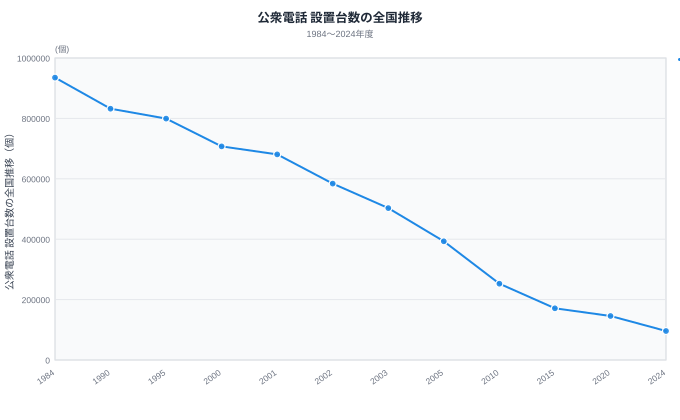
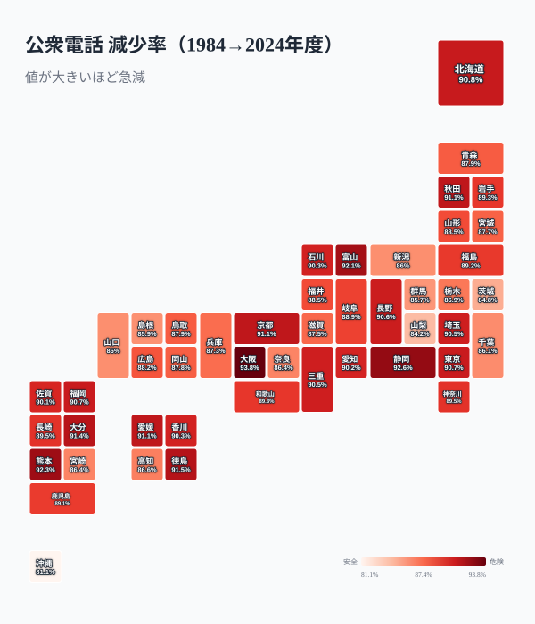

「最後に公衆電話を使ったのはいつだろう？」──多くの人がもう思い出せないはずです。携帯電話の普及で、街角の緑やグレーの箱は急速に姿を消しました。総務省の時系列データによれば、ピーク期の水準から今ではおよそ**10分の1**にまで減っています。

ところが、ここまで激減してもなお公衆電話は**ゼロにはなりません**。2024年の今も全国に残り続けています。「使われないのに、なぜ撤去しきらないのか」──この記事の中核はこの問いです。

結論を先に言えば、公衆電話には**消えきらない3つの理由**があります。第一種公衆電話の設置義務、災害時の輻輳に強い特性、そして僻地での「最後の通信手段」という役割です。本記事では、まず40年の激減カーブをたどり、その底でなぜ下げ止まるのかを読み解きます。なお都道府県ごとの絶対数と人口あたり密度の逆転は[姉妹記事](https://stats47.jp/blog/public-phone-count-gap)で扱うため、ここでは時系列に専念します。

> [!NOTE]
> 「公衆電話設置台数」は、各都道府県に設置されているNTT東日本・西日本などの公衆電話の台数を指します。災害時優先電話としての役割を持ち、停電時でも通話できる「災害時用公衆電話（特設公衆電話）」とは区別される統計です。本記事の台数は両者を混同しないよう注意して読んでください。

## 公衆電話は40年で約10分の1にまで減った

まず全国の推移を見てください。

総務省の時系列データによると、ピーク期の1984年度に約**93万5,000**台あった公衆電話は、2024年度には約**9万6,000**台まで落ち込んでいます。差し引きすると約9.7分の1、つまり**およそ10分の1**です。40年でほぼ「9割が消えた」と言い換えても大きく外れません。

減少が最も急だったのは2000年代前半でした。2001年度の約**68万台**から2003年度には約**50万台**へと、わずか2年で**約26%（4分の1超）**が消えています。携帯電話の爆発的普及と歩調が合う時期で、折れ線がここでひときわ急に落ち込み、激減カーブの「肩」を作っているのが見て取れます。

注目したいのは、カーブが2010年代後半から**緩やかに寝てくる**点です。最初の10年で半分以下になった勢いはやがて鈍り、近年は下げ止まりに近づきつつあります。これが偶然ではなく、公衆電話を一定数残す仕組みが効いているサインです。なぜ「9割消えても残り1割は消えないのか」──その理由を次の章から一つずつ解いていきます。

<source-link href="/ranking/public-phone-count">公衆電話設置台数ランキングをもっと見る</source-link>

> [!WARNING]
> 1984年度より前のピーク値は約93万5,000台で、現存する全国データの起点はこの年です。グラフの初期（1984〜1995年度）は集計が千台単位の概数のため、年ごとの細かな増減ではなく「いつ・どれだけ急に折れたか」という曲線の形を読む数字として扱ってください。

## 「残った1割」は今どこにあるのか

激減カーブの底に残った約9万6,000台を、2024年度の都道府県別で見るとこうなります。

トップの東京都は10,717個、最少の徳島県は509個で、開きは約21倍です。上位は東京・大阪・神奈川・愛知・千葉と人口集中地域が並び、下位には徳島・佐賀・鳥取・香川・福井と人口の少ない県が並びます。要するに「人が密集する場所を抱える県ほど多く残る」という素直な構図で、奇をてらった格差ではありません。

この絶対数と「人口あたり密度」を比べると順位がどう入れ替わるか、広い北海道がなぜ上位に入らないのかといった**都道府県間の比較**は、[姉妹記事](https://stats47.jp/blog/public-phone-count-gap)で詳しく扱っています。本記事はここでは深入りせず、「全国でこれだけ消えてもなぜ残り1割が消えないのか」という時系列の問いに戻ります。

> [!TIP]
> 設置台数の絶対数は人口規模に強く引きずられます。「自分の県は本当に手薄なのか」は人口あたり・面積あたりで見直す必要があり、その逆転は姉妹記事が主題にしています。

## 減り方は均一ではない──都市部ほど急減した

ここで時系列を地理に重ねると、激減の「速さ」が県によって違っていたことが見えてきます。次の地図は、ピークの1984年度から2024年度までの**減少率**を都道府県別に塗り分けたものです。

濃い県ほど大きく減ったことを示します。減少率がもっとも高いのは大阪府で**約94%**、次いで静岡県・熊本県・富山県などが**90%超**で続きます。これらは都市や地方中核を抱え、かつては駅・繁華街・商業施設に第二種公衆電話を厚く置いていた地域です。利用が減ると採算判断で真っ先に間引かれるため、減り方も急になりました。

一方で減少率がもっとも低い（=減りにくい）のは沖縄県の**約81%**で、山梨県・茨城県・群馬県・島根県なども相対的に減っていません。離島・山間部・過疎地を抱える地域は、もともと採算で置いた第二種が少なく、制度で維持される第一種が骨格を占めていたぶん、減らせる余地が小さかったと読めます。「都市部は急減し、僻地は減りにくい」──この**減り方の地理的な偏り**こそ、次章からの3つの理由を裏づける入口です。

> [!NOTE]
> 1984年度の県別値は千台単位の概数のため、減少率は小数点以下まで厳密な値ではなく傾向を示す数字です。全47都道府県が81〜94%の幅に収まっており、「どの県も8割以上は消えたが、消え方の速さには明確な濃淡がある」と読むのが正確です。

## 理由1：第一種公衆電話の「設置義務」が下限を作る

公衆電話の減少は、単に「使われないから撤去」されているわけではありません。鍵を握るのが**第一種公衆電話の設置基準**です。NTT東日本・西日本は、市街地ではおおむね500m四方に1台、それ以外の地域でも1km四方に1台を目安に、第一種公衆電話を維持する責務を負っています。これはユニバーサルサービス（誰もが使える基礎的通信）の一環で、採算が合わなくても残す前提の枠組みです。

だからこそ激減カーブは近年になって寝てきます。先ほど見たとおり、近年撤去されてきたのは採算判断で置かれた**第二種**が中心で、都市部ほど急減したのもこのためです。第二種を削りきると、後に残るのは制度で守られた第一種で、ここから先は簡単には減りません。「9割消えても残り1割が消えない」の正体は、この**制度的な下限**です。

> [!NOTE]
> 第一種は「社会生活上の必要性から設置基準で維持されるもの」、第二種は「採算判断で設置されるもの」です。総務省は2022年に第一種の設置基準を緩和（密度の目安を引き下げ）しましたが、ゼロにする方針ではなく、災害対応を担う下限を残す設計は変わっていません。

## 理由2：災害時の輻輳に強く、停電でも使える

二つ目の理由は、公衆電話が**非常時にこそ強い**ことです。大地震や大規模災害が起きると、携帯電話網は一斉発信で輻輳（混雑）し、つながりにくくなります。各キャリアは通信を間引く規制をかけますが、公衆電話は**災害時優先電話**に位置づけられ、この規制の対象外です。実際、東日本大震災では携帯がつながらない中で公衆電話に行列ができました。

さらに、加入電話回線から給電される公衆電話は**停電時でも通話できます**（硬貨投入や災害時無料化での発信が可能）。スマホは充電が切れれば沈黙しますが、公衆電話は電源喪失下でも生き残る数少ない通信手段です。この「平時は使われないが非常時に効く」性質が、撤去しきれない強い理由になっています。

> [!WARNING]
> 「公衆電話が災害に強い」のは制度と給電方式があってこそで、設置場所を知らなければ非常時に使えません。NTT東西は公衆電話の設置場所検索を公開しています。いざというときに備え、自宅・職場・通学路の最寄りを一度確認しておくことが、この記事の最も実用的な持ち帰りです。

## 理由3：僻地では「最後の通信手段」として残る

三つ目は、**携帯の電波が届かない場所の最後の砦**という役割です。山間部・離島・過疎地には、今も携帯の不感地帯が残ります。そうした拠点では、公衆電話が唯一の発信手段になることがあります。利用がほとんどなくても、ここを撤去すれば「もしものとき連絡できない地域」が生まれてしまうため、第一種として残されます。

地方の県でも防災・通信インフラの観点が重要なのは、このためです。先に見た「僻地ほど減りにくい」という減少率の偏りは、この第一種主体の維持構造の裏返しでもあります。水道などの生活インフラと同様に、利用頻度が下がっても「いざというとき」に備えた最低限の維持が続く構図は共通しています。生活インフラの老朽化と維持コストの問題は[水道インフラの危機](https://stats47.jp/blog/water-infrastructure-crisis)でも、通信・郵便拠点の縮小は[郵便局の最後の窓口](https://stats47.jp/blog/post-office-last-window)でも扱っています。

<source-link href="/ranking/public-phone-count">都道府県別の設置台数を順位で確認する</source-link>

## まとめ：消えゆくインフラの「残し方」

公衆電話のデータが示すのは、単なる衰退ではなく「どう残すか」の設計思想です。

- 全国の設置台数はピークの1984年度（約93万5,000台）から2024年度（約9万6,000台）へ、およそ**10分の1**まで激減しました（約9.7分の1）。
- 減少が最も急だったのは2001〜2003年度で、わずか2年で**約26%（4分の1超）**が消えました。
- 減り方は均一ではなく、大阪は約94%減と急減した一方、沖縄は約81%減と相対的に減りにくいなど、**都市部ほど速く・僻地ほど緩やかに**減りました。
- それでもゼロにならないのは**3つの理由**があるからです。
  - 理由1：第一種公衆電話の**設置義務**が制度的な下限を作り、近年は下げ止まりに近づきます。
  - 理由2：災害時の**輻輳に強く停電でも使える**ため、非常時の最後の手段として残されます。
  - 理由3：電波の届かない**僻地の最後の通信手段**として撤去しきれません。

スマホがあっても、災害・停電・電波障害のときに頼れる固定インフラとしての価値は消えません。公衆電話の数は、私たちの社会がどこまで「もしも」に備えているかの目安でもあります。都道府県ごとの残り方の違いは[姉妹記事](https://stats47.jp/blog/public-phone-count-gap)を、通信・情報分野の他の指標は[ICTカテゴリ](https://stats47.jp/category/ict)をあわせてご覧ください。

## データ出典

- 総務省「情報通信統計データベース」「電気通信サービスの契約数及びシェアに関する四半期データ」（公衆電話設置台数）
- e-Stat（政府統計の総合窓口）経由で整備。出典統計はクリエイティブ・コモンズ表示（CC BY）の利用規約に基づく。
- 最新ランキングの集計年度：2024年度。全国推移と減少率は、47都道府県の設置台数を年度ごとに合算した値（1984〜2024年度）を用いています。1984年度の県別値は千台単位の概数のため、減少率は傾向を示す近似値です。
