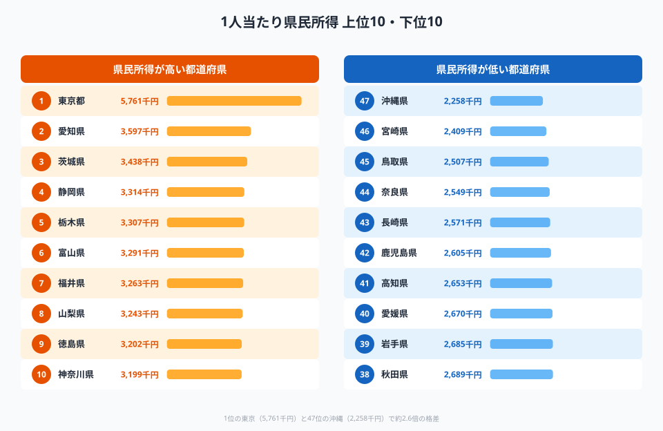
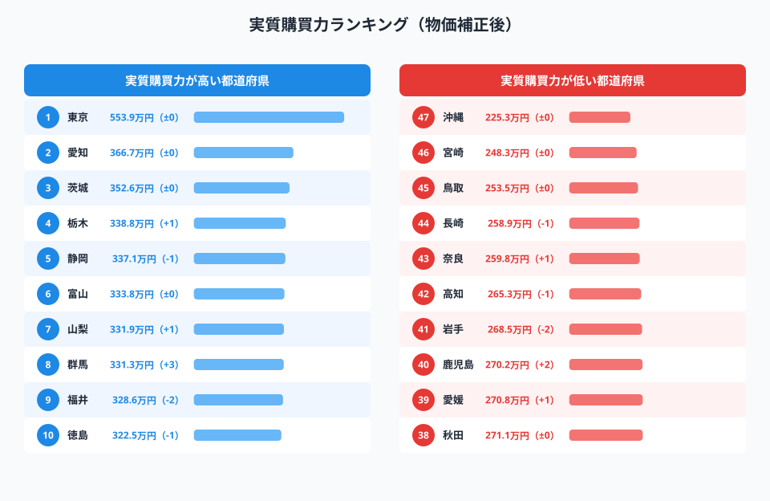
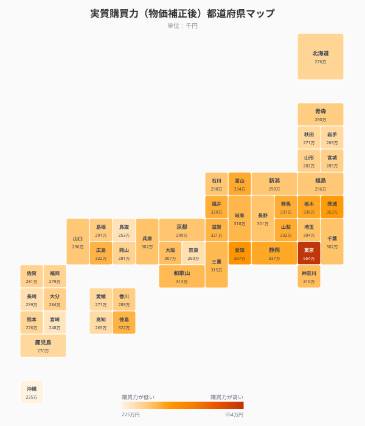
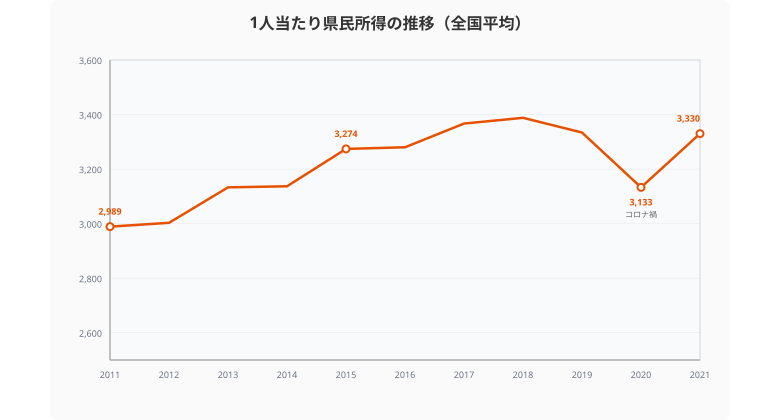
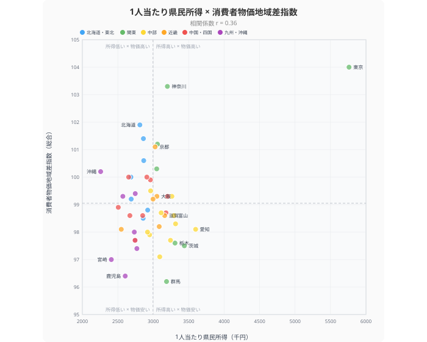

「1人当たり県民所得」のランキングで東京がダントツ1位なのは周知の事実です。しかし、東京の物価は全国で最も高い。**同じ576万円でも、東京で暮らすのと群馬で暮らすのでは「買えるもの」が違う**。そこで本記事では、名目所得を物価で割った「**実質購買力**」で47都道府県を並べ替えます。

> [!NOTE]
> 「県民所得」は県全体の所得を人口で割った指標であり、個人の年収や手取り額とは異なります。雇用者報酬・財産所得・企業所得を合算した「県の経済力÷人口」です。本記事の計算式は **実質購買力 = 名目県民所得 ÷ 消費者物価地域差指数 × 100** です。

## 名目の県民所得ランキング──東京576万円で圧倒

<data-source url="https://www.e-stat.go.jp/dbview?sid=0000010103" label="e-Stat 県民経済計算"></data-source>

**1位は[東京都](/areas/13000)の576.1万円**。2位の愛知県（359.7万円）に200万円以上の大差をつけています。3位の茨城県（343.8万円）、4位の静岡県（331.4万円）、5位の栃木県（330.7万円）と続き、意外にも首都圏のベッドタウンである神奈川県は10位（319.9万円）にとどまります。

下位に目を向けると、**47位は[沖縄県](/areas/47000)の225.8万円**。東京との差は350万円、約2.6倍の格差です。

しかし、このランキングには落とし穴があります。**物価が違う**のです。東京の物価指数は104.0、群馬は96.2──同じ1万円で買えるモノの量が約8%も違います。

## 実質購買力ランキング──物価補正で浮かぶ本当の実力

<data-source label="県民所得は [e-Stat 県民経済計算](https://www.e-stat.go.jp/dbview?sid=0000010103)（2021年度）、物価指数は [e-Stat 消費者物価地域差指数](https://www.e-stat.go.jp/dbview?sid=0000010212)（2024年）"></data-source>

物価で補正した**実質購買力**で並べ替えると、順位が変動します。

**東京都は名目576.1万円→実質553.9万円に目減り**するものの、他県との差が大きすぎて1位は揺るぎません。2位の愛知県（実質366.7万円）も、物価の安さ（98.1）が効いて名目とほぼ変わらない位置を維持しています。

注目すべきは**[群馬県](/areas/10000)**です。名目11位から実質8位へ**3ランク上昇**。物価指数96.2は全国最安で、名目318.7万円が実質331.3万円に膨らみます。同様に**長野県（**名目24位→実質21位、+3）、**新潟県（**名目26位→実質23位、+3）も物価の安さで実質順位を押し上げています。

逆に大きく順位を下げたのが**神奈川県**。名目10位から**実質16位へ6ランクダウン**。所得319.9万円に対して物価指数103.3が重く、実質購買力は309.7万円にとどまります。**北海道**も名目32位→実質37位（-5）と、高い物価（101.9）が所得の低さに追い打ちをかけています。

### 都道府県マップ

<data-source label="県民所得（2021年度）÷ 物価地域差指数（2024年）× 100"></data-source>

マップで見ると、**東海・北関東の色が濃い（**購買力が高い）のが目立ちます。愛知・茨城・栃木・静岡・富山──これらは「所得がそこそこ高い＋物価が安い」という組み合わせで、実質的な暮らしやすさでは大都市圏を上回ります。

一方、**沖縄・北海道は色が薄い**。所得が低いうえに物価も全国平均を超えるため、実質購買力で見ると二重に不利な構造です。

<source-link href="/ranking/per-capita-kenmin-shotoku-h27">47都道府県の1人当たり県民所得ランキングをもっと見る</source-link>

<ad-slot></ad-slot>

## 県民所得の推移──2020年の落ち込みから回復途上

<data-source url="https://www.e-stat.go.jp/dbview?sid=0000010103" label="e-Stat 県民経済計算"></data-source>

全国平均の1人当たり県民所得は、2011年の298.9万円から2018年の338.8万円まで緩やかに上昇しました。しかし**2020年にコロナ禍で313.3万円に急落**。2021年は333.0万円まで回復していますが、2018年のピークには届いていません。

この10年間の伸び率は約11%。一方で消費者物価指数は同期間に数%上昇しており、**実質ベースの所得増はさらに小幅**です。「賃上げ」が叫ばれる背景には、この緩慢な所得成長があります。

## 所得と物価の関係──相関はあるが例外も多い

<data-source label="県民所得は e-Stat 県民経済計算（2021年度）、物価指数は e-Stat 消費者物価地域差指数（2024年）"></data-source>

散布図で所得（横軸）と物価（縦軸）の関係を見ると、**右上に東京・神奈川（**高所得×高物価）、**左下に宮崎・鹿児島・群馬（**低所得×低物価）が位置し、一定の正の相関があります。

しかし**例外が重要**です。

- **右下エリア（**高所得×低物価）：愛知・茨城・栃木・富山・滋賀などが集まるゾーン。ここが**実質購買力で最も有利**な都道府県群です
- **左上エリア（**低所得×高物価）：沖縄・北海道・山形が該当。所得が低いのに物価が高く、**実質的に最も厳しい**地域です

大阪府は意外にも物価指数99.3と全国平均以下。首都圏（東京104.0・神奈川103.3・千葉101.2・埼玉100.3）に比べて物価面では暮らしやすいと言えます。

<ad-slot></ad-slot>

## 費目別の物価格差──住居費が地域差を決めている

「物価が高い」と一口に言っても、**費目によって地域差の大きさはまったく違います**。

**住居費の格差が圧倒的**です。東京都の住居物価指数は**127.2**に対し、最も低い岐阜県は**81.3**。約1.56倍の差があります。この差は、食料（沖縄106.7 vs 長野95.8、約1.11倍）や光熱・水道（北海道119.6 vs 大阪87.0、約1.37倍）を大きく上回ります。

費目別に最高県・最低県・倍率を並べると、地域差の大きさは費目ごとに大きく異なります。

- 住居：127.2（東京） vs 81.3（岐阜）── **1.56倍**
- 教育：125.1（大阪） vs 78.8（富山）── **1.59倍**
- 光熱・水道：119.6（北海道） vs 87.0（大阪）── **1.37倍**
- 食料：106.7（沖縄） vs 95.8（長野）── **1.11倍**
- 総合：104.0（東京） vs 96.2（群馬）── **1.08倍**

注目すべきは**教育費の地域差**。大阪府が125.1で全国最高、富山県が78.8で最低と、住居に匹敵する格差があります。私立学校の学費や塾代が都市部で高いことが背景にあります。

住居費と教育費──この2つが、都市部と地方の「暮らしのコスト」の違いを最も大きく左右しています。

> [!TIP]
> 総合物価指数では東京104.0と群馬96.2の差はわずか8ポイントですが、住居だけに絞ると東京127.2 vs 岐阜81.3で46ポイントの差。「何にお金がかかるか」を費目別に見ることで、移住の判断材料が変わります。

<source-link href="/ranking/consumer-price-difference-index-overall">消費者物価地域差指数の詳細ランキングを見る</source-link>

## まとめ

「県民所得ランキング」は最もよく引用される経済指標のひとつですが、物価を考慮しないと実態を見誤ります。

本記事の分析から見えたポイントを整理します。

1. **東京は名目・実質ともに1位だが、22万円分の「目減り」がある**。576.1万円の名目所得は物価補正後553.9万円に。物価指数104.0の代償は小さくない
2. **北関東・中部が実質の勝ち組**。茨城・栃木・愛知・富山・群馬は所得水準と物価安のバランスが良く、実質購買力の上位を占める
3. **神奈川は名目10位→実質16位と最大の下落幅**。首都圏の高物価が所得を相殺する典型例
4. **沖縄・北海道は「低所得×高物価」の二重苦**。実質購買力では全国でもっとも厳しい地域
5. **住居費の地域差が最大**。東京の住居物価指数127.2に対し岐阜は81.3。住む場所を変えるだけで生活コストが劇的に変わる

移住や転職を考えるとき、名目の年収だけでなく「**その地域の物価で何が買えるか**」を意識することが、本当の豊かさにつながるのではないでしょうか。

## データ出典

本記事のデータはe-Stat（政府統計の総合窓口）を基に作成しています。
