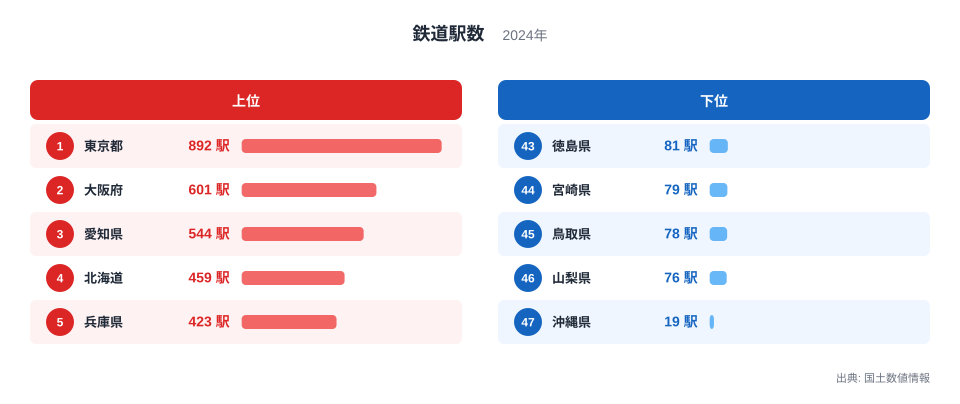
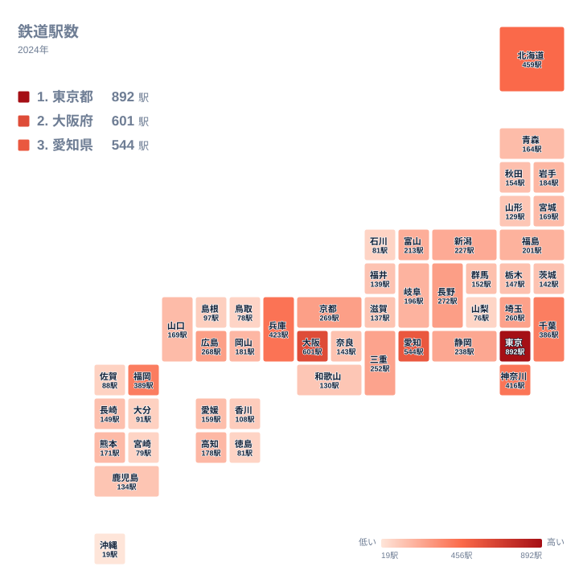

普段の通勤や旅行で何気なく利用している鉄道駅ですが、その数は都道府県ごとに大きく偏っています。人口が多い都市圏に集中しているのは想像しやすいところですが、実際の順位を見ると、単純な人口の多さだけでは説明できない並びが見えてきます。ここでは国土数値情報の集計をもとに、鉄道駅数の地域差とその背景を掘り下げます。

駅の数は47都道府県のすべてで1桁を超えていますが、その多寡には都市計画・地形・戦後の鉄道網の歴史といった複数の要因が絡み合っています。単純に人口の多い順に並ぶわけではない点こそが、この指標を読み解く面白さです。

## 上位と下位を分ける差

<source-link href="/ranking/railway-station-count">鉄道駅数ランキングをもっと見る</source-link>

全国で最も駅が多いのは東京都で、その数は892駅にのぼります。2位は大阪府の601駅、3位は愛知県の544駅と続き、ここまでは三大都市圏の中心県が並びます。ところが4位には北海道が459駅で入り、5位の兵庫県423駅、6位の神奈川県416駅よりも上位に位置しています。人口や面積あたりの密度で見れば北海道の順位はまったく違う姿になりますが、駅の実数だけを比べると、広大な土地に長い路線網を持つ北海道が大都市圏に迫る存在感を示している点が、この指標のおもしろさです。

愛知県が544駅で3位に入っているのは、名古屋市を中心とする中京圏の産業構造と深く関わっています。名古屋市営地下鉄に加えて、私鉄の名古屋鉄道が県内各地に路線網を張り巡らせており、そこにJR東海の在来線が重なり合うことで、自動車産業の集積地として広がる通勤圏を支える駅の数を押し上げてきました。同じ製造業の拠点でも、単独の鉄道会社ではなく複数の事業者が路線を分担してきた歴史が、駅数の多さにつながっていると考えられます。

一方で最も駅が少ないのは沖縄県で、19駅にとどまります。次に少ないのは山梨県の76駅、鳥取県の78駅、宮崎県の79駅と続き、石川県と徳島県はいずれも81駅で並んでいます。上位県との差は40倍を超えており、同じ都道府県という単位でくくられていても、鉄道インフラの整備状況にはこれほどの開きがあることがわかります。

> [!NOTE]
> この駅数は国土数値情報に登録された鉄道駅データをもとに集計した値です。JRや大手私鉄だけでなく地下鉄や第三セクター鉄道の駅も含まれますが、路面電車の停留場の扱いはデータの整備方針に依存するため、他の統計での「駅数」と単純比較できない場合があります。

## 地理でみる分布

地図で見ると、駅が多い地域は関東・近畿・東海の三大都市圏を中心に、そこから放射状に濃淡が広がっている様子がわかります。東京都から神奈川県、千葉県、埼玉県にかけての首都圏、大阪府から兵庫県、京都府にかけての近畿圏は、通勤・通学の鉄道網が細かく張り巡らされているため駅の密度が高くなっています。長野県が272駅で9位に入っているのも印象的で、山がちな地形にもかかわらず、古くから複数の私鉄・国鉄路線が県内を結んできた歴史が反映されています。

順位の中ほどにも注目すべき県があります。富山県は213駅で16位に入っており、より人口の多い福島県の201駅や岐阜県の196駅を上回っています。この背景には、JR西日本から経営を分離してできたあいの風とやま鉄道や、路面電車を含む富山地方鉄道、万葉線といった第三セクターや地方私鉄が、かつての国鉄・私鉄路線を引き継ぎながら数多くの駅を維持してきた事情があると考えられます。

対照的に、駅の少なさが際立つのは沖縄県と、四国・九州南部の一部の県です。沖縄県は戦後に鉄道網そのものを失った経緯があり、現在運行しているのはゆいレールのみです。鳥取県や宮崎県のように山地が多く人口の分散した県では、鉄道よりも自動車を中心とした移動が定着しており、駅の絶対数が伸びにくい構造になっています。

> [!WARNING]
> このデータは2024年時点の国土数値情報にもとづいています。廃線や新駅の開業は年ごとに発生するため、最新の路線図とは細部が異なる可能性があります。また都道府県単位の集計であるため、同じ県内でも都市部と郡部で駅の密度は大きく異なります。

## なぜこの順位になるのか

沖縄県が最下位になっている背景には、単なる人口や面積の違いだけでは説明できない歴史的な経緯があります。戦前の沖縄県には沖縄県営鉄道という路線が存在していましたが、太平洋戦争でほぼ壊滅し、戦後の米軍統治下では鉄道の再建よりも道路網の整備が優先されました。その結果、自動車中心の交通体系が定着し、現在の鉄道は空港と那覇市中心部を結ぶゆいレールのみという状態が続いています。

これに対して本州や北海道の各県は、明治期から昭和期にかけて国鉄や私鉄の路線網が段階的に整備され、多くの支線や駅が現在まで維持されてきました。北海道が4位という上位に入っているのも、人口密度こそ低いものの、広い土地に多くの路線と駅を抱える歴史的な蓄積があるためです。

福岡県が389駅で7位に入っているのも、九州最大の都市である福岡市が地下鉄と西日本鉄道の路線網を軸に、周辺市町村からの通勤・通学需要を集めてきた結果だと考えられます。人口規模だけを見れば東京都や大阪府には及ばないものの、九州における拠点都市としての役割の大きさが、駅数という形で表れています。同じカテゴリの[インフラ関連の統計一覧](/category/infrastructure)を見ると、道路や港湾など他の指標でも地域ごとの整備状況の違いが浮かび上がってきます。首都圏の駅数を支える[東京都のデータ](/areas/13000)や、関西圏の拠点である[大阪府のデータ](/areas/27000)もあわせて確認すると、駅数以外の指標との関係が見えやすくなります。

> [!TIP]
> 駅の絶対数だけでなく、面積あたりや人口あたりの駅数に置き換えると、順位はまったく異なる姿になります。北海道のように面積が広い県は絶対数では上位でも、面積あたりでは順位が下がる傾向があるため、目的に応じて指標を使い分けることをおすすめします。

長野県が272駅で9位に入っている点も、鉄道網の歴史を考えるうえで参考になります。山がちな地形を抱えながらも、明治期から昭和期にかけて複数の民間鉄道と国鉄路線が県内各地を結ぶように整備され、その多くが現在まで維持されてきました。埼玉県が260駅で12位、静岡県が238駅で14位に位置しているのも、首都圏や東海道沿線という立地条件が、駅数の積み上げに直結していることを示しています。地形や人口だけでなく、どの時代にどの路線が敷かれたかという歴史の積み重ねが、現在の駅数ランキングに色濃く反映されているといえます。

## まとめ

- 鉄道駅数の1位は東京都で892駅、最下位は沖縄県の19駅です。
- 2位は大阪府の601駅、3位は愛知県の544駅で、三大都市圏の中心県が上位を占めています。
- 北海道は459駅で4位に入り、兵庫県や神奈川県よりも駅数が多くなっています。
- 沖縄県は戦後に鉄道網を失った歴史的経緯から、現在もゆいレールのみで最下位となっています。
- 駅の多い地域は首都圏・近畿圏・東海圏に集中しており、地形や歴史的な路線整備の差が現在の分布に反映されています。

## データ出典

- 国土数値情報（2024年）
