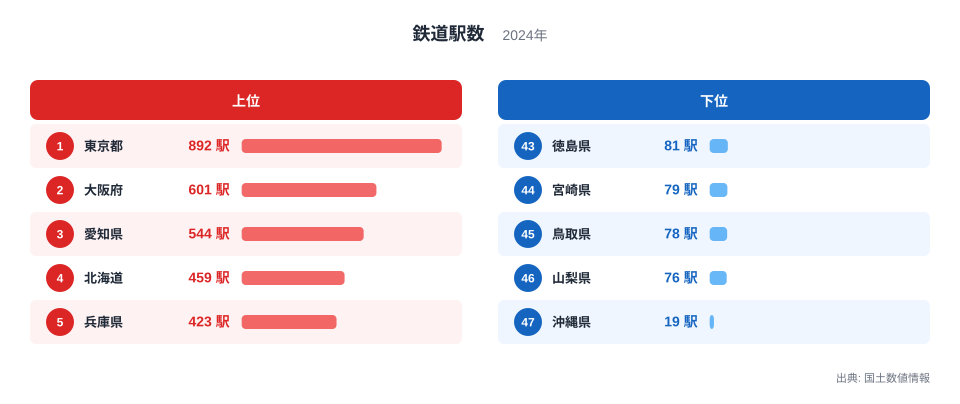
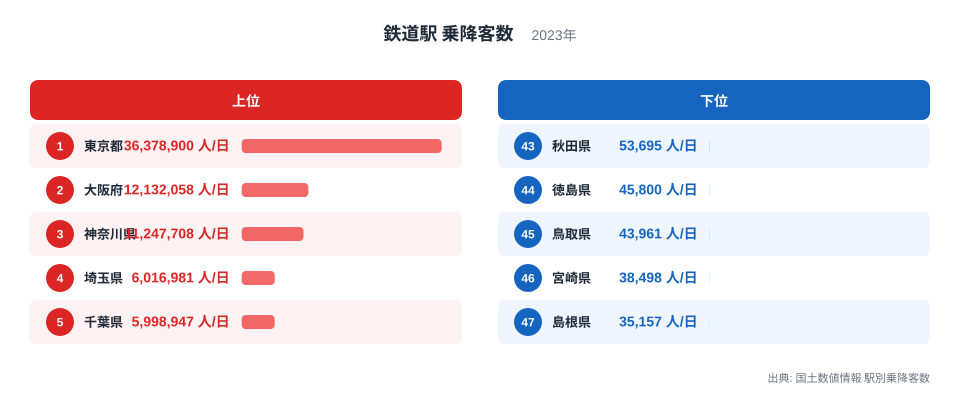
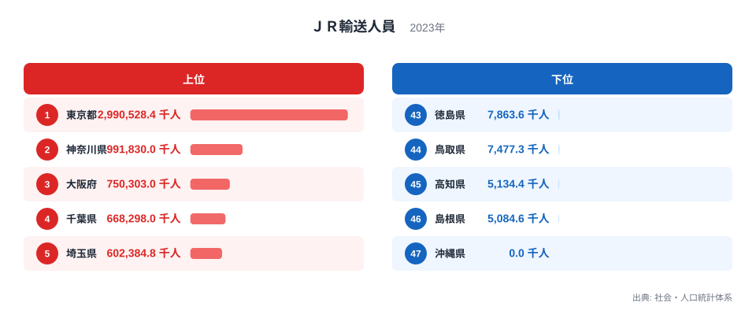

## 鉄道を3つの指標から見る

鉄道にまつわる都道府県別のデータには、駅の数、駅の乗降客数、JRの輸送人員など、複数の指標があります。どれも「鉄道の規模」を測るものですが、指標が違えば見える順位も違います。ここでは鉄道駅数、鉄道駅の乗降客数、JR輸送人員という3つの指標を並べて、都道府県ごとの鉄道の姿を見ていきます。

3つとも1位は東京都です。人口や事業所が集中する首都圏では、駅の数もJRの利用も乗降客数も突出しています。一方で下位に目を向けると、指標によって順位が入れ替わる県があり、単純に「鉄道が発達している県」「発達していない県」の2つに分けられない姿が見えてきます。とくに沖縄県は3つの指標で異なる顔を見せる、分かりやすい例です。

指標ごとに何を数えているかを意識せずにランキングだけを眺めると、「駅が少ない県は鉄道の利用も少ない」「JRの輸送人員が0の県は鉄道自体が発達していない」といった思い込みをしてしまいがちです。以下では、それぞれの指標が実際に何を測っているのかを確認しながら、都道府県ごとの違いを見ていきます。

## 鉄道駅数でみる都道府県の差

<source-link href="/ranking/railway-station-count">鉄道駅数ランキング</source-link>

鉄道駅数の1位は東京都で、892駅です。2位は大阪府で601駅、3位は愛知県で544駅と、いずれも人口の多い都市圏の都道府県が上位に並んでいます。

もっとも少ないのは沖縄県で、19駅です。次いで山梨県が76駅、鳥取県が78駅と続きます。沖縄県は本島の面積に対して鉄道路線がゆいレールに限られているため、47都道府県のなかでも駅の数がとりわけ少なくなっています。徳島県は81駅で石川県と同数となっており、駅数ランキングでは同じ値の県が並ぶこともあります。

## 鉄道駅の乗降客数でみる沖縄県の意外な位置

<source-link href="/ranking/railway-passengers">鉄道駅 乗降客数ランキング</source-link>

「鉄道駅 乗降客数」というこの指標でも、1位は東京都で、1日あたり36,378,900人です。2位は大阪府で12,132,058人、3位は神奈川県で11,247,708人と、駅数と同じく都市圏の都道府県が上位を占めています。

ここで注目したいのが沖縄県です。鉄道駅数では19駅ともっとも少ない沖縄県ですが、乗降客数では1日109,305人で33位となり、最下位ではありません。山梨県や石川県、大分県、岩手県、佐賀県、青森県、福井県、高知県、山形県、秋田県、徳島県、鳥取県、宮崎県、島根県の14県は、いずれも沖縄県より駅の数が多いにもかかわらず、乗降客数では沖縄県を下回っています。駅の数がもっとも少ない県が、乗降客数では14の県を上回っているという事実は、駅数だけを見て鉄道利用の実態を判断できないことを示しています。

## JR輸送人員でみる沖縄県の特殊な事情

<source-link href="/ranking/jr-passenger-transport">ＪＲ輸送人員ランキング</source-link>

「ＪＲ輸送人員」という指標の1位は東京都で、2,990,528.4千人です。2位は神奈川県で991,830千人、3位は大阪府で750,303千人と続き、こちらも大都市圏の都道府県が上位を占めています。

そして沖縄県は、JR輸送人員が0千人で47位です。これはデータが欠けているのではなく、沖縄県内にJRの路線が1本も走っていないためです。前の項で見たとおり、沖縄県には19の鉄道駅があり、1日109,305人がその駅を利用していますが、それらはゆいレールなどJR以外の鉄道であり、JR輸送人員の統計にはいっさい計上されません。同じ「鉄道」という言葉でも、指標が何を数えているかによって、沖縄県の順位はまったく違って見えることが分かります。

鉄道駅数では最下位、鉄道駅乗降客数では下位のなかでは中ほど、JR輸送人員では0で最下位という3通りの結果は、いずれも同じ沖縄県の鉄道の姿を映したものです。1つの指標だけを見て「沖縄県には鉄道がほとんどない」と結論づけてしまうと、県内で実際に鉄道を利用している10万人以上の人の存在を見落とすことになります。

## 3つの指標を重ねて見えてくること

鉄道駅数、鉄道駅乗降客数、JR輸送人員のいずれも、上位は東京都、神奈川県、大阪府、愛知県、福岡県といった大都市圏の都道府県で占められています。上位の顔ぶれは指標が変わってもあまり動かない一方で、下位に目を向けると、沖縄県のように指標ごとに順位が大きく異なる県があり、鉄道という1つのテーマでも、どの指標で切り取るかによって見える県の姿が変わってきます。

鉄道駅数だけを見ると沖縄県は最下位ですが、乗降客数では最下位ではなく、JR輸送人員では路線が存在しないために0になるという、3つの指標がそれぞれ違う理由で違う順位を示す例になっています。ある県の鉄道の姿を理解するには、1つの指標だけでなく、複数の指標をあわせて見ることが欠かせません。

同じ「鉄道」という統計でも、駅の数を数えるのか、利用者数を数えるのか、特定の事業者だけを数えるのかによって、指標が映し出す姿は変わります。都道府県別のランキングを見るときは、そのランキングが何を数えているのかをまず確認することが、正しい読み方の第一歩になります。

鉄道に関するより詳しい統計は[鉄道のテーマ](/themes/railway)にまとまっています。社会基盤施設に関する他の統計は[社会基盤施設の統計一覧](/category/infrastructure)から探せます。この記事で取り上げた[東京都のデータ](/areas/13000)や[沖縄県のデータ](/areas/47000)も、あわせてご覧ください。

> [!NOTE]
> 鉄道駅数と鉄道駅乗降客数は、JRだけでなく私鉄や地下鉄、モノレールなど全ての鉄道を含みます。一方でJR輸送人員はJRの路線だけを数えた指標のため、同じ都道府県でも指標によって対象となる路線の範囲が異なります。

> [!WARNING]
> JR輸送人員が0や少ない値であることは、鉄道の利用が少ないことを意味するとは限りません。沖縄県のように、JR以外の鉄道が中心となっている地域では、JR輸送人員だけを見ても実際の鉄道利用の姿はつかめません。

> [!TIP]
> 都道府県の鉄道を比べるときは、駅の数、乗降客数、JR輸送人員のどれか1つだけで判断せず、複数の指標を並べて確認することをおすすめします。指標によって順位が大きく変わる県ほど、その背景にある事情が見えてきます。県内にJR以外の鉄道事業者が多い県ほど、JR輸送人員だけでは実態を見誤りやすくなります。

## データ出典

社会・人口統計体系、2023年（JR輸送人員）。国土数値情報、2023年（鉄道駅 乗降客数）・2024年（鉄道駅数）
