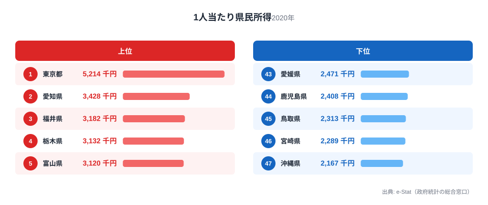

「年収が高い県ほど暮らしは楽なはず」——そう思っている人ほど驚く数字があります。1人当たり県民所得で全国1位なのは東京都で、521.4万円です。ところが家賃を差し引いた実質の手取り(家賃控除後可処分所得)で並べ直すと、東京都は16位まで後退します。

代わりに1位に立つのは山形県です。名目の県民所得では全国20位という「中位」の県が、家賃を引いた実質手取りでは月54.5万円と全国トップに躍り出ます。逆に名目所得では9位だった徳島県は、家賃控除後では33位まで沈みます。年収の順位表と、手取りの順位表はまったく別の顔をしているのです。

この記事では、1人当たり県民所得(名目)と家賃控除後可処分所得(実質)という2つのランキングを重ね合わせ、どの県が「見た目より暮らしやすいか」「見た目ほど暮らしやすくないか」をデータで確認します。鍵を握るのは家賃で、その差は最大12倍にのぼります。

## 名目年収1位の東京が、家賃を引くと16位に沈む

まず全体の構図を数字で押さえておきます。1人当たり県民所得(2020年度)は東京都が521.4万円で1位、最下位は沖縄県の216.7万円で、その差は2.4倍です。一方、家賃控除後可処分所得(2024年度、月額)は山形県が54.5万円で1位、最下位はやはり沖縄県で16.7万円、差は3.3倍に広がります。

沖縄県が両方の指標で最下位に沈んでいる点にまず注目してください。沖縄県は名目所得が全国最下位であるだけでなく、家賃(民営家賃の消費支出額)も全国で最も高い月25.7万円です。名目所得の低さと家賃の高さが重なる「二重の不利」を抱えているため、実質手取りでも最下位から動けません。

対照的に、東京都は名目所得こそ1位ですが、家賃(月17.6万円、全国5位の高さ)を差し引くと手取りは月46.2万円まで下がり、16位相当まで後退します。名目の順位だけを見て「東京に住めば生活が豊かになる」と考えるのは早計だということが、この逆転からわかります。

> [!NOTE]
> 家賃控除後可処分所得は、総務省家計調査の二人以上の勤労者世帯における可処分所得から、同調査の「民営家賃」の消費支出額を差し引いた指標です。持ち家世帯の帰属家賃や住宅ローンの返済額は含まれていないため、「実際の生活費をすべて反映した手取り」ではなく、あくまで賃貸家賃という単一の変動費を調整した指標である点に注意してください。

## 実質手取りランキング — 上位5県・下位5県

家賃控除後可処分所得の上位を占めるのは、東北・北関東・北陸の各県です。1位の山形県(54.52万円)に続き、僅差の2位に茨城県(54.48万円)、3位福井県(54.0万円)、4位栃木県(53.1万円)、5位埼玉県(52.8万円)が入ります。これらの県に共通するのは、家計調査上の家賃負担が総じて軽いことです。実際、山形県の家賃(月2.1万円)は47都道府県で最も安く、福井県(月3.6万円)も下から6番目の安さ(47件中42位)にとどまります。名目所得ではトップ層ではなくても、家賃という「固定費」が軽い分、手元に残る金額は大きくなります。

下位5県は沖縄県(16.7万円)、北海道(28.7万円)、宮城県(31.7万円)、大分県(33.1万円)、宮崎県(33.9万円)の順です。北海道と宮城県が下位に沈んでいるのは注目に値します。両県とも名目所得は全国中位圏(北海道31位、宮城23位)でそこまで低くはないのですが、家賃がそれぞれ全国3位(北海道20.2万円)、2位(宮城23.0万円)という高さのため、手取りに換算すると大きく順位を落とします。都市部・地方中核都市であっても、家賃が重ければ実質の暮らし向きは楽にならないという構造がここに表れています。

<source-link href="/ranking/disposable-income-after-rent">家賃控除後可処分所得ランキングをもっと見る</source-link>

## 名目の県民所得ランキングでは東京がトップのまま

比較のため、名目側の1人当たり県民所得ランキングも見ておきます。1位の東京都(521.4万円)、2位の愛知県(342.8万円)、3位の福井県(318.2万円)、4位の栃木県(313.2万円)、5位の富山県(312.0万円)という顔ぶれです。上位には製造業の集積が厚い東海・北陸勢と、突出した所得水準を持つ東京都が並びます。

下位は宮崎県(228.9万円)、沖縄県(216.7万円)が最下位2県で、九州・沖縄勢が目立ちます。この名目ランキングだけを見れば、東京・愛知・福井といった県に住むほど「稼げる」という単純な話に見えます。しかし前章の実質ランキングと突き合わせると、上位5県のうち実質でも上位に残ったのは福井県(名目3位→実質3位)だけで、東京都(1位→16位)、愛知県(2位→10位)、栃木県(4位→4位、実質でも変わらず堅調)、富山県(5位→8位)は軒並み順位を下げています。「稼ぐ額」と「使える額」は別物だということが、この対比からはっきり見えてきます。

<source-link href="/ranking/per-capita-prefectural-income-h27">1人当たり県民所得ランキングをもっと見る</source-link>

## なぜこれほど順位がズレるのか — 物価と家賃という重り

この散布図は横軸に名目の1人当たり県民所得、縦軸に家賃控除後可処分所得をとったものです。両者が単純に比例するなら右肩上がりの直線に47都道府県が並ぶはずですが、実際には東京都だけが右下に大きく外れ、山形県・奈良県が左上に外れるという「ねじれ」が見られます。この外れ方を生んでいるのが、住居費と地域の物価水準です。

最も分かりやすいのは家賃の格差です。家賃控除後可処分所得の元になる民営家賃の消費支出額は、最高の沖縄県(月25.7万円)と最低の山形県(月2.1万円)で12.0倍もの開きがあります。

<source-link href="/ranking/private-rent-consumption-expenditure">民営家賃消費支出額ランキングをもっと見る</source-link>

さらに消費者物価地域差指数の「住居」項目を見ると、東京都は127.2(全国平均を100とした場合)と突出して高く、岐阜県(81.3)との差は1.6倍に達します。名目の年収がどれだけ高くても、住居費がこれだけ重ければ手元に残る金額は目減りするということです。

<source-link href="/ranking/consumer-price-difference-index-housing">消費者物価地域差指数(住居)ランキングをもっと見る</source-link>

奈良県の躍進(名目39位→実質6位)も同じ理屈で説明できます。奈良県は近畿地方の中で消費者物価地域差指数(総合)が98.1と全国平均をやや下回り、家賃も月8.4万円と全国21位の水準にとどまります。大阪・京都のベッドタウンでありながら物価・家賃の負担は近畿の中心部ほど重くないため、名目所得の低さが相殺され、実質順位では上位に食い込んでいます。

一方で徳島県(名目9位→実質33位)や広島県(12位→35位)のように、名目所得は高いのに実質順位で大きく後退する県もあります。これらの県は家賃自体が突出して高いわけではありませんが、消費者物価地域差指数(総合)が全国平均に近い水準にあるため、名目所得の高さがそのまま手取りの多さには結びついていません。名目所得の高さは「その県の産業構造(製造業や第三次産業の集積度)」を反映したものであり、生活コストの低さを保証するものではない、という点がここからも読み取れます。

> [!WARNING]
> 「家賃が安い県ほど得」と単純化しないでください。沖縄県は家賃が全国一高いうえに名目所得も最下位という二重の不利を抱えていますが、北海道や宮城県のように名目所得は中位でも家賃の重さだけで実質順位を落とす県もあります。逆に山形県や奈良県のように、名目所得が中位でも家賃・物価の軽さで実質順位を押し上げる県もあります。名目所得・家賃・物価のどれか1つだけを見て住みやすさを判断すると、実態を見誤ります。

> [!TIP]
> 自分の出身県や検討中の移住先について確かめたい場合は、名目の1人当たり県民所得の順位から家賃控除後可処分所得の順位を引き算してみてください。プラスに大きく振れる県ほど「名目より実質的に得」、マイナスに大きく振れる県ほど「名目ほど暮らしは楽ではない」ことを意味します。本記事の散布図で、自分の県が直線からどちらに外れているかを確認するのも手がかりになります。

> [!NOTE]
> 1人当たり県民所得は2020年度、家賃控除後可処分所得・消費者物価地域差指数は2024年度の値を用いています。県民所得は地域の産業構造(製造業の集積度合いなど)に規定される指標で、単年の景気変動では大きく動きにくい性質があります。そのため4年分の年次のズレが、本記事で見ている「名目と実質の逆転構造」そのものを覆すことはありません。

## まとめ

- 1人当たり県民所得(名目・2020年度)は東京都が521.4万円で1位、最下位は沖縄県の216.7万円で2.4倍差
- 家賃控除後可処分所得(実質・2024年度)は山形県が月54.5万円で1位、最下位はやはり沖縄県の16.7万円で3.3倍差
- 東京都は名目1位から実質16位、徳島県は名目9位から実質33位へ後退し、名目の年収順位が実質の手取り順位と一致しない
- 山形県(名目20位→実質1位)、奈良県(名目39位→実質6位)は家賃・物価の軽さで実質順位を大きく押し上げている
- 沖縄県は名目所得の低さと家賃の高さ(全国一・12.0倍差)が重なり、名目・実質どちらのランキングでも最下位

## データ出典

- 1人当たり県民所得: 総務省統計局「社会・人口統計体系」(県民経済計算に基づく1人当たり県民所得、2020年度)
- 家賃控除後可処分所得・民営家賃消費支出額: 総務省統計局「家計調査」(二人以上の勤労者世帯、2024年度)
- 消費者物価地域差指数: 総務省統計局「小売物価統計調査(構造編)」に基づく消費者物価地域差指数(2024年)

いずれもe-Stat(政府統計の総合窓口)経由で取得した最新の公開データを基に、都道府県別に集計・整備しています。

より広い切り口で実質収入や購買力を比較したい場合は[実質収入・購買力](/themes/real-income)のテーマページ、物価そのものの地域差を確認したい場合は[物価・消費](/themes/consumer-prices)のテーマページも参考にしてください。東京都・山形県・奈良県それぞれの詳しい統計は[東京都のデータ](/areas/13000)、[山形県のデータ](/areas/06000)、[奈良県のデータ](/areas/29000)からも確認できます。
