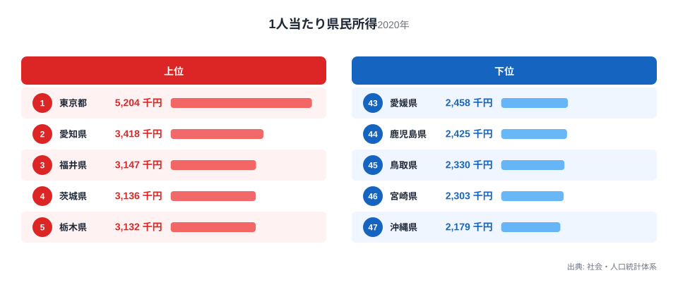
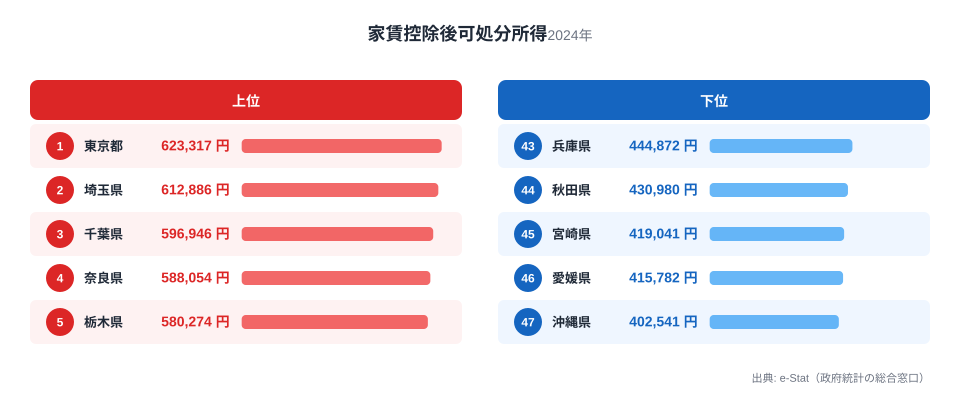
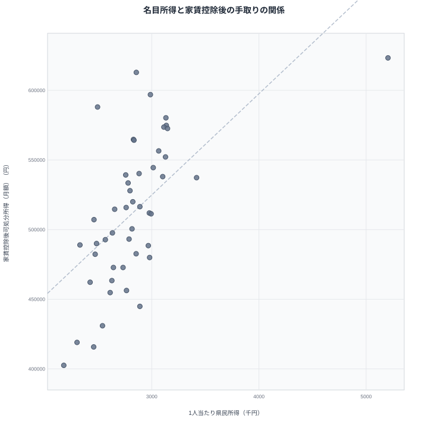

「年収が高い県ほど暮らしにゆとりがあるはず」——そう考える人にとって、この記事のデータは少し意外に映るかもしれません。1人当たり県民所得で全国トップに立つのは東京都です。では、そこから家賃を差し引いた「家賃控除後可処分所得」でも、東京都は首位を守れるのでしょうか。

答えは「守れる」です。家賃を差し引いても東京都は依然として全国1位のままです。ところが、地域による物価の違いまで補正した「実質可処分所得」で並べ直すと、東京都はわずかに首位の座を明け渡します。しかもその差はたった5,299円しかありません。

この記事では、1人当たり県民所得(名目)・家賃控除後可処分所得・実質可処分所得(物価補正後)という3つのランキングを重ね合わせ、東京都の首位がどこで、なぜ崩れるのかを47都道府県のデータで確認します。鍵を握るのは家賃の重さで、都道府県間で最大12.0倍もの開きがあります。

## 1人当たり県民所得では東京が圧倒的な1位

まず出発点となる名目の指標を確認します。1人当たり県民所得は、その地域で生まれた所得の総額を人口で割ったもので、家計が実際に受け取る手取りとは異なり、企業の利益や設備投資まで含む地域経済全体の規模を示す指標です。2020年度の値で見ると、東京都は520.4万円で全国1位、2位は愛知県で341.8万円です。東京都が2位を大きく引き離しています。最下位は沖縄県の217.9万円で、東京都との差は2.4倍にのぼります。

上位には東京都のほか、愛知県・福井県・茨城県・栃木県という製造業の集積地が並びます。これらの県は工場や企業の生産活動が活発で、地域全体の所得水準を押し上げています。一方、下位には宮崎県・沖縄県といった九州・沖縄勢が並び、第一次産業や観光業の比重が高く、一人当たりの生産額が伸びにくい構造があります。この名目ランキングだけを見ると、東京都に住むことが最も「稼げる」ように見えます。

<source-link href="/ranking/per-capita-prefectural-income-h27">1人当たり県民所得ランキングをもっと見る</source-link>

## 家賃を引いても東京は1位のまま

次に、家計調査に基づく「家賃控除後可処分所得」を見てみます。この指標は、二人以上の勤労者世帯が実際に受け取る月々の可処分所得から、同じ調査の民営家賃の消費支出額を差し引いたものです。1人当たり県民所得とは異なり、企業の利益や設備投資は含まれず、世帯が生活費として使える金額そのものを表します。

2024年度の値では、東京都は月62.3万円で全国1位を守ります。2位は埼玉県の61.3万円、3位は千葉県の59.7万円、4位は奈良県の58.8万円、5位は栃木県の58.0万円と続き、いずれも東京都のベッドタウンにあたる南関東・北関東・北陸の県が並びます。最下位は沖縄県の40.3万円で、東京都との差は1.5倍まで縮まります。名目の2.4倍から1.5倍への縮小は、家賃という固定費を差し引くと地域差の一部が相殺されることを示しています。

下位は43位の兵庫県、44位の秋田県、45位の宮崎県、46位の愛媛県、47位の沖縄県と続きます。これらの県は家賃自体が特別高いわけではなく、むしろ月々の可処分所得の水準そのものが低いために下位に沈んでいます。家賃を差し引く操作は、家賃が高い地域の順位を押し下げる一方で、そもそもの手取りが少ない地域の順位までは押し上げてくれないのです。

<source-link href="/ranking/disposable-income-after-rent">家賃控除後可処分所得ランキングをもっと見る</source-link>

> [!NOTE]
> 家賃控除後可処分所得は、総務省家計調査の二人以上の勤労者世帯における可処分所得(月額)から、同調査の「民営家賃」の消費支出額を差し引いた指標です。持ち家世帯の帰属家賃や住宅ローンの返済額は含まれていないため、賃貸家賃という単一の変動費だけを調整した値である点に注意してください。

## 物価まで補正すると、東京はわずかに埼玉に追い抜かれる

家賃だけでなく、日用品やサービス全般にわたる地域の物価差まで補正したのが「実質可処分所得（物価補正後）」です。これは家賃控除後可処分所得とは別に、家計調査の可処分所得を消費者物価地域差指数で割り戻して算出した指標です。

ここで初めて順位の入れ替わりが起きます。1位は埼玉県の月61.9万円、2位が東京都の月61.3万円で、その差はわずか5,299円しかありません。3位には奈良県の月60.7万円が続き、4位栃木県、5位千葉県と、上位の顔ぶれ自体は家賃控除後ランキングとほぼ変わりません。下位は43位の兵庫県、44位の宮崎県、45位の秋田県、46位の愛媛県、47位の沖縄県で、最下位の沖縄県は月42.3万円、東京都との差は1.5倍です。

注目したいのは奈良県の動きです。1人当たり県民所得では39位という中位より下の順位だった奈良県が、実質可処分所得では3位まで駆け上がります。近畿地方にありながら大阪や京都ほど物価が高くないため、名目所得の低さが物価補正によって相殺されているのです。

<source-link href="/ranking/real-disposable-income">実質可処分所得ランキングをもっと見る</source-link>

> [!TIP]
> 家賃控除後可処分所得と実質可処分所得は月額、民営家賃消費支出額は年額で公表されています。本記事で家賃を月換算する際は年額を12で割っています。沖縄県の家賃は年25.7万円ですから、月換算では約2.1万円になります。年額と月額を混同すると桁が違って見えるので注意してください。

## なぜ僅差の逆転が起きるのか — 家賃という重り

この散布図は、横軸に1人当たり県民所得、縦軸に家賃控除後可処分所得をとったものです。両者が単純に比例するなら右肩上がりの直線に47都道府県が並ぶはずですが、実際には東京都だけが右下に大きく外れ、埼玉県・奈良県が左上に外れる「ねじれ」が見られます。

このねじれを生んでいるのが、家賃の重さです。民営家賃消費支出額の年額を見ると、1位は沖縄県の25.7万円、対して47位の山形県はわずか2.1万円しかなく、その差は12.0倍に達します。東京都は5位の17.6万円で、埼玉県は17位の9.2万円にとどまります。1人当たり県民所得では圧倒的な1位でも、家賃という固定費が重ければ、家賃控除後・物価補正後の順位では他県に追いつかれてしまいます。

<source-link href="/ranking/private-rent-consumption-expenditure">民営家賃消費支出額ランキングをもっと見る</source-link>

埼玉県が僅差で東京都を上回る理由も同じ構図で説明できます。埼玉県は東京都に隣接するベッドタウンでありながら、家賃は年9.2万円で、東京都の半分近くに抑えられています。1人当たり県民所得では19位にとどまる埼玉県ですが、家賃と物価の両方で東京都より軽い負担で済むため、実質可処分所得ではわずかに東京都を上回るのです。

> [!WARNING]
> 1人当たり県民所得は県民経済計算という統計に基づく指標で、企業の利益や設備投資まで含めた地域経済全体の生産額を人口で割ったものです。一方、家賃控除後可処分所得と実質可処分所得は家計調査という別の統計に基づき、勤労者世帯が実際に受け取る手取りだけを表します。両者は算出のもとになる統計自体が異なるため、「名目から家賃と物価を引くとこの実質値になる」という単純な引き算の関係ではありません。3つのランキングは、それぞれ異なる角度から見た暮らし向きの目安として読んでください。

## まとめ

- 1人当たり県民所得(名目・2020年度)は東京都が520.4万円で全国1位、最下位は沖縄県の217.9万円で、その差は2.4倍です
- 家賃控除後可処分所得(2024年度・月額)でも東京都は月62.3万円で全国1位を守り、最下位は沖縄県の月40.3万円で、その差は1.5倍まで縮まります
- 物価まで補正した実質可処分所得では、1位が埼玉県の月61.9万円、2位が東京都の月61.3万円に入れ替わり、その差はわずか5,299円です
- 奈良県は名目39位から実質可処分所得3位まで順位を上げ、近畿地方の中でも物価の低さが最も効いている県のひとつです
- 民営家賃消費支出額は沖縄県が年25.7万円で最も高く、最も安い山形県の年2.1万円との差は12.0倍に達し、家賃の重さが順位を左右する最大の要因になっています

## データ出典

- 1人当たり県民所得: 総務省統計局「社会・人口統計体系」(県民経済計算に基づく1人当たり県民所得、2020年度)
- 家賃控除後可処分所得・民営家賃消費支出額: 総務省統計局「家計調査」(二人以上の勤労者世帯、2024年度)
- 実質可処分所得: 総務省統計局「家計調査」の可処分所得を、同局「小売物価統計調査(構造編)」に基づく消費者物価地域差指数で補正した値(2024年)

いずれもe-Stat(政府統計の総合窓口)経由で取得した最新の公開データを基に、都道府県別に集計・整備しています。

より広い切り口で実質収入や購買力を比較したい場合は[実質収入・購買力](/themes/real-income)のテーマページ、物価そのものの地域差を確認したい場合は[物価・消費](/themes/consumer-prices)のテーマページも参考にしてください。東京都・埼玉県・奈良県それぞれの詳しい統計は[東京都のデータ](/areas/13000)、[埼玉県のデータ](/areas/11000)、[奈良県のデータ](/areas/29000)からも確認できます。
