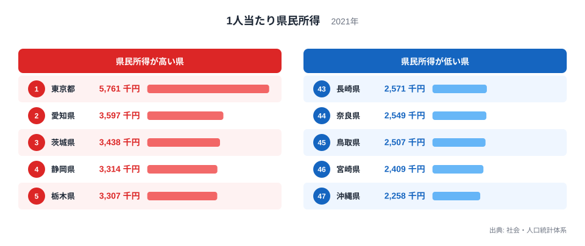
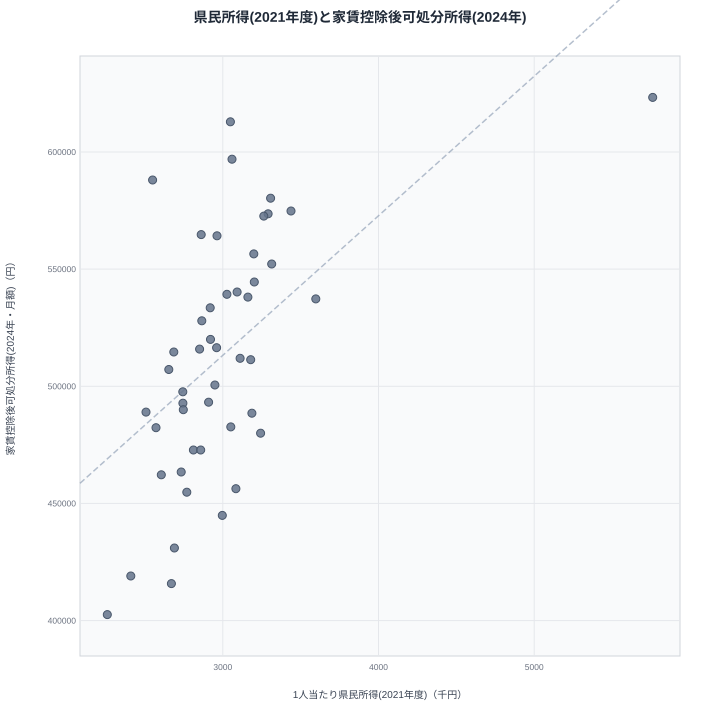
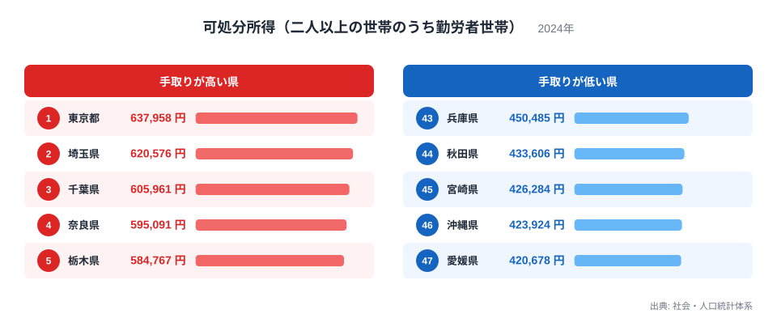
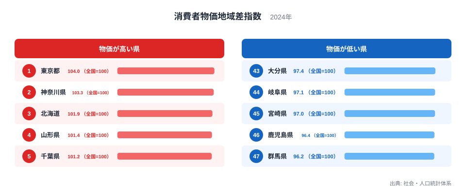
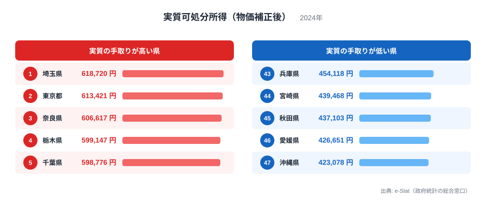

「年収が高い県ほど暮らしにゆとりがある」と考える人にとって、この記事のデータは少し意外に映るかもしれません。1人当たり県民所得で全国トップに立つのは東京都です。では、世帯の手取りから家賃を差し引いても、東京都は首位を守れるのでしょうか。

答えは「守れる」です。家賃控除後の可処分所得でも、東京都は全国1位のままです。ところが、物価の地域差まで補正した実質可処分所得で並べ直すと、埼玉県が東京都をわずかに上回り、東京都は2位に下がります。その差は5,299円で、埼玉県の値に対して約0.9%にすぎません。順位は入れ替わりますが、2県はほぼ並んでいると読むのが妥当です。

家賃を引いても順位は動かず、物価の地域差指数で割ったときに順位が入れ替わります。東京都の消費者物価地域差指数は104.0で全国最高、埼玉県は100.3にとどまります。この記事では、県民所得・家賃控除後・物価補正後という3つの見方を順に重ね、東京都の首位がどの段階で埼玉県に追いつかれるのかを確認します。なお、家計調査と物価統計の値は県庁所在市などを代表させたものなので、県全体の姿とは範囲が異なります。

## 県民所得では東京都が2位の愛知県の1.6倍

最初に、地域経済の規模を人口で割った名目の指標を見ます。1人当たり県民所得は、県全体の所得を人口1人当たりに直した指標で、県全体が対象です。この記事の後半で使う指標は家計調査や物価統計に基づく県庁所在市などの値なので、統計の種類も対象の範囲も違います。本サイトで取得できる最新の2021年度では、東京都が576.1万円で全国1位、2位の愛知県は359.7万円で、東京都は愛知県の1.6倍です。最下位は沖縄県の225.8万円で、東京都との差は2.6倍にのぼります。

上位は東京都、愛知県、茨城県、静岡県、栃木県の順です。2位から5位の4県は330.7万円から359.7万円の間に収まります。東京都だけがこの範囲から大きく離れています。下位は43位の長崎県から、奈良県、鳥取県、宮崎県、沖縄県と続きます。上位と下位の間は、東京都を除けばおよそ1.6倍の幅に収まっています。

東京都がここまで突出する理由は、このデータだけでは確かめられません。企業の所得が東京都に集まっている可能性はありますが、県民所得は家計が受け取る手取りそのものではないため、東京都に住む人の暮らし向きをそのまま表す数字ではありません。次の章からは、世帯が実際に使える金額に近い指標へ切り替えて、東京都の優位がどこまで続くかを追います。

<source-link href="/ranking/per-capita-prefectural-income-h27">1人当たり県民所得ランキングをもっと見る</source-link>

## 家賃を引いても東京都は1位のまま

次に、家計調査に基づく「家賃控除後可処分所得」を見ます。県庁所在市などの勤労者世帯の月間可処分所得から、二人以上の世帯の年間民営家賃消費支出額を12で割った月額を引いた参考計算です。県民所得とは違い、世帯が生活費として使える金額に近い値になります。

2024年の値では、東京都が623,317円で全国1位を守ります。2位は埼玉県の612,886円、3位は千葉県の596,946円、4位は奈良県の588,054円、5位は栃木県の580,274円と続きます。最下位は沖縄県の402,541円で、東京都との差は1.5倍です。県民所得の2.6倍より差が小さく見えますが、これは家賃を引いたからではありません。家賃を引く前の勤労者世帯の可処分所得でも、最大の東京都と最小の愛媛県の比は1.5倍で、倍率は変わりません。県民所得と家計調査は別の統計なので、倍率の違いは統計の違いによるものです。

家賃の控除額は東京都が月14,641円、埼玉県が月7,690円です。東京都の控除額のほうが6,951円大きいため、両県の差は引く前の17,382円から10,431円へ縮みますが、順位は動きません。家賃の影響が最も目立つのは下位です。年256,598円と47都道府県のうち最大の家賃支出がかかる沖縄県は、引く前に46位だった順位が最下位に下がり、愛媛県と入れ替わります。下位は43位の兵庫県、44位の秋田県、45位の宮崎県、46位の愛媛県、47位の沖縄県の順です。

> [!NOTE]
> 家賃控除後可処分所得は、可処分所得が二人以上の世帯のうち勤労者世帯、家賃が二人以上の世帯全体と、世帯の範囲が異なる系列の差です。民営家賃消費支出額には持ち家など家賃を払わない世帯が平均に含まれている可能性があり、借りている世帯が実際に払う家賃とは違います。このデータだけでは確かめられないため、同じ世帯の実際の手残りとは読まないでください。

<source-link href="/ranking/disposable-income-after-rent">家賃控除後可処分所得ランキングをもっと見る</source-link>

あわせて見る: [民営家賃消費支出額ランキング](/ranking/private-rent-consumption-expenditure)

## 県民所得で突出する東京都も、手取りでは埼玉県と並びます

県民所得での東京都の突出は、手取りの差にどこまで引き継がれているのでしょうか。次の散布図は、横軸に1人当たり県民所得、縦軸に家賃控除後可処分所得をとったものです。横軸は2021年度、縦軸は2024年と年が異なります。県民所得は2021年度が本サイトで取得できる最新で、家計調査は2024年まで取得できるためです。

全体としては右上がりで、県民所得が高い県ほど家賃控除後の手取りも高い傾向があります。47都道府県の相関係数は0.57で、はっきりした関係ではあるものの、強い関係とまでは言えない水準です。東京都を除いた46県でも0.57と変わらず、東京都1県が相関を決めているわけではありません。

目立つのは東京都の位置です。東京都は横軸で右端に離れていますが、縦軸では埼玉県とほぼ同じ高さにあります。1人当たり県民所得は東京都が埼玉県の1.9倍ですが、勤労者世帯の可処分所得で比べると1.0倍にすぎません。奈良県は反対に、横軸が下位なのに縦軸は高い位置にあります。県民所得は奈良県が44位ですが、家賃控除後の手取りは4位です。埼玉県も県民所得は19位と中位で、東京都ほど右に離れていないのに、家賃控除後の手取りは2位と東京都に次ぐ高さにあります。県全体の所得と世帯の手取りは別の統計なので、東京都で特に差が大きく出る理由は、このデータだけでは確かめられません。

> [!WARNING]
> 相関係数0.57は、2つの値が同じ方向に動く傾向を示すだけで、県民所得が高いことが手取りを高くする原因だとは示しません。さらに横軸は県全体、縦軸は県庁所在市などの勤労者世帯と、対象の範囲が違います。1つの県の位置から、その県に住む人の暮らし向きを断定するのは避けてください。

## 名目の手取りも物価も、東京都が全国最高

ここからが、首位が入れ替わる理由の核心です。家賃を引く前の可処分所得（二人以上の世帯のうち勤労者世帯）は、2024年に東京都が637,958円で1位、埼玉県が620,576円で2位です。3位は千葉県の605,961円、4位は奈良県の595,091円、5位は栃木県の584,767円と続きます。下位は43位の兵庫県から、秋田県、宮崎県、沖縄県と並び、最下位は愛媛県の420,678円です。

東京都と埼玉県の差は17,382円で、名目の手取りの段階では東京都が明確に上回っています。順位表だけを見れば、埼玉県が東京都を抜く要素は見当たりません。この差を縮めて順位を入れ替えるのが、次に見る物価の水準です。

<source-link href="/ranking/disposable-income-worker-households">勤労者世帯の可処分所得ランキングをもっと見る</source-link>

消費者物価地域差指数は、全国平均を100として、各地の物価の水準を比べる指数です。2024年は東京都が104.0で1位、2位は神奈川県の103.3、3位は北海道の101.9、4位は山形県の101.4、5位は千葉県の101.2です。埼玉県は100.3で8位にあたり、全国平均をわずかに上回る程度です。最も低いのは群馬県の96.2で、東京都との差は7.8ポイントあります。

東京都の物価は全国平均より4.0ポイント高く、手取りをこの指数で割り戻すと価値が目減りします。東京都は637,958円が613,421円になり、24,537円分が減ります。埼玉県は620,576円が618,720円になり、減るのは1,856円だけです。目減りの差は22,681円で、引く前の17,382円の差を上回るため、順位が入れ替わります。言い換えると、同じ手取りでも全国平均の物価で買い直したとき、買えるものが減る額は、1か月あたり24,537円分の東京都に対して1,856円分の埼玉県です。

なお、この指数は持家の帰属家賃を除いた総合の品目構成で作られており、民営家賃などの費目が含まれる可能性があります。費目別の内訳はこのデータにないため、東京都の指数の高さが家賃から来るのか、食料や光熱などほかの費目から来るのかは、このデータだけでは分けられません。

<source-link href="/ranking/consumer-price-difference-index-overall">消費者物価地域差指数ランキングをもっと見る</source-link>

> [!TIP]
> 消費者物価地域差指数は、同じ年の地域間で物価の水準を比べるための値です。時系列の実質成長率を直接示すものではないので、年をまたいだ比較には使わないでください。

## 物価で割り戻すと、埼玉県がわずかに上回る

勤労者世帯の可処分所得を物価地域差指数で割り戻したのが、実質可処分所得です。2024年は、1位が埼玉県の618,720円、2位が東京都の613,421円で、その差は5,299円になります。この差は埼玉県の値に対して約0.9%で、大きくありません。家計調査は県庁所在市などを対象にした標本調査なので、この程度の差は調査のばらつきで順位が入れ替わる可能性があり、このデータだけでは確かめられません。東京都が首位から転落したというより、2県がほぼ並んだと読むのが安全です。3位は奈良県の606,617円、4位は栃木県の599,147円、5位は千葉県の598,776円です。

名目の手取りで3位だった千葉県は、物価指数が101.2と高いため5位に下がります。反対に、物価指数が97.6の栃木県は5位から4位へ、98.1の奈良県は4位から3位へ上がります。物価が低い県ほど、割り戻したときの目減りが小さいためです。奈良県は1人当たり県民所得では44位でしたが、実質可処分所得では3位です。県全体の所得の順位と、世帯の手取りの順位がこれだけ離れることもあります。

下位は43位の兵庫県、44位の宮崎県、45位の秋田県、46位の愛媛県、47位の沖縄県の順で、最下位の沖縄県は423,078円です。1位の埼玉県との差は1.5倍で、家賃を引いたときと同じ幅です。物価補正で首位の顔ぶれは変わっても、下位の顔ぶれはほとんど動かないことが分かります。

<source-link href="/ranking/real-disposable-income">実質可処分所得ランキングをもっと見る</source-link>

## まとめ

- 1人当たり県民所得(2021年度)は東京都が576.1万円で全国1位、最下位は沖縄県の225.8万円で、その差は2.6倍です
- 家賃控除後可処分所得(2024年・月額)でも東京都が623,317円で全国1位を守り、最下位は沖縄県の402,541円で、その差は1.5倍です
- 東京都の物価指数は104.0で全国最高、埼玉県は100.3で、勤労者世帯の可処分所得を割り戻すと東京都の目減りは24,537円、埼玉県は1,856円です
- 物価まで補正した実質可処分所得では、1位が埼玉県の618,720円、2位が東京都の613,421円と順位が入れ替わりますが、その差は5,299円で約0.9%にとどまり、2県はほぼ並んでいます
- 同じ手取りでも全国平均の物価で買い直すと、東京都のほうが埼玉県より買えるものが大きく減る計算です
- 奈良県は1人当たり県民所得で44位ですが、実質可処分所得では3位に入ります

より広い切り口で実質収入や購買力を比較したい場合は[実質収入・購買力](/themes/real-income)のテーマページ、物価そのものの地域差を確認したい場合は[物価・消費](/themes/consumer-prices)のテーマページも参考にしてください。東京都・埼玉県・奈良県それぞれの詳しい統計は[東京都のデータ](/areas/13000)、[埼玉県のデータ](/areas/11000)、[奈良県のデータ](/areas/29000)からも確認できます。

## データについて

- 年の表記は、1人当たり県民所得が年度、家計調査に基づく指標と物価指数が暦年です。家計調査の年次結果は暦年平均なので、設定上は年度扱いで登録されている家計調査系の指標も、ほかの家計調査の記事とそろえて「2024年」と書いています。
- 散布図の横軸は2021年度、縦軸は2024年です。県民所得は本サイトで取得できる最新が2021年度で、家計調査は2024年まで取得できるため、年を合わせられません。
- 家計調査と物価指数の値は、県庁所在市などを都道府県の値として代表させています。県民所得は県全体の値なので、範囲が異なります。
- 家賃控除後可処分所得は、勤労者世帯の可処分所得(月額)から、二人以上の世帯の年間民営家賃消費支出額(2024年)を12で割った額を引いた参考計算です。実質可処分所得は、勤労者世帯の可処分所得を消費者物価地域差指数(全国=100)で割って100を掛けた参考値です。
- 本文の差・倍率・相関係数は、ここに挙げた各指標の数値から計算した値で、式と入力は散布図のデータに記録しています。
