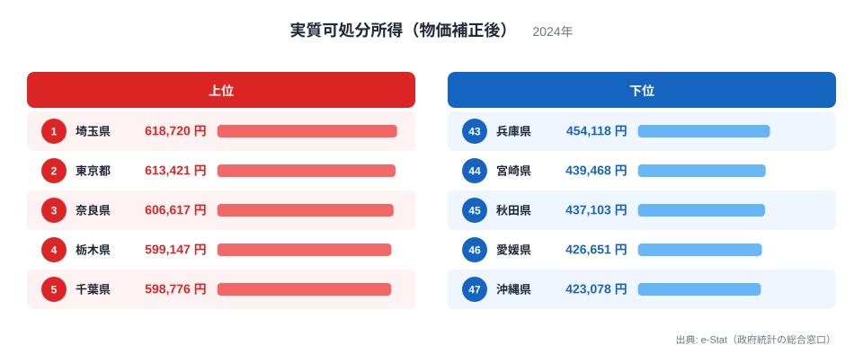
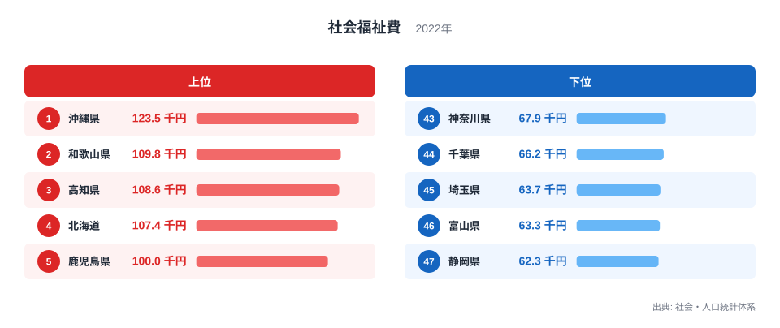
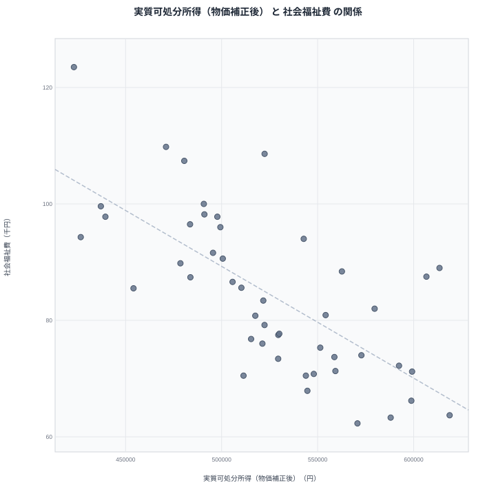

家計に残るお金の余裕と、行政が福祉に使う予算は、どちらも住民の暮らしに直結する数字です。この2つには関係があるのでしょうか。この記事では2024年の実質可処分所得と2022年の社会福祉費を都道府県別に並べ、その重なりを確かめていきます。

先に結論を示すと、両者には明確な逆の傾向が見られます。実質可処分所得が最も低い沖縄県は、社会福祉費では最も高い順位です。この記事では、この逆の傾向が何を意味しているのか、単純な因果関係で片づけずに丁寧に見ていきます。

## 実質可処分所得の上位と下位

<source-link href="/ranking/real-disposable-income">実質可処分所得（物価補正後）ランキングをもっと見る</source-link>

実質可処分所得の1位は埼玉県で618,720円です。2位は東京都で613,421円、3位は奈良県で606,617円と続きます。埼玉県や東京都、神奈川県のような首都圏の県は賃金水準が高く、東京都心への通勤圏として物価補正後も高い所得を維持しています。

最下位は沖縄県で423,078円です。46位は愛媛県で426,651円、45位は秋田県で437,103円と続きます。1位の埼玉県と47位の沖縄県のあいだには、195,642円もの開きがあります。沖縄県は観光業を中心とした産業構造で、賃金水準が全国的に見て低い地域です。

## 社会福祉費の上位と下位

社会福祉費の1位は沖縄県で123.5千円です。2位は和歌山県で109.8千円、3位は高知県で108.6千円と続きます。沖縄県は人口一人あたりの社会福祉費が全国で最も高く、和歌山県や高知県といった県も上位に位置しています。

最下位は静岡県で62.3千円です。46位は富山県で63.3千円、45位は埼玉県で63.7千円と続きます。1位の沖縄県と47位の静岡県のあいだには、61.2千円という2倍近い開きがあります。

## 見かけの相関と真因

散布図を見ると、実質可処分所得が低い県ほど社会福祉費が高いという右下がりの傾向がはっきりと見えます。沖縄県は実質可処分所得で最下位、社会福祉費で1位という両極端の位置にあります。和歌山県も実質可処分所得で42位、社会福祉費で2位と、下位側と上位側で対応しています。

> [!WARNING]
> 実質可処分所得と社会福祉費の逆の傾向は相関であって、社会福祉費が高いから所得が低くなる、あるいは所得が低いから福祉費が高くなる、という単純な因果の向きだけで説明できるものではありません。制度の仕組みまで含めて理解する必要があります。

この逆の傾向を生んでいるのは、日本の社会福祉制度がそもそも所得の低い地域や生活支援の必要性が高い地域により多くの予算を配分する仕組みになっているという構造です。生活保護費や高齢者福祉、障害者福祉といった社会福祉費の多くは、住民の所得水準や高齢化の度合いに応じて必要額が変わります。所得水準が低い地域ほど生活支援を必要とする住民の割合が高くなりやすく、結果として社会福祉費も大きくなる傾向があります。つまり、社会福祉費の高さは所得の低さを引き起こしているのではなく、所得の低さや生活の厳しさに応じて福祉制度が機能した結果だと理解するのが自然です。

## 首都圏の高所得県が示す別の側面

実質可処分所得の上位県である埼玉県や東京都、栃木県は、社会福祉費ではいずれも下位に位置しています。埼玉県は社会福祉費で45位、東京都は17位です。所得水準が高く自主財源も豊富な地域では、福祉サービスの必要度そのものが相対的に低いか、あるいは福祉以外の分野への予算配分が優先されている可能性があります。

> [!TIP]
> 所得と福祉費のような組み合わせを読むときは、行政の予算がどのような制度に基づいて配分されているかを知っておくと、単なる数字の大小以上の理解につながります。

## 47都道府県を俯瞰して見えること

実質可処分所得と社会福祉費を47都道府県で並べてみると、両者の逆の傾向は、日本の社会保障制度が持つ「必要に応じて配分する」という基本的な設計思想を映し出しているように見えます。所得水準の高い地域では住民が自分の稼ぎで生活を賄える割合が高く、行政による直接的な福祉支援への依存度は相対的に低くなります。一方、所得水準が低い地域や高齢化が進んだ地域では、生活保護や高齢者福祉といった制度を必要とする住民の割合が高まり、社会福祉費もそれに応じて膨らみます。

このように考えると、実質可処分所得と社会福祉費は、住民の生活実態という同じ土台の異なる側面を映していると言えます。所得が家計というミクロな視点からの豊かさの指標であるのに対し、社会福祉費は行政というマクロな視点からその地域の生活課題の大きさを示す指標です。両者が逆向きに動くのは、福祉制度が本来果たすべき役割を果たしている結果とも読めます。

## 沖縄県の特殊な事情

沖縄県が実質可処分所得で最下位でありながら社会福祉費で1位という両極端の位置にあるのは、単に所得が低いというだけでなく、他の都道府県とは異なる人口構成や産業構造も関係していると考えられます。出生率が全国で高い水準にある沖縄県では、子育て世帯への支援を含む福祉需要が構造的に大きくなりやすい面があります。所得の低さと福祉費の高さは、いずれも沖縄県特有の社会経済的な背景から生じている可能性があり、単純な因果の連鎖として捉えるべきではありません。観光業への依存度が高い産業構造も、賃金水準が伸びにくい一因として指摘されています。

## データ出典

実質可処分所得はe-Stat（政府統計の総合窓口）の2024年データ、社会福祉費は社会・人口統計体系の2022年データを使用しています。

> [!NOTE]
> 実質可処分所得は、名目の可処分所得から物価変動の影響を取り除いた値です。名目の所得ランキングとは順位が異なる場合があるため、物価補正の有無を意識して読む必要があります。

[社会福祉費ランキング](/ranking/per-capita-social-welfare-expenditure-pref-municipal)や[同じカテゴリの統計一覧](/category/economy)もあわせてご覧ください。実質可処分所得1位の[埼玉県のデータ](/areas/11000)、2位の[東京都のデータ](/areas/13000)では、それぞれの県の他の指標も確認できます。
