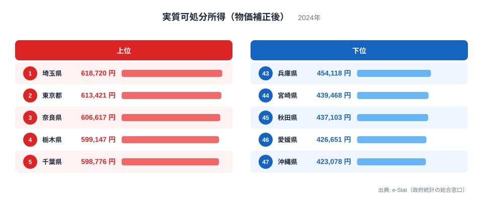
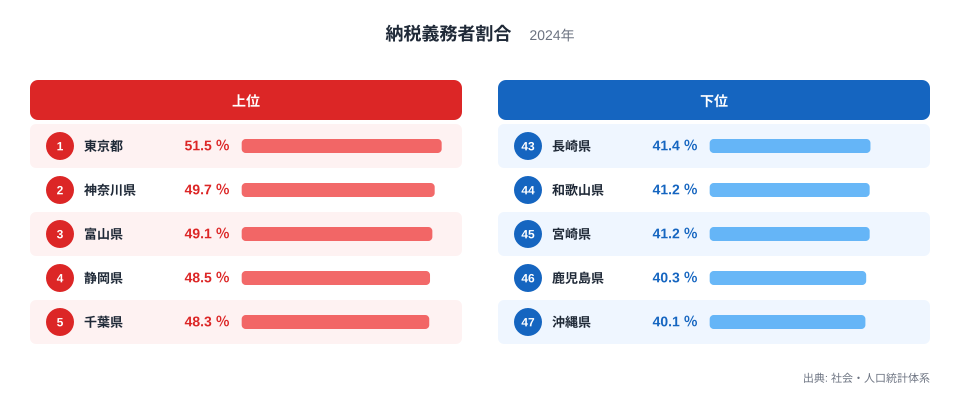
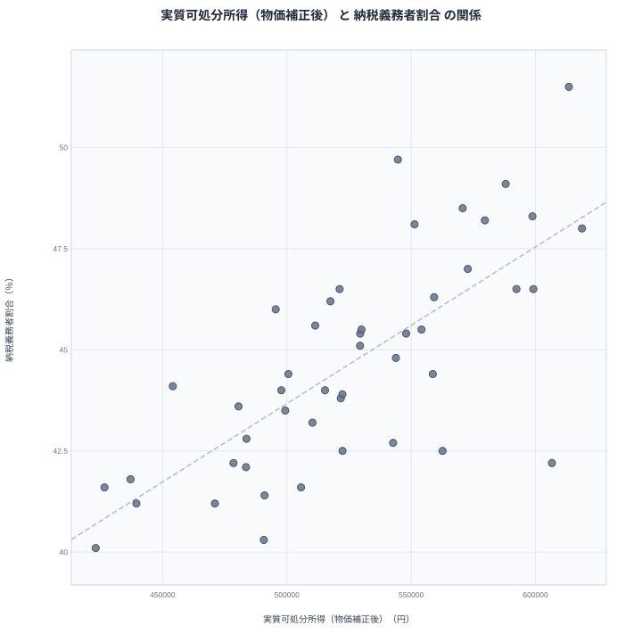

## 手取りが多い県は納税者も多いという仮説

物価を差し引いた実質可処分所得のランキングを見ると、1位は埼玉県、2位は東京都、3位は奈良県となっています。一方で人口に占める納税義務者の割合を見ると、1位は東京都、2位は神奈川県、3位は富山県です。上位の顔ぶれは完全には一致しませんが、首都圏の県が両方の上位に並んでいる点は共通しています。

実質可処分所得が高い県ほど、働いて所得を得ている人の割合も高く、結果として納税義務者の割合も高くなるのではないでしょうか。この記事では、この素朴な仮説を実際のデータで検証します。結論を先に述べると、両者にはゆるやかな相関が見られますが、その背景にあるのは単純な「豊かさ」ではなく、就業構造や世帯構成の違いという、もう一段深い要因です。

## 実質可処分所得のランキングを見る

<source-link href="/ranking/real-disposable-income">実質可処分所得（物価補正後）ランキングをもっと見る</source-link>

実質可処分所得の1位は埼玉県で61万8,720円、2位は東京都で61万3,421円、3位は奈良県で60万6,617円です。続く栃木県が59万9,147円、千葉県が59万8,776円と、上位5県はいずれも首都圏やその周辺に位置する県で占められています。

下位を見ると、最も低いのは沖縄県で42万3,078円、次いで愛媛県が42万6,651円、秋田県が43万7,103円、宮崎県が43万9,468円、兵庫県が45万4,118円と続きます。九州や四国、東北の一部の県が下位に集まっている点が特徴です。

実質可処分所得は、名目の可処分所得から物価水準を差し引いて算出される指標です。同じ手取り額でも、物価が高い地域では実質的な購買力は下がり、物価が低い地域では購買力は相対的に高くなります。埼玉県や東京都のような首都圏の県が上位に来ているのは、物価水準を考慮してもなお、所得水準そのものが高いことを示しています。

## 納税義務者割合のランキングを見る

納税義務者割合の1位は東京都で51.5パーセント、2位は神奈川県で49.7パーセント、3位は富山県で49.1パーセントです。続く静岡県が48.5パーセント、千葉県が48.3パーセントとなっており、こちらも首都圏や中部圏の県が上位を占めています。

下位を見ると、最も低いのは沖縄県で40.1パーセント、次いで鹿児島県が40.3パーセント、宮崎県と長崎県が41.2パーセントと41.4パーセントで続き、和歌山県が41.2パーセントとなっています。九州・沖縄地方の県が下位に集中している傾向がうかがえます。

納税義務者割合は、人口に対して住民税などの納税義務を負う人がどれだけいるかを示す指標です。この割合が高い地域は、就業している人の比率が高いか、あるいは所得水準が課税最低限を超えている人の割合が高いことを意味します。逆にこの割合が低い地域では、高齢化によって年金生活者の比率が高い、あるいは非課税水準の所得者が多いといった事情が考えられます。

## 散布図で相関を確かめる

散布図では、実質可処分所得が高い県ほど納税義務者割合も高くなる、ゆるやかな右肩上がりの傾向が見られます。東京都や神奈川県、千葉県、埼玉県といった首都圏の県は、どちらの指標でも上位に位置し、点は右上に集まっています。沖縄県や宮崎県、鹿児島県といった県は両方の指標で下位に位置し、点は左下に集まっています。

ただし、点のばらつきは決して小さくありません。奈良県は実質可処分所得では3位という高い順位にある一方で、納税義務者割合では37位にとどまっています。この2つの指標が完全に連動しているわけではないことが、この散布図からも読み取れます。

奈良県のようなずれが生じる理由は、就業と居住の分離にあります。奈良県は大阪府や京都府への通勤者が多く、いわゆるベッドタウンとしての性格を持つ県です。世帯としての所得水準は周辺の都市部に近い水準を保てる一方で、納税は勤務先ではなく居住地でおこなわれるとは限らず、また高齢の非就業世帯員を含む世帯構成の影響も受けるため、納税義務者割合という人口ベースの指標では低めに出やすくなります。

## なぜ完全には一致しないのか

実質可処分所得と納税義務者割合が完全には一致しない最大の理由は、前者が世帯ベースの指標であり、後者が人口ベースの指標であるという違いにあります。実質可処分所得は勤労者世帯などの家計を対象に算出される一方、納税義務者割合はその都道府県に住むすべての住民を分母として計算されます。

高齢化率が高い地域では、年金生活者を含む高齢者の比率が上がるため、人口全体に占める納税義務者の割合は下がりやすくなります。一方で、実質可処分所得の統計は主に勤労者世帯を対象とすることが多く、高齢化の影響を直接には受けにくい構造になっています。この対象の違いが、両指標のあいだにずれを生む一因です。

また、共働き世帯の比率も両指標のずれに関わってきます。共働きが一般的な地域では、世帯としての可処分所得は高くなりやすく、同時に就業者が多い分だけ納税義務者割合も高くなりやすいという相乗効果が働きます。逆に片働き世帯が多い地域や、非正規雇用の比率が高い地域では、世帯所得は一定水準を保てても、納税義務者としてカウントされる人の割合は伸びにくくなります。首都圏の県で両方の指標が高く出ているのは、こうした就業構造の厚みが背景にあると考えられます。

> [!NOTE]
> 実質可処分所得は物価水準で補正された金額であり、名目の可処分所得とは異なります。物価が高い地域では、名目額が同じでも実質額は低く算出される点に注意してください。

> [!WARNING]
> 納税義務者割合は、あくまで人口に対する納税義務者の比率であり、所得水準そのものを示すものではありません。高齢化率や世帯構成の違いによって、所得水準が高くてもこの割合が低く出る県があることを踏まえて読む必要があります。また、散布図で見られるゆるやかな相関は、実質可処分所得の高さが納税義務者割合を押し上げるという因果関係を示すものではありません。両指標が似た方向を向くのは、就業構造や世帯構成という共通の背景を反映した結果にすぎない点に注意してください。

> [!TIP]
> 2つの指標を見比べるときは、対象となる母集団(世帯か人口全体か)の違いを意識すると、ずれの理由が見えやすくなります。奈良県のように片方の順位だけが突出して低い県は、通勤圏や世帯構成といった構造的な事情を疑ってみるとよいでしょう。

## まとめ

実質可処分所得は埼玉県、東京都、奈良県の順に高く、納税義務者割合は東京都、神奈川県、富山県の順に高いという結果でした。首都圏の県が両方の上位に多く入る一方、下位では沖縄県や宮崎県、鹿児島県といった九州・沖縄地方の県が目立ちました。

散布図では両者にゆるやかな相関が見られたものの、奈良県のように所得は高いのに納税義務者割合は低いという例外もありました。これは実質可処分所得が世帯を対象とする指標であるのに対し、納税義務者割合が人口全体を対象とする指標であることに由来しており、高齢化率や就業構造、世帯構成の違いが両者のずれを生んでいると考えられます。所得の豊かさと納税者の多さは似た方向を向きやすいものの、必ずしも同じ理由で動く指標ではないことに注意が必要です。

## データ出典

実質可処分所得（物価補正後）はe-Stat（政府統計の総合窓口）の2024年データ、納税義務者割合は社会・人口統計体系の2024年データをもとにしています。

あわせて見る: [納税義務者割合ランキング](/ranking/taxpayer-ratio-per-pref-resident) / [同じカテゴリの統計一覧](/category/economy) / [埼玉県のデータ](/areas/11000) / [東京都のデータ](/areas/13000)
