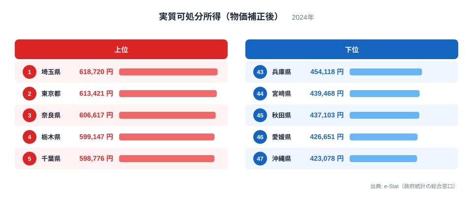
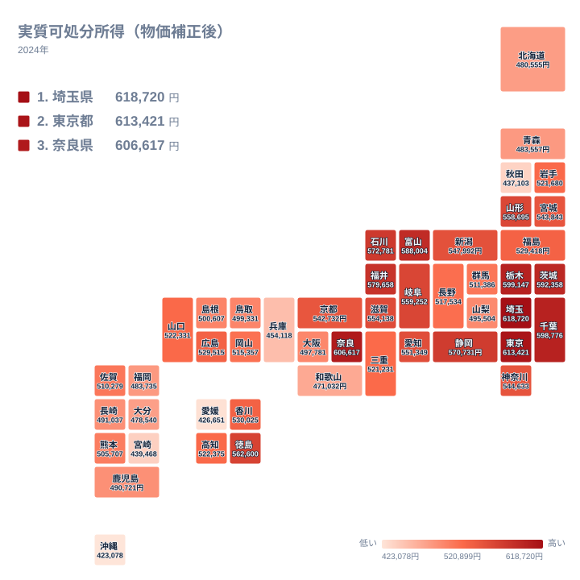
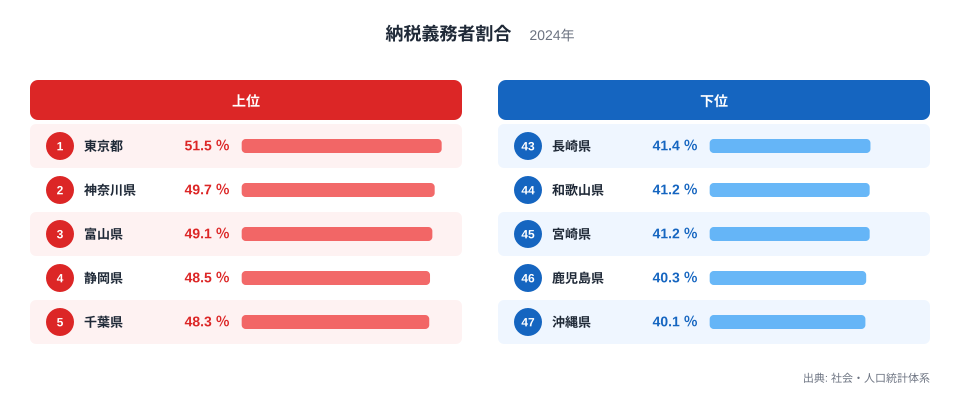
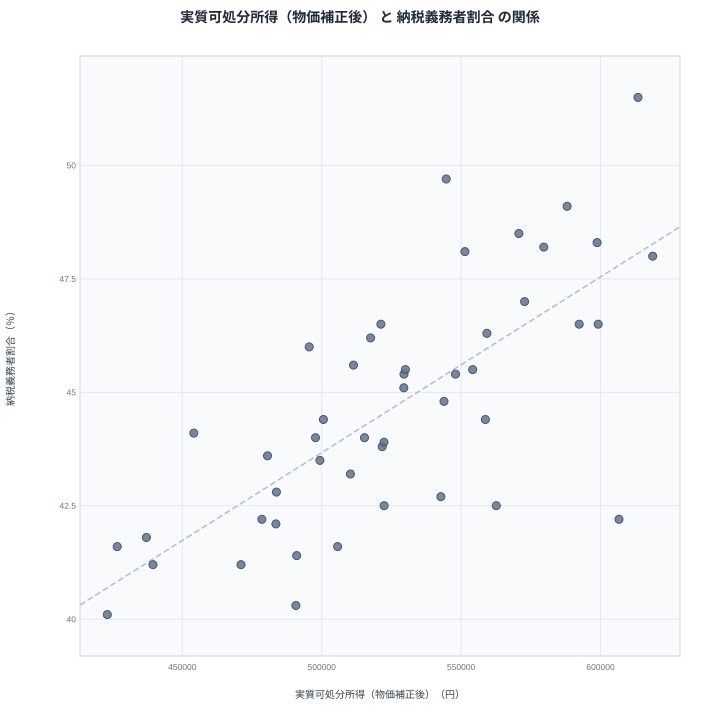

「手取りが多い県」と聞けば、誰もが東京を思い浮かべます。確かに名目の収入は東京が高い。しかし、東京は物価も家賃も高い。では物価の地域差を補正した「実質の手取り」で比べたら、どの県が1位になるのでしょうか。

答えは埼玉県です。物価補正後の実質可処分所得は月61万8,720円で、東京都の61万3,421円をわずかに上回ります。最下位は沖縄県の42万3,078円で、1位との差は約1.5倍に開きます。

そしてこのランキングには、意外な相方がいます。「人口に占める納税義務者の割合」です。両者の相関係数は0.72。世帯の手取りの正体が賃金水準だけではないことを、この相関が教えてくれます。

## 実質可処分所得ランキング──ベッドタウンの県が強いのです

実質可処分所得（物価補正後）の1位は埼玉県で月61万8,720円です。2位は東京都で61万3,421円、3位は奈良県で60万6,617円、4位は栃木県で59万9,147円、5位は千葉県で59万8,776円と続きます。6位の茨城県も59万2,358円で、上位は関東圏、それも東京そのものよりベッドタウンの県が目立ちます。

理由はシンプルです。埼玉や千葉の世帯は東京圏の賃金水準で稼ぎながら、住んでいる地域の物価は東京より低いのです。名目の収入で東京に僅差まで迫ったうえで、物価補正がとどめを刺す構図です。大阪圏でも同じことが起き、奈良県が3位に入ります。

下位を見ると、47位は沖縄県で42万3,078円、46位は愛媛県で42万6,651円、45位は秋田県で43万7,103円、44位は宮崎県で43万9,468円です。意外なのは43位の兵庫県で45万4,118円。大都市圏に属しながら、実質の手取りでは下位グループに沈んでいます。

> [!NOTE]
> 実質可処分所得は、家計調査の可処分所得（二人以上の世帯のうち勤労者世帯・1か月あたり）を消費者物価地域差指数で割って100を掛けた値です（2024年）。家計調査の地域区分は県庁所在市（および政令指定都市）で、都道府県全域の平均ではありません。また勤労者世帯が対象なので、年金世帯や自営業世帯は含まれていません。

<source-link href="/ranking/real-disposable-income">実質可処分所得ランキングをもっと見る</source-link>

## 地図で見ると関東と北陸に富が寄ります

地図に落とすと、濃い色は関東平野にまとまって現れます。埼玉・東京・千葉・茨城・栃木が塊となり、そこから離れた飛び地として北陸が浮かびます。富山県は7位で58万8,004円、福井県は8位で57万9,658円と、地方圏では突出した水準です。

一方、九州・四国・東北の日本海側は全体に淡く、西南日本の外縁部ほど実質の手取りが薄いことが見て取れます。

関東の強さは賃金水準で説明がつきます。では、賃金水準がそれほど高くないはずの富山や福井は、なぜ首都圏の県と並べるのでしょうか。その答えのヒントが、次のランキングにあります。あわせて見る: [埼玉県の県データ](/areas/11000) / [富山県の県データ](/areas/16000)

## 納税義務者割合──「所得のある人」の比率です

納税義務者割合は、個人住民税の所得割を納める人の数を、子どもを含む総人口で割った指標です。ざっくり言えば「県民のうち、課税されるだけの所得を得ている人がどれだけいるか」を表します。

1位は東京都で51.5%です。2位は神奈川県で49.7%、そして3位に富山県が49.1%で食い込みます。4位は静岡県で48.5%、5位は千葉県で48.3%、6位は福井県で48.2%、7位は愛知県で48.1%。首都圏・東海の大都市圏に混じって、富山と福井という北陸の2県が上位に並ぶのがこのランキングの特徴です。

下位は47位が沖縄県で40.1%、46位は鹿児島県で40.3%、45位は宮崎県で41.2%、44位は和歌山県で41.2%、43位は長崎県で41.4%です。1位の東京都との差は約1.3倍。実質可処分所得の下位県と、かなりの程度重なります。

なお、分母が総人口なので、子どもが多い県や高齢化率が高い県は構造的に低く出ます。「働かない人が多い」という意味ではない点には注意が必要です。

<source-link href="/ranking/taxpayer-ratio-per-pref-resident">納税義務者割合ランキングをもっと見る</source-link>

## 散布図で見る相関係数0.72

2つの指標を散布図にすると、右上がりの傾向が確認できます。相関係数は0.72。右上には東京都・千葉県・富山県が、左下には沖縄県・宮崎県・鹿児島県が位置し、「所得のある人の比率が高い県ほど、世帯の実質手取りも多い」という関係が読み取れます。

この散布図で最も目を引くのは、帯から大きく外れた奈良県です。実質可処分所得では3位の60万6,617円と最上位クラスなのに、納税義務者割合では37位の42.2%と下位に沈みます。稼ぐ世帯は多くないのに、稼いでいる世帯の手取りは大きい──後で見るように、これは世帯の中身の違いを示す重要なヒントです。

> [!WARNING]
> 相関は因果関係を意味しません。また実質可処分所得は家計調査ベースの標本調査で、県庁所在市の勤労者世帯だけを対象とします。一方の納税義務者割合は県内の全人口が分母です。対象範囲の異なる2つの統計の関係として読んでください。

## 真因を考える──手取りを決めるのは「稼ぎ手の数」です

人口規模の影響を取り除いた偏相関係数でも0.70と、相関はほぼ変わりません。都市か地方かという軸だけでは、この結びつきは説明できないのです。

鍵は、世帯の手取りが「1人あたりの賃金 × 稼ぎ手の数」で決まるという当たり前の式にあります。納税義務者割合が高い県は、人口に占める「所得を得ている人」の比率が高い県です。そこには2つの経路があります。

ひとつは首都圏型で、賃金水準そのものが高く、現役世代の人口比率も高い経路です。東京・神奈川・千葉はここに入ります。もうひとつが北陸型です。富山や福井は1人あたりの賃金では首都圏に及びませんが、共働きが定着しており、世帯の中の稼ぎ手が多くなっています。納税義務者割合3位という富山の位置は、「世帯総がかりで稼ぐ」構造の反映です。その結果、実質可処分所得でも富山は7位と、地方圏で群を抜きます。

散布図で外れていた奈良県は、この逆のパターンとして読めます。大阪圏に通勤する単独の稼ぎ手が高い所得を持ち帰る一方、共働きの比率は高くありません。世帯の手取りは大きいのに、納税者の人口比は低いという組み合わせは、片働き・高所得型の世帯構造と整合的です。

つまり実質手取りの地図は、賃金の地図であると同時に、働き方の地図でもあります。「どこに住めば手取りが増えるか」という問いの答えは、その土地の賃金水準だけでなく、世帯で何人働くかという生活の形に半分近く握られているのです。

> [!TIP]
> 手取りの実力をさらに掘るなら、家賃を差し引いた後の可処分所得や、食費の重み（エンゲル係数）と合わせて見るのがおすすめです。物価・所得まわりの都道府県データは[実質所得のテーマページ](/themes/real-income)にまとまっています。

## データ出典

- 実質可処分所得（物価補正後）: 総務省統計局「家計調査」の可処分所得（二人以上の世帯のうち勤労者世帯・県庁所在市）を消費者物価地域差指数で補正した値（2024年）
- 納税義務者割合: 総務省統計局「社会・人口統計体系」（2024年度値）
- 相関係数・偏相関係数は上記2指標の47都道府県値から算出
