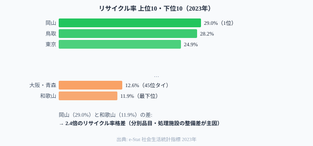
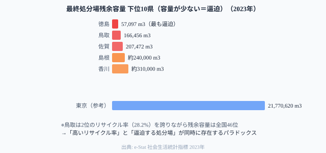

鳥取県のリサイクル率は全国2位（28.2%）──だが最終処分場の残余容量は全国46位（166,456m3）だ。高いリサイクル率と逼迫する処分場が同時に存在するのはなぜか。

日本のごみ行政はリサイクル率・1人1日排出量・最終処分場残余容量の3指標が複雑に絡み合っている。この記事では環境省「一般廃棄物処理実態調査」をもとに47都道府県の廃棄物構造を読み解き、**「リサイクルしながらも処分場が逼迫する」パラドックス**の正体を探る。

> [!NOTE]
> リサイクル率・1人1日当たり排出量・最終処分場残余容量はいずれも2023年データ。e-Stat社会・人口統計体系の「社会生活統計指標」に基づく。最終処分場の「埋立余命」は残余容量÷年間埋立量の単純計算であり、実際の限界はより早期に到来する可能性がある。

## リサイクル率ランキング──岡山29% vs 和歌山12%

リサイクル率1位は**[岡山県](/areas/33000)の29.0%**。2位は鳥取県（28.2%）で、3位に都市圏から意外な**東京都（24.9%）**が入る。

最下位は**[和歌山県](/areas/30000)の11.9%**、45位（タイ）に大阪府・青森県（12.6%）が並ぶ。1位岡山と最下位和歌山の差は**2.4倍**だ。

この差の主な要因は分別収集体制にある。岡山県は資源ごみの分別品目が多く回収ルートが整備されている。大阪府はリサイクル率が低い一方で焼却処理に依存する傾向がある。

東京が3位に入るのは、大量の廃棄物を扱う中間処理施設・再生利用ルートが集積しているためで、「都市部だから少ない」のではなく「都市部だからリサイクル体制が充実している」という逆説だ。

<source-link href="/ranking/waste-recycling-rate">47都道府県のごみリサイクル率ランキングをもっと見る</source-link>

## 1人1日当たりごみ排出量──排出量と処分場逼迫に相関はない

1人1日当たりのごみ排出量で最も多いのは**富山県（989g）**。青森県（967g）、福島県（968g）が続く。最も少ないのは**京都府（749g）**で、滋賀県（761g）、神奈川県（769g）と続く。

ここで重要なのは、**排出量が少ないことと最終処分場の余裕が直結しないこと**だ。排出量が少なくても処理体制によっては処分場が逼迫する。

<source-link href="/ranking/waste-generation-per-person-per-day">47都道府県の1人1日当たりごみ排出量ランキングをもっと見る</source-link>

<ad-slot></ad-slot>

## 最終処分場の残余容量──鳥取・徳島が「埋立余命」最短

最終処分場の残余容量が最も少ないのは**徳島県（57,097m3）**。単純計算では年間埋立量3,750m3に対し約15年分だが、残余容量が減るにつれ使える範囲が狭まるため、より早期に限界を迎える可能性がある。

**鳥取県（166,456m3）のパラドックスが重要だ**。リサイクル率2位（28.2%）でありながら、最終処分場の残余容量は全国46位という逼迫状態にある。高リサイクルでも処分場は減り続ける──これはリサイクルできない廃材・焼却灰の埋立が不可避であることを意味している。

一方、東京都（21,770,620m3）は海面埋立処分場を持つため容量が大きいが、それでも無限ではない。

> [!WARNING]
> 最終処分場の新規確保は「迷惑施設」としての住民反対・適地の不足・コストの問題が重なり、全国的に困難な状況が続いている。容量が逼迫する県では広域連携（複数県での共同処分）や中間処理の高度化が急務となっている。

## リサイクル率 × 排出量の4象限

横軸に1人1日当たり排出量、縦軸にリサイクル率をとった散布図からは、理想的な「排出量が少なく・リサイクル率が高い」象限は限られることがわかる。

**「出すがリサイクルする」型（岡山・鳥取・東京）**: 排出量は平均的〜多めだが、リサイクル率が高い。分別体制・処理施設の充実が主因。

**「出すがリサイクルしない」型（青森）**: 排出量967gとリサイクル率12.6%の組み合わせは最も改善余地が大きい象限。排出抑制とリサイクル体制の両面強化が求められる。

**「出さないが平均的リサイクル」型（京都・滋賀・神奈川）**: 排出量は少ないが、リサイクル率が突出して高いわけではない。「ごみを出さない文化」と「分別回収体制」は別の政策変数だ。

> [!TIP]
> 排出量を減らす施策（3R推進・食品ロス削減）とリサイクル率を上げる施策（分別品目増・処理施設整備）は政策的に独立している。両方を同時に評価することで、自治体の廃棄物行政の真の力量が見えてくる。

<ad-slot></ad-slot>

## 処分量・再生利用量の内訳──大阪の「焼却依存」

最終処分量と中間処理後再生利用量の内訳を見ると、**大阪府は最終処分量が319,002tと突出して多い**一方、再生利用量は相対的に少ない。焼却後の灰を埋立処分に回す割合が高いことが推測される。

東京都は最終処分量を抑えつつ再生利用量378,452tを確保しており、リサイクル率24.9%という数字の裏付けが見える。愛知県は再生利用量333,280tと東京・神奈川に次ぐ水準で、製造業盛んな地域では産業系リサイクルが全体を押し上げている。

## まとめ

3指標を統合すると浮かぶ構造:

1. **リサイクル率は分別政策の差**: 隣接する岡山（29%）と大阪（12%）の格差は、地域の生活環境や所得の差ではなく、行政の分別収集体制の差がほぼ全て説明する
2. **リサイクルと処分場余命は独立変数**: 鳥取はリサイクル率2位だが処分場は全国46位の逼迫。「リサイクル率が高い＝廃棄物問題が解決」は誤解だ
3. **排出量の少ない地域が必ずしも環境負荷が低いわけではない**: 統計方法・事業系ごみの計上差が数字に影響する

廃棄物行政の改善は「リサイクル率を上げる」と「排出量を減らす」と「処分場を確保する」の3つを別々の政策変数として扱う必要がある。

## データ出典

- [e-Stat 社会生活統計指標](https://www.e-stat.go.jp/dbview?sid=0000010108) — リサイクル率・排出量・最終処分場残余容量（2023年）

<source-link href="/ranking/waste-recycling-rate">ごみリサイクル率ランキング</source-link>
<source-link href="/ranking/waste-generation-per-person-per-day">1人1日当たりごみ排出量ランキング</source-link>
<source-link href="/ranking/final-disposal-site-remaining-capacity">最終処分場残余容量ランキング</source-link>

本記事の対象データ: [関連カテゴリ](/category/energy)
