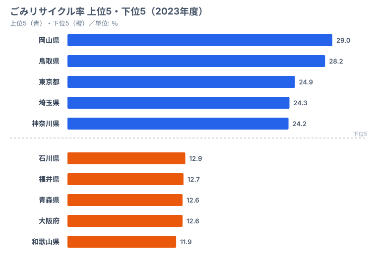
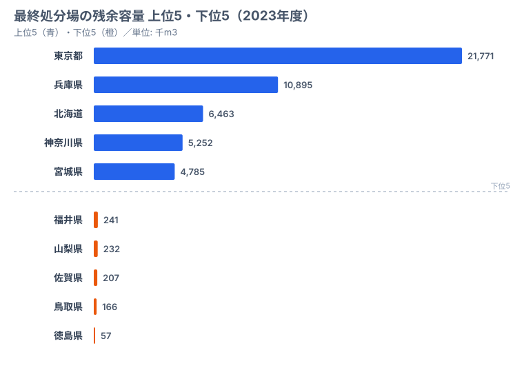

鳥取県のリサイクル率は全国2位（28.2%）です。ところが、最終処分場の残余容量は166千m3で下位グループに沈み、埋立余地はむしろ逼迫しています。「リサイクルを頑張れば処分場は安泰」という直感は、ここで裏切られます。

日本のごみ行政は、リサイクル率と最終処分場の残余容量という2つの指標が別々の論理で動いています。この記事では環境省「一般廃棄物処理実態調査」をもとに、リサイクル率の上位・下位と処分場の余命を重ねて、**「リサイクルしながらも処分場が逼迫する」という逆説**の正体を探ります。リサイクル率の高さと処分場の余裕は、見かけほど連動していないのです。

> [!NOTE]
> リサイクル率・最終処分場残余容量はいずれも2023年度データで、e-Stat 社会・人口統計体系の「社会生活統計指標」に基づきます。「リサイクル率」は資源化量を総排出量で割った値で、住民の意識ではなく自治体の分別収集体制を強く反映します。最終処分場の残余容量は単位が「千m3」であり、本文で併記する「166,456m3」のような表記は同じ量を生のm3で示したものです。

## リサイクル率は岡山と和歌山で2.4倍の開き

リサイクル率の1位は**[岡山県](/areas/33000)の29.0%**です。2位は鳥取県（28.2%）で、3位には都市圏から意外にも**東京都（24.9%）**が入ります。4位は埼玉県（24.3%）、5位は神奈川県（24.2%）と、首都圏の人口集中地域が上位に並びます。

下位は**[和歌山県](/areas/30000)の11.9%**が最も低く、45位（タイ）に大阪府・青森県（12.6%）、44位に福井県（12.7%）、43位に石川県（12.9%）が続きます。1位岡山と最下位和歌山の差は**2.4倍**にのぼります。

この差の主な要因は、住民の環境意識よりも自治体の分別収集体制にあります。岡山県は資源ごみの分別品目が多く、回収ルートが整っているため、資源化に回る量が増えます。逆に、リサイクル率が低い地域は焼却処理への依存度が高く、燃やしてしまえば資源化量としてはカウントされません。東京都が3位に入るのは「都市部だからごみが少ない」のではなく、大量の廃棄物を扱う中間処理施設と再生利用ルートが集積しているからで、「都市部だからこそリサイクル体制が充実している」という逆説が読み取れます。和歌山・青森のような下位県は、人口規模が小さく分別回収のコストが相対的に重くなりやすい点も、低リサイクル率の背景にあります。

> [!WARNING]
> リサイクル率が高い県を「廃棄物問題が解決した県」と読み替えるのは早計です。リサイクル率は「資源化できた割合」であって、「埋め立てるごみがゼロになった」ことを意味しません。焼却灰やリサイクル不能な廃材は必ず残り、それらは最終処分場へ向かいます。次の章で見るように、リサイクル率の順位と処分場の余命の順位は一致しません。

<source-link href="/ranking/waste-recycling-rate">47都道府県のごみリサイクル率ランキングをもっと見る</source-link>

<ad-slot></ad-slot>

## 最終処分場の余命は東京と徳島で大きく開く

最終処分場の残余容量が最も大きいのは**東京都（21,771千m3）**です。海面埋立処分場を持つため、群を抜いた容量を確保しています。2位は兵庫県（10,895千m3）、3位は北海道（6,463千m3）、4位は神奈川県（5,252千m3）、5位は宮城県（4,785千m3）と続きます。

一方、残余容量が最も少ないのは**[徳島県](/areas/36000)の57千m3**で、46位に**[鳥取県](/areas/31000)の166千m3**、45位に佐賀県（207千m3）、44位に山梨県（232千m3）、43位に福井県（241千m3）が並びます。

ここで効いてくるのが冒頭の**鳥取のパラドックス**です。鳥取県はリサイクル率2位（28.2%）でありながら、最終処分場の残余容量は166千m3で全国46位という逼迫状態にあります。高いリサイクル率は資源化に回る量を増やしますが、それでも焼却灰やリサイクル不能な廃材の埋立は不可避で、処分場は着実に減っていきます。つまり、リサイクルを頑張っても「埋めるごみがゼロ」にはならないため、残余容量の絶対量が小さい県では余命が短くなるのです。東京都が容量で突出するのは海面埋立という地理的条件によるもので、リサイクル率の高さがそのまま容量の大きさにつながっているわけではありません。容量上位は「埋め立てられる空間を物理的に確保できた県」、下位は「適地が乏しく確保が難しい県」と読むのが実態に近いといえます。

> [!TIP]
> リサイクル率の順位と処分場残余容量の順位は別物として読むのがコツです。鳥取はリサイクル率2位かつ残余容量46位、東京はリサイクル率3位かつ残余容量1位というように、両指標で位置が大きくずれます。「分別を頑張る政策」と「処分場を確保する政策」は独立した変数であり、片方の達成がもう片方を保証しません。

<source-link href="/ranking/final-disposal-site-remaining-capacity">47都道府県の最終処分場残余容量ランキングをもっと見る</source-link>

## リサイクル率×処分場余命の4象限で県を読む

リサイクル率と最終処分場の残余容量を2軸で重ねると、県は大きく4つのタイプに分かれます。両指標がともに良好な「理想的」な象限に入る県は限られます。

**「リサイクルもでき、容量にも余裕がある」型（東京・神奈川）**: 東京はリサイクル率3位かつ残余容量1位、神奈川はリサイクル率5位かつ残余容量4位で、両指標が揃っています。中間処理施設の集積と海面埋立などの地理的条件が背景にあります。

**「リサイクルは進むが容量が逼迫」型（鳥取）**: リサイクル率2位ながら残余容量46位。分別政策は優れていても、処分場の絶対量が小さいため余命が短い象限です。広域連携や中間処理の高度化で、埋立量そのものを減らす取り組みが急務になります。

**「リサイクルも容量も厳しい」型（和歌山・福井・大阪）**: 和歌山はリサイクル率最下位、福井はリサイクル率44位かつ残余容量43位で、分別体制の強化と処分場確保の両方が課題として残ります。

> [!WARNING]
> 最終処分場の新規確保は「迷惑施設」としての住民反対・適地の不足・建設コストが重なり、全国的に困難な状況が続いています。残余容量が下位の県では、複数自治体による広域処分や焼却灰の資源化といった、埋立量を減らす施策の優先度が高くなります。容量が大きい東京都であっても無限ではなく、海面埋立に依存する構造には長期的な限界が指摘されています。

## まとめ──分別と処分場確保は別々に評価する

2つの指標を重ねると、次の構造が浮かびます。

1. **リサイクル率は分別政策の差で説明できます**: 岡山（29.0%）と和歌山（11.9%）の2.4倍の開きは、地域の所得や環境意識ではなく、自治体の分別収集体制の差がほぼ説明します。
2. **リサイクル率と処分場の余命は独立した変数です**: 鳥取はリサイクル率2位ながら残余容量46位で、「リサイクル率が高い＝廃棄物問題が解決」という読みは成り立ちません。
3. **容量上位は地理的条件に支えられています**: 東京の残余容量1位は海面埋立という条件によるもので、リサイクルの努力だけで再現できるものではありません。

廃棄物行政の改善は、「リサイクル率を上げる」施策と「処分場を確保・延命する」施策を、別々の政策変数として同時に評価する必要があります。片方の数字だけを見て安心するのは危険だといえるでしょう。

## データ出典

- [e-Stat 社会生活統計指標](https://www.e-stat.go.jp/dbview?sid=0000010108) — ごみリサイクル率・最終処分場残余容量（2023年度）
