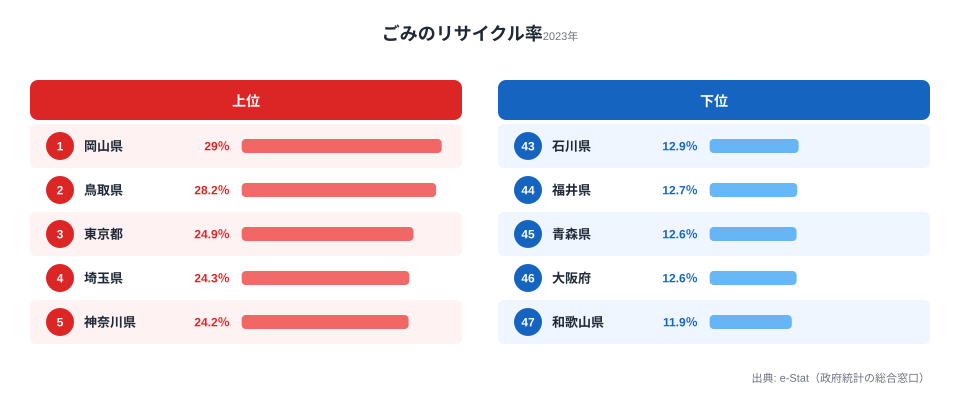
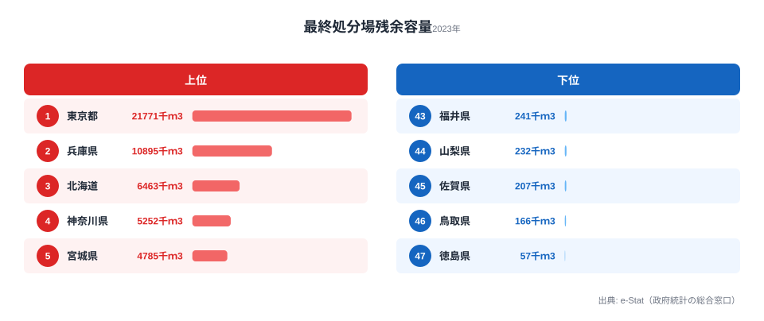
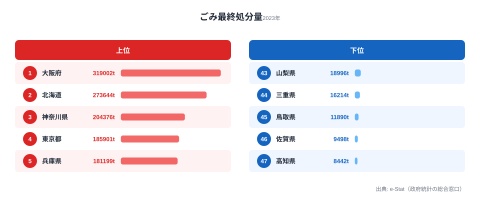

鳥取県のリサイクル率は全国2位（28.2%）です──ところが最終処分場の残余容量は全国46位（166千m3）。高いリサイクル率と逼迫する処分場が、なぜ同じ県で同時に起きるのでしょうか。

リサイクル率が高ければ廃棄物問題は片付く、と考えてしまいがちです。しかし実際の日本のごみ行政は、リサイクル率・最終処分量・最終処分場残余容量という複数の指標が絡み合っていて、ひとつの指標だけでは「その県が困っているかどうか」は判断できません。この記事では環境省「一般廃棄物処理実態調査」をもとに47都道府県の廃棄物構造を重ねて読み、**「リサイクルしているのに処分場が逼迫する」という逆説**の正体を探っていきます。

> [!NOTE]
> リサイクル率（％）・最終処分量（t）・最終処分場残余容量（千m3）はいずれも2023年度のデータで、e-Stat 社会・人口統計体系の「社会生活統計指標」に基づきます。リサイクル率は「資源化された量 ÷ ごみ総処理量」で計算されるため、分母であるごみ総量が小さい県でも分子の資源化が進めば高く出ます。一方で残余容量は「いま残っている埋立スペース」の絶対量なので、両者は別々の事情を映す指標です。

## リサイクル率ランキング──岡山29% vs 和歌山12%、その差は分別政策

リサイクル率1位は**[岡山県](/areas/33000)の29.0%**です。2位は鳥取県（28.2%）で、3位には都市圏から意外にも**東京都（24.9%）**が入ります。一方で最下位は**[和歌山県](/areas/30000)の11.9%**、45位・46位には青森県・大阪府（ともに12.6%）が並びます。1位岡山と最下位和歌山の差は**2.4倍**です。

この差を生む主な要因は、地域の所得や生活環境ではなく、自治体の分別収集体制にあります。岡山県は資源ごみの分別品目が多く回収ルートが整備されているのに対し、リサイクル率が低い県では焼却処理に依存する割合が高くなる傾向があります。同じ瀬戸内圏で隣り合う岡山と、近畿の大阪・和歌山がこれだけ離れるのは、気候や産業構造ではなく「どこまで細かく分けて集めるか」という政策設計の差が効いているためです。

東京が3位に入るのも同じ構図です。大量の廃棄物を扱う中間処理施設・再生利用ルートが集積しているため、「都市部だから処理が雑になる」のではなく「都市部だからリサイクル体制が充実する」という逆方向の効果が出ています。リサイクル率は人口規模ではなく、処理インフラの厚みで決まると読めます。

<source-link href="/ranking/waste-recycling-rate">47都道府県のごみリサイクル率ランキングをもっと見る</source-link>

> [!TIP]
> リサイクル率を「住民の意識の高さ」と読むのは危険です。岡山や東京の高さは、分別品目を増やし回収・中間処理の施設を整えた行政投資の結果という側面が大きく、住民1人ひとりの努力量とは必ずしも一致しません。県を比べるときは「制度がどこまで整っているか」を見る指標として扱うのが実態に近い読み方です。

## 最終処分場の残余容量──鳥取・徳島が「埋立余命」最短

ここで指標を切り替えて、ごみを最終的に埋め立てる「最終処分場」に、あとどれだけ余裕が残っているかを見てみます。残余容量が最も少ないのは**[徳島県](/areas/36000)の57千m3**で、これが全国最下位（47位）です。次いで46位が鳥取県（166千m3）。逆に1位は東京都（21,771千m3）で、海面埋立処分場を抱えるため桁違いの容量を持ちます。最大の東京と最小の徳島では、残っている埋立スペースに実に約382倍もの開きがあります。

そして冒頭の逆説がここで像を結びます。**鳥取県はリサイクル率2位（28.2%）でありながら、最終処分場の残余容量は全国46位**です。これは、リサイクルをどれだけ進めても、焼却灰やリサイクルできない廃材の埋立がゼロにはならず、処分場は減り続けるからです。リサイクル率の高さは「埋立量を減らす効果」はあっても「残っている容量を増やす効果」はありません。残余容量はあくまで過去に確保した埋立スペースの残高であり、リサイクルとは別の時間軸で目減りしていくのです。

> [!WARNING]
> 残余容量を年間埋立量で割った「埋立余命」は単純計算の目安にすぎません。残量が減るにつれ実際に使える範囲は狭まるため、計算上の年数より早く限界が来る可能性があります。さらに最終処分場の新規確保は「迷惑施設」としての住民反対・適地の不足・建設コストが重なり、全国的に困難です。徳島・鳥取のように残余が少ない県では、複数県での共同処分（広域連携）や焼却灰の資源化といった中間処理の高度化が急務になります。

<source-link href="/ranking/final-disposal-site-remaining-capacity">47都道府県の最終処分場残余容量ランキングをもっと見る</source-link>

<ad-slot></ad-slot>

## リサイクル率と処分場逼迫は連動するのか

ここまでで「リサイクル率が高い県＝処分場に余裕がある県」ではないことが見えてきました。実際、リサイクル率1位の岡山県は残余容量では28位（842千m3）と中位にとどまり、リサイクル率2位の鳥取県は残余容量46位。逆に東京都はリサイクル率3位・残余容量1位で両方が高い、という具合に、2つの指標の順位は素直には連動しません。

これは「いま余裕があるか（残余容量）」と「これ以上ごみを増やさない努力ができているか（リサイクル率）」が、本来別々の政策変数だからです。残余容量は地形・既存施設・海面埋立の有無といった立地条件に強く左右され、リサイクル率は分別制度の設計で決まります。**両者を1枚の表で混同せず、別の軸として並べて初めて、その県が「逼迫しているのに埋立に頼らざるを得ない」のか「余裕があるのに分別が進んでいない」のかが切り分けられます。**

## 最終処分量の内訳──大阪の「焼却・埋立依存」

最後に、実際に埋め立てられているごみの量（最終処分量）を見ます。最も多いのは**[大阪府](/areas/27000)の319,002t**で全国1位です。北海道（273,644t）、神奈川県（204,376t）が続きます。大阪はリサイクル率では46位（12.6%）と低く、最終処分量では1位──つまり「資源化に回さず、焼却後の灰を埋立に回す」割合が高い構図が、2つの指標から裏付けられます。

一方で東京都の最終処分量は185,901t（4位）です。人口・ごみ総量が全国で最も多い水準でありながら埋立量を相対的に抑えており、これはリサイクル率24.9%（3位）と整合します。たくさん出していても、資源化と中間処理で埋立に回す量を絞り込めている、ということです。最終処分量の多寡は人口規模だけでなく、その手前のリサイクル・焼却処理の設計で大きく変わると読めます。

<source-link href="/ranking/garbage-final-disposal">47都道府県のごみ最終処分量ランキングをもっと見る</source-link>

<ad-slot></ad-slot>

## まとめ

3つの指標を重ねると、次の構造が浮かび上がります。

1. **リサイクル率は分別政策の差**: 隣接する岡山（29.0%）と大阪（12.6%）の2.4倍の開きは、生活環境や所得の差ではなく、行政の分別収集体制の差がほぼ説明します
2. **リサイクル率と処分場の余命は別物**: 鳥取はリサイクル率2位（28.2%）でも残余容量は46位（166千m3）。「リサイクル率が高い＝廃棄物問題が解決」は誤解です
3. **残余容量の地域差は立地条件で決まる**: 海面埋立を持つ東京（21,771千m3）と内陸の徳島（57千m3）の約382倍差は、努力量ではなく地形・既存施設の差です
4. **最終処分量はリサイクルの結果を映す**: 最終処分量1位の大阪（319,002t）はリサイクル率46位、埋立量を抑えた東京はリサイクル率3位──処分量はその手前の処理設計の鏡です

廃棄物行政を評価するときは、「リサイクル率を上げる」「最終処分量を減らす」「処分場を確保する」を別々の政策変数として扱う必要があります。ひとつの指標だけを見て安心することも、悲観することもできない──それが47都道府県のごみデータが示す結論です。

## データ出典

- [e-Stat 社会生活統計指標](https://www.e-stat.go.jp/dbview?sid=0000010108) — ごみのリサイクル率・最終処分量・最終処分場残余容量（いずれも2023年度）
