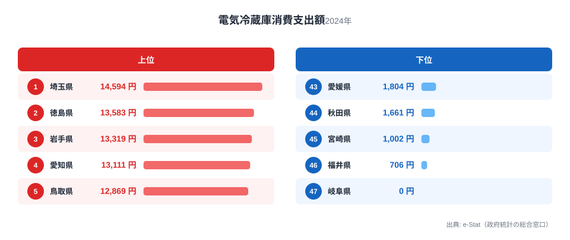
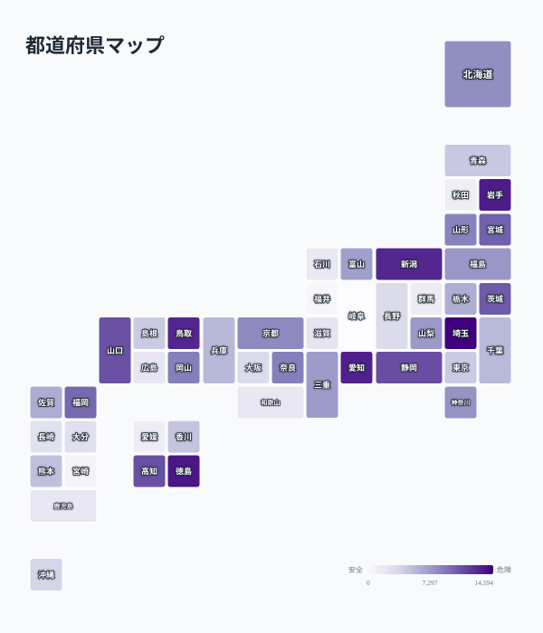

「うちの冷蔵庫、そろそろ買い替えかな」——そんな一言が、家計調査の統計にはっきり跡を残しています。2024年の電気冷蔵庫消費支出額を都道府県庁所在市で比べると、1位の埼玉県は14,594円、最下位の岐阜県はなんと0円でした。同じ年に冷蔵庫へお金を使った世帯がどれだけいたかで、支出額は大きく揺れ動きます。

この記事では、電気冷蔵庫という「毎日使うのに滅多に買わない」耐久消費財の支出額ランキングを見ながら、なぜ1年だけを切り取ると地域差が大きく出るのか、そして冷蔵庫の買い替えが世帯構成や住まい方とどう結びついているのかを掘り下げます。結論を先に言うと、この支出額の高低は「その県の暮らしぶりの豊かさ」ではなく「その年にどれだけの世帯が買い替えのタイミングを迎えたか」で決まる部分が大きいという点が、読み解く上でのポイントです。

> [!NOTE]
> このランキングは総務省「家計調査」の品目別支出額のうち、電気冷蔵庫（耐久消費財に分類）を都道府県庁所在市の二人以上世帯について集計したものです。冷蔵庫は数年から十数年に一度しか買い替えない商品のため、日用品や食料品のように「毎月一定額を使う」タイプの支出とは性質が異なります。

## 上位と下位

<source-link href="/ranking/refrigerator-consumption-expenditure">電気冷蔵庫消費支出額ランキングをもっと見る</source-link>

2024年の1位は[埼玉県](/areas/11000)で14,594円です。2位の徳島県13,583円、3位の岩手県13,319円と、上位3県はいずれも1万3千円台に集まっており、僅差の争いになっています。4位愛知県13,111円、5位鳥取県12,869円と続き、上位5県は関東・四国・東北・東海・山陰と地域的なまとまりはなく、全国に散らばっています。

この分布が示しているのは、冷蔵庫支出の高さが特定の地域の生活文化に根ざしたものではないということです。もし冷蔵庫が大きい家庭ほど高いといった単純な理由であれば、大家族が多い地域や持ち家率が高い地域にかたよるはずですが、上位県の顔ぶれにはそうした一貫した傾向が見当たりません。むしろ、その年にたまたま買い替え需要が集中した世帯がどれだけ含まれていたかという「偶然」の要素が強く出ていると考えるのが自然です。

家計調査は都道府県庁所在市の世帯を抽出して調査するサンプル調査であるため、対象世帯のうち数世帯が冷蔵庫を買い替えただけでも、平均支出額は大きく跳ね上がります。逆に、その年にたまたま買い替え世帯が少なければ、平均は大きく沈みます。上位県の支出額が僅差で並んでいるのは、たまたま調査年に買い替えのタイミングが重なった世帯が一定数存在したことを示しているにすぎません。

> [!WARNING]
> 電気冷蔵庫のような耐久消費財の支出額は、単年のデータだけで地域の豊かさや生活水準を語るには向きません。買い替え世帯がどれだけ調査対象に含まれていたかという偶然の要素が結果を大きく左右するため、地域差は年によって入れ替わりやすい点に注意してください。

## 最下位グループの実像

下位を見ると、46位福井県706円、47位[岐阜県](/areas/21000)は支出額0円という結果でした。0円というのは「その年、調査対象となった世帯の中に冷蔵庫を購入した世帯が一件もなかった」ことを意味します。冷蔵庫は平均使用年数が10年前後とされる耐久消費財なので、たまたまその年に買い替えのタイミングを迎える世帯がゼロだったとしても不思議ではありません。

下位県の顔ぶれも、上位と同様に地理的なまとまりを持ちません。近畿の滋賀県2,697円、中国地方の広島県2,449円、九州の鹿児島県2,443円、和歌山県2,361円などが3,000円未満に並んでいますが、同じ地方の他県が上位に来ているケースも多く、「地域全体の傾向」として語るのは難しいデータです。つまり下位グループの共通点は「地理」ではなく「その年に買い替え世帯が少なかった」という一過性の事情である可能性が高いといえます。

## 発見:全国地図で見る買い替えの波

<source-link href="/ranking/refrigerator-consumption-expenditure">電気冷蔵庫消費支出額の全47都道府県を見る</source-link>

47都道府県を地図で並べてみると、濃い色（支出額が高い県）と薄い色（支出額が低い県)が隣り合う県同士でも入れ替わっている様子がよくわかります。たとえば関東地方では、埼玉県が全国1位である一方、隣接する東京都は4,587円、千葉県は5,625円と大きく下回っています。同じ通勤圏・同じ気候条件の地域でも支出額が数倍違うという事実は、冷蔵庫の支出額が気候や地域文化ではなく、世帯ごとの買い替えタイミングに強く左右されることを裏付けています。

一方で、いくつかの県では持ち家率や世帯人数の違いが影響している可能性も考えられます。二人以上世帯を対象とする家計調査は、単身世帯が多い都市部では調査対象が絞られやすく、持ち家で長く同じ住まいに住み続ける世帯が多い地方では、逆に大型冷蔵庫への買い替え需要がまとまって出やすいと推測できます。東京都や大阪府（3,461円）のような大都市が軒並み下位グループに沈んでいるのは、単身世帯や賃貸世帯の比率が高く、大型の電気冷蔵庫への投資額そのものが小さくなりやすいことも一因と考えられます。[仮説] この点は世帯人数・持ち家率の統計と突き合わせた検証が必要です。

> [!TIP]
> 冷蔵庫のような耐久消費財の地域差を見るときは、単年ではなく複数年の推移を確認すると「その年だけの偶然」なのか「継続的な傾向」なのかを見分けやすくなります。ランキングページの年次セレクタで過去の年も合わせて確認してみてください。

## まとめ

- 2024年の電気冷蔵庫消費支出額は1位埼玉県14,594円、2位徳島県13,583円、3位岩手県13,319円
- 最下位は47位岐阜県で支出額0円、46位福井県706円と大きく開いている
- 支出額0円を除く最小値（福井県706円）と比べても1位埼玉県は約20.7倍の開きがある
- 上位・下位ともに地理的なまとまりが見られず、買い替え世帯の有無という一過性の要因が支出額を左右している可能性が高い
- 東京都・大阪府など大都市圏は下位グループに集中しており、単身世帯や賃貸世帯の比率の高さが影響していると考えられる

## データ出典

総務省「家計調査」の品目別支出額（電気冷蔵庫、耐久消費財）を、都道府県庁所在市の二人以上世帯を対象に集計した数値です。e-Stat（政府統計の総合窓口）経由で取得したデータをもとに構成しています。家計にまつわる他の指標は[経済カテゴリ](/category/economy)でも確認できます。
