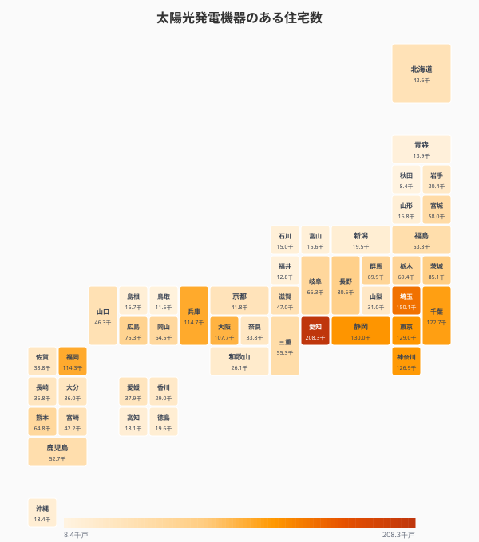
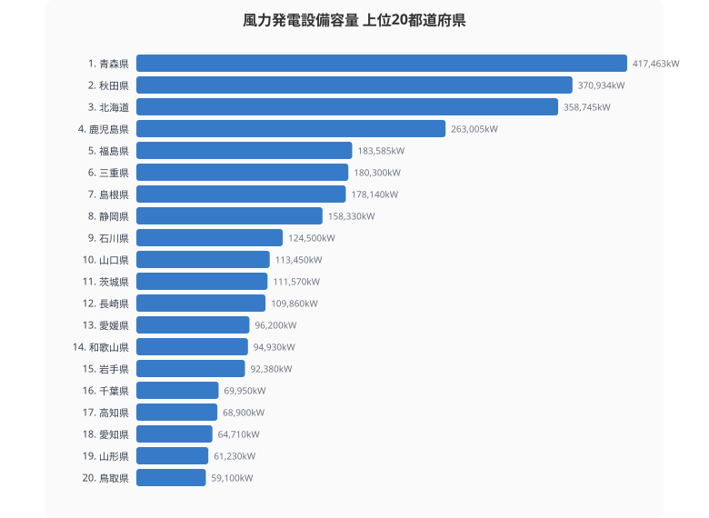
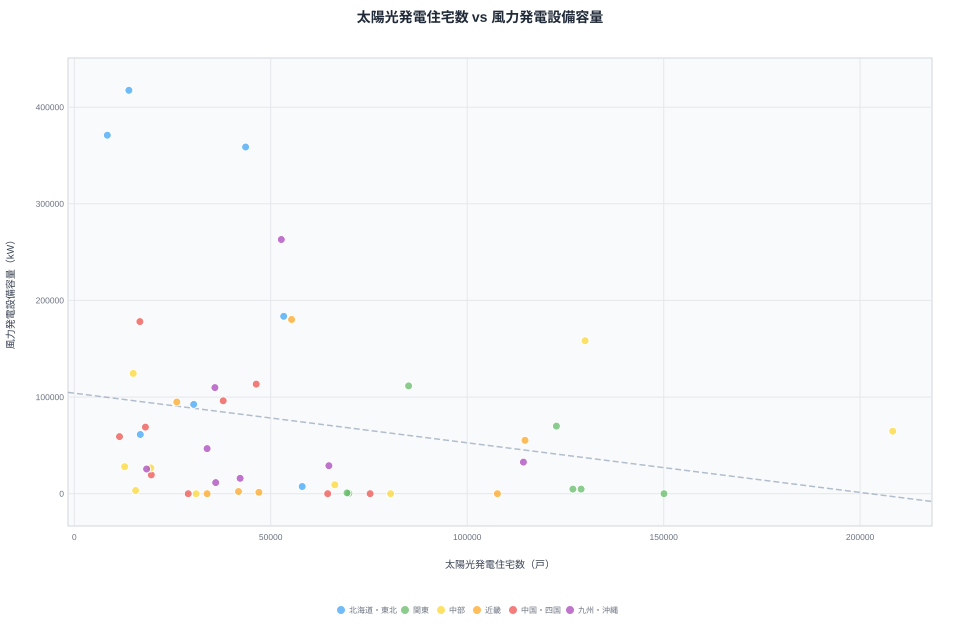
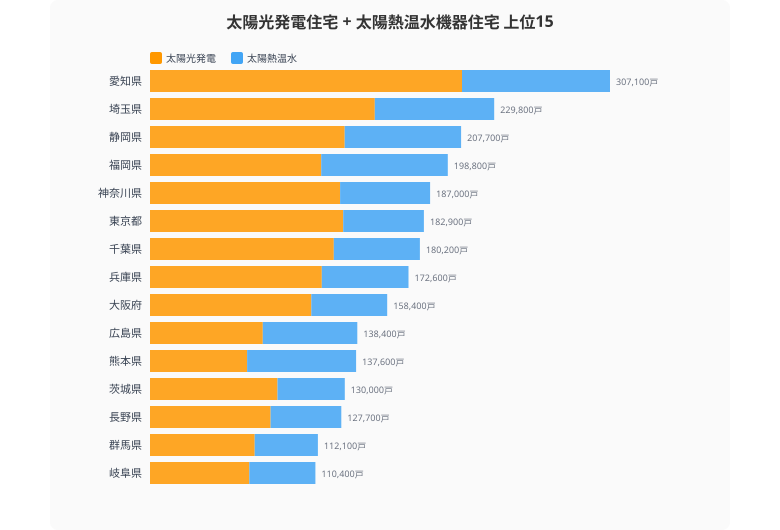
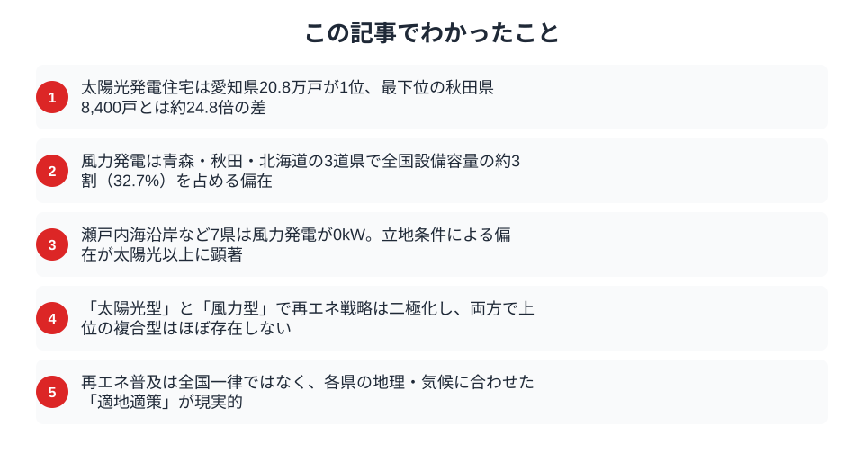

2050年カーボンニュートラルに向け再生可能エネルギーの拡大が叫ばれるが、その普及状況は47都道府県で大きく異なる。太陽光パネル付き住宅と風力発電の設置状況から、日本の再エネ地図を描く。

## 太陽光パネル住宅が多い県 -- 日照時間だけでは説明できない差

太陽光発電機器を設置している住宅数の1位は[愛知県](/areas/23000)で208,300戸。2位は埼玉県（150,100戸）、3位は静岡県（130,000戸）。いずれも日照時間が比較的長い太平洋側の県だが、それだけでは説明がつかない。

愛知県が突出する背景には、住宅総数の多さと戸建て住宅比率の高さがある。太陽光パネルの設置は戸建て住宅が前提となるため、集合住宅が多い東京都は129,000戸（約12.9万戸）にとどまる。愛知の208,300戸と比べると6割強の水準だ。

下位を見ると、47位は秋田県（8,400戸）、46位は鳥取県（11,500戸）、45位は福井県（12,800戸）。日照時間が短い日本海側や積雪地帯で普及が進んでいない傾向が明確だ。1位と47位の差は約24.8倍に達する。

<source-link href="/ranking/housing-with-solar-panels">47都道府県の太陽光発電住宅数ランキングをもっと見る</source-link>

## 風力発電の「偏在」 -- 青森・秋田・北海道に集中する理由

> [!NOTE]
> 風力発電データは2017年時点のものです。その後の洋上風力開発等により現在の分布は変化している可能性があります。

風力発電の設備容量は極めて偏在している。1位は[青森県](/areas/02000)（417,463kW）、2位は[秋田県](/areas/05000)（370,934kW）、3位は北海道（358,745kW）。詳細は[都道府県別 風力発電設備容量ランキング](/ranking/wind-power-capacity)を参照。この上位3道県で全国の設備容量の約4割を占める。

風力発電は「風況」が最大の立地要因だ。日本海側の海岸線や北海道・東北の平野部は安定した強風が吹き、設備利用率が高い。4位の鹿児島県（261,543kW）は洋上風力のポテンシャルも大きい。

一方、岡山県・広島県・香川県など瀬戸内海沿岸の県は風力発電がゼロ。内陸部や山間部の県も設備容量が小さく、風力は立地条件による偏在が太陽光以上に顕著だ。

<source-link href="/ranking/wind-power-generation-capacity">47都道府県の風力発電設備容量ランキングをもっと見る</source-link>

<ad-slot></ad-slot>

## 太陽光型 vs 風力型 -- 散布図で見る再エネ戦略の県別パターン

> [!NOTE]
> 太陽光データは2023年、風力データは2017年です。年次が異なる点にご留意ください。

横軸に太陽光発電住宅数、縦軸に風力発電設備容量をとると、各県の再エネ戦略の「型」が見える。

右上の「複合型」に位置する県は少なく、大半は「太陽光型」（右下）か「風力型」（左上）のどちらかに偏る。愛知・埼玉・静岡・茨城は太陽光に強く風力はほぼゼロ。逆に青森・秋田は風力が突出する一方、太陽光住宅は少ない。

北海道・鹿児島は両方の数値がある程度大きく、地理的条件を活かした複合型の可能性を持つ。ただし、両方で上位に入る「理想の複合型」は現状ではほとんど存在しない。

<source-link href="/ranking/electricity-generation-capacity">47都道府県の発電電力量ランキングをもっと見る</source-link>

## 太陽熱利用は「忘れられた再エネ」か -- 温水機器の地域分布

太陽熱を利用した温水機器のある住宅数は、太陽光発電住宅の約半分から3分の1程度だ。1位は愛知県（98,800戸）で太陽光と同じ順位。2位は福岡県（84,500戸）、3位は埼玉県（79,700戸）。

太陽熱温水器は1970〜80年代に普及した「旧世代の再エネ」というイメージが強いが、エネルギー変換効率は太陽光発電より高い。特に給湯需要が大きい家庭では有効な選択肢だ。ただし新規導入は減少傾向にあり、既存設備の老朽化が進んでいる。

上位15県の太陽光と太陽熱の合計を見ると、愛知県は30.7万戸と突出している。太陽エネルギーの総合的な利用度では、愛知県が日本一と言える。

<ad-slot></ad-slot>

## まとめ

太陽光と風力のデータから、日本の再生可能エネルギー普及の地域構造を整理する。

第7次エネルギー基本計画で再エネ比率の大幅引き上げが議論されているが、目標達成には「全国一律」ではなく「適地適策」のアプローチが不可欠だ。太平洋側の温暖な地域は太陽光を、日本海側・北部は風力を軸に、各県の地理的条件に合った組み合わせで再エネを推進する。この地域特性を踏まえた政策設計が、カーボンニュートラルへの現実的な道筋になる。

**データ出典:**
- [社会生活統計指標（e-Stat）](https://www.e-stat.go.jp/dbview?sid=0000010108) -- 太陽光発電住宅数（2023年）、太陽熱温水機器住宅数（2023年）、風力発電設備容量（2017年）、風力発電設置基数（2017年）、発電電力量（2023年）

## データ出典

本記事のデータはe-Stat（政府統計の総合窓口）を基に作成しています。

本記事の対象データ: [関連カテゴリ](/category/energy)
