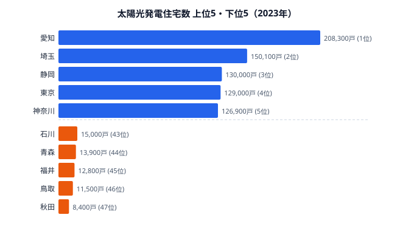
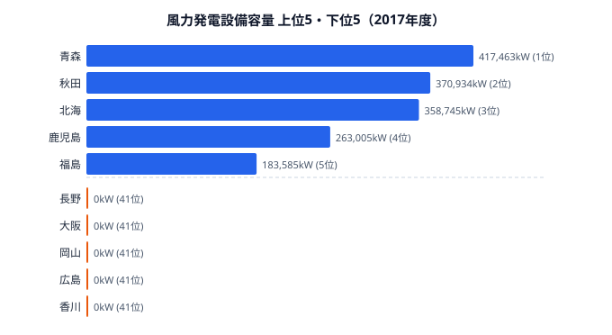

「再生可能エネルギーを増やそう」と言うとき、私たちは漠然と「全国でソーラーパネルや風車を増やす」イメージを持ちがちです。しかし都道府県別のデータを見ると、得意な再エネは県によってまったく違います。太陽光が強い県と風力が強い県は、ほとんど重なりません。2050年カーボンニュートラルに向けて、太陽光発電住宅と風力発電の設置状況から、日本の再エネ地図がどう「二極化」しているのかを描いてみます。

## 太陽光パネル住宅が多い県は太平洋側に集中する

太陽光発電機器を設置している住宅数の1位は[愛知県](/areas/23000)で208,300戸です。続いて埼玉県（150,100戸）、静岡県（130,000戸）、東京都（129,000戸）、神奈川県（126,900戸）と、いずれも日照時間が比較的長い太平洋側の県が並びます。ただし、日照時間の長さだけでこの順位を説明することはできません。

愛知県が突出する背景には、住宅総数の多さと戸建て住宅比率の高さがあります。太陽光パネルの設置は屋根を持つ戸建て住宅が前提になるため、集合住宅が多い東京都は129,000戸にとどまり、愛知県の約6割の水準です。つまり太陽光住宅の絶対数は「日照」よりも「戸建てがどれだけあるか」に強く引っ張られています。

一方の下位を見ると、47位は秋田県の8,400戸、46位は鳥取県（11,500戸）、45位は福井県（12,800戸）、44位は青森県（13,900戸）、43位は石川県（15,000戸）と、日照時間が短い日本海側や積雪地帯で普及が進んでいないことが分かります。1位の愛知県と47位の秋田県の差は約24.8倍に達します。冬の積雪は発電量を落とすうえ、屋根に積もった雪がパネルを覆うため、雪国では太陽光が選ばれにくいのです。

> [!NOTE]
> ここでの「太陽光発電住宅数」は設置済みの住宅の戸数で、発電容量(kW)ではありません。戸建てが多い大都市圏ほど絶対数が大きく出やすいため、「住宅に占める普及率」とは順位が変わる点に注意してください。

> [!TIP]
> 普及率(住宅に占める割合)で見ると景色が一変します。住宅率では佐賀・長野・山梨が上位に入り、絶対数1位の愛知や4位の東京は下位に沈みます。「戸数の多さ」と「県民の選びやすさ」は別物として読み分けるのがコツです。

<source-link href="/ranking/solar-power-housing">47都道府県の太陽光発電住宅数ランキングをもっと見る</source-link>

## 風力発電は青森・秋田・北海道に偏在する

太陽光とは対照的に、風力発電の設備容量は極端に偏っています。1位は[青森県](/areas/02000)の417,463kW、2位は[秋田県](/areas/05000)の370,934kW、3位は北海道（358,745kW）で、この上位3道県だけで全国の設備容量の約3割を占めます。4位は鹿児島県（263,005kW）、5位は福島県（183,585kW）と続きます。

風力発電で最大の立地要因は「風況」、つまりどれだけ安定して強い風が吹くかです。日本海側の海岸線や北海道・東北の平野部は年間を通して強風が吹き、風車を回す効率(設備利用率)が高くなります。青森・秋田・北海道に風車が集まるのは、政策よりもまず地形と気候が決めているわけです。

下位を見ると、香川県・広島県・岡山県・大阪府・長野県はいずれも設備容量がゼロです。瀬戸内海沿岸は山に囲まれて風が弱く、内陸の山間部も安定した風が得にくいため、風力という選択肢そのものが成り立ちません。太陽光なら日照が弱くても多少は発電できますが、風力は「風が吹かなければゼロ」という、立地条件への依存が太陽光以上に厳しい再エネなのです。

> [!WARNING]
> 風力データは2017年度時点のものです。その後の洋上風力開発で分布は変化している可能性があります。また下位県の「0kW」は調査時点で導入実績がないことを示し、ポテンシャルがゼロという意味ではありません。年次の新しい太陽光(2023年)と単純比較しない点に注意してください。

<source-link href="/ranking/wind-power-capacity">47都道府県の風力発電設備容量ランキングをもっと見る</source-link>

<ad-slot></ad-slot>

## 「太陽光型」と「風力型」に二極化する再エネ地図

ここまでの2つのランキングを重ねると、日本の再エネ地図が大きく二つの型に分かれていることが見えてきます。太陽光の上位に並ぶ愛知・埼玉・静岡・東京・神奈川は、いずれも風力の上位には登場しません。逆に風力で独走する青森・秋田は、太陽光発電住宅では青森が44位、秋田が47位と最下位グループに沈みます。同じ県が両方で強い「複合型」は、現状ではほとんど存在しないのです。

この「真逆」は偶然ではなく、地理がそのまま現れた結果です。戸建てが多く晴れの多い太平洋側のベルト地帯は太陽光に向き、強風が安定して吹く日本海側・北部は風力に向きます。両方の条件を同時に満たす県はまれで、だからこそ再エネ大県は「太陽光型」か「風力型」のどちらかに振れます。北海道や鹿児島のように両方である程度の規模を持つ県もありますが、それでも太陽光と風力の双方で上位に入る「理想の複合型」と呼べる県はありません。

この構造は政策設計に直結します。再エネ比率を全国一律の手法で底上げしようとすると、太陽光に向かない雪国に無理にパネルを置いたり、無風の瀬戸内に風車を立てたりといった非効率が生じます。各県の地形と気候を起点に「どちらの型か」を見極め、太平洋側は太陽光、日本海側・北部は風力を軸に据える「適地適策」のほうが、はるかに現実的にカーボンニュートラルへ近づきます。

## まとめ

太陽光と風力のデータから読み取れる、日本の再生可能エネルギー普及の構造を整理します。

- 太陽光発電住宅は愛知県が208,300戸でトップ。埼玉・静岡・東京・神奈川と太平洋側に集中し、最下位の秋田県(8,400戸)との差は約24.8倍です。
- 太陽光住宅の絶対数は「日照」より「戸建ての多さ」に強く左右され、集合住宅の多い東京都は4位どまりです。
- 風力発電は青森・秋田・北海道の上位3道県で全国の約3割を占め、香川・広島・岡山・大阪・長野はゼロと、立地依存が太陽光以上に顕著です。
- 太陽光の上位県と風力の上位県はほとんど重ならず、再エネ地図は「太陽光型」と「風力型」に二極化しています。
- 全国一律ではなく、各県の地形・気候に合わせた「適地適策」が、再エネ拡大の現実的な道筋になります。

## データ出典

本記事のデータはe-Stat(政府統計の総合窓口)を基に作成しています。

- [社会生活統計指標(e-Stat)](https://www.e-stat.go.jp/dbview?sid=0000010108) — 太陽光発電住宅数(2023年)、風力発電設備容量(2017年度)
