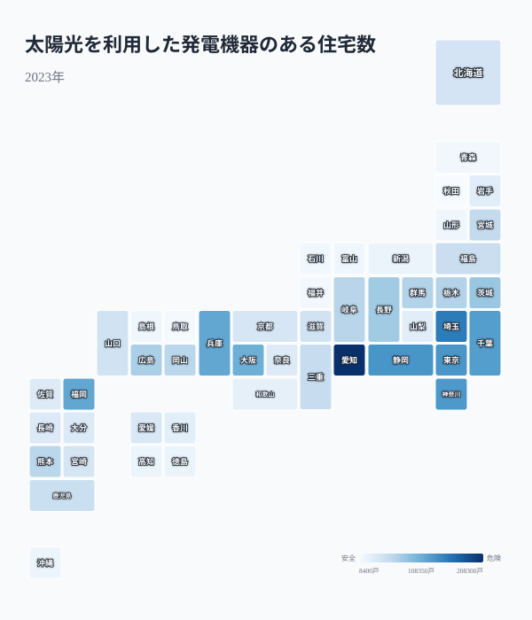
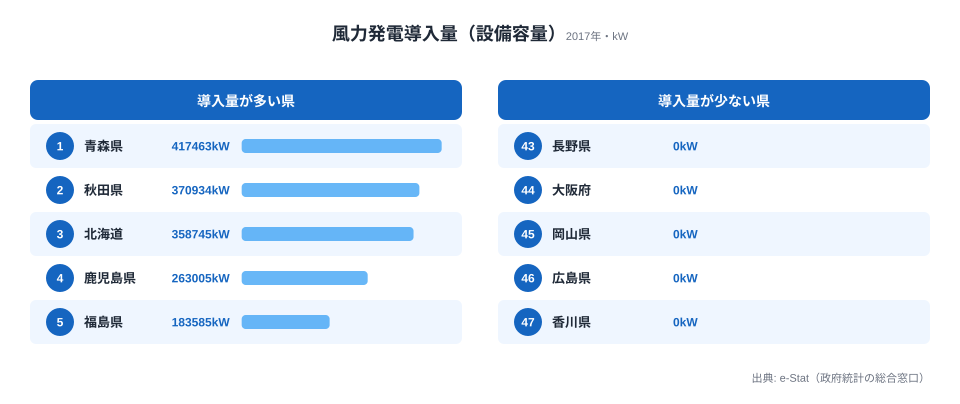

2050年カーボンニュートラルに向けて再生可能エネルギーの拡大が叫ばれていますが、その普及状況は47都道府県で大きく異なります。同じ「再エネ推進」でも、太陽光に強い県と風力に強い県はきれいに分かれ、両方で上位に立つ「複合型」の県はほとんど存在しません。太陽光パネル付き住宅と風力発電の設置状況から、日本の再エネ地図がどう塗り分けられているのかを描いていきます。

## 太陽光パネル住宅が多い県 -- 日照時間だけでは説明できない差

太陽光発電機器を設置している住宅数の1位は[愛知県](/areas/23000)で208,300戸でした。2位は埼玉県（150,100戸）、3位は静岡県（130,000戸）です。いずれも日照時間が比較的長い太平洋側の県ですが、それだけでは説明がつきません。

愛知県が突出する背景には、住宅総数の多さと戸建て住宅比率の高さがあります。太陽光パネルの設置は戸建て住宅が前提となるため、集合住宅が多い東京都は129,000戸（約12.9万戸）にとどまります。愛知の208,300戸と比べると6割強の水準です。

下位を見ると、47位は秋田県（8,400戸）、46位は鳥取県（11,500戸）、45位は福井県（12,800戸）でした。日照時間が短い日本海側や積雪地帯で普及が進んでいない傾向が明確で、1位と47位の差は約24.8倍に達します。

> [!NOTE]
> この指標は「太陽光を利用した発電機器のある住宅数」（社会・人口統計体系、2023年）で、戸数の絶対値です。住宅総数が多い大都市圏ほど数が大きく出やすいため、「普及の密度」を見たい場合は世帯数あたりに換算する必要があります。

<source-link href="/ranking/solar-power-housing">47都道府県の太陽光発電住宅数ランキングをもっと見る</source-link>

## 風力発電の「偏在」 -- 青森・秋田・北海道に集中する理由

風力発電の設備容量は極めて偏在しています。1位は[青森県](/areas/02000)（417,463kW）、2位は[秋田県](/areas/05000)（370,934kW）、3位は北海道（358,745kW）で、この上位3道県だけで全国の設備容量の約3割（32.7%）を占めます。4位は鹿児島県（263,005kW）、5位は福島県（183,585kW）と続きます。

風力発電は「風況」が最大の立地要因です。日本海側の海岸線や北海道・東北の平野部は安定した強風が吹き、設備利用率が高くなります。一方で、岡山県・広島県・香川県など瀬戸内海沿岸を中心に7県は設備容量が0kWで、風力発電が事実上存在しません。下位5県がすべて0kWという事実が、立地条件による偏在の激しさを物語っています。同じ再エネでも、太陽光の24.8倍差を上回るゼロイチの分布になっているのが風力の特徴です。

> [!WARNING]
> 風力発電データは2017年時点のものです。その後の洋上風力開発（秋田・千葉・長崎などで大型案件が稼働・計画中）により、現在の分布は本記事の数値から変化している可能性があります。最新の容量は環境省・経産省の公表値を参照してください。

<source-link href="/ranking/wind-power-capacity">47都道府県の風力発電設備容量ランキングをもっと見る</source-link>

<ad-slot></ad-slot>

## 太陽光型 vs 風力型 -- 散布図で見る再エネ戦略の県別パターン

横軸に太陽光発電住宅数、縦軸に風力発電設備容量をとると、各県の再エネ戦略の「型」が見えてきます。

右上の「複合型」に位置する県は少なく、大半は「太陽光型」（右下）か「風力型」（左上）のどちらかに偏っています。愛知（太陽光208,300戸・風力64,710kW）や埼玉（150,100戸・風力0kW）は太陽光に強く、逆に青森（太陽光13,900戸・風力417,463kW）や秋田（8,400戸・370,934kW）は風力が突出する一方で太陽光住宅は最下位グループに沈みます。再エネ戦略が地理条件によって明確に棲み分けられているのです。

数少ない例外が、北海道（太陽光43,600戸・風力358,745kW）と鹿児島県（52,700戸・263,005kW）です。両方の数値がある程度大きく、広い面積と多様な気候を活かした複合型の可能性を持っています。ただし、太陽光・風力の両方で全国上位に入る「理想の複合型」は、現状ではほとんど存在しません。

注意したいのは、この「太陽光が少ない＝風力が多い」という関係は、片方を増やせばもう片方が減るというトレードオフではない点です。両者を分けているのは政策の優劣ではなく、日照と風況という動かせない自然条件です。秋田や青森で太陽光住宅が少ないのは普及努力が足りないからではなく、戸建ての絶対数が少なく日本海側で冬季の発電効率も低いから、というのが実態に近いと言えます。再エネの「遅れ」を一律の指標で測ると、こうした地理的な前提を見落とすことになります。

> [!TIP]
> 太陽光は2023年、風力は2017年とデータの年次が異なります。散布図は「同時点の厳密な相関」ではなく、「各県がどちらの再エネに軸足を置いているか」という戦略パターンを読むものとして見てください。発電量全体の規模感は[発電電力量ランキング](/ranking/electricity-generation-capacity)と合わせると掴みやすくなります。

<source-link href="/ranking/electricity-generation-capacity">47都道府県の発電電力量ランキングをもっと見る</source-link>

<ad-slot></ad-slot>

## まとめ -- 再エネは「適地適策」で進む

太陽光と風力のデータから、日本の再生可能エネルギー普及の地域構造を整理します。

第7次エネルギー基本計画で再エネ比率の大幅な引き上げが議論されていますが、ここまで見てきたとおり、再エネの適地は全国に一様には広がっていません。太平洋側の温暖で住宅の多い地域は太陽光を、日本海側・北部の風況に恵まれた地域は風力を軸にするといった、各県の地理的条件に合った組み合わせが現実的です。電力需要の大きい都市部でどう再エネを確保するかも含め、この地域特性を踏まえた政策設計が、カーボンニュートラルへの近道になります。[エネルギー分野の他の指標](/category/energy)と合わせて、地域ごとの強みを確認してみてください。

## データ出典

- [社会・人口統計体系（e-Stat）](https://www.e-stat.go.jp/dbview?sid=0000010108) -- 太陽光を利用した発電機器のある住宅数（2023年）、風力発電導入量・設備容量（2017年）、発電電力量（2023年）。
- いずれも e-Stat（政府統計の総合窓口）を経由して整備しています。年次は指標ごとに異なります。
