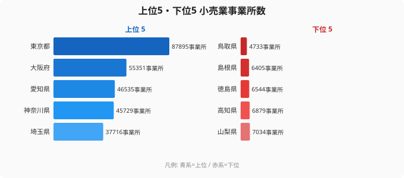

「同じ日本でも、住む県によってこれほど商業環境が違うのか」——2021年経済センサス活動調査が示す小売業事業所数のランキングを読むと、まず東京都の圧倒的な存在感に目を奪われます。87,895事業所という数字は、最も少ない鳥取県の4,733事業所の約19倍にあたります。単純な絶対数だけを見れば、大都市圏への小売業の集中は明白に映ります。

しかし、このランキングには「罠」があります。人口規模がそれぞれ異なる都道府県の事業所の絶対数を並べるだけでは、その土地の「商業の濃さ」は測れません。人口あたりの事業所数に換算すると順位は大きく動き、東京が必ずしもトップではなくなります。本記事では、絶対数と人口比という二つの視点から、日本の小売業地図の真の姿を探ります。

## 絶対数ランキング：三大都市圏が上位を独占

<source-link href="/ranking/retail-establishments-by-prefecture">小売業事業所数ランキングの全件データを見る</source-link>

上位5都府県は東京（87,895）、大阪（55,351）、愛知（46,535）、神奈川（45,729）、埼玉（37,716）と、首都圏・近畿圏・中部圏の大都市が並びます。この5都府県だけで全国（47都道府県合計 約88万事業所）の約31%を占めており、人口集中地域に小売業の集積もほぼ比例していることがわかります。

東京が突出している理由は人口だけではありません。国際的な観光地・ビジネス拠点としての来訪者数、オフィス街や繁華街が形成する「昼間人口」の多さ、そして百貨店・大型商業施設から個人商店まで多層的な商業集積が積み重なってきた歴史的経緯が重なっています。なお2位の大阪（55,351）から5位の埼玉（37,716）まではいずれも3万〜5万台で並んでおり、東京1県だけが頭一つ抜けている構図が読み取れます。

一方の下位5県——山梨（7,034）、高知（6,879）、徳島（6,544）、島根（6,405）、鳥取（4,733）——は、中国・四国地方に加えて甲信地方の山梨も含み、いずれも人口規模の小さい県です。これらの県は商圏を支える消費者母数が限られるため、維持できる小売店舗数にも自ずと上限があります。とりわけ最下位の鳥取（4,733）は、46位の島根（6,405）からもさらに離れた水準にあります。

> [!NOTE]
> 本データは小売業の「事業所数」であり、企業数や店舗売場面積とは異なります。1つの企業が複数の事業所（店舗）を持つ場合はそれぞれ別々にカウントされます。同じ床面積でも、テナントが複数事業者に分かれていればその数だけ事業所が計上されるため、商業ビルの多い都市部は事業所数が膨らみやすい点に注意してください。

## 人口比で見ると「真の商業密度」は別の顔を持つ

絶対数で下位に沈む高知県（6,879）や鳥取県（4,733）は、人口規模そのものが小さいため、人口あたりに直すと印象が一変します。人口1万人あたりの事業所数で並べ替えると、絶対数1位の東京は順位を大きく下げ、地方の小規模県が上位に浮上する「逆転現象」が起こります。

この比較が示す事実は示唆に富んでいます。絶対数では「小売砂漠」のように見えた地方県が、人口比では大都市を上回るケースが少なくないのです。鳥取・島根・高知といった絶対数下位グループも、人口あたりに換算すると相対的に「密」な水準に達します。

> [!TIP]
> 人口比で順位がどう動くかは、各県の人口を分母に直すと自分で確かめられます。事業所数は本記事の数値、人口は別指標になるため、[人口のランキング](/ranking/japanese-population)と突き合わせて「事業所数 ÷ 人口」で並べ替えると、商業密度ランキングが見えてきます。

この「逆転」の構造的な理由は何でしょうか。一つは、地方では自動車での移動が前提となるため、消費者が広い範囲に分散して居住しており、各生活圏に最低限の小売機能が必要になる点です。スーパーや農協の直売所、ガソリンスタンド兼コンビニなど、地域の生活インフラとしての小売業が点在します。都市部では1つの巨大ショッピングモールが数万人の需要を吸収できますが、過疎地ではそれが成立しにくいのです。

もう一つの理由として、地方における個人商店・零細事業所の「残存」があります。後継者不足や売上減少に直面しながらも、代替手段がないために事業を続けざるを得ない地域の実態があります。絶対数は少なくとも、人口比では「密に存在している」ことが、地方小売業の複雑な現状を映しています。

> [!WARNING]
> 人口比の分析はあくまで「事業所密度」の代理指標であり、売上規模・雇用者数・売場面積とは別の話です。観光地や昼間人口が多い地域では、住民人口で割ると過小評価になります。逆に東京は昼間人口が夜間人口を大幅に上回るため、住民人口を分母にした事業所密度は低めに出やすい点に注意が必要です。

## EC拡大と実店舗縮小：地方で進む「商業空白」

2021年のデータが示す事業所数は、長期的に見ると減少が続いてきた末の数字です。小売業の事業所数は経済センサスとその前身調査を通じて一貫して減少傾向にあり、全国の総数は緩やかに縮小してきました。

この長期減少を加速させた要因として、Eコマースの普及が挙げられます。楽天・Amazon・Yahoo!ショッピングに加え、コロナ禍を経てネットスーパーや食品デリバリーが広がった2020年代前半は、特に中小小売業への影響が大きかったと考えられます。衣料品・家電・書籍といったカテゴリでは、実店舗の競争優位が大きく揺らぎました。

都道府県別に見ると、大都市圏と地方では減少のかたちが異なります。大都市圏では「淘汰と集約」が進み、大手チェーンが個人商店を代替してきました。地方では「閉業後の空白」が生まれ、代替する業態がないまま商業空白地帯となるケースが目立ちます。いわゆる「買い物難民」問題は、事業所数の減少が単なる経営効率化にとどまらず、地域の生活インフラの喪失を意味することを示しています。

[商業統計カテゴリで他の指標も見る](/category/commercial)と、小売業販売額や従業者数など関連指標を横断的に確認できます。また[東京都のエリアプロフィール](/areas/13000)では、小売業集積の背景となる人口・観光・オフィス集積のデータも参照できます。

> [!NOTE]
> 「事業所が減った=その地域の消費が縮んだ」とは限りません。大手チェーンへの集約が進んだ地域では、事業所数が減っても1店舗あたりの売場面積や売上が拡大しているケースがあります。事業所数だけでなく、[小売業販売額のランキング](/ranking/retail-sales-amount-by-prefecture)と合わせて読むことで、「事業所は減ったが売上は維持」「事業所も売上も減」という地域の二極化が見えてきます。

## まとめ：絶対数が語らない地域商業の真実

- 絶対数の上位は東京（87,895）・大阪（55,351）・愛知（46,535）・神奈川（45,729）・埼玉（37,716）で、三大都市圏が独占しています
- 下位は山梨・高知・徳島・島根・鳥取で、最も少ない鳥取（4,733）は東京の約19分の1にとどまります
- 人口あたりに換算すると東京の順位は大きく下がり、地方の事業所密度が相対的に高い「逆転現象」が見えてきます
- EC拡大・後継者不足により全国で事業所数の長期減少が続いており、地方では「商業空白地帯」化が懸念されます
- 地方の小売業は人口比では「密」に見えても、零細・高齢化した事業者が支えている構造的な脆さを抱えています

[大阪府のエリアプロフィール](/areas/27000)では、東京と並ぶ商業集積の別のかたちを確認できます。

## データ出典

本記事のデータは総務省・経済産業省「2021年経済センサス活動調査」をもとに、e-Stat API を経由して stats47.jp が集計・整備したものです。事業所数は2021年時点の数値で、産業分類は日本標準産業分類の小売業に準拠しています。
