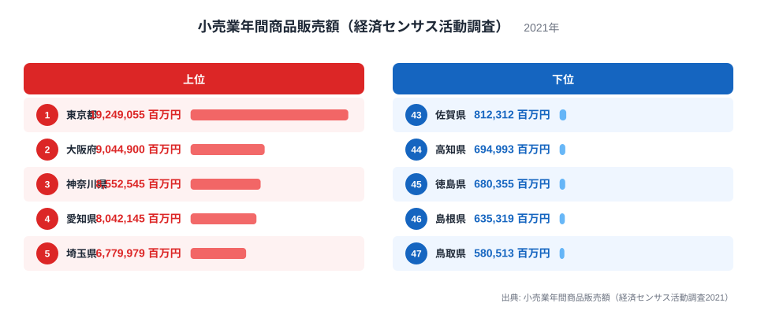
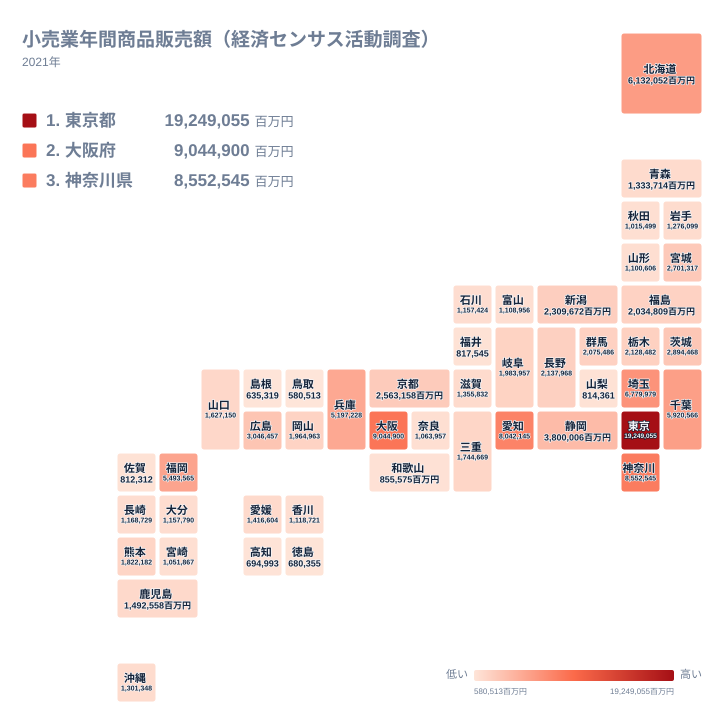

小売業の年間商品販売額は、地域の商業がどれだけ集積しているかを映す指標です。経済センサス活動調査による2021年の調査では、都道府県ごとの販売額に大きな差があることがわかります。全国1位の東京都は19,249,055百万円にのぼり、全国最下位の鳥取県は580,513百万円にとどまっています。両者の差はおよそ33倍に達しており、同じ日本国内でも小売市場の規模がこれほど違うのはなぜでしょうか。この記事では、上位と下位の顔ぶれを比較しながら、その背景にある構造を読み解いていきます。

上位に並ぶのは大都市圏を抱える都道府県で、下位には人口規模の小さい地方県が集まっています。ただし、それだけでは説明しきれない順位の入れ替わりもあり、地図で分布を見るとその癖がより鮮明になります。

## 上位5県と下位5県にみる商業集積の差

<source-link href="/ranking/retail-sales-amount-by-prefecture">小売業年間商品販売額（経済センサス活動調査）ランキングをもっと見る</source-link>

全国1位は東京都で、小売業年間商品販売額は19,249,055百万円です。[東京都のデータ](/areas/13000)を見ると、商業の集積度合いをあわせて確認できます。2位の大阪府は9,044,900百万円で、[大阪府のデータ](/areas/27000)と見比べると、関西圏の商業規模の大きさがわかります。3位の神奈川県は8,552,545百万円、4位の愛知県は8,042,145百万円、5位の埼玉県は6,779,979百万円と続きます。上位5県のうち、東京都、神奈川県、埼玉県の3県は関東地方に集中しており、大阪府は近畿地方、愛知県は中部地方の中心県です。いずれも人口の多い大都市圏を抱える県で、日常の買い物需要に加えて、広域から集客する商業施設の集積が販売額を押し上げていると考えられます。

下位に目を移すと、47位は鳥取県で580,513百万円、46位は島根県で635,319百万円、45位は徳島県で680,355百万円、44位は高知県で694,993百万円、43位は佐賀県で812,312百万円となっています。鳥取県と島根県は中国地方のうち日本海側にあたる山陰地方の県で、徳島県と高知県は四国地方、佐賀県は九州地方に位置しています。上位5県が3つの地方に集中していたのに対し、下位5県は山陰、四国、九州という異なる地方にまたがっており、特定の一地域だけが弱いわけではないことがうかがえます。

上位1位の東京都と最下位の鳥取県を比べると、販売額にはおよそ33倍の差があります。[仮説] この差には、人口規模や事業所数の違いに加えて、都市部への商業施設の集積度が影響している可能性がありますが、正確な要因を特定するには人口や事業所数のデータとあわせた検証が必要です。

> [!NOTE]
> この販売額は、都道府県内にある小売業の事業所が販売した金額の合計です。購入者の居住地とは一致せず、観光客や近隣県からの来店による売上も含まれています。

## 地理的にみる小売販売額の分布

タイルマップで全国の分布を見ると、小売業年間商品販売額が高い都道府県は、関東地方から近畿地方、中部地方にかけて連なっていることがわかります。これらの地域には人口が集中する大都市圏が含まれており、日常の買い物需要に加えて、広域から集客する大型商業施設が立地しやすい条件がそろっています。

一方で、販売額が低い都道府県は、山陰地方や四国地方、九州地方の一部に点在しています。同じ地方の中でも県によって順位には差があり、地方全体が一様に低いわけではありません。[仮説] 地方の中心都市を抱える県とそうでない県とで、商業施設の集積度に違いがある可能性があります。

小売業以外の商業に関連する統計もあわせて見たい場合は、[同じカテゴリの統計一覧](/category/commercial)から確認できます。

> [!WARNING]
> 経済センサス活動調査は数年に一度の実施であり、ここでの数値は2021年時点のものです。調査年によって対象範囲や集計方法が見直されることがあるため、他の年の数値と単純に比較する際は注意が必要です。

## なぜこれほど差がつくのか

小売業年間商品販売額の地域差は、単純な人口規模の違いだけでは説明しきれない部分があります。上位5県は東京都、大阪府、神奈川県、愛知県、埼玉県といった大都市圏の中心県が占めており、これらの県には広域から買い物客を集める商業施設が集中しています。一方、下位に並ぶ鳥取県、島根県、徳島県、高知県、佐賀県は、いずれも人口規模が比較的小さい県です。[仮説] 大都市圏では通勤や通学、観光で流入する人の消費も販売額に加わっている可能性があり、居住人口だけでは測れない商業の厚みが、上位県と下位県の差を広げていると考えられます。この点は、人口当たりの販売額など別の指標とあわせて検証する余地があります。

> [!TIP]
> 都道府県別の合計額だけでなく、人口一人当たりの販売額に置き換えると、地域ごとの商業の実力がより見えやすくなります。

## まとめ

- 全国1位は東京都で、小売業年間商品販売額は19,249,055百万円です。
- 全国最下位は鳥取県で、580,513百万円にとどまっています。
- 東京都と鳥取県の差はおよそ33倍にのぼります。
- 上位5県は関東、近畿、中部の大都市圏に集中し、下位5県は山陰、四国、九州に分散しています。
- 地方の中でも県による差が大きく、地方全体が一様に低いわけではない点が特筆されます。

## データ出典

本記事のデータは、小売業年間商品販売額（経済センサス活動調査2021）にもとづいています。集計年は2021年です。
