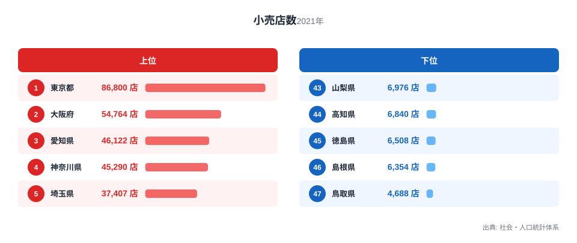
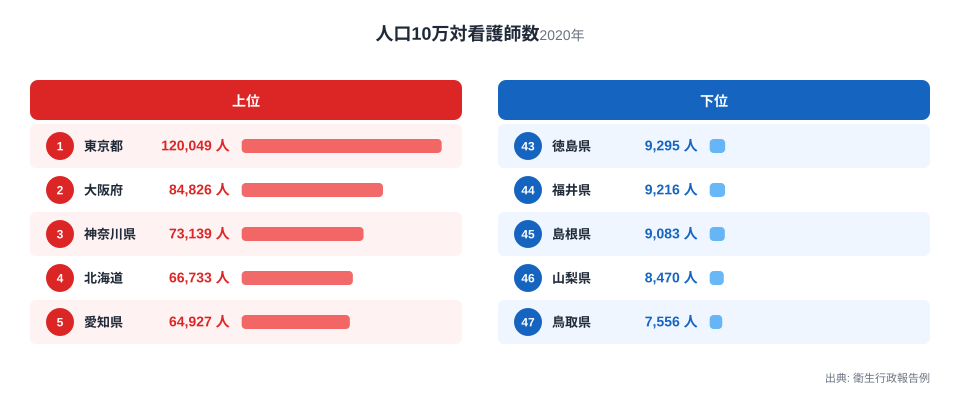

都道府県別の小売店数と、人口10万対看護師数を並べてみると、意外な一致が見えてきます。小売店が多い県ほど看護師も多く、少ない県ほど両方とも少ないのです。小売業と看護師の配置は、一見すると何の関係もなさそうな分野です。それなのになぜ、これほどまでに似た顔ぶれが並ぶのでしょうか。

この記事では、まず小売店数と人口10万対看護師数のそれぞれのランキングを見て、その後に2つの指標を散布図で重ね合わせます。最後に、この見かけの相関がどこから生まれているのかを考えます。単に「似ている」で終わらせず、両者を並べたときに何が読み取れて、何が読み取れないのかを整理していきます。

## 小売店数の上位と下位

<source-link href="/ranking/retail-store-count">小売店数ランキングをもっと見る</source-link>

小売店数の1位は東京都で86,800店です。2位は大阪府の54,764店、3位は愛知県の46,122店、4位は神奈川県の45,290店、5位は埼玉県の37,407店と続きます。上位5県はいずれも大都市圏を抱える都府県で、人口や事業所の集積が大きい地域です。6位の福岡県は37,018店、7位の北海道は36,512店で、これらの県も広い商圏を抱える地方の中心地です。

一方で最下位は鳥取県の4,688店です。46位は島根県の6,354店、45位は徳島県の6,508店、44位は高知県の6,840店、43位は山梨県の6,976店と続きます。東京都と鳥取県を比べると、店舗数の差は約18.5倍にのぼります。下位に並ぶ県は、いずれも人口規模が小さく、商業施設の絶対数が少ない地域です。

小売店数は、地域の人口や消費活動の規模をそのまま映す指標だと言えます。大きな都市ほど買い物をする人が多く、それに応じて店舗数も増える構造になっています。上位と下位のあいだにこれほどの差が出るのは、都道府県ごとの人口規模の差がそのまま反映されているからだと考えられます。

## 人口10万対看護師数の上位と下位

「人口10万対看護師数」という指標名ですが、実際の値を見ると人口10万人あたりに換算する前の実数に近い水準です。この指標の1位も東京都で、120,049人です。2位は大阪府の84,826人、3位は神奈川県の73,139人、4位は北海道の66,733人、5位は愛知県の64,927人となっています。6位は福岡県の64,086人、7位は兵庫県の57,521人で、小売店数と同じく人口規模の大きい都道府県が上位に並んでいます。

最下位は鳥取県の7,556人です。46位は山梨県の8,470人、45位は島根県の9,083人、44位は福井県の9,216人、43位は徳島県の9,295人と続きます。1位の東京都と47位の鳥取県を比べると、その差は約15.9倍です。

> [!NOTE]
> この指標は、人口10万人あたりに正規化された値ではなく、都道府県ごとの看護師の実数に近い水準を表していると考えられます。水準を比較するときは、各都道府県の人口規模も念頭に置いて読む必要があります。

小売店数のランキングと見比べると、上位に並ぶ顔ぶれがよく似ています。実際、小売店数の上位10県と人口10万対看護師数の上位10県は、順位こそ入れ替わっているものの、まったく同じ10都道府県で構成されています。下位10県も9県が共通しており、異なるのは奈良県と和歌山県だけです。この一致の大きさが、両者の関係を考える出発点になります。

## 散布図でみる2つの指標の関係

小売店数を横軸に、人口10万対看護師数を縦軸にとって47都道府県をプロットすると、点は左下から右上へときれいに並びます。小売店数が少ない県ほど看護師数も少なく、小売店数が多い県ほど看護師数も多いという傾向が、視覚的にはっきりと確認できます。

東京都、大阪府、神奈川県、愛知県といった大都市圏の都府県は、どちらの指標でも図の右上に位置しています。逆に鳥取県、島根県、徳島県、山梨県といった県は、どちらの指標でも図の左下にまとまっています。この2つの指標だけを見ると、強い相関があるように映ります。

> [!WARNING]
> [仮説] 小売店数と看護師数の間に見える関係は、小売業の活発さが看護師の需要を直接生み出しているという意味ではありません。両方の指標が、それぞれ別の理由で都道府県の人口規模と連動している可能性が高く、この記事のデータだけでは因果関係を確かめられません。

## 見かけの相関の裏にあるもの

小売店数は、その地域に住み買い物をする人の数に応じて増えます。看護師数も、医療機関を利用する人口や医療提供体制の規模に応じて配置されます。つまりこの2つの指標は、どちらも都道府県の人口規模という共通の土台の上に成り立っている数字です。

小売業と看護師の配置という、直接には結びつかない2つの分野が同じような地域差を示すのは、両者が別々に「人が多い場所ほど数が多くなる」という同じ法則に従っているためだと考えられます。図の右上に大都市圏が集まり、左下に人口の少ない県が集まるのは、この共通の背景があるからだと考えられます。

言い換えると、小売店数と看護師数のあいだに直接の因果関係を見出す必要はありません。両者はそれぞれ独立に、都道府県という同じ地域単位の規模を映し出しているにすぎないのです。似た形の分布になるのは、むしろ自然なことだと言えます。地域の人口規模という一つの背景要因が、小売業と医療という異なる分野の数字を同じ方向に動かしている、という見方をすると、この一致が腑に落ちやすくなります。

ただし、人口規模の影響を統計的に取り除いても、この2つの指標のあいだには0.7程度の相関がなお残ります。[仮説] このことから、人口規模だけがこの一致を説明する唯一の要因とは言い切れず、都市化の進み方や医療インフラの整備状況の地域差など、ほかの要因も関わっている可能性があります。この点はデータだけでは検証しきれないため、仮説にとどめます。

> [!TIP]
> 小売店数や看護師数のように地域の人口規模と強く結びつきやすい指標を比べるときは、実数だけでなく、人口一人あたりや面積あたりに置き換えた指標もあわせて確認すると、地域ごとの実態差が見えやすくなります。

## まとめ

- 小売店数の1位は東京都の86,800店、最下位は鳥取県の4,688店で、その差は約18.5倍です。
- 人口10万対看護師数の1位も東京都の120,049人、最下位は鳥取県の7,556人で、その差は約15.9倍です。
- 小売店数の上位10県と看護師数の上位10県は、順位は異なるもののまったく同じ10都道府県です。
- 下位10県も9県が共通しており、異なるのは奈良県と和歌山県だけです。
- 2つの指標が似た分布を示すのは、いずれも都道府県の人口規模を反映しているためだと考えられ、小売業と看護師需要が直接結びついているわけではありません。
- ただし人口規模の影響を取り除いても0.7程度の相関が残っており、人口規模以外の要因が関わっている可能性も[仮説]として残ります。

人口10万対看護師数の詳細は[人口10万対看護師数ランキング](/ranking/nurses-per-100k-population)をご覧ください。他の商業関連の統計は[同じカテゴリの統計一覧](/category/commercial)にまとまっています。上位県の内訳を詳しく知りたい方は、[東京都のデータ](/areas/13000)や[大阪府のデータ](/areas/27000)もあわせてご覧ください。

## データ出典

小売店数は社会・人口統計体系の2021年のデータです。人口10万対看護師数は衛生行政報告例の2020年のデータです。いずれもe-Stat経由で整備された統計を使用しています。
