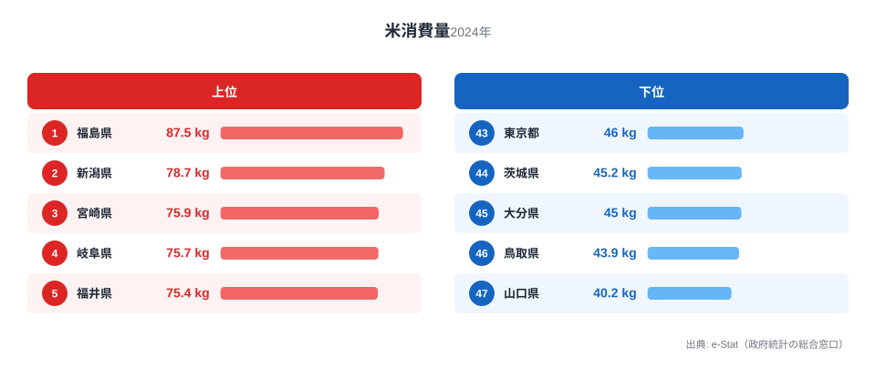

「ごはん党」と聞いて真っ先に思い浮かぶ県はどこでしょうか。[新潟](/areas/15000)や秋田のような米どころを想像する人が多いかもしれませんが、2024年の家計調査（二人以上世帯・都道府県庁所在市）で1位だったのは福島県でした。年間87.54kgと、最下位の山口県40.2kgの2.2倍にのぼります。

この指標が示すのは「収穫量」ではなく「家庭がどれだけ米を買って食べているか」という消費側の実態です。米どころ=消費量トップとは限らない、というねじれがこのデータの面白さです。この記事では、なぜ福島が1位に立つのか、そして全国的な「米離れ」がどこまで進んでいるのかを、都道府県別データから読み解きます。

> [!NOTE]
> このランキングは総務省「家計調査」の品目別支出・購入数量データが元になっています。調査対象は**都道府県庁所在市の二人以上世帯**で、県内全域の消費実態そのものではありません。また外食・中食（コンビニ弁当など）で食べた米は含まれない「家庭内の購入量」ベースの数字です。

## 上位と下位の対比

<source-link href="/ranking/rice-consumption-quantity">米消費量ランキングをもっと見る</source-link>

2024年の1位は福島県（87.54kg）、2位は新潟県（78.7kg）、3位は宮崎県（75.87kg）でした。上位には東北・北陸の米どころが並ぶ一方で、7位に埼玉県、10位に群馬県が入るなど、必ずしも「有名な米どころ」だけが上位を占めているわけではありません。

新潟県は「日本一のブランド力を誇る産地」として知られていますが、2024年の消費量は2位（78.7kg）にとどまります。実は新潟の家計調査データは年によって大きく揺れ動く県で、2019年の消費量はわずか49.96kgまで落ち込んだかと思えば、2021年には82.99kgまで跳ね上がるなど、値そのものの変動幅がとても大きいのが特徴です。米どころだからといって毎年安定して上位というわけではなく、その年の作柄や価格、消費者の購買行動に左右されやすい指標だといえます。

一方で下位グループは、山口県（40.2kg）が最下位、鳥取県（43.87kg）が46位、大分県（44.97kg）が45位、茨城県（45.15kg）が44位、東京都（46kg）が43位という顔ぶれです。大消費地の東京が下位に沈むのは、パン・麺類・中食への支出が多い都市部の食生活を考えれば納得しやすい結果です。注目したいのは山口県で、過去18年間のうち2019年・2022年・2024年の3回、全国最下位（47位）を記録しています。単発の落ち込みではなく、慢性的に消費量が少ない県であることがうかがえます。

## なぜ地域差が生まれるのか

<source-link href="/ranking/rice-consumption-quantity">都道府県別の詳細データはこちら</source-link>

家庭での米消費量には、大きく分けて「食文化としての主食依存度」と「パン・麺への代替の進み方」という2つの軸が働いていると考えられます。東北・北陸は伝統的に米を主食とする食習慣が根強く残る地域で、上位10県のうち福島・新潟・山形・福井・富山と5県が東北・北陸勢です。これに対して、中国・四国地方の一部県や近畿圏では、パン食や麺類への置き換えが進んでいる地域があり、山口・広島・岡山などが下位に沈みやすい傾向が続いています。

[仮説] 中国地方でパン消費が相対的に高い地域文化がある可能性がありますが、これは家計調査の米消費量データだけでは検証できません。[パン消費量ランキング](/ranking/bread-consumption-expenditure)や[米に対する支出金額ランキング](/ranking/rice-consumption-expenditure)と突き合わせて初めて確認できる仮説です。

> [!WARNING]
> 家計調査は毎年の抽出調査であり、サンプル世帯の入れ替わりや米価の変動、その年の天候（不作・豊作）によって順位が大きく動きます。新潟県の消費量が2019年の49.96kgから2021年の82.99kgまで振れたように、1年だけの順位を「その県の実力」と断定するのは早計です。複数年の傾向を見ることをおすすめします。

## 全国的な「米離れ」はどこまで進んだか

家計調査ベースの全国平均消費量を年別に集計すると、2007年の82.8kgから2024年には59.2kgまで低下しています。約17年間で28.5%の減少です。米消費量は右肩下がりで推移してきましたが、2019年（60.8kg）を底にいったんコロナ禍で持ち直し（2021年62.7kg）、その後再び減少に転じ、2024年にやや反発するという動きを見せています。

> [!TIP]
> 家庭での米消費が減った分、外食・中食（コンビニおにぎり・弁当など）で米を摂取している可能性があります。家計調査の「購入数量」だけでは食生活全体の米離れの実態はつかみきれない点に注意してください。

この全国的な減少傾向のなかでも、上位県と下位県の差（倍率）は年によって変動しつつもおおむね2倍前後で推移してきました。つまり「全体は減っているが、地域差そのものは縮まっていない」という状態が続いています。米消費量が減る速度は全国一律ではなく、もともと消費量が少なかった県ほど、家庭での米離れがさらに進みやすい構造があるとも読めます。

## まとめ

- 2024年の米消費量1位は福島県（87.54kg）、最下位は山口県（40.2kg）で2.2倍の差
- 2位新潟県（78.7kg）・3位宮崎県（75.87kg）と続くが、新潟は年によって順位変動が激しい
- 山口県は過去18年間で3回（2019・2022・2024年）最下位を記録した「慢性的に少ない」県
- 全国平均は2007年82.8kgから2024年59.2kgへ、17年間で28.5%減少
- 上位は東北・北陸の米どころが多いが、埼玉・群馬など関東勢も上位に食い込む

## データ出典

総務省「家計調査」の品目別データを、e-Stat（政府統計の総合窓口）経由で取得・集計しています。集計年は2007年〜2024年、対象は都道府県庁所在市の二人以上世帯です。
