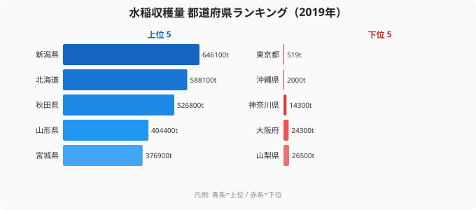
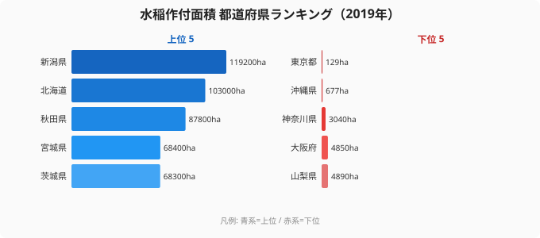
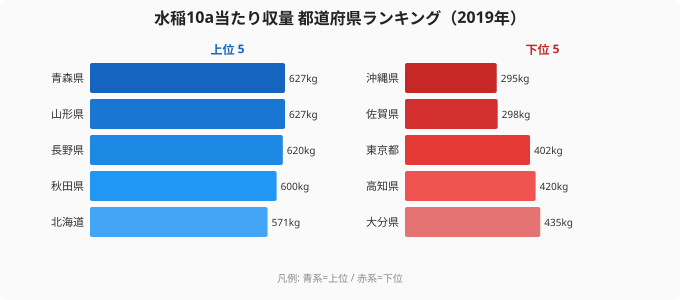

日本の主食米はどこで作られているのか ── 47 都道府県の水稲収穫量 (2019 年) を集計すると、全国 776 万 t のうち **TOP10 県だけで 414 万 t、占有率 53%** に達します。残り 37 県で半分にも満たない、というのが米作の地理的偏在の現実です。

なぜ米作地はこれほど偏るのか。鍵は **「雪解け水 × 沖積平野 × 冷涼気候」の 3 要件** が揃う地域の希少性にあります。本記事では、この 3 要件で説明される「米作ベルト」の構造と、その中で **「面積で稼ぐ県」と「効率で稼ぐ県」** が分かれる興味深い分化を解き明かします。

> [!NOTE]
> 本記事の「水稲 (すいとう)」は水田で栽培される稲のことで、陸稲 (りくとう、畑作の稲) は含まれません。日本国内の主食用米はほぼ 100% が水稲のため、本データは事実上の「日本の米作ランキング」と読めます。データ年度 2019 年は農林水産省「作物統計調査」で都道府県別が完全に揃い、コロナ禍前で生産・流通が平常運転だった構造分析の基準年として最適です。

## 米作の集中構造 ── TOP10 で全国の 53% を担う

上位 10 県は、1 位 新潟県 (646,100 t)、2 位 北海道 (588,100 t)、3 位 秋田県 (526,800 t)、4 位 山形県 (404,400 t)、5 位 宮城県 (376,900 t)、6 位 福島県 (368,500 t)、7 位 茨城県 (344,200 t)、8 位 栃木県 (311,400 t)、9 位 千葉県 (289,000 t)、10 位 青森県 (282,200 t) で、合計 4,138,600 t (全国シェア 53.3%) を占めます。

<source-link href="/ranking/rice-harvest-volume">水稲収穫量ランキングをもっと見る</source-link>

地域別に内訳を見ると、**東北 6 県のうち 5 県** (秋田・山形・宮城・福島・青森)、**北陸の新潟、北海道、関東 3 県** (茨城・栃木・千葉) が TOP10 を構成しています。この 10 県だけで全国収穫量の半分以上を担い、米作地が「東北・北陸を軸に北海道と北関東に広がる帯状の地域」に明確に偏在していることが分かります。

## なぜこの地域に集中するのか ── 米作の 3 要件

水稲栽培には以下の 3 要件が物理的に必要です。3 つすべてが揃う地域は日本の中で限られており、それが米作ベルトの地理を決定しています。

### 要件 1: 雪解け水 (春の大量灌漑水)

水稲は田植え期 (5-6 月) に大量の水を必要とします。**雪国は冬の雪が春に解けて天然の貯水池になる** ため、灌漑用水を安定供給できます。

新潟・秋田・山形・北海道はいずれも豪雪地帯で、信濃川・雄物川・最上川・石狩川など豊富な河川を持ちます。逆に降水量の少ない瀬戸内・九州南部 (沖縄除く) は水源不足で大規模水田が成立しにくい構造です。

### 要件 2: 沖積平野 (広大で水はけ良い土地)

水田は **広い平地で水を均等に貯められる土地** を必要とします。河川が運んできた土砂が堆積した沖積平野は、水保持力と排水性の両方を備える理想的な条件です。

- **[新潟県](/areas/15000)**: 越後平野 (信濃川・阿賀野川)
- **北海道**: 石狩平野・上川盆地
- **秋田県**: 秋田平野・横手盆地
- **宮城県**: 仙台平野
- **茨城県**: 関東平野の一部

これら平野の規模が、各県の水稲作付面積の上限を決めています。

### 要件 3: 冷涼な気候 (夏の昼夜温度差)

米は **昼間の高温で光合成、夜間の低温で養分蓄積** という温度差環境で品質と収量が最大化されます。亜熱帯気候の沖縄では夜間も高温が続くため米作に不利。北海道・東北の夏は冷涼で品質・収量ともに優れる構造になっています。

> [!TIP]
> この 3 要件の理論は「米作ベルト」が経済政策で人為的に作られたのではなく、**地理的・気候的な必然** であることを示唆します。仮に経済合理性だけで決まるなら、消費地に近い関東・関西で集中するはずですが、現実は逆。地理が経済を縛る典型例です。

## 「面積で稼ぐ県」と「効率で稼ぐ県」── 米作の二系統

米作量は単純に「水田の広さ × 単位面積あたり収量 (10a 当たり収量)」で決まります。ここに **意外な分化** が見られます。

### 水稲作付面積

作付面積の上位 5 県は、1 位 新潟県 (119,200 ha)、2 位 北海道 (103,000 ha)、3 位 秋田県 (87,800 ha)、4 位 宮城県 (68,400 ha)、5 位 茨城県 (68,300 ha)。広大な沖積平野を持つ県が並びます。

<source-link href="/ranking/rice-cultivated-area">水稲作付面積ランキングをもっと見る</source-link>

### 10a 当たり収量 (= 単位面積の生産効率)

10a 当たり収量の上位 5 県は、1 位タイ 青森県 (627 kg/10a)、1 位タイ 山形県 (627 kg/10a)、3 位 長野県 (620 kg/10a)、4 位 秋田県 (600 kg/10a)、5 位 北海道 (571 kg/10a)。面積上位とは顔ぶれが入れ替わります。

<source-link href="/ranking/rice-yield-per-10a">水稲10a当たり収量ランキングをもっと見る</source-link>

> [!WARNING]
> **新潟は面積 1 位だが、10a 当たり収量は全国 10 位 (542 kg/10a) に過ぎません**。北海道も面積 2 位ですが収量は 5 位。「米作王国・新潟」のイメージとは異なり、新潟は **圧倒的な面積で稼ぐ県** であって、効率では青森・山形・長野に劣ります。一方、青森・山形は面積が中位 (作付面積 6-7 位帯) ながら、単位収量で日本最高水準を維持。**「面積で稼ぐ vs 効率で稼ぐ」の二系統** が米作王国の中に存在しています。

なぜこの分化が起こるのか:

- **新潟・北海道型 (面積で稼ぐ)**: 越後平野・石狩平野の広大な沖積平野を最大限活用。低コスト大量生産モデル
- **青森・山形・長野型 (効率で稼ぐ)**: 限られた平野で品種改良・栽培技術を磨き、ブランド米 (青森「青天の霹靂」、山形「つや姫」、長野「風さやか」) で単価を維持

両系統が並存することで、日本の米作は「量と品質の両面で世界トップクラス」を実現しています。

## TOP10 以外の地域 ── 米作不参加の背景

最下位グループは「米作りに向かない」と「米作りを降りた」の 2 系統に分けられます。これらは記事の主題 (米作の地理構造) からは脇道ですが、対比として簡潔に触れます。下位 5 県とその不参加の主因は以下のとおりです。

- **43 位 山梨県 (26,500 t)**: 山地中心で平野が狭小
- **44 位 大阪府 (24,300 t)**: 都市化で農地転用 (経済合理性)
- **45 位 神奈川県 (14,300 t)**: 同上
- **46 位 沖縄県 (2,000 t)**: 亜熱帯気候で水稲不適 (要件 3 を満たさず)
- **47 位 東京都 (519 t)**: 完全な都市化で農地ほぼ消失

東京・大阪・神奈川は **歴史的には水田地帯だったが都市化で農地転用された** 経済合理性での撤退。沖縄は **最初から気候不適合で米作の主要産地になったことがない** 気候要因。同じ最下位でも構造的背景は大きく異なります。

## まとめ ── 米作の地理は変えられない

- **集中構造**: 全国 776 万 t のうち TOP10 県で **53%** (414 万 t) を担う
- **米作ベルト**: 東北 6 県・北陸新潟・北海道・北関東を結ぶ帯状地域
- **3 要件の必然性**: 雪解け水 × 沖積平野 × 冷涼気候の同時充足が必要
- **二系統の分化**: 「面積で稼ぐ新潟・北海道型」と「効率で稼ぐ青森・山形型」の併存
- **政策含意**: 米作は地理に強く規定されるため、政策で生産地を移動させることは困難。食料安全保障の観点では、米作ベルトが大規模災害を受けた場合のリスク評価が重要

## データの位置づけ

> [!NOTE]
> **2019 年データを採用した理由**: 農林水産省「作物統計調査」は毎年実施されますが、(a) コロナ前の通常運転データ、(b) 大規模気候災害がなく構造分析に適する、(c) e-Stat で 47 都道府県完全データが入手可能、という 3 条件から構造分析の基準年として最も信頼できる年です。短期トレンド分析は別記事で扱います。

## データ出典

- 農林水産省「作物統計調査」(2019 年産)
- [e-Stat 政府統計の総合窓口](https://www.e-stat.go.jp/) (政府統計コード: 0003418934)
- 単位: トン (t)、kg/10a (10 アールあたり収量)、ha (ヘクタール)
- 対象: 水稲 (陸稲を除く)
- データ取得・集計: stats47.jp (CC BY 4.0 ライセンスで引用可)

本記事の対象データ: [関連カテゴリ](/category/agriculture)・[東京都](/areas/13000)
