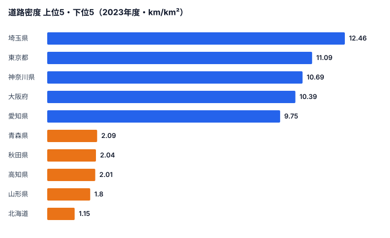
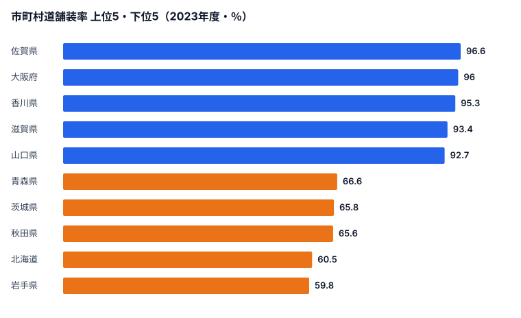
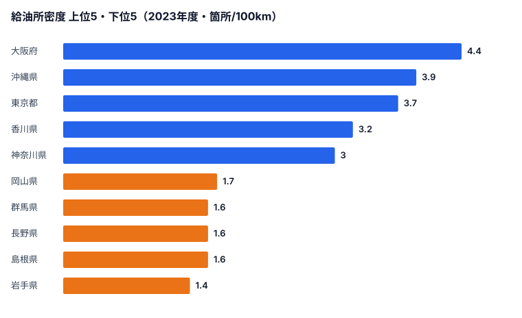

「日本の道路はどこも舗装されている」というイメージは、半分だけ正しい話です。国道や都道府県道といった主要道路の舗装率は全47都道府県で92%以上に達しています。ところが、生活に最も近い市町村道に目を向けると、[佐賀県](/areas/41000)の96.6%に対して[岩手県](/areas/03000)は59.8%しかなく、その差は約37ポイントにもなります。

道路は「ある／ない」では語れません。面積あたりどれだけ密に通っているか（密度）、その道がきちんと舗装されているか（舗装率）、そして給油所のような付帯インフラが伴っているか――この3つの軸で見ると、同じ「道路大国」のなかにくっきりとした地域差が浮かび上がります。この記事では、その差がどこから生まれるのかを順に検証していきます。

## 道路密度は関東・近畿に集中する

まず、面積1km²あたりにどれだけの道路が通っているか（道路密度）を見てみましょう。

密度が高いのは関東・近畿の都市部です。最上位は埼玉県の12.46km/km²で、東京都（11.09km/km²）、神奈川県（10.69km/km²）、[大阪府](/areas/27000)（10.39km/km²）、愛知県（9.75km/km²）が続きます。いずれも人口密度が高く、市街地が面的に広がっている地域です。狭い面積に人と建物が密集していれば、それを結ぶ道路も自然と網の目状に張り巡らされ、結果として「濃い」道路網になります。

一方、最下位は北海道のわずか1.15km/km²です。山形県（1.8km/km²）、高知県（2.01km/km²）、秋田県（2.04km/km²）、青森県（2.09km/km²）も低い水準にとどまります。これらに共通するのは、面積が大きい、あるいは山間部が多いという地形条件です。広大な土地や急峻な山地では、同じ延長の道路を敷いても1km²あたりに割り当てられる量は薄まります。つまり密度の低さは「道路が足りない」のではなく、分母である面積が大きいことの裏返しでもあります。埼玉と北海道では密度に約10.8倍もの開きがありますが、これは交通インフラの優劣ではなく、地理の構造そのものを映した数字だと読むべきです。

> [!NOTE]
> 道路密度（道路実延長／総面積）は「面積あたり」の指標です。面積の大きい北海道や山地の多い県は分母が大きいため構造的に低くなります。道路の整備水準そのものを比べたい場合は、次に見る舗装率のほうが実態に近い指標になります。

<source-link href="/ranking/road-length-per-km2">47都道府県の道路密度ランキングをもっと見る</source-link>

## 舗装率の「二重構造」――主要道はほぼ100%、市町村道は半分

主要道路（国道・都道府県道）の舗装率は、全47都道府県で92%以上です。高知県・佐賀県・宮崎県・鹿児島県などは100%に達しており、ここには地域差がほとんどありません。日本の幹線道路網は、すでに「舗装し終えた」段階にあると言えます。

ところが、市町村道に視点を移すと景色は一変します。

市町村道の舗装率は、最も高い佐賀県の96.6%から、最も低い岩手県の59.8%まで、約37ポイントもの幅があります。上位は佐賀県のほか、大阪府（96.0%）、香川県（95.3%）、滋賀県（93.4%）、山口県（92.7%）と、温暖で平坦な地域や都市部が並びます。逆に下位は岩手県（59.8%）、北海道（60.5%）、秋田県（65.6%）、茨城県（65.8%）、青森県（66.6%）で、東北と北海道が固まっています。岩手県では市町村道のおよそ4割が、いまだ未舗装のまま残っている計算になります。

この「主要道はほぼ100%なのに、市町村道は地域でこれだけ割れる」という二重構造には、二つの理由があります。一つは延長の問題です。市町村道は主要道路よりもはるかに延長が長く、全線を舗装するには莫大な予算が必要になります。財政規模の小さい自治体ほど、生活道路の隅々まで手が回りません。もう一つは気候です。融雪と凍結が繰り返される寒冷地では、舗装したアスファルトがひび割れ・破損しやすく、維持コストが温暖地より大幅に高くなります。東北・北海道が下位に集中するのは、長い延長と厳しい冬という二重の負担を抱えているためだと考えられます。

> [!WARNING]
> 市町村道舗装率の低さは「インフラ整備の怠慢」を意味するわけではありません。岩手県（59.8%）や北海道（60.5%）では、凍結・融雪サイクルによるアスファルト損傷が激しく、舗装の維持コストが温暖地より大幅に高くなります。延長の長さと気候の厳しさという構造的なコスト要因を踏まえて読む必要があります。

<source-link href="/ranking/municipal-road-paving-rate">47都道府県の市町村道舗装率ランキングをもっと見る</source-link>

<ad-slot></ad-slot>

## 給油所密度に映る「クルマ社会の足」の格差

道路インフラと表裏一体なのが、給油所（ガソリンスタンド）の存在です。道路がいくら通っていても、燃料を補給できる場所が遠ければ、特に過疎地では生活が成り立ちません。道路実延長100km当たりの給油所数を見てみましょう。

上位は大阪府（4.4箇所）、沖縄県（3.9箇所）、東京都（3.7箇所）、香川県（3.2箇所）、神奈川県（3.0箇所）で、人口が密集し需要の大きい都市部や、面積の小さい県が並びます。短い道路距離に多くの利用者がいれば、給油所のビジネスも成立しやすくなります。

対照的に下位は岩手県（1.4箇所）を最下位に、島根県・長野県・群馬県（いずれも1.6箇所）、岡山県（1.7箇所）が並びます。大阪府と岩手県では給油所密度に3倍以上の開きがあります。地方では給油所の廃業が相次ぎ、「ガソリンスタンド過疎」が社会問題化しています。長い道路に対して利用台数が少なければ、1店あたりの採算が取りにくく、撤退が進むという悪循環に陥りがちです。EV充電インフラへの転換が期待されるものの、2024年度末で全国の充電口数は約6.8万口にとどまり、2030年の目標30万口にはまだ距離があります。地方部は充電設備の採算も取りにくく、整備が後回しになりやすいのが実情です。給油所と道路の関係は、「クルマがなければ暮らせない地域ほど、燃料の足が細る」という地方インフラのジレンマを映しています。

> [!TIP]
> 道路密度・舗装率・給油所密度を重ねて読むと、地域インフラの性格が見えてきます。都市部は「密度が高く、舗装も給油網も充実」している一方、地方は「面積あたりは薄く、市町村道は未舗装が残り、給油所も遠い」という傾向が重なります。一つの指標だけでなく複数を合わせて見ると、その地域が抱える課題の輪郭がつかめます。

<source-link href="/ranking/gas-station-count-per-100km">47都道府県の給油所数ランキングをもっと見る</source-link>

<ad-slot></ad-slot>

## まとめ――「作る」から「守る」へ

3つの指標を通して見えてきたのは、次のポイントです。

- 道路密度は埼玉県（12.46km/km²）を筆頭に関東・近畿の都市部が高く、北海道（1.15km/km²）など面積の大きい県は構造的に低くなります。
- 主要道路の舗装率はほぼ100%で地域差がほとんどない一方、市町村道は佐賀県96.6%・岩手県59.8%と約37ポイントの差があり、東北・北海道が下位に集中します。
- 給油所密度は大阪府4.4箇所に対し岩手県1.4箇所と3倍以上の差があり、地方の「ガソリンスタンド過疎」が進んでいます。
- これらの地域差の多くは、整備の優劣ではなく、面積・地形・気候・財政規模といった構造的な条件を反映しています。

日本の道路政策は「作る」時代から「守る」時代への転換期を迎えています。2040年には道路橋の約75%が建設後50年以上になると試算されており、維持管理コストの増大は避けられません。道路密度や舗装率のデータは、その地域の道路インフラの「現在地」を示す基礎情報として、今後の投資判断の土台になっていくはずです。

## データ出典

本記事のデータはe-Stat（政府統計の総合窓口）の社会生活統計指標を基に作成しています。

- [社会生活統計指標（e-Stat）](https://www.e-stat.go.jp/dbview?sid=0000010208) -- 道路実延長（2023年度）、市町村道舗装率（2023年度）、給油所数（2023年度）
