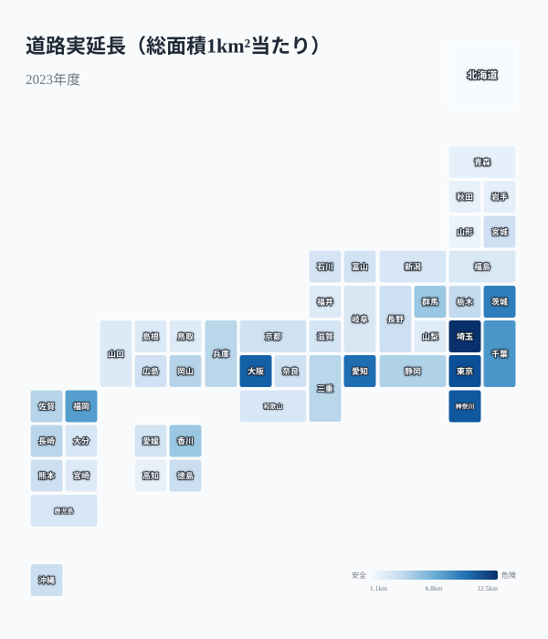
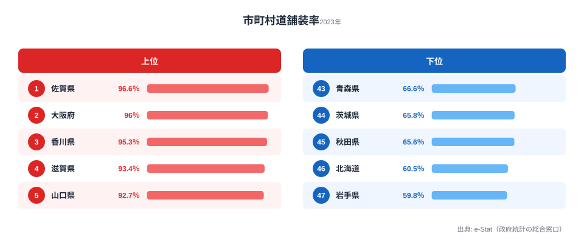

日本の主要道路は、舗装率がほぼ100%に達しています。「道路大国ニッポン」という言葉に違和感を覚える人は少ないでしょう。ところが市町村道に目を向けると、[佐賀県](/areas/41000)96.6%に対し[岩手県](/areas/03000)59.8%と、約37ポイントもの差が口を開けています。同じ国でありながら、生活道路の半分近くが未舗装の県と、ほぼ全線が舗装済みの県が併存しているのです。

この記事では、道路インフラの「現在地」を密度・舗装率・交通量の3つの軸でデータ検証します。先に結論を述べておくと、道路の格差は「量（密度）」と「質（舗装率）」で別々のパターンを描き、その背景には地形・気候・財政という構造的な要因が横たわっています。

## 道路密度マップ -- 面積あたりの道路延長

道路密度（総面積1km²当たりの道路実延長）は、関東・近畿を中心に高い値を示します。上位は埼玉県（12.5km/km²）、東京都（11.1km/km²）、神奈川県（10.7km/km²）、[大阪府](/areas/27000)（10.4km/km²）、愛知県（9.8km/km²）。いずれも人口密度が高く、市街地が連続して広がる地域です。狭い面積に多くの人と建物が集まれば、それらをつなぐ道路も網の目のように張り巡らされます。道路密度は、その県がどれだけ「市街化」しているかを映す鏡だと言えます。

一方、北海道（1.2km/km²）は広大な面積に対して道路延長が分散しており、密度は最下位です。山形県（1.8km/km²）、高知県（2.0km/km²）なども低くなっています。面積が大きい県や山間部の比率が高い県では、人が住まない森林・原野が分母を押し上げるため、構造的に密度が低く出ます。埼玉と北海道の差は10倍を超えますが、これは「道路が足りない」というより、そもそも県の成り立ちが違うことを示しています。密度の数字をそのまま「インフラの優劣」と読むと、地形の効果を見落としてしまいます。

<source-link href="/ranking/road-length-per-km2">47都道府県の道路密度ランキングをもっと見る</source-link>

> [!NOTE]
> 道路密度は「総面積1km²当たりの道路実延長」で計算しています。分母が県の総面積（森林・湖沼・原野を含む）であるため、可住地が少なく面積の広い県（北海道・山形・高知など）は実際の市街地の道路が充実していても密度は低く算出されます。「密度が低い＝道路が貧弱」とは限らない点に注意してください。

## 舗装率の二重構造

主要道路（国道・都道府県道）の舗装率は、全47都道府県で92%以上に達しています。高知県・佐賀県・宮崎県・鹿児島県では100%です。国の幹線として整備される主要道路には、もはや顕著な地域差は見られません。

しかし市町村道になると、景色が一変します。

市町村道舗装率は、佐賀県96.6%から岩手県59.8%まで幅広く分布しています。上位は佐賀県のほか、大阪府（96.0%）、香川県（95.3%）、滋賀県（93.4%）と、温暖で平坦な地域や都市部が並びます。下位は岩手県（59.8%）、北海道（60.5%）、秋田県（65.6%）、茨城県（65.8%）、青森県（66.6%）で、東北・北海道に集中しています。

なぜ主要道路では消えた格差が、市町村道では復活するのでしょうか。理由は二つあります。一つは、市町村道が圧倒的に延長が長いことです。県内の道路の大半を占める生活道路を全線舗装するには莫大な予算が必要で、自治体の財政力が問われます。もう一つは気候です。融雪・凍結を繰り返す寒冷地ではアスファルトが激しく劣化し、舗装の維持コストが温暖地より大幅に高くなります。岩手県や北海道の低い舗装率は、「整備が遅れている」というより「整備しても傷みやすく、追いつかない」構造を映しています。主要道路は国の予算で守られる一方、市町村道は地域の体力差がそのまま表に出るのです。

<source-link href="/ranking/municipal-road-paving-rate">47都道府県の市町村道舗装率ランキングをもっと見る</source-link>

> [!WARNING]
> 市町村道舗装率が低い東北・北海道では、冬期の凍結・融雪サイクルによるアスファルト損傷が激しく、舗装の維持コストが温暖地より大幅に高くなります。岩手県（59.8%）・北海道（60.5%）の低舗装率は、整備の怠慢ではなく寒冷地特有の構造的コスト問題を反映しています。逆に上位の佐賀・香川・滋賀は温暖で平坦という地理条件に恵まれている点も、単純な順位比較では見落とされがちです。

<ad-slot></ad-slot>

## 道路はあるのに使われない？

道路は「ある」だけでは意味がなく、「使われている」かどうかが価値を左右します。道路密度と交通量（12時間あたりの平均台数）の関係を散布図で確認してみましょう。

大阪府・東京都・神奈川県は、密度・交通量ともに高い右上に位置します。一方、北海道・島根県は密度も交通量も低い左下に集まります。全体としては「密度が高い県ほど交通量も多い」正の相関が確認でき、人と車が集まる場所に道路が育ち、その道路がさらに使われるという関係が読み取れます。

ただし、例外もあります。埼玉県は密度が最も高いにもかかわらず、交通量は大阪・東京を下回ります。これは、埼玉が東京のベッドタウンとして発展し、幹線よりも住宅街の生活道路が密に張り巡らされているためと考えられます[仮説]。密度の高さが必ずしも「交通の主役」を意味しないことを示す好例です。逆に過疎地域では、道路延長に対して利用台数が少なく、1台当たりの維持コストが高くなります。人口減少が進む地域で、使われない道路をどう維持し、どこから畳んでいくかは、今後ますます重い政策課題になっていくでしょう。

> [!TIP]
> 散布図は道路密度（2023年）と交通量（2020年）という年次の異なるデータを重ねています。年次のズレを念頭に置きつつ、各県が「密度の割に使われているか／いないか」という相対的な位置で読むと、単なる順位以上の示唆が得られます。

## ガソリンスタンド過疎とドライバーの足

道路インフラと密接に関わるのが、給油所の密度です。道路実延長100km当たりの給油所数は、大阪府4.4箇所に対し岩手県1.4箇所と、3倍以上の差があります。道路は通っていても、車を動かし続けるための「補給拠点」が薄い地域があるのです。

地方では給油所の廃業が相次ぎ、「ガソリンスタンド過疎」が社会問題化しています。給油のために片道数十分を要する集落も珍しくありません。EV充電インフラへの転換が期待されますが、2024年度末時点で全国の充電口数は約6.8万口にとどまり、2030年の目標30万口にはまだ遠いのが現状です。地方部は充電設備の採算が取りにくく、整備が後回しになりやすいため、燃料供給の空白が解消されないまま残るおそれがあります。道路そのものの密度・舗装率だけでなく、その道路を「走り続けられるか」という観点も、地域のモビリティを評価するうえで欠かせません。

<source-link href="/ranking/gas-station-count-per-100km">47都道府県の給油所数ランキングをもっと見る</source-link>

<ad-slot></ad-slot>

## まとめ

道路インフラのデータから、以下のポイントが見えてきました。

道路の格差は「量」と「質」で別々の地図を描きます。密度（量）は人口の集中する関東・近畿が圧倒し、舗装率（質）は寒冷地ほど苦戦するという、まったく異なるパターンでした。日本の道路政策は「作る」時代から「守る」時代へと転換期を迎えています。2040年には道路橋の約75%が建設後50年以上になると試算されており、維持管理コストの増大は避けられません。密度や舗装率のデータは、その地域の道路インフラの「現在地」を示す基礎情報として、今後の投資判断に活用できるはずです。インフラ全体の地域差を俯瞰したい方は[インフラ分野のランキング一覧](/category/infrastructure)も合わせてご覧ください。

## データ出典

- [社会生活統計指標（e-Stat）](https://www.e-stat.go.jp/dbview?sid=0000010208) -- 道路実延長（2023年度）、市町村道舗装率（2023年度）、道路平均交通量（2020年度）、給油所数（2023年度）

本記事のデータは、e-Stat（政府統計の総合窓口）を経由して整備された統計を基に作成しています。
