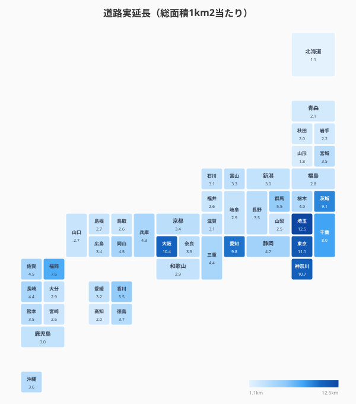
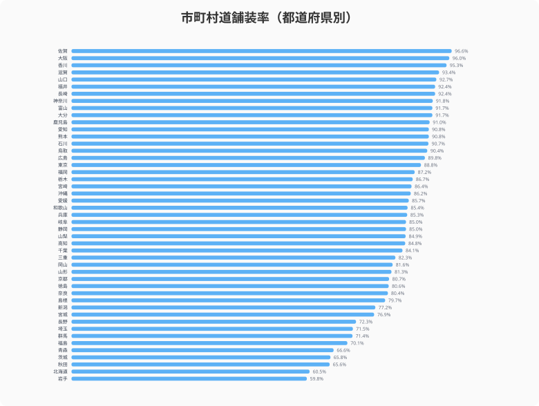
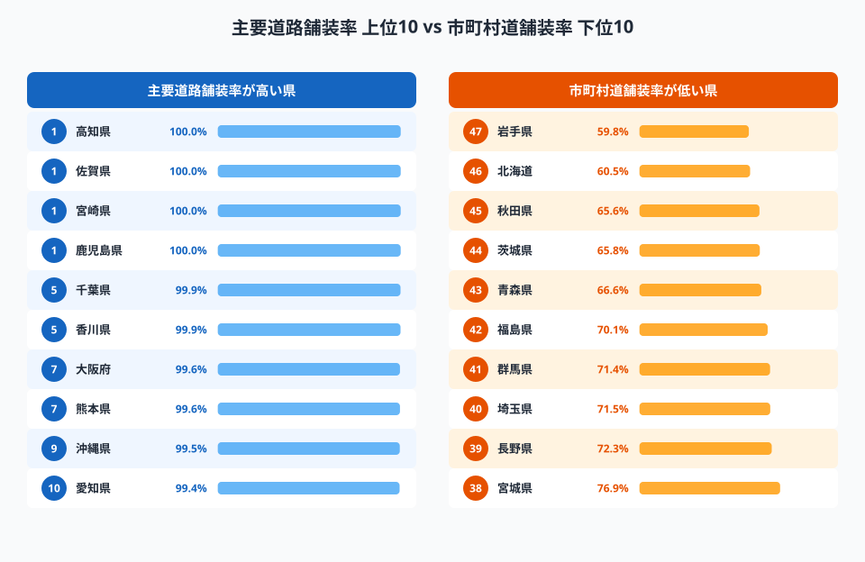
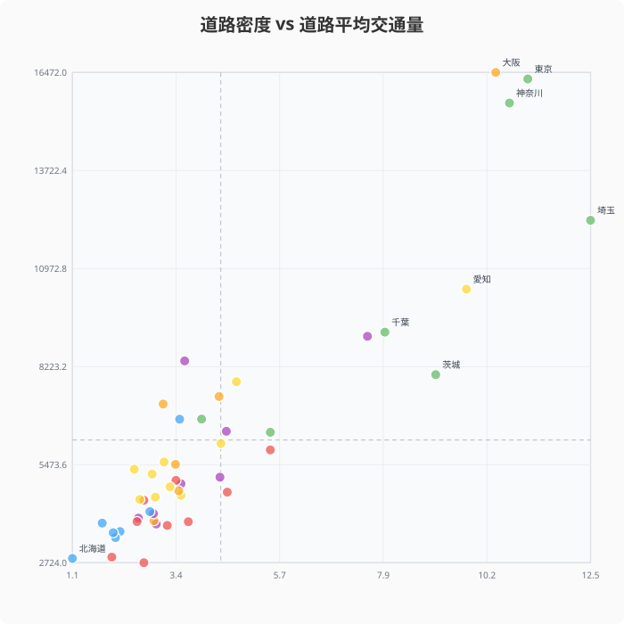
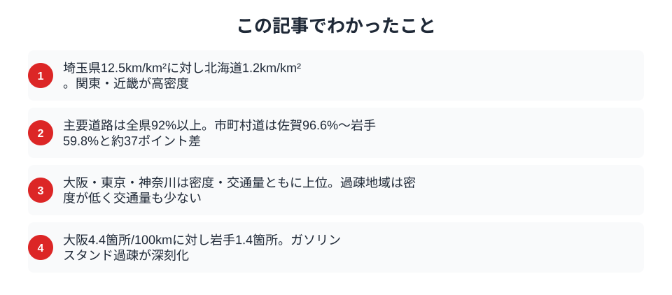

日本の主要道路は舗装率がほぼ100%に達している。しかし市町村道に目を向けると、[佐賀県](/areas/41000)96.6%に対し[岩手県](/areas/03000)59.8%と約37ポイントの差がある。「道路大国ニッポン」の実像を、密度・舗装率・交通量の3つの軸でデータ検証する。

## 道路密度マップ -- 面積あたりの道路延長

道路密度（総面積1km2当たりの道路実延長）は、関東・近畿を中心に高い値を示す。上位は埼玉県（12.5km/km2）、東京都（11.1km/km2）、神奈川県（10.7km/km2）、[大阪府](/areas/27000)（10.4km/km2）、愛知県（9.8km/km2）。いずれも人口密度が高く、市街地が広がる地域だ。

一方、北海道（1.2km/km2）は広大な面積に対して道路延長が分散しており、密度は最下位。山形県（1.8km/km2）、高知県（2.0km/km2）なども低い。面積が大きい県や山間部が多い県は構造的に密度が低くなる。

<source-link href="/ranking/road-length-per-km2">47都道府県の道路密度ランキングをもっと見る</source-link>

## 舗装率の二重構造

主要道路（国道・都道府県道）の舗装率は全47都道府県で92%以上。高知県・佐賀県・宮崎県・鹿児島県は100%に達している。ここには顕著な格差は見られない。

しかし市町村道になると景色が一変する。

市町村道舗装率は佐賀県96.6%から岩手県59.8%まで幅広い。上位は佐賀県のほか、大阪府（96.0%）、香川県（95.3%）、滋賀県（93.4%）と、温暖で平坦な地域や都市部が並ぶ。下位は岩手県（59.8%）、北海道（60.5%）、秋田県（65.6%）、茨城県（65.8%）、青森県（66.6%）と東北・北海道が集中する。

この「二重構造」は、自治体の財政力と維持管理コストに起因する。融雪・凍結によるアスファルト劣化が激しい寒冷地では、維持コストが高くなる。加えて市町村道は延長が長いため、全線舗装には莫大な予算が必要だ。

> [!WARNING]
> 市町村道舗装率が低い東北・北海道では、冬期の凍結・融雪サイクルによるアスファルト損傷が激しく、舗装の維持コストが温暖地より大幅に高い。岩手県（59.8%）・北海道（60.5%）の低舗装率はこの構造的コスト問題を反映している。

<source-link href="/ranking/municipal-road-paving-rate">47都道府県の市町村道舗装率ランキングをもっと見る</source-link>

<ad-slot></ad-slot>

## 道路はあるのに使われない？

道路密度と交通量（12時間あたりの平均台数）の関係を散布図で確認する。

> [!NOTE]
> 道路密度は2023年、道路平均交通量は2020年のデータです。年次が異なる点にご留意ください。

大阪府・東京都・神奈川県は密度・交通量ともに高い右上に位置する。一方、北海道・島根県は密度も交通量も低い左下に集まる。密度が高い県は交通量も多い正の相関が確認できるが、埼玉県は密度が最も高いにもかかわらず交通量は大阪・東京を下回る。ベッドタウンとして住宅街の生活道路が多いためと考えられる。

過疎地域では道路延長に対して利用台数が少なく、1台当たりの維持コストが高くなる。人口減少が進む地域で既存道路をどう維持するかは、今後ますます重要な政策課題になる。

## ガソリンスタンド過疎とドライバーの足

道路インフラと密接に関わるのが給油所の密度だ。道路実延長100km当たりの給油所数は、大阪府4.4箇所に対し岩手県1.4箇所と3倍以上の差がある。

地方では給油所の廃業が相次ぎ、「ガソリンスタンド過疎」が社会問題化している。EV充電インフラへの転換が期待されるが、2024年度末で全国の充電口数は約6.8万口にとどまり、2030年の目標30万口にはまだ遠い。地方部は充電設備の採算が取りにくく、整備が後回しになりやすい。

<source-link href="/ranking/gas-station-count-per-100km">47都道府県の給油所数ランキングをもっと見る</source-link>

<ad-slot></ad-slot>

## まとめ

道路インフラのデータから、以下のポイントが見えてきた。

日本の道路政策は「作る」時代から「守る」時代へと転換期を迎えている。2040年には道路橋の約75%が建設後50年以上になると試算されており、維持管理コストの増大は避けられない。道路密度や舗装率のデータは、その地域の道路インフラの「現在地」を示す基礎情報として、今後の投資判断に活用できるはずだ。

**データ出典:**
- [社会生活統計指標（e-Stat）](https://www.e-stat.go.jp/dbview?sid=0000010208) -- 道路実延長（2023年）、舗装率（2023年）、道路平均交通量（2020年）、給油所数（2023年）

## データ出典

本記事のデータはe-Stat（政府統計の総合窓口）を基に作成しています。
