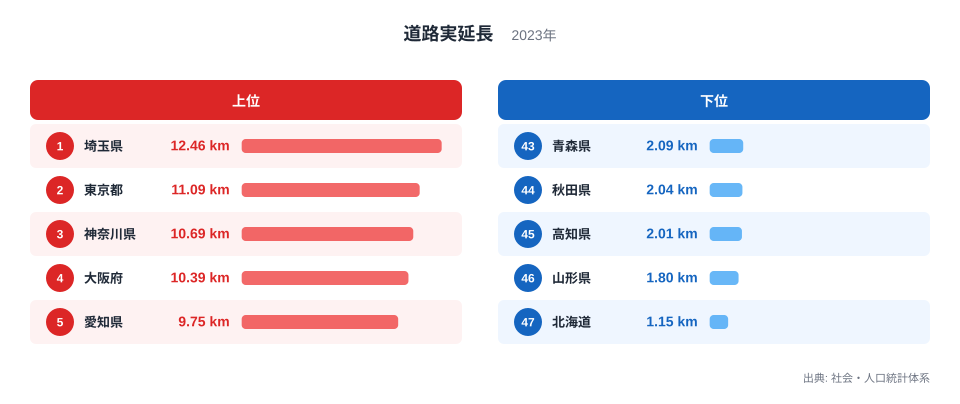
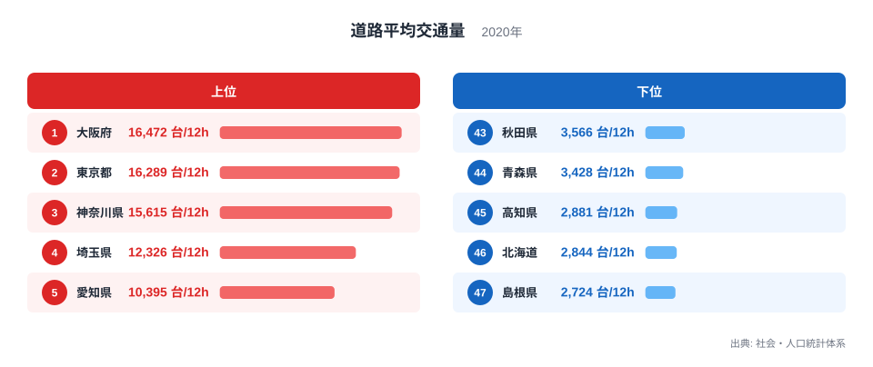
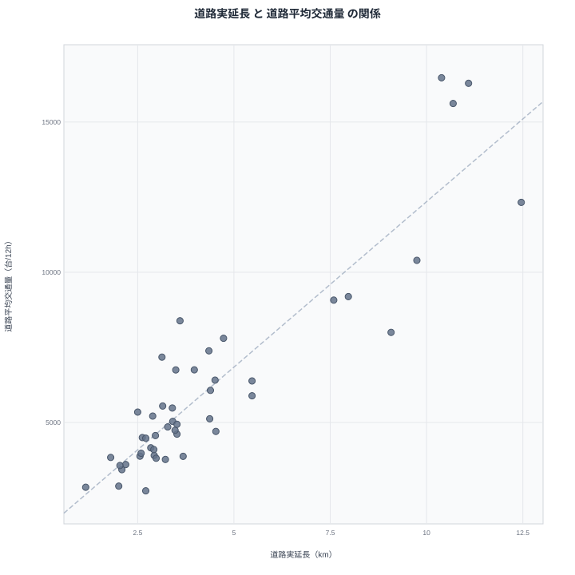

道路実延長が最も密なのは埼玉県で1平方キロメートル当たり12.46キロメートルです。同じ埼玉県は道路平均交通量でも12時間当たり12,326台と、全国で4番目に多い水準にあります。1平方キロメートル当たりの道路の長さを示す道路実延長と、実際に道路を走る車の量を示す道路平均交通量が、なぜこれほど同じ都府県で高くなるのでしょうか。この記事ではその関係を見ていきます。

## 道路実延長の上位と下位

<source-link href="/ranking/road-length-per-km2">道路実延長ランキングをもっと見る</source-link>

道路実延長は埼玉県が1平方キロメートル当たり12.46キロメートルで全国1位です。2位は東京都で11.09キロメートル、3位は神奈川県で10.69キロメートル、4位は大阪府で10.39キロメートル、5位は愛知県で9.75キロメートルとなっています。上位には首都圏と近畿圏の都府県が並んでいます。

一方で下位を見ると、北海道が1.15キロメートルで最下位です。46位は山形県で1.8キロメートル、45位は高知県で2.01キロメートル、44位は秋田県で2.04キロメートル、43位は青森県で2.09キロメートルとなっています。面積が広い道県や、人口密度が低い地方圏の県が下位に集まっています。

道路実延長は面積当たりの密度で計算される指標であるため、単純な道路の総延長ではなく、限られた土地の中にどれだけ道路網が張り巡らされているかを示しています。人口や事業所が集中する都市部では、生活道路や幹線道路が細かく整備される必要があり、面積当たりの道路密度が高くなる傾向があります。

## 道路平均交通量の上位と下位

あわせて見る: [道路平均交通量ランキング](/ranking/average-road-traffic-volume)

道路平均交通量は大阪府が12時間当たり16,472台で全国1位です。2位は東京都で16,289台、3位は神奈川県で15,615台、4位は埼玉県で12,326台、5位は愛知県で10,395台となっています。道路実延長の上位県とほぼ同じ顔ぶれが、道路平均交通量でも上位を占めていることが分かります。

下位を見ると、島根県が2,724台で最下位です。46位は北海道で2,844台、45位は高知県で2,881台、44位は青森県で3,428台、43位は秋田県で3,566台となっています。道路実延長の下位県だった北海道、青森県、秋田県、高知県が、道路平均交通量でも軒並み下位に位置しています。

道路実延長の上位に並んだ埼玉県、東京都、神奈川県、大阪府、愛知県という顔ぶれは、道路平均交通量の上位に並んだ大阪府、東京都、神奈川県、埼玉県、愛知県という顔ぶれとまったく同じ5都府県です。順位の並びは入れ替わっていますが、両指標の上位を占める地域が重なっていることから、強いつながりがあることがうかがえます。

## 2つの指標の相関を見る

散布図では、道路実延長が高い都府県ほど道路平均交通量も多いという明確な傾向が見て取れます。大阪府、東京都、神奈川県、埼玉県、愛知県は右上に集まっており、道路密度と交通量の両方で突出した位置にあります。一方で北海道、青森県、秋田県、高知県、山形県のように道路実延長が低い県は、道路平均交通量でも左下に位置しています。

> [!WARNING]
> この相関は「道路を増やせば交通量が増える」という単純な因果関係を示すものではありません。道路実延長は2023年、道路平均交通量は2020年のデータであり、調査年が異なる点にも注意が必要です。両指標がともに高くなる背景には、人口密度や都市化の度合いという別の要因が存在すると考えられます。

大都市圏では人口や事業所が密集しているため、通勤や物流のための移動需要が大きく、道路交通量が自然と多くなります。同時に、その需要を支えるために道路網も密に整備される必要があり、面積当たりの道路実延長も高くなります。つまり、道路実延長と道路平均交通量は、それぞれ独立に「人口密度の高さ」という共通の土台の上で決まっている可能性が高いのです。

## なぜこの相関が生まれるのか

道路実延長と道路平均交通量が強く連動する最大の理由は、どちらも人口や経済活動の密集度と結びついているためです。人口が密集する大都市圏では、住民の移動や物流のための道路需要が大きく、それに応じて道路網も密に整備されます。結果として、道路が密であるほど、そこを走る車の量も多くなるという関係が生まれます。

一方で北海道のように面積が広く人口密度が低い道県では、道路の総延長自体は長くても、面積で割った密度としては低くなります。同時に、人口が少なく移動需要も分散しているため、1本あたりの道路が受け止める交通量も少なくなる傾向があります。

> [!TIP]
> 道路密度と交通量の関係を見るときは、都市部の混雑と地方部の余裕という対比だけでなく、道路がどのような目的で整備されているか（生活道路か幹線道路か）にも目を向けると、より立体的な理解につながります。

## まとめ

道路実延長と道路平均交通量は、都道府県別に見ると強い相関を示す2つの指標です。埼玉県は道路実延長で12.46キロメートルの全国1位、道路平均交通量でも12,326台の4位となっています。一方で北海道は道路実延長が1.15キロメートルで最下位、道路平均交通量も2,844台で下位に位置しています。

> [!NOTE]
> 道路実延長の単位は1平方キロメートル当たりのキロメートル、道路平均交通量の単位は12時間当たりの台数です。どちらも密度や交通量を示す指標であり、道路の総延長や総交通量そのものを表すものではありません。

人口密度と都市化の度合いという共通の要因が、この2つの指標を連動させていると考えられます。道路がどれだけ密に整備されているかと、そこをどれだけ多くの車が走っているかは、地域の人口構造というつながりを通じて重なって見えることが分かります。

より詳しいデータを確認したい場合は、[道路平均交通量ランキング](/ranking/average-road-traffic-volume)や[同じカテゴリの統計一覧](/category/landweather)もあわせてご覧ください。両指標でともに上位となった[埼玉県のデータ](/areas/11000)や[東京都のデータ](/areas/13000)では、他の統計との関係もさらに詳しく見ることができます。

## データ出典

道路実延長は社会・人口統計体系の2023年データ、道路平均交通量は社会・人口統計体系の2020年データを使用しています。
