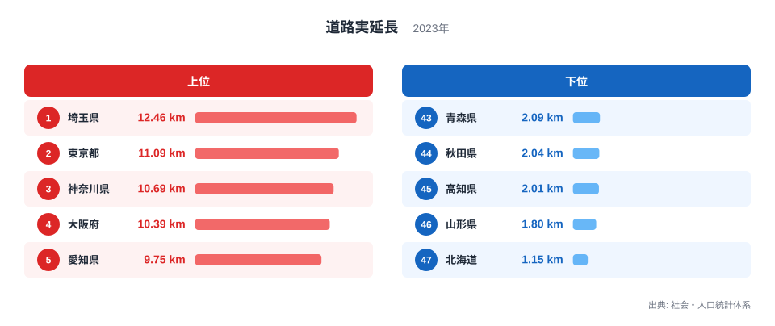
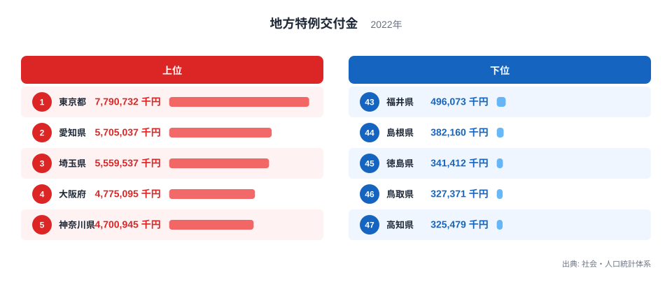
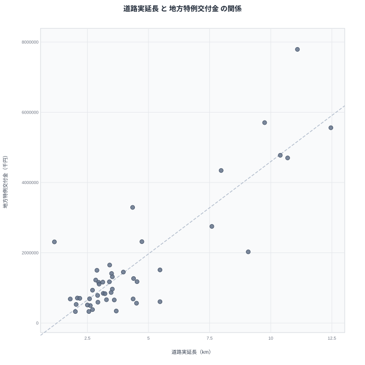

面積あたりの道路の長さが多い県は、国からの地方特例交付金も多いのでしょうか。一見すると無関係に見える2つの指標ですが、都道府県別のデータを並べてみると、どちらも都市部で数値が高くなる傾向があります。この記事では、2023年の道路実延長と2022年の地方特例交付金のデータを使い、両者の関係を散布図で確認しながら、見かけの相関の裏にどのような真因があるのかを読み解いていきます。

> [!NOTE]
> ここで扱う道路実延長は、都道府県の面積あたりに換算した道路の長さを示す指標です。単純な道路の総延長ではなく、面積に対してどれだけ道路が張り巡らされているかという密度を表しています。

## 道路実延長ランキング - 都市部ほど高密度な道路網

2023年の道路実延長で全国1位となったのは埼玉県で、12.46kmという数値になっています。2位は東京都の11.09km、3位は神奈川県の10.69km、4位は大阪府の10.39km、5位は愛知県の9.75kmと続いており、上位はいずれも人口が密集した都市部の県です。埼玉県の他の統計は[埼玉県のデータ](/areas/11000)から、東京都の統計は[東京都のデータ](/areas/13000)から確認できます。

<source-link href="/ranking/road-length-per-km2">道路実延長ランキングをもっと見る</source-link>

一方で最下位の47位は北海道の1.15kmで、46位の山形県は1.8km、45位の高知県は2.01km、44位の秋田県は2.04km、43位の青森県は2.09kmとなっています。北海道は道路の総延長そのものは全国でも有数の長さがありますが、面積が非常に広いため、面積あたりの密度に換算すると全国最下位になります。この点からも、この指標が「道路がどれだけ整備されているか」よりも「面積に対してどれだけ道路が密集しているか」を示す指標であることが分かります。

## 地方特例交付金ランキング - 人口規模の大きい都市圏に集中

地方特例交付金は、東京都が7,790,732千円で全国1位となっており、2位の愛知県5,705,037千円、3位の埼玉県5,559,537千円、4位の大阪府4,775,095千円、5位の神奈川県4,700,945千円と続いています。上位には人口の多い都市圏の府県が並んでおり、道路実延長のランキングと重なる県が目立ちます。

興味深いのは10位の北海道で、2,310,378千円と道路実延長では最下位だったにもかかわらず、地方特例交付金では上位に入っています。地方特例交付金は住宅ローン控除など国の税制措置によって減少した地方税収を補うための交付金で、人口規模や税収の大きさに応じて配分される仕組みになっています。北海道は面積が広いために道路密度こそ低いものの、札幌市を中心に人口が多いため、交付金の額は大きくなっていると考えられます。全国の交付金ランキングは[地方特例交付金ランキング](/ranking/local-special-grant-prefecture)で確認できます。

> [!WARNING]
> 道路実延長は2023年、地方特例交付金は2022年のデータであり、調査年が完全には一致していません。また、地方特例交付金は年度ごとの税制改正の影響を受けやすく、単年の数値だけで恒久的な傾向と判断しないよう注意してください。

## 2指標の相関を散布図で見る - 見かけの相関と真因

道路実延長と地方特例交付金の関係を散布図にすると、右肩上がりの傾向がはっきりと見て取れます。単純な相関係数を計算すると0.87に近い高い値になり、道路密度が高い県ほど交付金も多いという関係が強く現れています。

しかし、この相関をそのまま「道路が多いから交付金が増える」あるいは「交付金で道路を整備している」と読むのは早計です。[仮説] 両指標に共通して影響しているのは、人口規模や都市化の度合いという第三の要因である可能性があります。実際に、県の人口規模を統制したうえで計算した偏相関係数は0.50程度にとどまり、単純な相関係数よりも大きく下がります。これは、見かけの相関のうち相当部分が人口規模という共通の背景で説明できることを示唆しており、道路実延長そのものが交付金の額を直接左右しているとは言い切れません。この点はさらに他の財政指標と合わせた検証が必要です。

> [!TIP]
> 散布図で右肩上がりの関係が見えても、それだけで一方が他方の原因だと決めつけないことが大切です。北海道のように、片方の指標では突出して低く、もう片方では上位に入る県に注目すると、単純な相関の裏にある別の要因に気づきやすくなります。

道路や交付金など地域の基盤に関する統計は[同じカテゴリの統計一覧](/category/landweather)からまとめて確認できます。

## まとめ

- 道路実延長の1位は埼玉県の12.46kmで、面積の広い北海道は47位の1.15kmにとどまっています
- 地方特例交付金の1位は東京都の7,790,732千円で、愛知県、埼玉県、大阪府、神奈川県が上位に続いています
- 北海道は道路実延長で最下位ながら、地方特例交付金では10位と対照的な結果になっています
- 2指標の単純な相関係数は0.87に近い一方、人口規模を統制した偏相関係数は0.50程度に下がります
- 相関の背景には人口規模という共通の要因がある可能性があり、道路実延長が交付金を直接左右するとは言い切れません

## データ出典

出典: 社会・人口統計体系（総務省統計局）。道路実延長は2023年、地方特例交付金は2022年のデータです。
