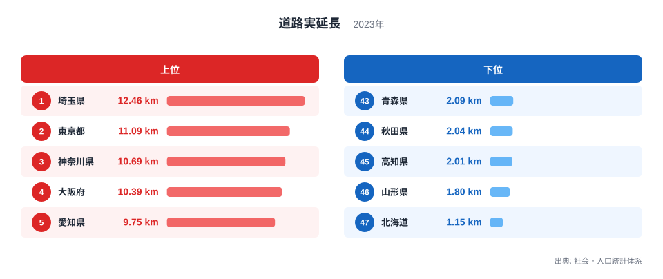
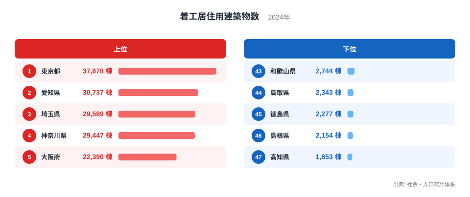
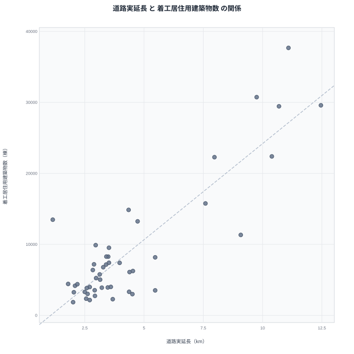

面積あたりの道路実延長が長い県と、着工する住宅建築物の数が多い県には、重なりが見られます。社会・人口統計体系のデータを突き合わせると、道路密度1位の埼玉県は住宅着工数でも3位に入り、着工数1位の東京都は道路密度でも2位です。この記事では2つの指標を並べ、なぜこうした重なりが生まれるのかを整理します。

## 道路実延長が長い県、短い県

<source-link href="/ranking/road-length-per-km2">道路実延長ランキングをもっと見る</source-link>

2023年の道路実延長を見ると、埼玉県は12.46キロメートルで1位です。2位は東京都で11.09キロメートル、3位は神奈川県で10.69キロメートル、4位は大阪府で10.39キロメートル、5位は愛知県で9.75キロメートルと続きます。上位には首都圏と近畿圏の都府県が並んでいます。

下位を見ると、北海道は1.15キロメートルで47位です。46位は山形県で1.8キロメートル、45位は高知県で2.01キロメートル、44位は秋田県で2.04キロメートル、43位は青森県で2.09キロメートルとなっています。北海道は面積が広大なため、道路が延びていても面積あたりの密度としては低く出やすい構造になっています。

6位から10位を見ると、茨城県は9.08キロメートルで6位、千葉県は7.97キロメートルで7位、福岡県は7.59キロメートルで8位、群馬県と香川県がともに5.47キロメートルで9位と10位に並んでいます。首都圏近郊の県が上位10県の大半を占めていることがわかります。

> [!NOTE]
> この指標は面積あたりの道路実延長であり、道路の総延長そのものではありません。面積が広い県は総延長が長くても密度としては低く算出されるため、単純な整備状況の比較には向いていません。

## 着工居住用建築物数が多い県、少ない県

続いて、2024年の着工居住用建築物数を見てみます。東京都は3万7678棟で1位です。2位は愛知県で3万737棟、3位は埼玉県で2万9589棟、4位は神奈川県で2万9447棟、5位は大阪府で2万2390棟と続きます。道路実延長のランキングとほぼ同じ都府県が上位に並んでいます。

下位に目を移すと、高知県は1853棟で47位です。46位は島根県で2154棟、45位は徳島県で2277棟、44位は鳥取県で2343棟、43位は和歌山県で2744棟となっています。人口規模の小さい県が下位に集中しています。

> [!WARNING]
> 着工居住用建築物数は人口規模の影響を強く受ける指標です。人口が多い都府県ほど新築の需要も大きくなるため、この数値だけを住宅投資の活発さの指標として単独で読むと誤解を招きます。

## 2つの指標の関係を散布図で見る

散布図を見ると、右肩上がりの傾向がはっきりと表れています。道路実延長の密度が高い県ほど着工居住用建築物数も多く、密度が低い県ほど着工数も少ないという関係です。ただし、これは相関であって因果関係ではありません。

この相関の背景には、人口密度という共通の要因があると考えられます。人口が集中している都府県では、道路網が細かく張り巡らされていて面積あたりの実延長が長くなりやすく、同時に住宅需要も大きいため着工件数も多くなります。つまり、道路が住宅の着工を呼び込んでいるのでも、住宅需要が道路を延ばしているのでもなく、どちらも人口密度の高さという共通の土台から生まれている数字だと考えるほうが自然です。

> [!TIP]
> 面積あたりの密度指標と絶対数の指標を比べるときは、人口密度という共通の背景を意識すると、見かけの相関に惑わされにくくなります。今回のケースでは首都圏・近畿圏への人口集中がその背景にあたります。

散布図の右上には埼玉県・東京都・神奈川県・大阪府・愛知県が集まっており、道路密度と着工件数の両方で高い水準を示しています。左下には北海道・山形県・高知県・秋田県・青森県のように、どちらの指標でも低い水準にとどまる道県が位置しています。この2つの塊のはっきりとした分かれ方は、都市圏と地方圏という日本の土地利用の大枠をそのまま映し出していると言えます。

## 面積の違いが両方の数字を左右する

[着工居住用建築物数ランキング](/ranking/residential-building-starts)を単独で見ると、東京都・愛知県・埼玉県・神奈川県・大阪府という大都市圏の顔ぶれが並び、道路実延長のランキングとの重なりがより鮮明にわかります。[埼玉県のデータ](/areas/11000)を確認すると、面積は全国的に見て中規模でありながら人口密度が高く、道路網が密に整備されている実情がうかがえます。同様に[東京都のデータ](/areas/13000)でも、面積は狭いものの人口と経済活動が極度に集中しているため、道路密度と住宅着工数の両方で上位に入っていると考えられます。[同じカテゴリの統計一覧](/category/landweather)から関連する国土系の指標もあわせて確認すると、地域ごとの土地利用の違いがより具体的に見えてきます。

道路実延長の密度と着工居住用建築物数は、どちらも人口や経済活動がその土地にどれだけ集まっているかを映す指標です。面積の広さという物理的な条件を踏まえたうえで比較すると、単なる数字の大小以上に、その地域の土地利用の実態が見えてきます。

北海道のように面積が広い道県は、道路密度では下位に沈んでも、着工居住用建築物数では9位で1万3480棟と上位10県に入っています。この食い違いは、面積あたりの密度と絶対数という2つの見方が、同じ都道府県でもまったく違う順位を生み出すことを示しています。ランキングを読むときは、その指標が「面積で割った密度」なのか「単純な合計」なのかを意識することが欠かせません。

## データ出典

出典: 社会・人口統計体系（総務省統計局）
道路実延長: 2023年
着工居住用建築物数: 2024年
