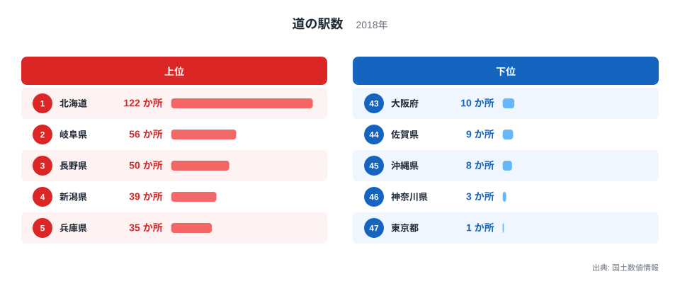
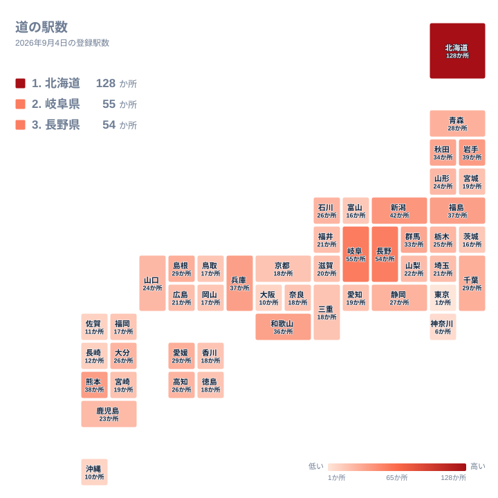

長距離のドライブ中に立ち寄る道の駅は、休憩や地域の特産品との出会いの場として親しまれており、旅の途中の楽しみのひとつになっています。国土数値情報の道の駅データを都道府県別に見ると、広大な面積を持つ地方の県に集中し、大都市圏では驚くほど数が少ないという、はっきりとした偏りが見えてきます。

## 上位と下位を分ける差

<source-link href="/ranking/roadside-station-count">道の駅数ランキングをもっと見る</source-link>

全国で最も道の駅が多いのは北海道で、122か所を数えます。2位の岐阜県が56か所、3位の長野県が50か所であることを考えると、北海道の数字がいかに大きいかがわかります。4位は新潟県の39か所、5位は兵庫県の35か所と続き、いずれも山間部や広い農村地域を抱える県が上位に並んでいます。

6位の和歌山県も34か所と上位に食い込んでいます。紀伊半島南部の険しい山地を縫うように国道が延び、熊野古道をはじめとする観光地への長いドライブルートが県内に広がっていることが、休憩と物産販売を兼ねる道の駅の必要性を高めてきたと考えられます。

一方、道の駅が最も少ないのは東京都で、わずか1か所にとどまります。46位の神奈川県は3か所、45位の沖縄県は8か所、44位の佐賀県は9か所、43位の大阪府は10か所と続き、都市化が進んだ地域や国土の中で比較的小さな面積の地域が下位に集まっています。上位の北海道と最下位の東京都の差は100倍を超えており、同じ道路網の国でも、道の駅という施設の必要性がこれほど違うことに驚かされます。

同じ首都圏でも、県によって順位には差があります。埼玉県は20か所で25位に入っており、3か所で46位にとどまる神奈川県とは対照的です。埼玉県は秩父地方や県北部に農業地帯が広がっており、地元産の野菜や果物を販売する拠点として道の駅が整備されてきました。都市化が進んだ神奈川県とは異なり、埼玉県には農地を抱える地域が広く残っている点が、この差につながっていると考えられます。

> [!NOTE]
> 道の駅は国土交通省の登録制度にもとづいて設置される休憩施設で、駐車場やトイレに加えて地域振興のための物産販売所を備えていることが特徴です。単なる休憩スペースとは異なり、市町村からの申請と登録を経て初めて道の駅として数えられます。同じような機能を持つ民間の休憩施設は、この数には含まれません。

## 地理でみる分布

地図で見ると、道の駅が多い地域は北海道と中部地方の山間県、そして東北から九州にかけての農村地域に広く分布していることがわかります。北海道は市街地と市街地の間の距離が長く、コンビニエンスストアなどの生活インフラも都府県に比べて少ないため、長距離移動の途中で休憩できる拠点として道の駅の役割が特に大きくなっています。岐阜県や長野県のように山地が多い県でも、峠道や山間の集落をつなぐ道路沿いに、地域の特産品を発信する拠点として道の駅が数多く整備されてきました。

順位の中ほどにも意外な顔ぶれがあります。愛知県は16か所で32位にとどまっており、県の面積や農業産出の規模を考えるとやや低めの順位です。愛知県には高速道路のサービスエリアやパーキングエリアが数多く整備されており、ドライバーの休憩需要の一部をこれらの施設がすでに担っていることが、道の駅を新たに整備する必要性をそれほど高めなかった一因になっていると考えられます。

対照的に、東京都や神奈川県、大阪府のように人口が集中する都市部では、道の駅そのものが少なくなっています。都市部ではコンビニエンスストアや商業施設が密集しており、長距離ドライブの休憩拠点としての需要が相対的に小さいことに加えて、大きな駐車場や物産販売所を備えた施設を新たに建設できる土地も限られています。

> [!WARNING]
> このデータは2018年時点の国土数値情報にもとづいています。道の駅は現在も新規登録が続いている制度であるため、最新の登録数とは差がある可能性があります。集計年が比較的古い点には注意してください。

## なぜこの順位になるのか

道の駅という制度が生まれた背景には、地方の道路沿いに休憩と地域振興を兼ねた拠点を作るという狙いがありました。北海道や岐阜県、長野県のように広い面積と豊かな農産物・特産品を持つ地域では、道の駅が観光振興や農産物の直売の場として積極的に活用されてきました。兵庫県が35か所で5位に入っているのも、日本海側から瀬戸内側まで広がる県土の中で、地域ごとの特産品を発信する拠点が各地に必要とされてきたためだと考えられます。

一方、東京都や神奈川県のような大都市圏では、そもそも道の駅が担うような休憩機能や物産販売の役割を、コンビニエンスストアや駅ビル、商業施設が代替しています。[観光関連の統計一覧](/category/tourism)を見ると、宿泊や観光にまつわる他の指標でも、都市部と地方の需要の違いが表れています。道の駅数1位の[北海道のデータ](/areas/01000)と、2位の[岐阜県のデータ](/areas/21000)をあわせて見ると、広い面積と山間地形が道の駅の多さに直結している様子がより具体的にわかります。

> [!TIP]
> 道の駅数を読むときは、単に多い・少ないだけでなく、その県の市街地間の距離や、コンビニエンスストアなど代替インフラの密度もあわせて考えると、なぜそこに道の駅が必要とされてきたのかという背景が見えやすくなります。観光地への主要ルート沿いかどうかも、あわせて確認すると理解が深まります。

45位の沖縄県が8か所にとどまっているのも興味深い点です。観光客の多い県ではありますが、本島内の移動距離は北海道に比べて短く、長距離ドライブの休憩拠点を数多く必要とする地理条件とは異なります。観光客の受け皿としては、道の駅よりもリゾート施設や個別の土産物店が担っている面が大きいと考えられます。

新潟県が39か所で4位に入っているのも、日本海側に長く伸びる県土の中で、地域ごとの拠点として道の駅が分散配置されてきたことを反映しています。大阪府が10か所で43位にとどまっているのは、都市化が進んだ平野が県土の中心を占め、そもそも道の駅を新設できる土地が限られていることが背景にあります。面積の広さと都市化の程度が、そのまま道の駅の数という形で表れているのが、このランキングの特徴です。

## まとめ

- 道の駅数の1位は北海道で122か所、最下位は東京都の1か所で、その差はきわめて大きくなっています。
- 2位は岐阜県の56か所、3位は長野県の50か所で、いずれも山間地域を抱えています。
- 4位は新潟県の39か所、5位は兵庫県の35か所です。
- 神奈川県は3か所で46位、大阪府は10か所で43位と、都市部の道の駅は少なくなっています。
- 道の駅が多い地域は面積が広く農村地域を抱える県に集中し、都市化が進んだ地域ほど数が少なくなっています。
- 愛知県は16か所で32位、沖縄県は8か所で45位と、経済規模や観光需要が大きくても道の駅数が伸びない例もあります。

## データ出典

- 国土数値情報（2018年）
