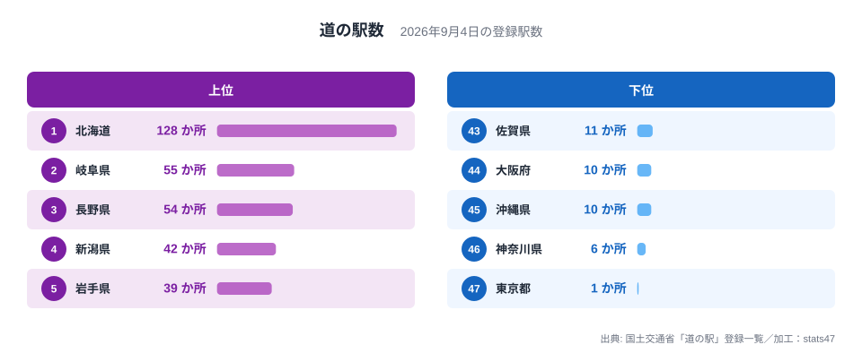
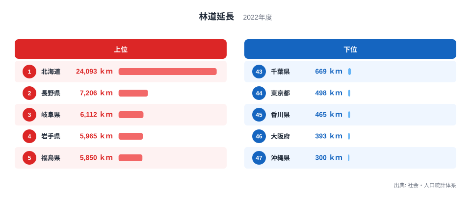
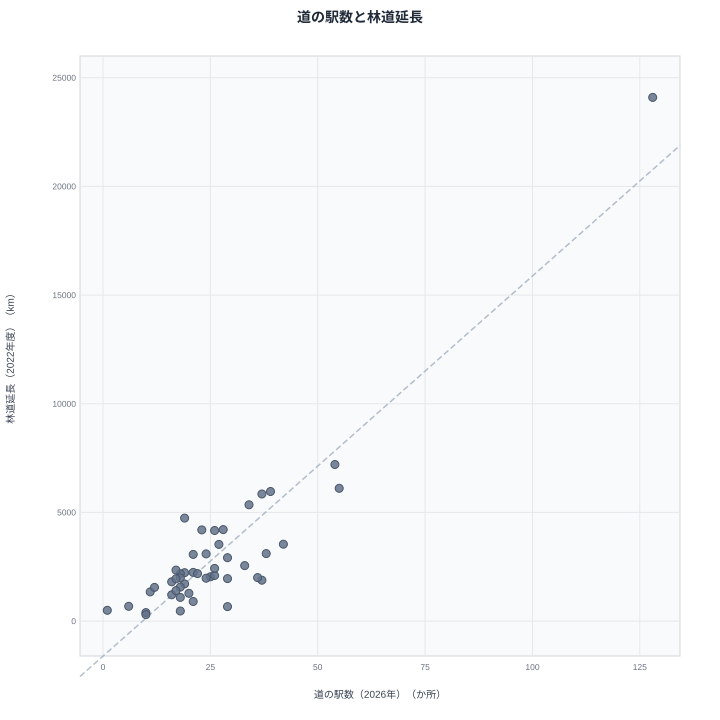

道の駅と聞くと、ドライブ中の休憩や地域の物産販売のイメージが強い施設です。旅の途中でふらりと立ち寄る場所として、多くの人に親しまれています。一方の林道は、山林の管理や木材の搬出のために整備される道路で、一般の観光客が意識することはあまりありません。まったく用途の異なるこの2つのインフラですが、都道府県別に数値を並べてみると、両方とも同じ県で多く、同じ県で少ないという、はっきりとした重なりが見えてきます。

## 道の駅数から見る出発点

<source-link href="/ranking/roadside-station-count">道の駅数ランキングをもっと見る</source-link>

道の駅の数は北海道が122か所で1位、岐阜県が56か所で2位、長野県が50か所で3位です。最も少ないのは東京都の1か所で、神奈川県の3か所、沖縄県の8か所と続きます。上位には広い山間地を抱える県が並び、下位には都市化が進んだ県や島しょ部の県が並んでいます。

> [!NOTE]
> 道の駅は国土交通省の登録制度にもとづく休憩・物産販売施設で、2018年時点の国土数値情報から集計しています。一方の林道延長は社会・人口統計体系による2022年時点の値で、集計元と集計年が異なる点に注意が必要です。

## 林道延長から見る出発点

林道延長でも1位は北海道で、24,093キロメートルにおよびます。2位は長野県の7,206キロメートル、3位は岐阜県の6,112キロメートルです。最も短いのは沖縄県の300キロメートルで、大阪府の393キロメートル、香川県の465キロメートルが続きます。道の駅数の上位3県である北海道、岐阜県、長野県が、林道延長でも1位から3位を占めているのは印象的な一致です。

道の駅数で下位だった東京都、神奈川県、沖縄県、大阪府も、林道延長ではそれぞれ498キロメートルで44位、683キロメートルで42位、300キロメートルで47位、393キロメートルで46位と、いずれも下位グループに入っています。2つの指標を見比べると、順位の高い県と低い県がかなりの部分で重なっていることがわかります。

> [!WARNING]
> 道の駅数と林道延長のどちらもが多いからといって、一方が他方を引き起こしているわけではありません。道の駅を増やせば林道が延びる、あるいは林道が長いから道の駅が作られる、という直接の因果関係を示すデータではない点に注意してください。

## 2つの指標の関係を散布図で確認する

散布図にすると、道の駅が多い県ほど林道も長い傾向にあることが視覚的に確認できます。北海道が飛び抜けた位置にあり、その他の県は右肩上がりに緩やかに連なっています。ただしすべての県がこの傾向にきれいに沿っているわけではありません。千葉県は道の駅数が29か所で12位と比較的多い一方、林道延長は669キロメートルで43位にとどまっており、道の駅の多さが必ずしも林道の長さと結びつかない例になっています。

この不一致は、道の駅が山間部だけの施設ではないことを示しています。千葉県のように平野が広がり農業が盛んな地域でも、地元の農産物を販売する拠点として道の駅が数多く整備されており、山林の管理を目的とする林道とは異なる理由で道の駅が増えている可能性があります。

逆方向の不一致を示すのが宮城県です。道の駅数は13か所で40位と少ない一方、林道延長は2,228キロメートルで21位と中位に位置しています。宮城県は西部に奥羽山脈の山地を抱えており林業のための林道整備が進んでいますが、県の中心である仙台市周辺に人口や経済活動が集中しているため、観光や地域振興を目的とする道の駅の整備はそれほど広がらなかったと考えられます。

香川県も見かけの相関から外れる例のひとつです。道の駅数は18か所で30位と中位にある一方、林道延長は465キロメートルで45位ときわめて短くなっています。香川県は面積が全国でも特に小さく山地に乏しいため林道の需要は限られますが、瀬戸内海の島々やうどん店めぐりを目的地とする観光需要が、道の駅の整備を後押ししてきたと考えられます。

> [!TIP]
> 道の駅数と林道延長の両方が高い県に共通しているのは、山地や森林が県土に占める割合の高さだと考えられます。道の駅そのものが林道を必要とするわけではなく、両方の指標を押し上げている背景に、山がちな地形という共通の土台があると読むと理解しやすくなります。

## 見かけの相関の裏にあるもの

道の駅数と林道延長がどちらも北海道、岐阜県、長野県で高く、東京都、神奈川県、沖縄県、大阪府で低いのは、両者に共通する第三の要因があるからだと考えられます。山地や森林が広い県では、林業のために林道が整備される一方で、山間の集落をつなぐ道路沿いに、地域振興を目的とした道の駅も設置されやすいという構図です。つまり道の駅数と林道延長は互いに影響し合っているのではなく、どちらも山がちな地形という共通の背景から生まれた、いわば兄弟のような関係にあると考えられます。

道の駅と林道は、どちらも山地や森林の広さに影響を受けやすい指標ですが、面積への依存の仕方には差があります。林道は林業のために整備される路線であり、山地の面積そのものが延長を規定するため、県の面積が広いほど林道延長も比例的に伸びやすい性質を持っています。一方、道の駅は観光や地域振興の拠点として道路沿いに設置される施設であり、面積の大小よりも道路網の密度や観光需要の強さに左右される面が大きく、必ずしも面積に比例して増えるとは限りません。かりに面積あたりに換算して比べれば、面積が突出して広い北海道の優位は、面積に強く規定される林道延長のほうが大きくやわらぎ、道の駅数はそこまで大きくは動かないと考えられます。つまり、いま見えている強い重なりのうち面積の大小に由来する部分は、道の駅よりも林道のほうが大きいと見られます。

新潟県は道の駅数が39か所で4位、林道延長は3,538キロメートルで11位です。兵庫県は道の駅数が35か所で5位である一方、林道延長は1,884キロメートルで31位にとどまっており、上位県の中でも道の駅数に比べて林道延長の順位が下がる県があることは、この関係が単純な一対一の対応ではないことを示しています。[林道延長ランキング](/ranking/forest-road-length)や、道の駅と同じ[観光関連の統計一覧](/category/tourism)もあわせて見ると、他の指標との関係もより立体的に見えてきます。北海道と並んで上位に入る[岐阜県のデータ](/areas/21000)、そして両方の指標を牽引する[北海道のデータ](/areas/01000)もあわせて確認できます。

## まとめ

- 道の駅数は北海道が122か所で1位、林道延長も北海道が24,093キロメートルで1位です。
- 道の駅数2位の岐阜県、3位の長野県は、林道延長でもそれぞれ3位、2位に入っています。
- 東京都、神奈川県、沖縄県、大阪府は道の駅数・林道延長のどちらも下位に集中しています。
- 千葉県は道の駅数が12位である一方、林道延長は43位にとどまり、この関係の例外にあたります。
- 宮城県は逆に道の駅数が40位と少なく、林道延長は21位と中位で、香川県も道の駅数30位に対し林道延長は45位です。
- 2つの指標が重なる背景には、山地や森林の広さという共通の要因があると考えられ、直接の因果関係を示すものではありません。

## データ出典

- 国土数値情報（2018年）
- 社会・人口統計体系（2022年）
