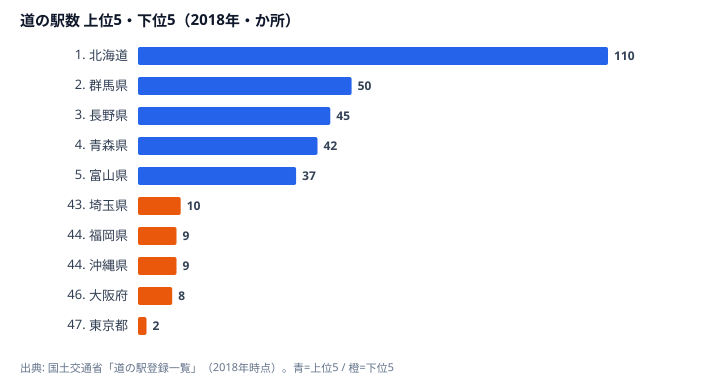
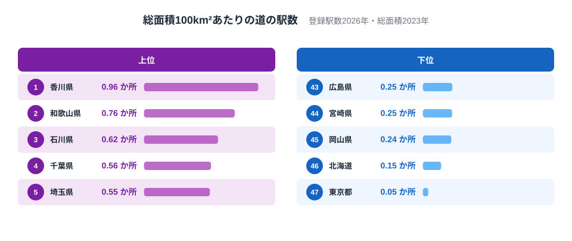

道の駅が最も多い北海道なら、県内のどこでもすぐに休憩できるのでしょうか。2026年9月4日現在、北海道の登録数は128か所で全国最多です。ところが、総面積100km²あたりに直すと約0.15か所にとどまり、総数とは違う見え方になります。

この記事では、国土交通省の公式登録一覧から数えた施設数を、そのまま比べる場合と、総面積を分母にして比べる場合に分けて読みます。総数で目立つ北海道と、密度で目立つ香川県の違いが中心です。ただし、密度は平均的な比率であって、施設間の距離や車での到達時間を測った結果ではありません。

## 道の駅が多い県・少ない県

<source-link href="/ranking/roadside-station-count">道の駅の登録数と面積あたりの値を比較する</source-link>

道の駅数は北海道が128か所で1位、岐阜県が55か所で2位、長野県が54か所で3位です。新潟県42か所、岩手県39か所が続きます。東京都は1か所で最も少なく、神奈川県は6か所です。北海道と東京都の総数の比は128÷1で128倍ですが、これは登録数の比であり、便利さの差ではありません。

総数が答えるのは「その県には登録駅がいくつあるか」です。県全体を周遊する旅行なら、立ち寄り先の候補を探す入口として使えます。しかし、候補が多いことと、ある地点から近いことは一致しません。道路のつながりや県内での偏りを考慮せず、数だけで休憩の取りやすさを判断することはできません。

また、少ない県に休憩機能が不足しているかどうかも、この値では測れません。道の駅として登録されていない休憩施設は対象外だからです。道の駅数の少なさを、観光客の受け入れ能力や地域の魅力の弱さと結び付けるのは、指標の意味を広げすぎています。総数はまず、制度に登録された拠点の規模として読みます。

> [!NOTE]
> ここで数えるのは営業中の店舗ではなく「登録駅」です。駐車場やトイレが24時間利用できるという制度上の要件は、売店や飲食店も24時間営業するという意味ではありません。

## 総面積で割ると上位の顔ぶれが変わる

総面積100km²あたりの道の駅数は、香川県が約0.96か所で最多です。和歌山県は約0.76か所、石川県は約0.62か所で続きます。北海道は約0.15か所で、東京都の約0.05か所に次いで小さい値です。登録数の多い北海道が、面積あたりでも上位になるわけではありません。

計算は「登録駅数÷総面積km²×100」です。図では2026年の登録数と、配信データで利用できる2023年の総面積を組み合わせています。総数を並べた先ほどの図に対して、県の広さをそろえた比率で比べるため、順位が変わります。香川県の登録駅数は18か所で北海道より少なくても、分母となる県の面積も小さいため、密度では大きな値になります。

この違いから、総数と密度のどちらが「正しいランキング」かを選ぶ必要はありません。県内の候補の総量を知りたいなら総数、面積に対する登録駅数の比率を知りたいなら密度というように、答えている問いが異なります。総数で目立たない県でも、分母をそろえると別の特徴が見えることが、この比較の利点です。

一方、分母にも注意が必要です。今回の総面積は北方領土・竹島を含む統計系列で、山地や道路のない場所も一律に含みます。実際にドライブできる地域の面積ではありません。したがって、北海道の値を「旅行者が利用できる地域の施設密度」とそのまま受け取ることはできません。分母の定義を変えれば、密度も変わります。

> [!WARNING]
> 面積あたりの値は、駅同士が均等に配置されていることを意味しません。総面積には山地や北方領土・竹島も含まれます。「密度が高いから短時間で巡れる」「低いから休憩に困る」とは断定できません。

## 「近くにある」を調べるには位置が必要

密度は、地理的な条件を一つ加えた比較ですが、まだ県別の集計です。道路沿いに拠点が集中している県と、広く分散している県で同じ密度になることもあります。施設の座標と道路経路を使っていない以上、いまいる場所から最寄り駅までの距離は求められません。

休憩場所の利用しやすさを調べるなら、まず出発地点と道の駅の所在地を特定し、移動に使う道路を確認する必要があります。営業日や必要なサービスも別に確かめます。同じ駅でも、休憩だけが目的なのか、食事や買い物もしたいのかによって、利用できる時間帯の条件が変わります。

この区別はサイトの地図を読むときにも役立ちます。県別総数を色分けした図は分布の概観、密度の図は分母をそろえた比較です。それとは別に、施設の位置と人口分布などを重ねる分析があります。[Geoの分析方法](/geo/method)で扱う空間分析と、この記事の県別集計を同じものとして扱わないことが大切です。

> [!TIP]
> 「多いか」を知りたいときは総数、「広さに対してどれくらいか」なら密度、「行きやすいか」なら位置と経路を見ます。旅行先を選ぶ問いに合わせて指標を使い分けてください。

## まとめ

- 北海道の登録駅数は128か所で最多ですが、それだけで近さは分かりません。
- 総面積100km²あたりでは香川県が約0.96か所で最多です。
- 北海道の面積あたりの値は約0.15か所で、総数とは違う位置付けになります。
- 密度は2026年の登録駅数と2023年の総面積による派生値です。
- 到達時間や利用できるサービスを知るには、所在地・経路・営業状況の確認が必要です。

あわせて見る：[道の駅登録数の県別分布](/blog/roadside-station-count-prefecture-gap)。

## データ出典

- [国土交通省「道の駅」登録一覧](https://www.mlit.go.jp/road/Michi-no-Eki/list.html)：2026年9月4日現在の全国1,234登録駅。都道府県別集計・密度の加工：stats47。
- [総務省統計局「社会・人口統計体系」](https://www.stat.go.jp/data/ssds/index.htm)：総面積は2023年、北方領土・竹島を含む系列。道の駅数そのものはe-Stat由来ではありません。
- [国土交通省「道の駅」制度概要](https://www.mlit.go.jp/road/Michi-no-Eki/outline.html)：登録要件と機能。
- 旧記事の数値と出典を訂正しました。異なる資料の旧集計とは接続せず、新設・廃止による増減としては比較していません。
