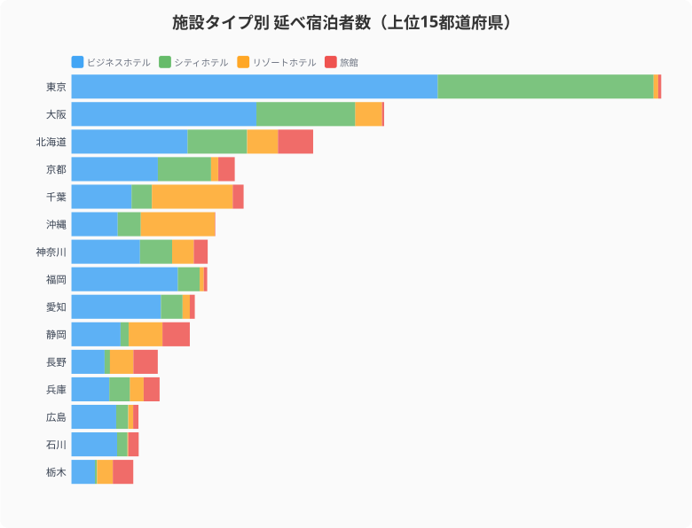
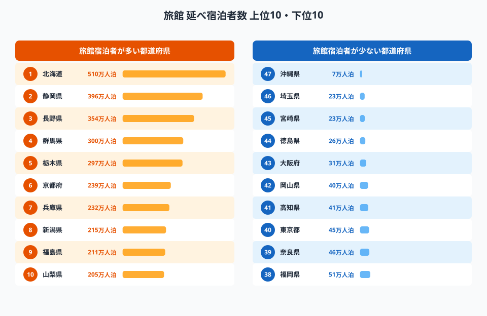
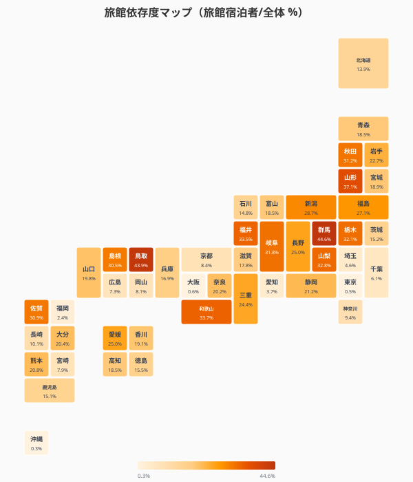
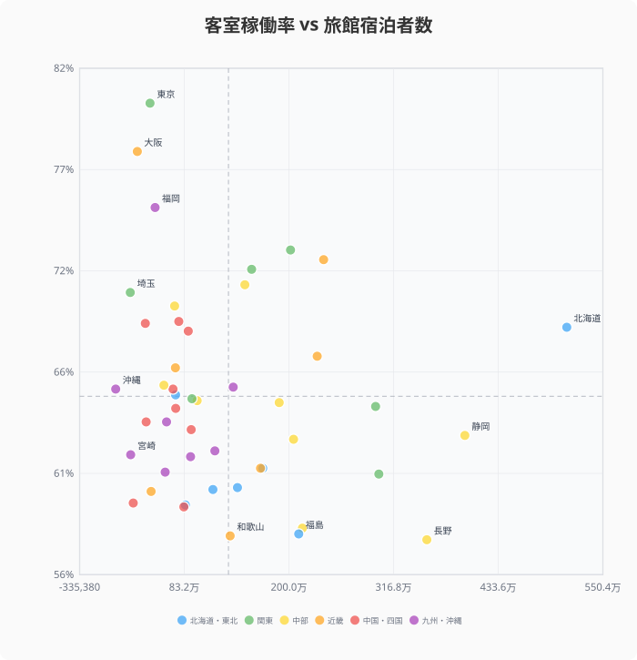
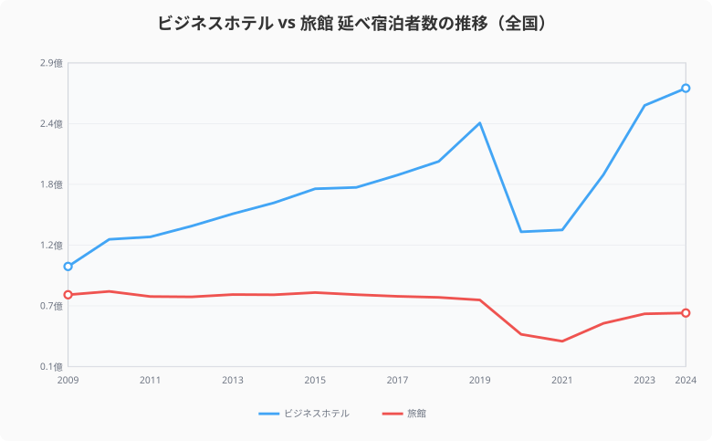
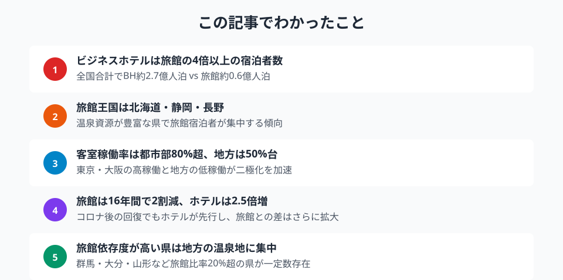

ビジネスホテルの全国合計は約2.69億人泊に対し、旅館は約0.62億人泊。かつて日本の旅の主役だった旅館は、いまやホテルの4分の1以下の規模にまで縮小した。都道府県データで「宿泊の二極化」を解剖する。

## 施設タイプ別・都道府県別の宿泊者数 -- BH圧倒の東京と旅館が健闘する群馬・北海道

延べ宿泊者数を施設タイプ別に分解し、上位15都道府県で比較した。東京都は約5,315万人泊のビジネスホテル宿泊者数で他を圧倒し、シティホテルも合わせるとホテル依存度が極めて高い。一方、北海道・静岡・長野・群馬では旅館の存在感が目立つ。

<data-source url="https://www.e-stat.go.jp/dbview?sid=0000010107" label="e-Stat 宿泊旅行統計調査"></data-source>

群馬県は全宿泊者数に占める旅館比率が44.6%と最も高く、草津・伊香保・水上といった温泉地の旅館が県の宿泊構造を支えている。[栃木県](/areas/09000)（32.1%）、[長野県](/areas/20000)（25.0%）も旅館比率が高い。

> [!NOTE]
> 本データはe-Stat「宿泊旅行統計調査」に基づく延べ宿泊者数（人泊）です。施設タイプの区分（ビジネスホテル・シティホテル・リゾートホテル・旅館）は観光庁の分類によりますが、複合型施設の分類は調査時点の自己申告に依存します。

## 旅館宿泊者数ランキング -- 温泉資源が豊富な県が上位を独占

旅館の延べ宿泊者数は北海道が約510万人泊で最多。静岡県、長野県と、温泉地を多く抱える県が上位を占める。

<data-source url="https://www.e-stat.go.jp/dbview?sid=0000010107" label="e-Stat 宿泊旅行統計調査"></data-source>

下位には都市部の東京都・大阪府や沖縄県が並ぶ。ビジネス需要や都市型観光が中心の地域では旅館が少なく、宿泊構造が根本的に異なることがわかる。

<source-link href="/ranking/total-overnight-guests-ryokan">延べ宿泊者数（旅館）ランキングを見る</source-link>

<ad-slot></ad-slot>

## 旅館依存度マップ -- 旅館比率が高い県の特徴

旅館宿泊者数を全体の延べ宿泊者数で割った「旅館依存度」をタイルグリッドマップで可視化した。

<data-source url="https://www.e-stat.go.jp/dbview?sid=0000010107" label="e-Stat 宿泊旅行統計調査"></data-source>

旅館依存度が高い県は関東北部（群馬・栃木）、甲信越（長野・山梨）、東北（山形・秋田）に集中する。いずれも有名温泉地を複数抱える県だ。逆に沖縄県や東京都は数%にとどまり、リゾートホテルやビジネスホテルが主体となっている。

## 稼働率と旅館宿泊者数の関係

全施設合計の客室稼働率は東京都の80.4%が最高で、大阪府・福岡県などビジネスホテルが集積する都市部が上位を占める。一方、旅館比率が高い長野県や和歌山県は60%前後にとどまる。

<data-source url="https://www.e-stat.go.jp/dbview?sid=0000010107" label="e-Stat 宿泊旅行統計調査"></data-source>

散布図を見ると、旅館宿泊者数が多い県ほど客室稼働率が低い傾向がある。旅館は平日の稼働が低く、週末・繁忙期に集中する構造的課題を抱えている。ビジネスホテルは平日のビジネス需要で安定稼働できる点で優位に立つ。

<source-link href="/ranking/room-utilization-rate">47都道府県の客室稼働率ランキングを見る</source-link>

<ad-slot></ad-slot>

## 経年推移で見る格差拡大 -- 旅館からホテルへのシフト

全国の延べ宿泊者数の推移を施設タイプ別に見ると、2009年にはビジネスホテル約1.05億人泊・旅館約0.79億人泊と比較的近い水準だったが、2024年にはBH約2.69億人泊・旅館約0.62億人泊と4倍以上の格差に広がった。

> [!WARNING]
> 旅館の長期減少は「廃業・転業」によるサービス供給側の縮小も含みます。需要の減少だけでなく、旅館の件数自体が全国的に減少していることも延べ宿泊者数の減少要因です。純粋な「旅館離れ」とは区別して解釈する必要があります。

<data-source url="https://www.e-stat.go.jp/dbview?sid=0000010107" label="e-Stat 宿泊旅行統計調査"></data-source>

ビジネスホテルは16年間で約2.6倍に成長した一方、旅館は約2割減少した。コロナ禍ではどちらも急落したが、回復局面でもビジネスホテルが先行し、旅館の回復は鈍い。2024年時点で旅館の宿泊者数はコロナ前の2019年（約0.74億人泊）にも届いていない。

<source-link href="/ranking/total-overnight-guests-business-hotel">延べ宿泊者数（ビジネスホテル）ランキングを見る</source-link>

## まとめ

宿泊施設タイプ別データから見えてくる二極化の構造を整理する。

旅館が生き残るための条件として、データは「高付加価値化」の方向を示唆している。稼働率の低さを単価の高さで補い、平日需要の開拓（ワーケーション・インバウンド長期滞在など）で稼働を平準化することが鍵となる。[群馬県](/areas/10000)・静岡・長野のように温泉資源と旅館文化を強みとして活かせる地域は、画一的なホテルチェーンとは異なる価値を提供できる可能性がある。

## データ出典

本記事のデータはe-Stat（政府統計の総合窓口）を基に作成しています。

本記事の対象データ: [関連カテゴリ](/category/tourism)
