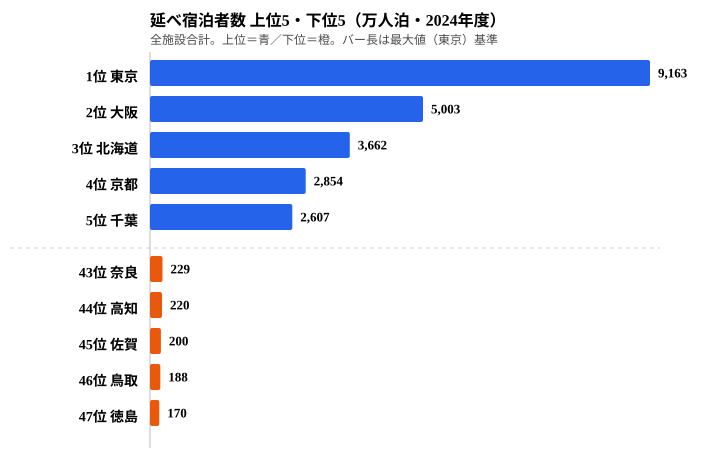
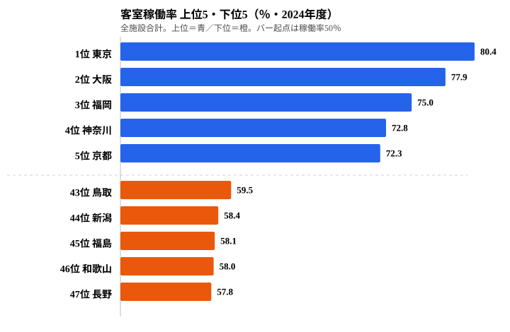

全国の延べ宿泊者数（全施設合計）は約5.4億人泊（2024年度・47都道府県の合計）にのぼります。その内訳を施設タイプで見ると、ビジネスホテルが約2.69億人泊、これに対して旅館は約0.62億人泊です。かつて日本の旅の主役だった旅館は、いまやホテルの4分の1以下の規模にまで縮みました。けれども「旅館が一律に消えた」わけではありません。この5.4億人泊という総量を県ごとに見ると、宿泊の構造そのものが地域で大きく分かれていることが見えてきます。この記事では、どこに人が泊まり、どの県が高稼働なのかという二つの軸から、「宿泊の二極化」の正体をデータで解剖します。

## 延べ宿泊者数は東京に一極集中、最下位とは50倍超の開き

まず、施設タイプを問わない延べ宿泊者数（全施設合計）の県別ランキングを見てみましょう。上位5県と下位5県を並べると、宿泊需要がどれほど特定の都市に集中しているかが一目でわかります。

東京都は約9,163万人泊で群を抜いて1位です。2位の大阪府（約5,003万人泊）、3位の北海道（約3,662万人泊）が続き、4位京都府・5位千葉県と、大都市圏と広域観光地が上位を占めます。一方、最下位の徳島県は約170万人泊にとどまり、46位の鳥取県、45位の佐賀県、44位の高知県、43位の奈良県と、内陸・四国の県が下位に並びます。1位と最下位の開きは50倍を超えており、宿泊需要が「泊まる用事のある都市」に強く偏っていることがわかります。

上位を支えているのは、ビジネス出張・都市型観光・国際線ハブという三つの集客エンジンです。東京や大阪はビジネスホテルが集積し、平日でも出張需要で部屋が埋まります。実際、東京都のビジネスホテル宿泊者数だけで約5,315万人泊に達し、これは下位県の県全体の宿泊者数を大きく上回る規模です。逆に下位の県は、日帰り圏に大都市があったり、主要観光地が点在せず宿泊を伴う滞在に結びつきにくかったりするため、絶対量で大きく差がつきます。ここで重要なのは、この上位下位の差が「旅館が多いか少ないか」だけでは説明できないという点です。総量の上位には旅館の名所もビジネスの拠点も混在しており、二極化の本当の姿は、次に見る「どんな施設に泊まるか」で初めて立ち上がってきます。

> [!NOTE]
> 本データはe-Stat「宿泊旅行統計調査」に基づく延べ宿泊者数（人泊）で、2024年度の全施設合計です。施設タイプの区分（ビジネスホテル・シティホテル・リゾートホテル・旅館）は観光庁の分類によりますが、複合型施設の分類は調査時点の自己申告に依存します。総量ランキングはこの施設タイプを合算した数字である点に注意してください。

<source-link href="/ranking/total-overnight-guests">延べ宿泊者数ランキングをもっと見る</source-link>

<ad-slot></ad-slot>

## 旅館に泊まる県・ホテルに泊まる県 -- 同じ宿泊でも中身が違う

総量では東京が圧倒する一方、「旅館への依存度」で見ると順位はがらりと入れ替わります。旅館宿泊者数を県全体の延べ宿泊者数で割った旅館比率は、群馬県が44.6%と最も高く、草津・伊香保・水上といった温泉地の旅館が県の宿泊構造を支えています。栃木県（32.1%）、長野県（25.0%）も旅館比率が高く、いずれも有名温泉地を複数抱える県です。

旅館の延べ宿泊者数そのものでも、北海道が約510万人泊で最多となり、静岡県・長野県と、温泉地を多く抱える県が上位を占めます。逆に都市部の東京都・大阪府や、リゾートホテルが主体の沖縄県では旅館の存在感が薄く、宿泊構造が根本的に異なります。つまり同じ「宿泊1人泊」でも、群馬では旅館の畳の上、東京ではビジネスホテルのシングルルームという、まったく別の中身を指しているのです。この違いこそが、総量ランキングだけでは見えない二極化の核心です。温泉資源と旅館文化を持つ県は、画一的なホテルチェーンとは別の宿泊体験を県の強みとして残しています。

> [!WARNING]
> 旅館宿泊者数の長期減少は、需要の「旅館離れ」だけでなく、廃業・転業によるサービス供給側の縮小も含みます。旅館の件数自体が全国的に減っているため、延べ宿泊者数の減少を純粋な人気の低下と読むのは誤りです。供給が減れば、泊まりたくても泊まれず数字が下がる構造がある点に注意してください。

## 稼働率は都市が高く温泉地が低い -- 旅館依存県ほど部屋が空く

最後に、宿泊施設がどれだけ効率よく稼げているかを示す客室稼働率（全施設合計）を見ます。総量や旅館比率とは別の角度から、二極化のもう一つの断面が浮かびます。

客室稼働率は東京都の80.4%が最高で、大阪府（77.9%）、福岡県（75.0%）、神奈川県（72.8%）、京都府（72.3%）と、ビジネスホテルが集積する都市部が上位を占めます。対照的に最下位は長野県の57.8%で、和歌山県（58.0%）、福島県（58.1%）、新潟県（58.4%）、鳥取県（59.5%）が続きます。下位に並ぶのは旅館比率が高い温泉県や、繁忙期と閑散期の差が大きい地域です。先ほど旅館比率が高いと見た長野県が、稼働率ではちょうど最下位に位置しているのは偶然ではありません。

ここから読めるのは、旅館依存度が高い県ほど客室稼働率が低くなりやすいという傾向です。旅館は週末・連休・繁忙期に需要が集中し、平日の稼働が伸びにくい構造を抱えています。一方ビジネスホテルは平日の出張需要で安定して部屋が埋まるため、都市部の稼働率を底上げします。これが「旅館は規模で縮み、ホテルは規模で伸びる」二極化の経済的な裏側です。延べ宿泊者数の全国推移を施設タイプ別に見ても、2009年にはビジネスホテル約1.05億人泊・旅館約0.79億人泊と比較的近かったものが、2024年にはビジネスホテル約2.69億人泊・旅館約0.62億人泊と、両者の比が約4.3倍にまで開きました。コロナ禍ではどちらも急落しましたが、回復局面でもビジネスホテルが先行し、2024年時点で旅館はコロナ前の2019年（約0.74億人泊）の水準にも届いていません。

> [!TIP]
> 稼働率の低さは弱点であると同時に「伸びしろ」でもあります。旅館が生き残る筋道として、データは高付加価値化を示唆しています。低い稼働を高い単価で補い、ワーケーションやインバウンドの長期滞在で平日需要を開拓して稼働を平準化できれば、温泉県は規模では測れない価値で勝負できます。総量・旅館比率・稼働率の三つは別々に動くので、県の戦略を考えるときは必ずセットで見るのが読み筋です。

<source-link href="/ranking/room-utilization-rate">客室稼働率ランキングをもっと見る</source-link>

群馬県・静岡県・長野県のように温泉資源と旅館文化を強みとして活かせる地域は、画一的なホテルチェーンとは異なる宿泊体験を提供できます。詳しい県ごとの宿泊プロフィールは[群馬県](/areas/10000)・[長野県](/areas/20000)・[栃木県](/areas/09000)の地域ページからも確認できます。観光関連の指標をまとめて見たい場合は[観光カテゴリ](/category/tourism)もあわせてご覧ください。

## データ出典

本記事のデータはe-Stat（政府統計の総合窓口）「宿泊旅行統計調査」を基に作成しています。

- 延べ宿泊者数・客室稼働率: e-Stat 宿泊旅行統計調査（2024年度）
- 対象カテゴリ: 観光業（tourism）
